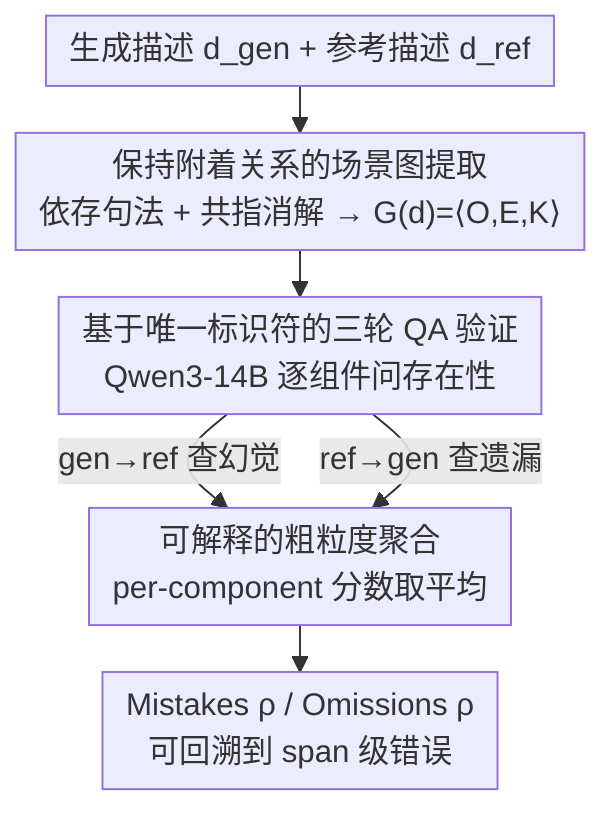

# PoSh: Using Scene Graphs to Guide LLMs-as-a-Judge for Detailed Image Descriptions

**会议**: ICLR 2026  
**arXiv**: [2510.19060](https://arxiv.org/abs/2510.19060)  
**代码**: [GitHub](https://github.com/amith-ananthram/posh)  
**领域**: 可解释性  
**关键词**: detailed image description, scene graph, LLM-as-Judge, fine-grained evaluation, assistive text

## 一句话总结
提出PoSh评估指标，通过从生成描述和参考描述中提取场景图 $G(d) = \langle O(d), E(d), K(d) \rangle$ 作为结构化rubric，引导开源14B LLM（Qwen3-14B）进行QA式细粒度错误定位，在DOCENT艺术品基准和CapArena上以+0.05 Spearman ρ超越GPT-4o-as-Judge，且完全可复现。

## 研究背景与动机

**领域现状**：VLM已能生成详细图像描述（100-300词），但评估方法严重滞后。CIDEr/SPICE设计用于短文本，LLM-as-Judge不可复现且产出粗粒度不可解释的分数。

**现有痛点**：
- 长描述中属性/关系误附着是核心错误（如"倒水的男人"被描为"中央的男人"），现有指标对此不敏感
- SPICE/CAPTURE虽用场景图但忽略对象附着（object attachment），容易误报高分
- 闭源LLM评估（GPT-4o）成本高且不可复现，开源LLM-as-Judge（LLaVA-Critic）不提供可解释的细粒度分数
- 缺乏含细粒度人工判断的评估基准——大多数详细描述基准无人工标注

**核心矛盾**：需要cheap、reliable、interpretable的评估方法，但cheap与reliable/interpretable通常矛盾。

**本文目标** 同时实现可解释性（细粒度错误定位到文本段）、与人类判断的高相关性、和完全开源可复现。

**切入角度**：场景图将描述的表面多样性降维为视觉组件（实体+属性+关系）→ 作为LLM-Judge的结构化checklist → 每个组件独立验证存在性 → 聚合为粗粒度分数。

**核心 idea**：用场景图结构化评估的"评什么"（实体、属性、关系），用LLM-QA灵活处理"怎么比"（表面形式差异）。

## 方法详解

### 整体框架

PoSh要解决的是"如何在不调用闭源大模型的前提下，给上百词的详细图像描述打出一个可解释、可复现的分数"。它的思路是先把描述压成场景图、再用场景图当作逐项 checklist 让一个开源 LLM 去核对。具体分三步：先用依存句法分析（spaCy）配合共指消解（Maverick），从生成描述和参考描述各自抽出句级场景图并合并成完整场景图；再把图里的每个组件（实体、属性、关系）转成模板化问题，交给 Qwen3-14B 逐项 QA，判断它在对方文本里是否存在；最后把这些 per-component 分数分别取平均，得到 mistakes（生成→参考方向，衡量幻觉）和 omissions（参考→生成方向，衡量遗漏）两个维度。

### 关键设计

**1. 保持附着关系的场景图提取：把"属性/关系挂在谁身上"也算进评估**

详细描述里最隐蔽的错误是属性或关系误附着——"倒水的男人"被写成"中央的男人"，对象都在、动作也都在，但谁在倒水错了。PoSh 先做句级依存句法分析，再用跨句共指消解把分散在不同句子里指向同一实体的提及合并，从描述文本里提取结构化表示 $G(d) = \langle O(d), E(d), K(d) \rangle$：$O$ 是实体集合，$E \subseteq O \times A$ 是属性边，$K \subseteq O \times R \times O$ 是关系边。关键在于每条属性边和关系边都保留了到其宿主实体的附着链接，并把每个组件定位回原文 span。SPICE 同样用场景图，但忽略附着关系，于是"把 A 的属性算到 B 头上"不会被惩罚、容易误报高分；PoSh 因为留着这条附着链，验证某个属性/关系时能用上正确的实体标识符，误附着才会真正扣分。

**2. 基于唯一标识符的三轮 QA 验证：不强制对齐两张图，而是逐个组件问"对方有没有"**

把每个场景图组件转成模板化问题让 LLM 回答 1-5 分时，最大的麻烦是同类实体碰撞——一张图里有好几个"man"，光问"有没有 man"无法分辨说的是哪一个。PoSh 用唯一标识符配合三轮递进验证来消歧：第一轮验证顶层实体本身（"man"）；第二轮验证部分-从属实体（"face of the man"），此时可以挂靠已确认存在的父实体；第三轮才验证属性和关系，用的是前两轮里已确认存在的最简标识符。标识符候选来自类名、表面形式、属性修饰、关系修饰，再由 LLM 重写成自然表达。这样做刻意避开了"强制对齐两个场景图组件"的老路——对方文本完全可能用不同的词指代同一对象（参考说"trio"，生成则分别提了三个人），逐项追问存在性比硬对齐更鲁棒。

**3. 可解释的粗粒度聚合：总分直接由细粒度分数平均而来，可回溯**

最终的粗粒度分数不是另起炉灶算的，而是把上一步的 per-component 分数直接平均：$\text{Mistakes} = \text{mean}_{c \in O(\text{gen})}(\pi(c))$，$\text{Omissions} = \text{mean}_{c \in O(\text{ref})}(\rho(c))$，其中 $\pi(c) = \Psi(c_{\text{gen}}, \text{ref})$ 是把生成侧组件拿到参考里查、$\rho(c) = \Psi(c_{\text{ref}}, \text{gen})$ 是把参考侧组件拿到生成里查，$\Psi$ 即 QA 评分器。因为总分就是细粒度分的均值，拿到一个低分后可以一路追溯到具体是哪些实体的哪些属性出了问题——这种诊断能力正是 GPT-4o-as-Judge 那种直接吐一个标量分的做法给不了的。

### 损失函数 / 训练策略

PoSh 是推理时指标，本身没有训练过程。QA 评分器 $\Psi$ 用 Qwen3-14B，存在性分数从 token logits 的加权平均提取（1-5 分），实体存在性的判定阈值取 2（在小型验证集上调优）。效率上，单张 H100 跑 400 个样本约 15 分钟（每个 2 秒），而依赖 GPT-4 的 DCScore 同样规模要 2 小时以上。

## 实验关键数据

### DOCENT基准 — 粗粒度指标对比

| 指标 | 参数量 | Mistakes ρ | Omissions ρ | Overall ρ | 可复现 |
|------|--------|-----------|------------|----------|--------|
| SPICE | - | 0.308 | 0.464 | 0.458 | ✓ |
| CAPTURE | - | 0.259 | 0.447 | 0.453 | ✓ |
| LLaVA-Critic | 72B | 0.412 | 0.509 | 0.546 | ✓ |
| DCScore | GPT-4o | **0.541** | 0.395 | 0.471 | ✗ |
| GPT-4o (ref+img) | - | 0.484 | 0.380 | 0.510 | ✗ |
| **PoSh** | **14B** | 0.519 | **0.581** | **0.599** | **✓** |

### 细粒度指标对比（DOCENT）

| 方法 | Mistakes F1 | Omissions F1 |
|------|------------|-------------|
| Random | 0.503 | 0.499 |
| 4GramEmbed | 0.483 | 0.641 |
| SGEmbed | 0.514 | 0.658 |
| **PoSh** | **0.580** | **0.680** |

### 关键发现
- PoSh在DOCENT上Overall acc=70.7%，超越GPT-4o (67.3%)和GPT-5 text-only (68.0%)，且完全开源可复现
- 在CapArena上PoSh对复杂场景（≥3人）的模型排名与人类的相关性优于72B的LLaVA-Critic（ρ=0.727 vs 0.686）
- 场景图子组件验证：元素提取F1=0.892，元素验证F1=0.852——高质量的结构化提取是PoSh成功的基础
- PoSh作为RL奖励函数（DAPO）优于SFT：omission改善+0.432，overall改善+0.135
- DOCENT排行榜显示：开源模型在mistakes上有竞争力，但在omissions上明显落后闭源模型——覆盖率是关键差距

## 亮点与洞察
- **场景图作为结构化rubric**：既利用了场景图的结构化降维能力（减少评估对象的表面形式多样性），又通过LLM-QA保持了灵活性（不强制对齐），两者互补
- **从细粒度到粗粒度的可解释性**：每个粗粒度分数都有对应的细粒度span-level错误支撑，这是现有指标（包括GPT-4o-as-Judge）不具备的
- **DOCENT基准的社会价值**：辅助文本生成对视觉障碍者的网络可及性至关重要，艺术品的复杂视觉场景（平均161个视觉组件）是当前VLM的真实挑战

## 局限与展望
- 依赖依存句法分析和共指消解的质量——非英语语言的工具成熟度可能不足
- 当前不加权各组件（实体/属性/关系同等重要），未来可引入任务特定权重
- DOCENT仅含100张图的生成评判，规模受限于人工标注成本（细粒度18分钟/样本）
- reference-based设计依赖参考描述的质量和覆盖率

## 相关工作与启发
- **vs SPICE**：SPICE也用场景图但忽略对象附着→给误附着细节打高分；PoSh保持附着链确保正确验证
- **vs DCScore**：DCScore用GPT-4提取factoids+验证，在mistakes上最强(ρ=0.541)，但提取覆盖率不足导致omissions弱(ρ=0.395)；PoSh用句法分析确保全覆盖
- **vs LLaVA-Critic**：72B VLM-as-Judge在CapArena上最优，但不提供可解释的细粒度分数；PoSh用14B达到接近性能且完全可解释

## 评分
- 新颖性: ⭐⭐⭐⭐ 场景图+LLM-QA的结合设计精巧，DOCENT基准填补空白
- 实验充分度: ⭐⭐⭐⭐⭐ DOCENT细粒度+粗粒度+CapArena跨域+RL奖励函数+子组件验证
- 写作质量: ⭐⭐⭐⭐⭐ 动机清晰、社会影响有说服力、实验系统全面
- 价值: ⭐⭐⭐⭐ 为详细图像描述评估提供了可部署的开源工具，推动辅助文本生成进步

<!-- RELATED:START -->

## 相关论文

- [\[CVPR 2026\] Learning Where to Look and How to Judge: Resolution-agnostic Image Quality Assessment with Quality-aware Saliency](../../CVPR2026/interpretability/learning_where_to_look_and_how_to_judge_resolution-agnostic_image_quality_assess.md)
- [\[ACL 2025\] Enhancing Automated Interpretability with Output-Centric Feature Descriptions](../../ACL2025/interpretability/output_centric_interpretability.md)
- [\[ICML 2026\] Diagnosing the Reliability of LLM-as-a-Judge via Item Response Theory](../../ICML2026/interpretability/diagnosing_the_reliability_of_llm-as-a-judge_via_item_response_theory.md)
- [\[CVPR 2026\] On the Possible Detectability of Image-in-Image Steganography](../../CVPR2026/interpretability/on_the_possible_detectability_of_image-in-image_steganography.md)
- [\[ICLR 2026\] RADAR: Reasoning-Ability and Difficulty-Aware Routing for Reasoning LLMs](radar_reasoning-ability_and_difficulty-aware_routing_for_reasoning_llms.md)

<!-- RELATED:END -->
