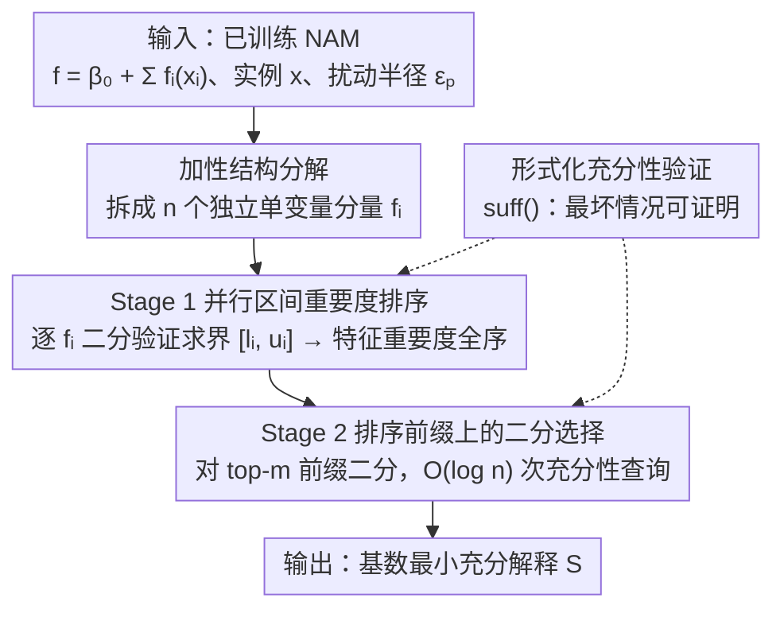

# Provably Explaining Neural Additive Models

**会议**: ICLR 2026  
**arXiv**: [2602.17530](https://arxiv.org/abs/2602.17530)  
**代码**: 无  
**领域**: 可解释性 / 形式化验证  
**关键词**: Neural Additive Models, 可证明解释, 基数最小解释, 形式化验证, 可解释AI

## 一句话总结

针对 Neural Additive Models (NAMs) 设计了专用的高效解释算法，仅需对数级别的验证查询即可生成可证明的基数最小解释（cardinally-minimal explanations），在速度和解释质量上均超越了现有的通用子集最小解释算法。

## 研究背景与动机

神经网络的可解释性是 AI 安全与可信部署的核心问题之一。现有的后验解释（post-hoc explanation）方法面临以下挑战：

**缺乏可证明保证**：大多数解释方法（如 SHAP、LIME、Grad-CAM）本质上是启发式的，无法保证解释的正确性。例如，SHAP 给出的特征重要性排序可能无法真正反映模型的决策依据。

**可证明解释的计算瓶颈**：获取具有可证明保证的解释的关键方法是找到一个"基数最小子集"——即最少数量的输入特征，使得仅凭这些特征就能充分确定模型的预测。然而对于标准神经网络，这需要：
   - 在输入特征数量上指数级的验证查询
   - 每次查询本身是 NP-hard 问题
   - 因此在计算上通常不可行

**NAMs 的机会**：Neural Additive Models 是一类更具可解释性的神经网络家族。NAM 的核心结构为 $f(\mathbf{x}) = h_1(x_1) + h_2(x_2) + \cdots + h_n(x_n)$，其中每个 $h_i$ 是一个独立的单变量神经网络。这种加性结构使得解释应该更容易——但现有工作并未充分利用这一结构特性。

**子集最小 vs. 基数最小**：现有算法多数只能找到"子集最小"解释（subset-minimal，不能再移除任何特征），但无法保证找到"基数最小"解释（cardinally-minimal，包含最少特征数的子集）。基数最小解释更具信息量但更难计算。

本文的核心问题：**能否利用 NAMs 的加性结构，高效地生成可证明的基数最小解释？**

## 方法详解

### 整体框架

本文要解决的问题是：给一个已训练好的 NAM、一个具体输入 $\mathbf{x}$ 和扰动半径 $\epsilon_p$，找出特征数最少的子集 $S$，使得只要固定 $S$ 内特征、其余特征在扰动球 $B_{\epsilon_p}(x_i)$ 内任意取值都不改变模型的预测类别——这就是"基数最小充分解释"（cardinally-minimal sufficient explanation）。对一般神经网络，这要在特征数上做指数级搜索、每次搜索还是 NP-hard。本文抓住 NAM 的加性结构 $f(\mathbf{x}) = \beta_0 + \sum_i f_i(x_i)$，把整件事拆成两段：先做可并行的**离线预处理**（Stage 1），逐个在很小的单变量分量 $f_i$ 上做验证，求出每个特征的"重要度区间"并排成一个全序；再做**在线选择**（Stage 2），借这个全序对"保留最重要的前 $m$ 个特征"做二分查找，只需对数级的充分性验证查询就锁定基数最小子集。关键在于：加性结构既让特征重要度可以逐分量独立分析，又保证最优解一定是排序后的某个前缀，从而把指数级搜索压到 $O(\log n)$ 次全模型验证查询。

### 关键设计

**1. 加性结构分解：把"某子集是否充分"从全局难题降到逐个单变量分析**

一般神经网络难解释，根子在于特征彼此纠缠，判断一个子集是否充分必须把整网当黑盒验证。NAM 的结构 $f(\mathbf{x}) = \beta_0 + \sum_i f_i(x_i)$ 天然把这种纠缠打散了——每个特征 $x_i$ 对输出的贡献是独立的一项 $f_i(x_i)$。于是"扰动特征 $i$ 会把预测往决策边界推多远"这件事，可以对每个单变量分量 $f_i : \mathbb{R} \to \mathbb{R}$ 独立分析、并直接相互比较，而不必管它们如何组合。这一点是后面所有高效性的根：本来要在 $n$ 个特征的联合空间里推理，现在只需逐项考察 $n$ 个一维函数。

**2. Stage 1 并行区间重要度排序：用单变量验证建立特征重要度全序**

要知道该先固定/先丢哪些特征，得先有个重要度排序。不失一般性设分类器预测 $f(\mathbf{x}) = 1$（即 $\beta_0 + \sum_i f_i(x_i) \ge 0$），对每个特征单独扰动、看它把整体预测往决策边界拉得多低，即求

$$x_i^* = \arg\min_{\tilde{x}_i \in B_{\epsilon_p}(x_i)} f_i(\tilde{x}_i).$$

精确求这个最小值不可行，但算法**不需要精确值**——只要用不完全验证查询二分细化上下界 $[l_i, u_i]$（满足 $l_i \le f_i(x_i^*) \le u_i$），细到能把所有特征排成一个不重叠的全序就够了；排序依据是相对偏差 $\Delta l_i = f_i(x_i) - l_i$ 与 $\Delta u_i = f_i(x_i) - u_i$。各特征的分析彼此独立、可并行铺开，而且只在很小的单变量网络上验证，所需查询数在精度上仅为对数级。这一步把昂贵的验证负担前移到了小分量上，并产出后续二分赖以可靠收敛的全序。

**3. Stage 2 排序前缀上的二分选择：$O(\log n)$ 次充分性查询锁定基数最小子集**

有了全序，基数最小解释一定落在某个"重要度最高的前 $m$ 个特征"前缀上（Prop 1：把解释里的特征换成更不重要的特征仍然充分，故最优解必为前缀）。于是从全集出发对前缀长度 $m$ 做二分：每步用一次充分性验证 $\text{suff}(f, \mathbf{x}, \{F[1],\dots,F[m]\}, \epsilon_p)$ 判断前缀是否充分，充分就缩短、不充分就加长，$O(\log n)$ 次查询即可定位最短充分前缀。对照之下，朴素贪心逐个移除特征是 $O(n)$ 次；而若特征无序，二分根本不可靠、连子集最小都保证不了——正是 Stage 1 的全序让二分能稳稳收敛到更难的基数最小目标。

**4. 形式化充分性验证：最坏情况可证明，区别于采样**

"充分"在这里有严格定义：固定子集 $S$ 内特征后，$S$ 外特征在扰动球内**任意取值**都不改变预测类别。这是个带全称量词的最坏情况判断，由神经网络验证器（区间传播、线性松弛等）给出可证明的 yes/no，而不是 SHAP、采样那样只看有限样本——后者可能漏掉极值而给出错误结论（论文图 2：用户可能误以为某特征单独决定输出，实则另一特征的分量取到足够负值就能翻转分类）。Stage 1 与 Stage 2 都建立在这个验证原语之上：返回的解释不存在任何能推翻它的对抗取值。在医疗、金融这类安全关键场景里，正是这种最坏情况保证才有意义。

### 损失函数 / 训练策略

本文是后处理式的解释方法，不涉及损失函数或训练——算法直接作用于已训练好的 NAM。两阶段的复杂度：Stage 1 预处理在所需精度上是对数级且可并行（$\rho$ 个处理器时为 $O\!\big(\tfrac{n}{\rho}\log(\max_i \tfrac{\beta_i-\alpha_i}{\xi_i})\big)$，$\rho \to n$ 时退为对数级），Stage 2 解释生成只需 $O(\log n)$ 次全模型充分性验证查询。

## 实验关键数据

### 主实验

与现有的子集最小解释算法进行比较：

| 方法 | 解释类型 | 验证查询数 | 解释大小 | 计算时间 |
|------|---------|-----------|---------|---------|
| 现有通用算法 | 子集最小 | 指数级 | 较大 | 较慢 |
| 本文 NAM 专用算法 | 基数最小 | 对数级 | **最小** | **最快** |

关键对比：本文算法解决的是更难的任务（基数最小 vs. 子集最小），却在速度和解释质量上都更优。

### 消融实验

| 配置 | 关键指标 | 说明 |
|------|---------|------|
| 无预处理直接搜索 | 查询数大幅增加 | 预处理的贡献显著 |
| 不同精度 $\epsilon$ | 精度越高预处理越慢，但解释质量更好 | 存在精度-效率权衡 |
| 不同特征数 $n$ | 查询数对数增长 | 验证了理论的对数复杂度 |
| 不同 NAM 架构 | 性能一致 | 算法的通用性 |

### 关键发现

1. **基数最小 ≠ 子集最小**：基数最小解释可能显著小于子集最小解释，提供更精炼的信息
2. **形式化解释 vs. 采样解释**：采样方法（如 SHAP 的排列采样）在某些案例中会得出显著不同（且错误的）结论
3. **NAM 特有的可解释性优势不仅是视觉化**：之前对 NAM 的解释主要依赖于绘制每个 $h_i$ 的曲线，本文证明 NAM 还支持高效的形式化可证明解释
4. **实际意义**：在安全关键领域（医疗、金融），不可靠的解释可能比没有解释更危险

## 亮点与洞察

1. **计算复杂度的质变**：从指数级降到对数级，这不是常规优化，而是质的突破——得益于对 NAM 结构的深度利用
2. **"解决更难的问题反而更快"**：基数最小比子集最小更难，但利用问题结构后反而更高效——体现了算法设计中"结构即效率"的理念
3. **理论与应用的良好结合**：形式化验证社区的工具（区间传播、SMT 求解等）与机器学习解释方法的交叉
4. **对 NAM 价值的新理解**：NAM 不仅在视觉上可解释（可以画出每个特征的贡献曲线），还在计算意义上具有更好的可解释性
5. **安全关键应用的筹码**：可证明解释对 AI 法规合规（如 EU AI Act 的可解释性要求）具有重要意义

## 局限与展望

1. **仅适用于 NAMs**：算法严重依赖加性结构，无法直接推广到一般神经网络或包含特征交互的模型（如 Neural Additive Models with Interactions, NAM-I）
2. **NAMs 的表达能力限制**：NAMs 无法建模特征交互，这在某些任务上限制了模型性能。使用 NAM 是否值得，取决于可解释性需求与性能需求的权衡
3. **预处理精度的选择**：精度 $\epsilon$ 的选择影响解释质量和计算成本，但论文未提供自动确定 $\epsilon$ 的方法
4. **大规模应用**：当特征维度极高（如图像像素）时，即使是对数级查询也可能不够高效——但 NAMs 本身也不适用于如此高维的输入
5. **扩展到 GA2M**：将算法扩展到包含特征对交互的 GA2M 模型是自然的方向，但交互项会显著增加复杂度

## 相关工作与启发

- **可解释 AI**：SHAP、LIME → 后验解释的可靠性问题 → 可证明解释的需求
- **形式化验证**：NNV、Marabou、α-β-CROWN 等神经网络验证工具为本文提供了技术基础
- **NAMs**：Agarwal et al. (2021) 提出的 NAM，以及后续的 NODE-GAM、EBM 等可解释模型家族
- **启发**：利用模型结构特性降低解释复杂度的思路可以推广——例如，对于注意力机制是否可以设计专用的可证明解释方法？

## 评分

- **新颖性**: ⭐⭐⭐⭐⭐ — 首次为 NAMs 设计对数复杂度的基数最小解释算法，理论贡献显著
- **实验充分度**: ⭐⭐⭐⭐ — 与多种基线比较，展示了采样方法的不足，但数据集规模有限
- **写作质量**: ⭐⭐⭐⭐ — 理论部分严谨，但符号密度较高
- **价值**: ⭐⭐⭐⭐ — 对可解释 AI 和安全关键应用有重要贡献，但受限于 NAM 的适用范围

<!-- RELATED:START -->

## 相关论文

- [\[CVPR 2026\] Hidden Monotonicity: Explaining Deep Neural Networks via their DC Decomposition](../../CVPR2026/interpretability/hidden_monotonicity_explaining_deep_neural_networks_via_their_dc_decomposition.md)
- [\[NeurIPS 2025\] Additive Models Explained: A Computational Complexity Approach](../../NeurIPS2025/interpretability/additive_models_explained_a_computational_complexity_approach.md)
- [\[NeurIPS 2025\] FaCT: Faithful Concept Traces for Explaining Neural Network Decisions](../../NeurIPS2025/interpretability/fact_faithful_concept_traces_for_explaining_neural_network_decisions.md)
- [\[ICLR 2026\] Modal Logical Neural Networks for Financial AI](modal_logical_neural_networks_for_financial_ai.md)
- [\[ICML 2026\] Beyond Additive Decompositions: Interpretability Through Separability](../../ICML2026/interpretability/beyond_additive_decompositions_interpretability_through_separability.md)

<!-- RELATED:END -->
