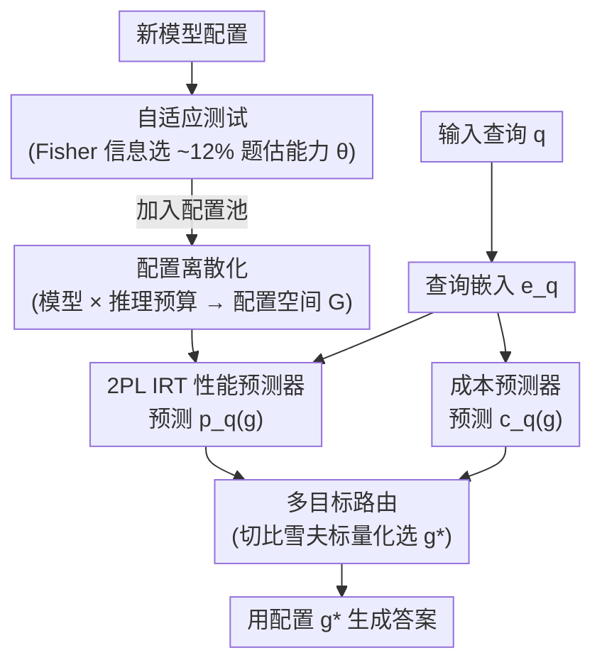

# RADAR: Reasoning-Ability and Difficulty-Aware Routing for Reasoning LLMs

**会议**: ICLR 2026  
**arXiv**: [2509.25426](https://arxiv.org/abs/2509.25426)  
**代码**: 无  
**领域**: 可解释性  
**关键词**: 推理语言模型, 模型路由, 项目反应理论, 多目标优化, 自适应推理

## 一句话总结

本文提出 Radar 框架，将推理语言模型（RLM）的自适应推理问题建模为多目标优化，利用项目反应理论（IRT）联合估计可解释的查询难度和模型配置能力参数，实现轻量级、可扩展的查询级路由，在 8 个推理基准上优于 SOTA 路由方法，且仅增加约 7ms 延迟。

## 研究背景与动机

近年来推理语言模型（RLMs）如 DeepSeek-R1、o4-mini、Qwen3 等展示了在数学、科学和编程等挑战性任务上的卓越能力。选择合适的 RLM 涉及**性能-成本权衡**的两个关键层面：(1) 模型大小——更大的模型性能更好但成本更高；(2) 推理预算——更多的思考 token 提升性能但增加延迟和费用。

关键发现：MATH-500 上超过 50% 的查询可以用 Qwen3-0.6B 以极少推理预算正确解答，而一些困难查询则需要更强的 RLM 配置。更强的 RLM 还可能在简单问题上"过度思考"（overthinking）反而降低性能。这激发了一个核心问题：如何为每个查询选择恰好"足够强"的 RLM 配置，从而在不牺牲性能的前提下最大化成本效益？

## 方法详解

### 整体框架

Radar 要解决的是「为每个查询挑一个恰好够强的 RLM 配置」：既不让小模型在难题上力不从心，也不让大模型在简单题上过度思考又徒增延迟和费用。它整体分两步走——先用项目反应理论（IRT）拟合一个可解释的性能预测器，把「查询难度」和「模型配置能力」放进同一把标尺；再对性能与成本两个目标做多目标优化，逐查询选出 Pareto 意义下最优的配置 $g^*$ 去生成答案。当新模型要接入时，靠自适应测试只评测一小撮信息量最大的查询就能估出它的能力，把它加进配置池而无需重训整套 IRT。

### 关键设计

**1. 配置离散化：把"选模型"和"选预算"压成一次路由**

单看模型大小或单看推理预算都不够——大模型在简单题上会过度思考，小模型给足预算又未必划算，真正的自由度其实是「哪个模型 × 给多少思考预算」的组合。Radar 因此把每个 RLM $m \in \mathcal{M}$ 沿其可用推理预算 $u \in \mathcal{U}_m$ 切成若干配置 $g = (m, u) \in \mathcal{G}$，于是「挑模型 + 挑预算」被统一压成在配置空间 $\mathcal{G}$ 上的单一路由问题。对开源 RLM，预算通过计数思考 token 强制执行：一旦超出 $u$ 就追加一条中断消息逼模型收尾。本文据此构造了 35 个配置，作为后续所有路由的候选池。

**2. 2PL IRT 性能预测器：把查询当考题、配置当考生**

要逐查询路由，先得能预测「某配置在某查询上能不能答对」。Radar 用二参数逻辑斯蒂（2PL）IRT 模型实现性能预测器 $p_q(g)$：配置 $g_i$ 答对查询 $q_j$ 的概率为 $p_{ij} = \sigma(a_j(\theta_i - b_j))$，其中 $\theta_i$ 是配置 $g_i$ 的标量能力，$b_j$ 是查询难度、$a_j$ 是区分度。标量能力 $\theta_i$ 把所有配置排在一条可解释的强弱轴上，参数量也比多维 IRT（MIRT）省。为了能泛化到训练时没见过的查询，难度和区分度并不逐题自由学，而是写成查询嵌入 $\mathbf{e}_j$ 的线性变换 $b_j = \mathbf{w}_b^\top \mathbf{e}_j$、$a_j = \mathbf{w}_a^\top \mathbf{e}_j$，于是新查询只要算出嵌入就能直接预测其难度，无需出现在训练集里。

**3. 多目标路由：用切比雪夫标量化够到 Pareto 前沿的凹陷处**

性能和成本天然冲突，把两者简单加权求和会漏掉 Pareto 前沿上的非凸段——而恰恰是那些「性价比拐点」最值得选。对每个查询 $q$，Radar 求解 $g^* = \arg\max_{g \in \mathcal{G}} f(p_q(g), c_q(g))$，其中 $p_q(g)$ 来自上面的 IRT 预测器、$c_q(g)$ 预测成本。文中对比了两种标量化：线性标量化 $\text{LSP}_q^{w_1} = \arg\max_{g} w_1 p_q(g) - (1-w_1) c_q(g)$ 只能覆盖前沿的凸部分；切比雪夫标量化 $\text{CSP}_q^{w_1} = \arg\min_{g} \max\{w_1|1-p_q(g)|, (1-w_1)c_q(g)\}$ 通过最小化到理想点的最大加权偏差，能发现前沿的非凸部分。这也是 LLM 路由里首次引入线性标量化之外的多目标优化（MOO）技术，在分布外（OOD）场景下尤其管用。

**4. 自适应测试：新配置即插即用**

接入一个新模型配置时，与其在整个训练集上跑一遍来估计它的能力 $\theta$，不如只挑最能区分能力的题目测。Radar 借用教育测评里的 Fisher 信息选题：第 $t$ 步选 $j_t = \arg\max_{j \in \mathcal{Q} \setminus \mathcal{S}_{t-1}} I(\hat{\theta}_{t-1}, a_j, b_j)$，其中信息量

$$I(\theta, a_j, b_j) = a_j^2 \sigma(a_j(\theta-b_j))[1-\sigma(a_j(\theta-b_j))]$$

在 $\theta$ 接近难度 $b_j$ 时最大——也就是优先用「难度刚好卡在当前能力估计附近」的题目去逼问。这样只需评测约 12% 的训练集就能准确估出新配置能力，把它直接挂进配置池参与路由，而无需重训整个 IRT。

### 损失函数 / 训练策略

IRT 模型用二元交叉熵在所有"配置 × 查询"的对错记录上训练：

$$\mathcal{L}_{2PL} = -\frac{1}{nk} \sum_{i=1}^n \sum_{j=1}^k [y_{ij} \log p_{ij} + (1-y_{ij}) \log(1-p_{ij})]$$

其中 $y_{ij} \in \{0,1\}$ 表示配置 $g_i$ 在查询 $q_j$ 上是否答对。数据上共收集 175 万条二值响应，覆盖 35 个配置和 50,139 个查询。

## 实验关键数据

### 主实验（ID 设置，Hypervolume 指标，越高越好）

| 基准数据集 | Random-Pair | RouterBench | IRT-Router | Radar (本文) | 改进 |
|-----------|-------------|-------------|------------|-------------|------|
| GPQA-Diamond | 0.5545 | 0.6866 | 0.6942 | **0.7513** | +8% vs 次优 |
| MMLU | 0.6905 | 0.8592 | 0.8604 | **0.8720** | +1.3% |
| MMLU-Redux | 0.7281 | 0.9053 | 0.9117 | **0.9230** | +1.2% |
| LSAT | 0.6913 | 0.9125 | 0.9163 | **0.9188** | +0.3% |
| FRAMES | 0.6589 | 0.8325 | 0.8501 | **0.8762** | +3.1% |

### 消融实验

| 配置 | Hypervolume | 说明 |
|------|-----------|------|
| 线性标量化 (ID) | 略优 | ID 场景下边际领先 |
| 切比雪夫标量化 (OOD) | 更优 | OOD 场景下优势明显 |
| 20% 训练数据 | ~相当 | 仅用 20% 数据即可达到相似性能 |
| Radar (35 配置) | 基线 | 原始 35 个配置 |
| Radar++ (43 配置) | 提升 | 通过自适应测试加入 Qwen3-14B 后提升 |

### 关键发现

- 在 MATH-500 上，Radar 可以仅用 o4-mini（高预算）1.31% 的成本达到其 90% 的性能
- 在 FRAMES（长文本多文档 QA）上，Radar 以 10% 的成本达到 90% 性能，次优方法需要 30% 成本
- Radar 的路由延迟仅约 7ms，相比最小 RLM 配置约 870ms 的生成时间可忽略不计
- 自适应测试仅需 12% 的训练集（5k 查询）即可准确估计新配置能力
- 估计的查询难度与 MATH-500 的 5 级人工标注难度呈中等 Pearson 相关（0.509）

## 亮点与洞察

- **首次将 MOO（超越线性标量化）引入 LLM 路由**：切比雪夫标量化能发现 Pareto 前沿的非凸部分
- **心理测量学启发的 IRT 模型**：将查询类比为考试题目、模型配置类比为考生，自然且可解释
- **极端成本节约**：在 MATH-500 上 1.31% 成本达到 90% 性能的结果令人印象深刻
- **即插即用设计**：无需微调 RLM，黑盒使用，新模型快速接入
- **强 OOD 泛化**：在长文本多文档 QA 上的泛化能力尤为突出

## 局限与展望

- 成本预测使用简单启发式（平均 token 数 × 单价），未考虑查询特异的成本差异
- 在 AIME 等高难度 OOD 基准上泛化能力稍弱，倾向于分配能力偏低的配置
- 仅处理文本模态，多模态推理场景有待扩展
- 2PL IRT 的线性参数化可能不足以捕获复杂的难度-能力交互关系
- 未考虑批量查询下的总预算约束场景

## 相关工作与启发

- IRT-Router（Song et al., 2025）：使用多维 IRT (MIRT)，参数更多但能力非标量；Radar 用标量能力值实现可解释排序
- RouterBench（Hu et al., 2024）：传统模型路由，本文扩展到 RLM 配置级路由
- L1/S1 等高效推理方法：与 Radar 互补，可作为额外配置加入路由池
- 教育测评领域的自适应测试：Fisher 信息选题策略的成功借鉴

## 评分

- 新颖性: ⭐⭐⭐⭐ IRT + MOO 的组合新颖，但单个组件（IRT、路由）不算全新
- 实验充分度: ⭐⭐⭐⭐⭐ 8 个基准、35 个配置、175 万条数据，全面且严谨
- 写作质量: ⭐⭐⭐⭐⭐ 结构清晰，公式推导完整，图表直观
- 价值: ⭐⭐⭐⭐⭐ 直接面向 RLM 实际部署的核心问题，节约成本效果显著

<!-- RELATED:START -->

## 相关论文

- [\[ICLR 2026\] The Geometry of Reasoning: Flowing Logics in Representation Space](the_geometry_of_reasoning_flowing_logics_in_representation_space.md)
- [\[ICLR 2026\] When Thinking Backfires: Mechanistic Insights Into Reasoning-Induced Misalignment](when_thinking_backfires_mechanistic_insights_into_reasoning-induced_misalignment.md)
- [\[ICML 2026\] Towards Long-Horizon Interpretability: Efficient and Faithful Multi-Token Attribution for Reasoning LLMs](../../ICML2026/interpretability/towards_long-horizon_interpretability_efficient_and_faithful_multi-token_attribu.md)
- [\[ICLR 2026\] MATA: A Trainable Hierarchical Automaton System for Multi-Agent Visual Reasoning](mata_a_trainable_hierarchical_automaton_system_for_multi-agent_visual_reasoning.md)
- [\[ACL 2025\] Towards Explainable Temporal Reasoning in Large Language Models: A Structure-Aware Generative Framework](../../ACL2025/interpretability/towards_explainable_temporal_reasoning_in_large_language_models_a_structure-awar.md)

<!-- RELATED:END -->
