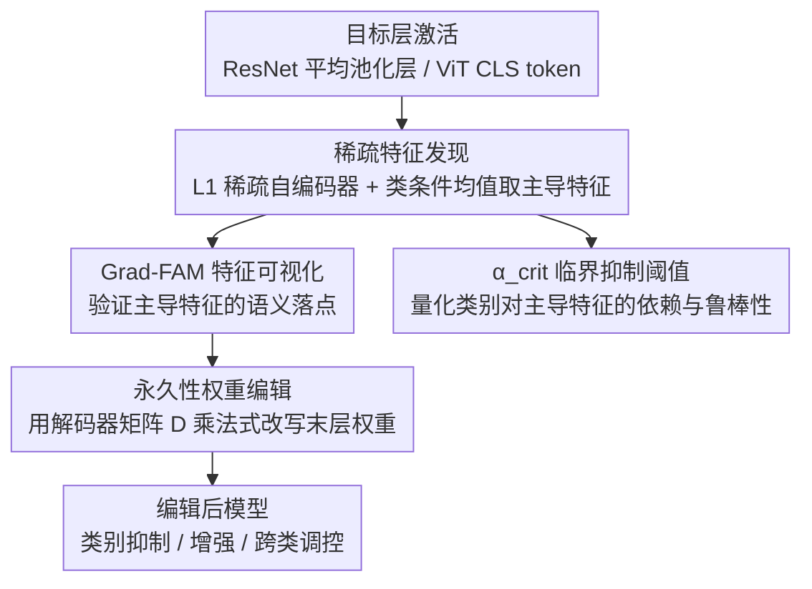

# SALVE: Sparse Autoencoder-Latent Vector Editing for Mechanistic Control of Neural Networks

**会议**: ICLR2026  
**arXiv**: [2512.15938](https://arxiv.org/abs/2512.15938)  
**代码**: 待确认  
**领域**: 可解释性  
**关键词**: 机制可解释性, 稀疏自编码器, 模型编辑, 特征可视化, 权重空间干预  

## 一句话总结
提出 SALVE 框架——"发现-验证-控制"三阶段流程：用 L1 正则化稀疏自编码器发现模型的可解释特征基，用 Grad-FAM 可视化验证特征语义，再利用 SAE 解码器矩阵引导永久性权重空间编辑。在 ResNet-18 和 ViT-B/16 上验证了从类别抑制到跨类特征调控的精确、持久、低副作用控制。

## 研究背景与动机
- 机制可解释性(mechanistic interpretability)近年取得长足进展，SAE(稀疏自编码器)成为发现神经网络内部特征的主流工具（Anthropic "Mapping the Mind" 等标志性工作）
- 但现有工作多停留在"发现并可视化特征"阶段——知道模型在"想什么"，但无法精确修改它的行为
- 模型编辑领域（如ROME、MEMIT）可以修改模型，但缺乏可解释性支撑，修改是黑盒的
- SALVE的核心愿景：**理解(interpretability) → 控制(editing)**，先用SAE理解模型学到了什么特征，再精确编辑这些特征
- 推理时干预(activation steering)是临时的，SALVE追求的是永久性权重修改

## 方法详解

### 整体框架
SALVE 把"看懂模型"和"改动模型"串成一条"发现-验证-控制"的流水线：先在目标层（ResNet 的平均池化层、ViT 的 [CLS] token）上训练一个 L1 正则化的线性稀疏自编码器，得到稀疏可解释的特征基；再用激活最大化和 Grad-FAM 把每个特征的语义看清楚；最后借 SAE 解码器矩阵 $D$ 把"哪个特征要增强/抑制"反投影回最后一层权重，做永久性编辑。整条链路不需要在推理时反复注入向量，编辑完即固化进权重；同时附带一个诊断量 $\alpha_{crit}$，从主导特征出发量化每个类别的鲁棒性。

### 关键设计

**1. 稀疏特征发现：让模型的内部表征变得"一格一格"可操作**

普通激活是高度纠缠的，几百个维度一起表达一个概念，没法单独抓出"教堂"这种语义去动它。SALVE 在目标层训练一个线性自编码器 $Z = \text{Encoder}(x)$，并在编码上加 L1 正则逼出稀疏激活——同一时刻只有少数特征被点亮，于是每个特征更接近一个独立、可单独操作的概念单元。要找出某个类靠哪些特征支撑，就对该类样本求类条件均值潜在激活 $\mu_k = \frac{1}{|C_k|}\sum_{n \in C_k} Z_n$，再按 $|\mu_k|$ 排序取主导特征。稀疏性在这里很关键：那些只在零星样本上激活的特征会在求均值时互相抵消趋近于零，剩下的高均值特征才是该类真正稳定依赖的方向，后续编辑也才打得准。

**2. Grad-FAM 特征可视化：把抽象特征落到图像的具体区域上**

光有"这个类依赖特征 $l$"还不够，得验证特征 $l$ 到底在看什么，否则编辑就是盲改。SALVE 提出 Grad-FAM，思路类似 Grad-CAM，但作用对象从 CNN 的特征图换成了 SAE 的潜在空间——对每个 SAE 特征生成一张空间热力图，显示它在输入图像里"关注"的区域。它和激活最大化形成互补：激活最大化告诉你特征对应的抽象概念长什么样，Grad-FAM 则把这个概念在一张具体图像里的落点标出来。两者一起，让人能在动手编辑前确认"这个特征的语义确实是我以为的那个"。

**3. 永久性权重空间编辑：用乘法式更新保住已学到的符号结构**

确认了目标特征后，SALVE 直接改最后一层权重，而不是在推理时打补丁。编辑规则是 $w_{ij}' = w_{ij} \cdot \max(0,\, 1 \pm \alpha \cdot |c_j|)$，其中 $c_j = D[j, l]$ 是特征 $l$ 通过解码器对激活维度 $j$ 的贡献，$\alpha$ 控制干预强度，$\pm$ 决定是增强还是抑制。这里刻意用乘法而非加法或直接置零：乘法保留了原分类器权重的符号结构，缩放幅度又随 $|c_j|$ 按特征贡献分布，于是效果依赖样本实际的激活模式而非对权重做全局覆盖，副作用因此被限制在与目标特征真正相关的维度上。改完即固化，推理时零额外开销。

**4. $\alpha_{crit}$ 临界抑制阈值：用一个标量量化"某类有多脆弱"**

不同类对其主导特征的依赖程度差别很大，SALVE 用 $\alpha_{crit}$ 把这件事变成可测量的量——它定义为使目标类 logit 降到零所需的最小抑制强度。通过线性近似可以解析估出 $\alpha_{crit}^{(n)} \approx \frac{z_i^{(n)}}{R_i(\mathbf{x}^{(n)})}$，其中 $R_i$ 度量沿该特征方向的抑制敏感度。这个标量直接读出表征的鲁棒性结构：$\alpha_{crit}$ 越低，说明该类几乎全压在单一特征上、稍一抑制就崩，是脆弱表征；$\alpha_{crit}$ 越高，说明有多个冗余特征互相兜底，抑制一个也撑得住。它既能做鲁棒性诊断，也能预测哪些类更容易被对抗性地禁用。

### 损失函数 / 训练策略
SAE 训练只用重建损失加 L1 稀疏正则两项；权重编辑是训练之后的后处理步骤，按上面的乘法规则一次性改写权重，不引入任何额外训练。

## 实验关键数据

### 主实验（ResNet-18 on Imagenette, ViT-B/16 验证）

| 操作 | 目标类准确率 | 非目标类准确率 | 说明 |
|------|------------|--------------|------|
| 原始模型 | ~95% | ~95% | 基线 |
| 抑制 "Church" 特征 | ~0% | ~95% | 精准禁用目标类，零溢出 |
| 增强 "Golf ball" 特征 | 保持 ~95% | ~95% | 增强不影响其他类 |
| 抑制 "Tower" 跨类特征 | Petrol Pump↓, Church 不变 | 轻微变化 | 揭示特征共享和纠缠 |

### 消融与分析

| 分析 | 结果 | 说明 |
|------|------|------|
| αcrit 分布（解析 vs 数值 vs 经验） | 三者一致 | 解析估计提供下界，数值计算精确 |
| 跨类特征 "Tower" 编辑 | Petrol Pump 依赖高，Church 冗余大 | 不同类对同一特征的依赖度差异揭示表征结构 |
| SAE 初始化鲁棒性 | 10 次随机初始化结果一致 | 编辑效果不依赖 SAE 的特定基 |
| ViT-B/16 验证 | 类似的抑制曲线和编辑精度 | CNN 和 Transformer 架构通用 |
| CIFAR-100 扩展 | 有效但跨类共享更多 | 高类别多样性下简单 L1 SAE 的局限 |

### 关键发现
- 永久性权重编辑实现了与推理时激活 steering 和 ROME 类似的目标类零化效果
- $\alpha_{crit}$ 成功识别出"脆弱"类别——依赖单一主导特征、缺乏冗余的类更容易被抑制
- 跨类特征编辑揭示了隐藏的特征纠缠："Tower" 特征的抑制/增强与 "Chain Saw" 类呈反向效应，暗示学习到的虚假负相关

## 亮点与洞察
- 首次系统性地将 SAE 可解释性发现转化为永久性权重编辑，填补了"理解→控制"的关键缺环
- Grad-FAM 是 SAE 特征可视化的有用工具——比直接看激活分布更直观，与 Grad-CAM 互补
- $\alpha_{crit}$ 阈值概念优雅——用一个标量量化"特征对类别有多重要"，可用于鲁棒性诊断和对抗脆弱性预测
- 永久性权重编辑 vs 推理时干预的对比论述清晰——持久性修改在合规场景中更有价值
- 跨类特征编辑揭示了模型内部的特征纠缠结构——"Tower" 特征与 "Chain Saw" 的反向关系是仅通过 SALVE 才能发现的

## 局限与展望
- 仅在图像分类任务（Imagenette、CIFAR-100）上验证，LLM 上的适用性是更重要也更困难的方向——LLM 的内部表征更高维、更纠缠
- SAE 的训练质量直接决定了下游编辑的质量——如果特征不够 disentangled，编辑会有副作用（CIFAR-100 实验已初步显示这个问题）
- 权重空间反投影可能在深层网络中因非线性累积而失真——当前仅编辑最后一层
- 与模型编辑领域方法（ROME、MEMIT）的直接定量对比不够充分——目前仅在类抑制上做了定性比较
- 扩展到更大模型（如 ViT-L、ResNet-101）和更大数据集时稀疏基的质量需要验证——可能需要 Gated/Top-k SAE 等更先进变体

## 相关工作与启发
- **vs ROME/MEMIT**：ROME 做单样本事实修正（rank-1 weight update），SALVE 做特征驱动的全局行为调控——两者目标不同但方法可互补
- **vs Activation Steering**：steering 是临时推理时干预（需在每次前向传播中注入偏移向量），SALVE 做永久性权重编辑——推理时零开销
- **vs Anthropic 的 dictionary learning**：Anthropic 的 SAE 研究聚焦于"发现和理解"特征，SALVE 将其升级为"控制"工具——从 interpretability → editability
- **启发**：SAE + 权重编辑的范式有望成为 AI safety 的实用工具——先理解模型在"想什么"，再精确纠正不想要的行为

## 评分
- 新颖性: ⭐⭐⭐⭐ 理解→控制的桥梁概念新颖，永久性权重编辑 vs 推理时 steering 的定位清晰
- 实验充分度: ⭐⭐⭐ 仅图像分类（Imagenette + CIFAR-100），缺 LLM 和大规模模型实验
- 写作质量: ⭐⭐⭐⭐ "发现-验证-控制" pipeline 框架动机清晰，消融和定性分析完整
- 价值: ⭐⭐⭐⭐ AI safety 方向有长期价值，SAE+权重编辑的范式值得关注

<!-- RELATED:START -->

## 相关论文

- [\[CVPR 2026\] Improving Sparse Autoencoder with Dynamic Attention](../../CVPR2026/interpretability/improving_sparse_autoencoder_with_dynamic_attention.md)
- [\[AAAI 2026\] SparseRM: A Lightweight Preference Modeling with Sparse Autoencoder](../../AAAI2026/interpretability/sparserm_a_lightweight_preference_modeling_with_sparse_autoencoder.md)
- [\[ICLR 2026\] Modal Logical Neural Networks for Financial AI](modal_logical_neural_networks_for_financial_ai.md)
- [\[ICLR 2026\] Addressing Divergent Representations from Causal Interventions on Neural Networks](addressing_divergent_representations_causal.md)
- [\[ICLR 2026\] PERSONA: Dynamic and Compositional Inference-Time Personality Control via Activation Vector Algebra](persona_dynamic_and_compositional_inference-time_personality_control_via_activat.md)

<!-- RELATED:END -->
