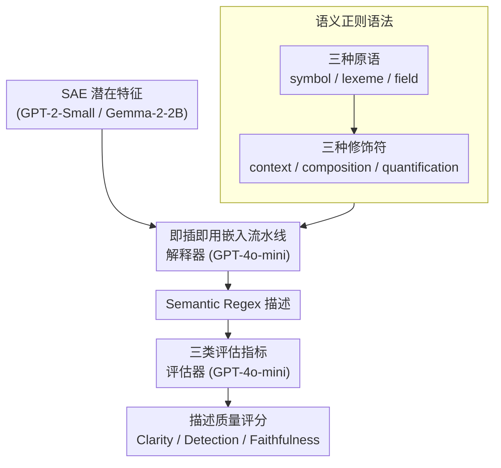

# Semantic Regexes: Auto-Interpreting LLM Features with a Structured Language

**会议**: ICLR 2026  
**arXiv**: [2510.06378](https://arxiv.org/abs/2510.06378)  
**代码**: [apple/ml-semantic-regex](https://github.com/apple/ml-semantic-regex)  
**领域**: LLM NLP / Mechanistic Interpretability  
**关键词**: mechanistic_interpretability, automated_interpretability, sparse_autoencoders, structured_language, feature_description  

## 一句话总结

本文提出 **Semantic Regexes（语义正则表达式）**，一种用于自动描述 LLM 特征的结构化语言，通过原语（symbol/lexeme/field）+ 修饰符（context/composition/quantification）组合，实现与自然语言同等准确但更简洁、一致且可分析的特征描述。

## 研究背景与动机

**自动可解释性的现状**：
- 稀疏自编码器（SAE）等方法可以从 LLM 中提取单义特征（features）
- 自动可解释性用 LLM 将特征翻译为人类可读的描述
- 这些描述帮助研究者理解模型编码了什么概念、追踪特征电路

**自然语言描述的问题**：
- **冗长**：描述经常过于啰嗦（如"The presence of the sequence 54 indicating a year, time, or numeric reference frequently associated with events"）
- **不一致**：功能相同的特征可能得到完全不同的描述
- **歧义**：自然语言天然存在多义性，不利于需要组合推理的分析任务
- **需要人工重标注**：即使在最新的特征电路工作中，研究者仍需手动重标注特征

**结构化语言的优势**：
- 良定义的语法和语义，减少歧义
- 复合规则支持从简单到复杂的精确表达
- 一致的表达方式便于比较和聚合

## 方法详解

### 整体框架

本文要解决的是自动可解释性里"特征描述"的表达问题：稀疏自编码器（SAE）能从 LLM 抽出单义特征，但目前都用自然语言去描述这些特征，结果冗长、不一致、还有歧义。Semantic Regex 把这一步换成一套结构化的"特征描述语言"——用 grounded theory 从数千个真实特征里归纳出一组**原语**（管匹配粒度）和**修饰符**（管组合方式），让一个特征的语义能像写正则表达式一样被精确拼出来。整套语言不改动既有流水线的骨架：SAE 照常提取特征，解释器读激活数据、按这套语法吐出 semantic regex 描述，评估器再用一组指标核对描述与特征行为是否吻合。

### 关键设计

**1. 三种原语：用不同粒度兜住"特征到底匹配什么"**

自然语言描述的第一个毛病是粒度含糊——一个特征到底是认死某个字符串，还是认一类词，描述里说不清。Semantic Regex 把匹配粒度显式拆成三档原语，由严到松层层递进。`[:symbol X:]` 精确匹配字符串 X，对应只在特定 token 上激活的特征，比如 `[:symbol color:]` 只命中文本里的 "color"；`[:lexeme X:]` 放宽到 X 的句法变体（时态、单复数等），`[:lexeme color:]` 会把 "color"、"colors"、"coloring" 一并收进来，对应捕捉词义而非词形的特征；`[:field X:]` 进一步放宽到同一概念域的语义变体，`[:field color:]` 匹配 "red"、"blue"、"green" 这类共属"颜色"概念的词，对应激活于一整个概念类别的特征。三档之间选哪一档，本身就回答了"特征抽象到什么程度"，让原本含糊的粒度变成描述里的显式信息。

**2. 三种修饰符：让简单匹配精确组合成复杂行为**

光有原语只能描述孤立的匹配点，但很多特征要靠上下文、组合或可选成分才能讲清楚，于是在原语之上再叠三种修饰符。Context 用 `@{:context X:}(regex)` 给括号内的匹配加上语境限定，`@{:context politics:}([:symbol color:])` 表示只在政治语境里命中 "color"，把"在某种话题下才激活"的特征精确框住；Composition 用序列拼接和交替符 `|` 把原语连起来，`[:field color:]([:symbol and:]|[:symbol or:])[:field color:]` 描述"两个颜色词被 and/or 连接"的句式；Quantification 借用正则量词 `?`（零或一次）表达可选成分，`[:symbol a:][:field color:]?[:field flower:]` 说明颜色词出现与否都算命中。三种修饰符与三种原语自由组合，就能从单个 token 一路精确表达到带语境约束的复杂句式，而且这份复杂度是显式写在描述里、可被直接读取和统计的。

**3. 即插即用嵌入流水线：只换语言，不动架构**

这套语言要有用，前提是不能逼研究者重搭一套系统。本文把它直接挂进既有的解释器（explainer）+ 评估器（evaluator）流水线：主体模型用 GPT-2-Small 和 Gemma-2-2B，特征来自它们的 SAE 潜在向量（GPT-2-RES-25k、Gemma-2-2B-RES-16k/65k），解释器和评估器都用 GPT-4o-mini。改动只发生在 prompt 一层——在原本的 max-acts prompt 里注入 semantic regex 的语法规则和少量 few-shot 示例，让解释器学会吐结构化描述，评估器再据此判定描述与激活样例是否匹配。因为只换了描述语言、没碰流水线骨架，任何已经在跑自动可解释性的系统都能低成本接入，全程不涉及任何参数训练。

**4. 三类评估指标：从生成、判别、因果三面交叉验证描述准不准**

要证明结构化描述不比自然语言差，得有一套不依赖训练、能量化"描述好坏"的指标，本文把它们归成三类。**生成类（Clarity）**测描述能否反推出高激活样例，类似 precision：用 Clarity 指标比较"按描述生成的样例"与随机样例的激活，取 Gini 指数（即 ROC AUC 的一个重标度）。**判别类（Detection / Fuzzing / Responsiveness / Purity）**测描述能否把已知激活样例认出来，类似 recall：Detection 在样例级算平衡准确率，Fuzzing 把判定细化到"描述是否命中样例里真正激活的那些 token"再算平衡准确率，Responsiveness 取 Gini 指数，Purity 取平均精度。**忠实类（Faithfulness）**最严，测描述是否反映因果干预——让评估器判断在该特征被 steer（放大）与被 ablate（消融）两种条件下，描述与文本续写的吻合程度差异。三类从"生成得出""认得出""经得起干预"三个角度交叉验证，避免单一指标被钻空子。

## 实验关键数据

### 主实验：准确率对比（每层 100 特征）

| 指标 | Semantic Regex | max-acts (NL) | token-act-pair (NL) |
|------|---------------|---------------|---------------------|
| Clarity (GPT-2) | **显著优于** | 基线 | 最低 |
| Detection (GPT-2) | **显著优于** tap | 与 SR 持平 | 最低 |
| Fuzzing (GPT-2) | **显著优于** tap | 与 SR 持平 | 最低 |
| Clarity (Gemma-16k) | 非劣效 | 基线 | 最低 |
| Clarity (Gemma-65k) | **显著优于** tap | 基线 | 最低 |

核心结论：**Semantic regex 在所有模型上至少与自然语言持平，在多个指标上显著优于 token-act-pair**。这说明结构化约束不会降低描述能力。

### 消融实验：简洁性和一致性

| 度量 | Semantic Regex | max-acts | token-act-pair |
|------|---------------|----------|----------------|
| 描述长度中位数（字符） | **41** (IQR: 19-59) | 139 (IQR: 119-166) | 55 (IQR: 46-66) |
| 相同描述率（5次生成） | **33.6%** | 0.0% | 12.2% |

- Semantic regex 比 max-acts 短 **3.4 倍**
- 同一特征的不同采样下，semantic regex 33.6% 产生完全相同的描述（max-acts 为 0%）

### 特征复杂度分析

| 层位置 | 平均组件数 | 低级原语占比 | Field 占比 | 带修饰符占比 |
|--------|----------|------------|-----------|------------|
| 早期层 | 少 | 高（symbol/lexeme 为主） | 低 | 低 |
| 中间层 | 中等 | 降低 | 增加 | 增加 |
| 后期层 | 多 | 最低 | 最高 | 最高 |

Semantic regex 的结构自然编码了特征复杂度：后层特征需要更长、更抽象的描述。这与"后层编码更复杂表征"的已知现象一致，但首次能从特征描述中直接读取。

### 用户研究（24 人）

| 度量 | Semantic Regex 优于 NL 的特征数 / 12 |
|------|--------------------------------------|
| 决策边界理解（正向-反事实激活差） | **9 / 12** |

- 参与者使用 semantic regex 在 12 个特征中的 9 个上生成了更好的正向和反事实样例
- 自然语言描述常引入无关细节导致误解（如"expected to indicates anticipation"让用户误认为非预期语境是反例）
- 参与者对 semantic regex 的理解比预期好得多，收到的自然语言理解问题反而更多

### 关键发现

1. **结构化 ≠ 表达力降低**：semantic regex 在准确率上与自然语言持平甚至更优
2. **简洁性 3.4 倍提升**：大幅降低解读负担
3. **一致性从 0% 提升到 33.6%**：有助于冗余特征检测和电路分析
4. **复杂度可读**：从描述格式直接反映特征的抽象层级
5. **人类友好**：用户研究确认 semantic regex 帮助建立更准确的特征心智模型

## 亮点与洞察

- **方法论创新**：将正则表达式的思路推广到语义域，兼具形式化和可读性
- **Grounded Theory 驱动**：语言设计不是凭空构造，而是从数千个真实特征归纳而来
- **即插即用**：仅需修改 prompt 中的描述规范即可集成到现有可解释性流水线
- **规模化分析的关键能力**：自然语言描述适合理解单个特征，但 semantic regex 的结构使得跨模型、跨层的宏观分析成为可能
- **Apple 出品**，开源代码和交互界面，工程质量高

## 局限性

1. **非唯一映射**：同一特征可能有多个等效的 semantic regex 描述，缺乏标准化风格指南
2. **过于简洁的风险**：`[:field musician:]` 可能让人误以为 "guitarist" 会强激活，但实际特征只激活于音乐家名字
3. **不解决多义性**：高度多义的特征产生的 semantic regex 不连贯
4. **模型学习新语言的局限**：LLM 仅从简短描述和少量示例学习 semantic regex 语法，偶尔出错
5. 目前仅在 GPT-2 和 Gemma-2 上验证，更大模型和更复杂 SAE 的适用性待验证

## 相关工作与启发

- **SAE / Transcoders (Bricken et al., 2023; Dunefsky et al., 2024)**：提取 LLM 的单义特征
- **Bills et al. (2023)**：自动可解释性流水线开创者（token-act-pair 方法）
- **Paulo et al. (2024)**：max-acts 方法，改进了激活数据展示方式
- **Ameisen et al. (2025)**：特征电路追踪，需要人工重标注——semantic regex 的一致性可减少此需求
- **Jin et al. (2025)**：特征复杂度分层——semantic regex 从描述端独立验证了这一发现
- 启示：可解释性不仅是生成描述，描述的**语言本身**也值得设计

## 评分

- **创新性**: ⭐⭐⭐⭐ — 结构化语言 × 自动可解释性是新组合
- **实验设计**: ⭐⭐⭐⭐ — 多模型 + 多指标 + 用户研究，全面
- **实用性**: ⭐⭐⭐⭐⭐ — 即插即用，Apple 开源，直接可用
- **写作质量**: ⭐⭐⭐⭐⭐ — 论述清晰，可视化出色
- **综合评分**: ⭐⭐⭐⭐ (4/5)

<!-- RELATED:START -->

## 相关论文

- [\[ACL 2026\] Style over Story: Measuring LLM Narrative Preferences via Structured Selection](../../ACL2026/interpretability/style_over_story_measuring_llm_narrative_preferences_via_structured_selection.md)
- [\[ICLR 2026\] One Language, Two Scripts: Probing Script-Invariance in LLM Concept Representations](one_language_two_scripts_probing_script-invariance_in_llm_concept_representation.md)
- [\[ICML 2026\] CorrSteer: Generation-Time LLM Steering via Correlated Sparse Autoencoder Features](../../ICML2026/interpretability/corrsteer_generation-time_llm_steering_via_correlated_sparse_autoencoder_feature.md)
- [\[ICLR 2026\] Conjuring Semantic Similarity](conjuring_semantic_similarity.md)
- [\[CVPR 2026\] Language Models Can Explain Visual Features via Steering](../../CVPR2026/interpretability/language_models_can_explain_visual_features_via_steering.md)

<!-- RELATED:END -->
