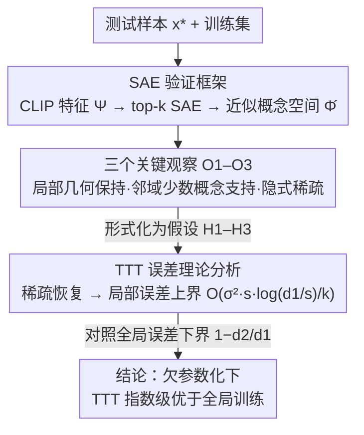

# Specialization after Generalization: Towards Understanding Test-Time Training in Foundation Models

**会议**: ICLR 2026 Oral  
**arXiv**: [2509.24510](https://arxiv.org/abs/2509.24510)  
**代码**: 无  
**领域**: 模型压缩 / 测试时训练  
**关键词**: Test-Time Training, 线性表示假说, 稀疏自编码器, 泛化后特化, 基础模型

## 一句话总结

本文从线性表示假说（LRH）出发，提出"泛化后特化"（specialization after generalization）理论框架，首次在 in-distribution 场景下系统解释了 TTT 为何有效——基础模型因全局欠参数化导致概念叠加干扰，TTT 通过临时遗忘无关概念来释放模型容量、局部特化到测试任务相关的少量概念上，理论保证即使特征空间指数级小于概念空间也能泛化。

## 研究背景与动机

**领域现状**：Test-Time Training（TTT）将微调推向极致——为每一个测试样本单独微调模型，近年在抽象推理、语言建模、视频生成等任务上均展现了显著提升。典型做法是从训练集中检索测试点的近邻，用监督损失对预训练模型做几步梯度下降，推理时使用局部微调后的模型做预测。

**现有痛点**：过去对 TTT 有效性的解释主要集中在两个方面：(1) 适应分布偏移（out-of-distribution adaptation）；(2) 利用预训练未见的特权数据。但随着基础模型规模急剧扩大，绝大部分测试数据已经是 in-distribution 的，这两个解释都不再适用。一个关键的未解问题浮出水面：**在 in-distribution 场景下，TTT 为何仍然能改善预测？**

**核心矛盾**：尽管当代基础模型参数量巨大，但 scaling law 研究表明增加模型规模仍可持续提升性能，说明模型实际上处于"有效欠参数化"状态（effectively underparameterized）。模型需要同时编码现实世界中海量概念，而概念数量远超模型维度，不得不将多个概念叠加在同一组激活中（superposition）。这种叠加在全局预测时造成概念间相互干扰，无法精确解耦每个概念的含义。

**本文目标** (1) 从理论上刻画 TTT 在 in-distribution 下的有效性机制；(2) 建立 TTT 误差的理论上界，证明它优于全局训练；(3) 通过 SAE 验证理论假设、通过 scaling study 验证理论预测。

**切入角度**：作者从线性表示假说（LRH）出发——模型将高层语义概念编码为激活空间中的线性方向，单个输入只激活少量概念（$s$-稀疏）。由于概念数 $d_1$ 远大于模型维度 $d_2$，概念在密集激活中叠加。TTT 只需要在局部邻域内解耦少量相关概念，而不需要全局解耦所有概念，因此更容易成功。

**核心 idea**：TTT 本质上是"泛化后特化"——模型先通过全局训练学到概念的叠加表示，再在测试时通过局部微调将模型容量释放给当前任务相关的少数概念，临时"遗忘"无关知识以换取局部精度的提升。

## 方法详解

### 整体框架

本文是一项理论驱动的实证研究，不提出新的 TTT 算法，而是构建一个基于 LRH 的理论框架来解释 TTT 的有效性，并通过稀疏自编码器（SAE）实验验证假设、通过 scaling study 验证理论预测。整体分为三个层次：(1) 用 SAE 在 ImageNet 上建立三个关键观察（O1-O3），支撑理论假设；(2) 在 MNIST/ImageNet/Pile 上做模型和数据规模的 scaling 实验，验证"欠参数化假说"的实际预测；(3) 在 LRH 下推导 TTT 局部误差上界，与全局训练误差做理论对比。

输入是任意测试样本 $x^*$，方法是在训练集中找它的 $k=50$ 个近邻，用交叉熵损失训练局部线性分类器（只更新最后一层），预测 $x^*$ 的标签。理论分析的核心问题是：为什么这种"用 50 个邻居训一个局部模型"的策略比"在全量数据上训一个全局模型"更好？三个层次环环相扣——先用 SAE 把不可观测的概念空间变成可分析的对象，再在其上观测到 O1–O3 三条经验规律，最后把这三条形式化成假设、推出 TTT 的误差上界并与全局训练对比。

### 关键设计

**1. SAE 验证框架：把不可观测的"概念空间"变成可分析的对象**

理论里的"真实概念空间" $\Phi$ 没法直接访问，所以作者借稀疏自编码器（SAE）学一个近似概念空间 $\hat{\Phi}$，让原本只能口头假设的命题变得可以实测。具体做法是在 ImageNet-1K 上用 CLIP ViT-B/32 提取 $d_2=512$ 维特征 $\Psi(x)$，再训练一个 top-$k$ SAE 把它编码成 $d_1=4096$ 维、$s=16$ 稀疏的概念向量 $\hat{\Phi}(x)$：编码器 $E \in \mathbb{R}^{d_1 \times d_2}$ 只保留最大的 $s$ 个激活，解码器 $D \in \mathbb{R}^{d_2 \times d_1}$ 从稀疏表示重建原特征，优化目标就是重建误差

$$\mathbb{E}_x\|\Psi(x) - D \cdot \text{top}_s(E \cdot \Psi(x))\|_2^2,$$

并用 ghost gradient 辅助损失压制死特征（最终只有 4% 概念不活跃）。一个关键选择是：后续实验都跑在 SAE 重建后的特征 $\hat{\Psi}(x)$ 上、而不是原始 CLIP 特征，这样实验空间和理论模型对齐，代价只是全局分类精度掉约 6%——用这点精度换来理论假设的可验证性，是整篇方法成立的前提。

**2. 三个关键观察 O1–O3：把理论假设逐条落到经验证据上**

直接分析 TTT 的数学性质很难，作者反过来先在 $\hat{\Phi}$ 空间里建立三条可测的经验规律，再把它们当成后续证明的假设条件。

- **O1（局部几何保持）**：分别在 $\Psi$、$\hat{\Psi}$、$\hat{\Phi}$ 三种空间里取同一测试点的邻域，比较概念空间中的余弦相似度分布——三者几乎重合，说明 SAE 映射没有破坏局部角度结构，理论可以放心在 $\hat{\Phi}$ 上谈邻域。
- **O2（邻域由少数概念支持）**：对每个邻域学一个自适应二值掩码 $m$，用直通估计器优化 $\hat{\Phi}_m(x) = m \odot \hat{\Phi}(x)$ 并加 $\ell_2$ 稀疏惩罚。结果平均只留约 40 个概念（邻域内本来激活约 180 个）TTT 精度就不掉。更说明问题的是，非自适应掩码（只保留测试点自身激活的概念）只能到 71.51%，明显输给自适应掩码的 72.64%——这条对比直接证明"哪些概念相关"必须靠学，掩码学习能识别并剔除伪相关特征。
- **O3（隐式稀疏性）**：在 $\hat{\Psi}$ 空间和 $\hat{\Phi}_m$ 空间各做一次 TTT，两者预测在约 89% 样本上一致、top-10 概率分布高度吻合，说明特征空间里的 TTT 其实隐式偏好概念空间中的稀疏解。

这三条恰好对应"邻域结构可信、相关概念稀疏、TTT 自己会找稀疏解"，为下一步的误差证明铺好台阶。

**3. TTT 误差理论分析：证明局部特化在欠参数化下指数级优于全局训练**

把 O1–O3 形式化成三个假设后，作者就能给 TTT 的泛化误差上界。三个假设是：(H1) 特征空间的邻域被包在概念空间一个稍大的邻域里，由 Johnson–Lindenstrauss 引理保证偏移 $\delta \leq O(\sqrt{\log N / d_2})$；(H2) 邻域内存在一个 $\Theta(s)$-稀疏的局部概念向量能近似真实函数；(H3) TTT 会隐式找到概念空间中的稀疏解。在这些条件下用稀疏恢复技术可证 TTT 的测试误差满足

$$\big(f(x^*) - \langle \Psi(x^*), \hat{v}_{x^*}^{\text{TTT}} \rangle\big)^2 \leq O\!\left(\frac{\sigma^2 s \log(d_1/s)}{k}\right),$$

已达到 minimax 最优速率。作为对照，作者又给了一个全局模型的误差下界：当特征空间是概念空间的随机投影时，全局误差为 $1 - d_2/d_1$，随 $d_1 \to \infty$ 趋向 1。两个式子并排看就是整套理论的高潮——TTT 误差随邻域大小 $k$ 改善、对概念空间维度只有对数依赖 $\log d_1$，而全局模型误差随概念数线性恶化 $d_2/d_1$；当现实世界概念极多（$d_1$ 很大）时，局部特化相对全局训练就拿到了指数级优势。

### 损失函数 / 训练策略

TTT 阶段使用标准交叉熵损失在 $k=50$ 近邻上训练局部线性分类器，仅更新最后一层。语言建模实验中，在 Qwen2.5 系列模型上用 LoRA（约 1% 参数）做 TTT，按相似度从高到低的顺序在 50 个邻居上各做一步梯度下降。邻域检索用 $L_2$ 距离（归一化 CLIP 特征等价于余弦相似度）。

## 实验关键数据

### 主实验：ImageNet 上的 TTT vs 全局训练

| 方法 | 概念空间 $\hat{\Phi}(x)$ 准确率 | 特征空间 $\hat{\Psi}(x)$ 准确率 |
|------|------|------|
| 全局训练 | 71.45 ± 0.21 | 71.26 ± 0.20 |
| TTT ($k$=50 邻居) | **72.64 ± 0.20** | **72.56 ± 0.19** |
| 自适应掩码 TTT | 72.64 ± 0.20（仅 ~40 概念） | — |
| 非自适应掩码 TTT | 71.51 | — |

TTT 相比全局训练提升约 1.2-1.3 个百分点。自适应掩码 TTT 仅使用约 40 个概念就达到和密集 TTT 相同的性能，而非自适应掩码（仅保留测试点自身激活的 16 个概念）几乎没有改善，说明局部概念选择需要学习而非简单匹配。

### 模型/数据 Scaling 实验

| 任务 | 最小模型 TTT 增益 | 最大模型 TTT 增益 | 趋势 |
|------|---------|---------|------|
| MNIST | ~0.8% 错误率降低 | ~0.1% | 差距随模型增大显著缩小 |
| ImageNet (MLP) | ~3% 准确率提升 | ~0.5% | 同上 |
| Pile 语言建模 (Qwen2.5) | 0.5B: ~0.07 bits/byte 改善 | 7B: ~0.02 bits/byte | 同上 |

### TTT 局部性验证

| 评估方式 | MNIST 准确率 | ImageNet 准确率 |
|---------|------------|----------------|
| 全局模型 | 98.57 ± 0.12 | 78.33 ± 0.19 |
| TTT 评估测试样本 | 99.01 ± 0.10 | 79.39 ± 0.18 |
| TTT 评估邻域 | 100.00 ± 0.00 | 95.19 ± 0.00 |
| TTT head 全局评估 | **36.38 ± 0.16** | **77.04 ± 0.06** |

这张表最有说服力：TTT head 在邻域内近乎完美（MNIST 100%，ImageNet 95.19%），但将它全局应用于整个测试集则灾难性崩溃（MNIST 仅 36.38%），直观验证了"局部特化"机制——TTT 通过遗忘无关概念换取局部精度。

### 关键发现

- **模型缩放趋势完美匹配理论预测**：TTT 始终优于全局训练，但差距随模型增大而缩小。在 MNIST 上最小模型有约 0.8% 的改善，最大模型几乎持平；在 Pile 上 0.5B 改善最大，7B 改善最小。这与理论中"欠参数化程度决定 TTT 增益"一致——模型越大，需要叠加的概念越少，全局模型本身就能解耦更多概念
- **数据规模的反直觉效应**：训练数据越多，TTT 的改善反而略微增大。这是因为更大的训练集为每个测试点提供了更丰富、更相关的邻域，使局部适应更有效
- **邻域大小存在最优权衡**：在 ImageNet 上实验了不同的 $k$ 值，发现 $k$ 太小有高方差，$k$ 太大引入无关概念导致局部稀疏假设失效，最优在 ~50 附近
- **非参数基线表现差**：多数投票（majority vote）在类别数多时表现极差（ImageNet 1000 类），因为它无法利用概念空间的结构信息，只做简单的频率统计

## 亮点与洞察

- **"遗忘即释放"的统一解释**：首次将 TTT 在 in-distribution 场景下的有效性归因于模型的全局欠参数化，而非分布偏移。这个视角同时解释了为什么 TTT 在小模型上改善多、大模型上改善少，以及为什么 TTT head 全局评估会崩溃。概念上极其优雅
- **SAE 作为理论验证工具**：巧妙地利用 SAE 将不可观测的"概念空间"变为可分析的对象。自适应掩码实验（O2）尤其精彩——证明邻域内只有约 40/4096 个概念真正相关，这为"为什么 50 个邻居就够"提供了定量解释
- **理论给出实用指导**：误差界 $O(\sigma^2 s \log(d_1/s)/k)$ 直接告诉实践者：TTT 效果取决于局部概念稀疏度 $s$、概念空间规模 $d_1$（仅对数依赖）和邻域大小 $k$。这为选择邻域大小和判断何时使用 TTT 提供了理论依据
- **与持续学习的概念桥接**：TTT 的"临时遗忘"机制与持续学习中的灾难性遗忘是同一枚硬币的两面——在持续学习中遗忘是问题，在 TTT 中遗忘却是特性

## 局限与展望

- **LRH 假设的普适性未验证**：所有理论结论依赖于线性表示假说，但 LRH 在所有架构和任务上是否成立仍是开放问题。在高度非线性的任务（如需要复合推理的场景）中，概念可能不以线性方向编码
- **SAE 近似精度有限**：实验中 SAE 重建导致全局准确率降低 6%，说明 $\hat{\Phi}$ 与真实概念空间存在差距。O1-O3 的验证都基于近似概念空间，真实概念空间中这些性质是否同样成立需要更多证据
- **线性 TTT vs 非线性 TTT 的鸿沟**：理论分析限于线性分类器（更新最后一层），但实践中 TTT 通常用 LoRA 更新多层参数。作者在语言建模实验中用了 LoRA TTT，但理论并未覆盖这种非线性情况
- **实验规模受限**：语言建模实验限于 1% 测试集和最大 7B 模型（受限于单张 RTX 4090）。scaling 趋势在更大模型（70B+）上是否仍成立值得验证
- **邻域选择策略未深入**：论文用固定 $k=50$ 和 $L_2$ 距离，但最优邻域大小可能取决于测试点本身（概念密度高的区域需要更小的邻域）。自适应邻域选择是一个有价值的研究方向

## 相关工作与启发

- **vs 经典 TTT（Sun et al. 2020）**：经典 TTT 用自监督损失（如旋转预测）适应分布偏移，本文研究的是半参数 TTT（用监督损失在近邻上微调），且专注于 in-distribution 场景。经典 TTT 的理论分析假设 TTT 梯度与 oracle 标签梯度对齐，本文提供了 LRH 下这种对齐成立的理论依据
- **vs 非参数方法（kNN 分类器）**：kNN/多数投票是最简单的"局部化"策略，但在概念空间高维（$s$-稀疏）时表现很差。本文理论解释了原因：非参数方法无法利用概念空间的稀疏结构来解耦含义，只能做频率统计
- **vs Basu et al. 2023**：也分析了 TTT 的类似设置，但从非参数估计角度出发，假设目标函数在特征空间中光滑。本文明确建模了底层稀疏概念空间，能解释为什么 TTT 在局部高维（$s$-稀疏）情况下仍然有效
- **与可解释性研究的交叉**：本文将 SAE 从可解释性工具扩展为理论验证工具，这种思路可以迁移——用 SAE 分析其他需要理解模型内部表示结构的问题（如 RLHF 对齐、知识编辑）

## 评分

- **新颖性**: ⭐⭐⭐⭐⭐ — "泛化后特化"框架在理论深度和解释力上都非常出色，首次统一解释了 TTT 在 in-distribution 下的有效性
- **实验充分度**: ⭐⭐⭐⭐ — 横跨视觉和语言的 scaling study 验证了理论预测，SAE 实验验证了三个关键假设，但语言建模实验规模受限
- **写作质量**: ⭐⭐⭐⭐⭐ — 论文结构极为清晰，从"何时有效"到"为何有效"的递进逻辑优美自然，理论与实验的衔接紧密
- **价值**: ⭐⭐⭐⭐ — 理论导向为主，对 TTT 实践有间接指导价值（何时用、邻域多大），更重要的是为理解基础模型的内部表示提供了新视角

<!-- RELATED:START -->

## 相关论文

- [\[ICLR 2026\] Temporal Sparse Autoencoders: Leveraging the Sequential Nature of Language for Interpretability](temporal_sparse_autoencoders_leveraging_the_sequential_nature_of_language_for_in.md)
- [\[ICLR 2026\] Grokking in LLM Pretraining? Monitor Memorization-to-Generalization without Test](grokking_in_llm_pretraining_monitor_memorization-to-generalization_without_test.md)
- [\[ICLR 2026\] Tokenizing Single-Channel EEG with Time-Frequency Motif Learning](tokenizing_single-channel_eeg_with_time-frequency_motif_learning.md)
- [\[ICLR 2026\] ZeroTuning: Unlocking the Initial Token's Power to Enhance Large Language Models Without Training](zerotuning_unlocking_the_initial_tokens_power_to_enhance_large_language_models_w.md)
- [\[ICLR 2026\] Toward Faithful Retrieval-Augmented Generation with Sparse Autoencoders](toward_faithful_retrieval-augmented_generation_with_sparse_autoencoders.md)

<!-- RELATED:END -->
