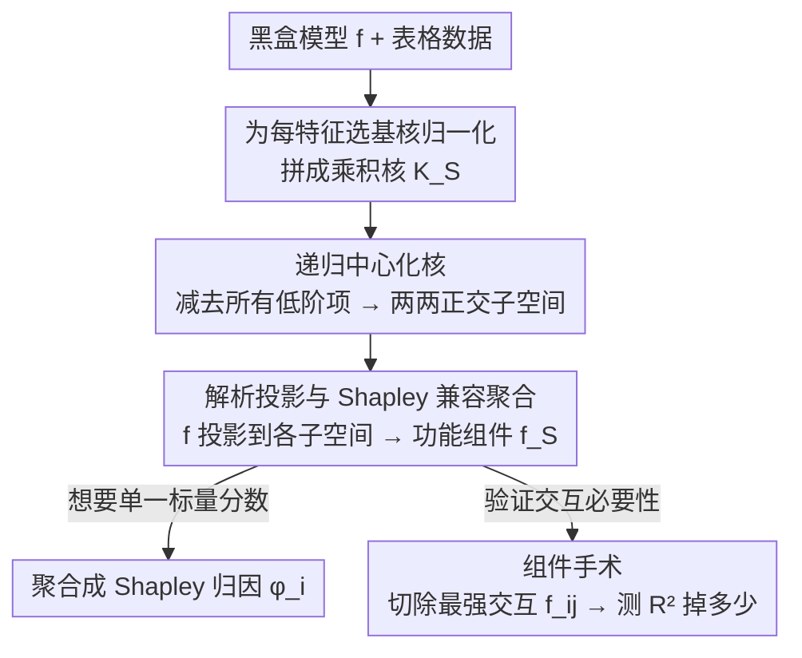

# STRIDE: Subset-Free Functional Decomposition for XAI in Tabular Settings

**会议**: ICLR 2026  
**arXiv**: [2509.09070](https://arxiv.org/abs/2509.09070)  
**代码**: 无  
**领域**: 可解释 AI / 核方法  
**关键词**: Functional Decomposition, RKHS, Centered Kernels, Feature Interaction, Component Surgery

## 一句话总结

STRIDE 将模型解释重新定义为 RKHS 中的正交函数分解问题，通过递归核中心化无需枚举 $2^d$ 个子集即可解析计算正交功能组件 $f_S(x_S)$，不仅能给出标量重要性分数还能揭示特征如何协同或冗余地影响预测，在表格数据上实现了比 TreeSHAP 快 3 倍且 $R^2=0.93$ 的性能。

## 研究背景与动机

**领域现状**：可解释 AI（XAI）的主流方法（如 SHAP、LIME、IG）将每个特征的影响压缩为单个标量值 $\phi_i$。Shapley 值框架提供了公理化公平的归因分配，TreeSHAP 等优化算法在特定模型上实现了高效计算，成为实践中的标准工具。

**现有痛点**：标量归因有两个根本性缺陷。第一，**表达力不足**：将特征的复杂非线性效应压缩为一个数字，无法回答"特征如何影响预测"——只能回答"哪个特征重要"。特征间的协同（synergy）和冗余（redundancy）关系被完全遮蔽。第二，**计算代价高**：精确计算 Shapley 值需要遍历 $2^d$ 个特征子集，计算复杂度呈指数增长，实践中只能依赖近似方法。

**核心矛盾**：XAI 社区面临一个根本困境——要么用标量归因获得高效但粗糙的解释（告诉你"什么重要"），要么用函数分解获得详细但低效的解释（告诉你"如何影响"）。此前没有一个框架能同时提供两者且保持实用的计算效率。

**本文目标** (1) 如何在不枚举 $2^d$ 子集的情况下高效计算函数分解？(2) 如何在保持模型无关性的前提下恢复正交功能组件？(3) 如何量化证明交互效应的"功能必要性"而非仅仅观察到相关性？

**切入角度**：作者观察到 Hoeffding 的功能 ANOVA 分解和再生核希尔伯特空间（RKHS）理论可以结合——通过定义递归中心化的核函数，构造出与每个特征子集对应的正交子空间，然后通过解析投影恢复功能组件。关键洞察是中心化核的 Möbius 反演结构使得分解可以无需子集枚举。

**核心 idea**：用 RKHS 中的递归中心化核构造正交子空间，将模型解释从标量归因升级为无需子集枚举的正交函数分解。

## 方法详解

### 整体框架

STRIDE 要解决的问题是：给定任意黑盒模型 $f: \mathcal{X} \rightarrow \mathbb{R}$，不是只回答"哪个特征重要"，而是把 $f$ 整个拆成一组互不重叠的正交功能组件 $f = \sum_S f_S$，每个 $f_S(x_S)$ 对应特征子集 $S$ 的纯效应。整条链路是这样转的：先为每个特征选一个基核并归一化、拼成乘积核 $K_S$；再对乘积核做递归中心化得到 $K_S^{(c)}$，由此撑起一组两两正交的子空间 $\mathcal{H}_S$；然后把 $f$ 解析投影到每个子空间，直接读出对应的功能组件 $f_S(x_S)$；最后若用户仍想要熟悉的标量分数，可把功能组件再聚合成兼容 Shapley 公理的归因 $\phi_i$。整个过程是 post-hoc 的，对训练好的模型直接做，关键是绕开了对 $2^d$ 个子集的枚举。

### 关键设计

**1. 递归中心化核：用代数结构换掉子集枚举**

精确的函数分解最大的拦路虎是要为每个子集 $S$ 单独算出"剔除所有更低阶效应后剩下的纯交互"，朴素做法要遍历 $2^d$ 个子集。STRIDE 的做法是把这件事编码进核函数的递归定义里：令 $K_S^{(c)} := K_S - \sum_{R \subsetneq S} K_R^{(c)}$，基例 $K_\emptyset^{(c)} := 1$。这个递归通过 Möbius 反演有显式闭式 $K_S^{(c)} = \sum_{R \subseteq S}(-1)^{|S|-|R|}K_R$，所以不需要逐个子集迭代，直接代数展开即可。中心化核的关键性质是"部分零均值"——对 $S$ 中任意一个维度 $i$ 积分后恒为零：$\int_{T_i} K_S^{(c)}(x_S, t_S)\, d\mu_i(t_i) = 0$。正是这条性质保证了不同子集的中心化核在 $L^2(\mu)$ 中两两正交（Theorem 1）。

正交性不是锦上添花，而是整套方法可解释性的根基：它让每个组件 $f_S$ 精确捕获子集 $S$ 的纯交互效应，不会和低阶或高阶效应混在一起，从而保证分解唯一、各组件含义清晰。

**2. 解析投影与 Shapley 兼容聚合：一份分解同时喂两类用户**

有了正交子空间，恢复功能组件就退化成一次投影。由正交投影定理，

$$f_S(x_S) = \langle f, K_S^{(c)}(\cdot_S, x_S) \rangle,$$

即 $f$ 在子空间 $\mathcal{H}_S$ 上的投影。实际计算时用经验样本平均近似其中的积分，并配合低秩近似和正则化保证数值稳定。对仍想要单一标量分数的用户，STRIDE 把功能组件再聚合：$\phi_i(x) := \sum_{S \ni i} \frac{1}{|S|} f_S(x_S)$，可证明它满足效率性、对称性、哑变量和线性这几条 Shapley 公理。这样一来，熟悉 Shapley 的人拿到的归因和以前口径一致，而想深挖的人还能继续看 $f_S$——后者是前者的严格超集，标量能从功能组件聚合出来，反过来则不行。

**3. 组件手术（Component Surgery）：把"看起来重要"逼成"移除损失多少"**

光说某个交互重要还停留在定性观察。组件手术先用 STRIDE 分解挑出影响最大的交互组件（比如最高影响的 $f_{ij}$），再从模型预测里把它"切除"——用 $f(x) - f_{ij}(x_{ij})$ 代替 $f(x)$ 去预测，直接测性能掉多少。在 California Housing 上，移除单个最重要的交互组件让测试 $R^2$ 下降了 $0.023 \pm 0.004$。这一步把解释从"这个交互看起来重要"推到了"移除它会损失多少性能"的因果级证据，而不再只是统计相关。

### 损失函数 / 训练策略

STRIDE 是 post-hoc 方法，不涉及模型训练。核超参数（如 RBF 带宽）使用中位数启发式设定。低秩近似的秩和正则化强度作为超参数。交互阶数通过特征依赖性评分筛选，仅建模最相关的特征对。

## 实验关键数据

### 主实验：与 TreeSHAP 基准对比

| 数据集 | 维度 $d$ | STRIDE 时间 (s) | TreeSHAP 时间 (s) | 加速比 | $R^2$ | Spearman $\rho$ |
|--------|---------|----------------|-------------------|--------|-------|-----------------|
| California Housing | 8 | 0.550 | 5.331 | **9.7×** | 0.932 | 0.955 |
| Credit Default | 23 | 1.609 | 11.679 | **7.3×** | 0.988 | 0.945 |
| Online Shoppers | 25 | 1.039 | 3.914 | **3.8×** | 0.965 | 0.898 |
| YearPredictionMSD | 90 | 72.613 | 168.976 | **2.3×** | 0.808 | 0.553 |
| Breast Cancer | 30 | 0.069 | 0.038 | 0.6× | 0.999 | 0.736 |

中位加速比约 3.0×，平均 $R^2 = 0.93$，大部分数据集上 Spearman 相关性超过 0.8。

### 组件手术与 XAI 框架对比

| 方法 | 目标模型 | 解释单元 | 高阶交互 | 计算效率 |
|------|---------|---------|---------|---------|
| LIME | 任意 | $\phi_i$ | ✗ | 高 |
| KernelSHAP | 任意 | $\phi_i$ | ✗ | 很高 |
| TreeSHAP | 树模型 | $\phi_i$ | ✓(部分) | 低 |
| IG / DeepLIFT | 神经网络 | $\phi_i$ | ✗ | 很低 |
| KAN | 神经网络 | 函数 | (隐式) | 中 |
| **STRIDE** | **任意*** | **$\phi_i$ + $f_S$** | **✓** | **低-中** |

组件手术结果：California Housing 上移除最重要的单个交互 → 测试 $R^2$ 下降 $0.0232 \pm 0.0035$，证明交互的功能必要性。

### 关键发现

- **功能组件揭示领域知识**：在 California Housing 上，STRIDE 自动发现 Latitude 和 Longitude 之间的冗余关系以及 Longitude 与 Population 之间的正协同（对应加州沿海高密度高房价区域），这些与领域知识完美一致
- **What-if 分析能力**：模拟增加 MedInc 时，模型对代理特征（Latitude, Longitude）的依赖大幅减少，说明模型正确学到了"位置是收入的代理变量"
- **高维场景可扩展**：在 $d=90$ 的 YearPredictionMSD 上仍保持 2.3× 加速，尽管 $R^2$ 下降到 0.808
- **小任务上 TreeSHAP 更快**：Breast Cancer ($d=30$) 上 STRIDE 慢于 TreeSHAP，说明对小规模简单任务优化空间有限

## 亮点与洞察

- **从"什么"到"如何"的范式提升**：STRIDE 不仅告诉你哪个特征重要，还能展示特征之间如何协同或冗余地工作。这种功能视角严格比标量归因更有表达力——标量归因可以从功能组件聚合得到，反之则不行
- **组件手术的创新性**：首次实现了对黑盒模型中单个高阶交互的定量因果验证。这个方法可以直接迁移到任何提供功能分解的 XAI 框架中，作为验证解释可靠性的标准工具
- **理论优雅性**：递归中心化核 → Möbius 反演 → 正交子空间 → 解析投影的数学链条非常干净，将复杂的组合问题优雅地转化为线性代数操作

## 局限与展望

- **仅验证表格数据**：当前实验局限于表格数据的随机森林模型，对深度学习模型（如 Transformer）和非表格数据（图像、文本）的适用性未验证
- **高阶交互的可扩展性**：虽然避免了 $2^d$ 枚举，但建模高阶交互的计算成本仍可能较高，当前仅建模部分特征对
- **核选择的影响**：分解结果依赖于核函数和带宽的选择，不同核可能导致不同的分解结果
- **弱信号场景退化**：在 YearPredictionMSD ($\rho \approx 0.55$) 上与 TreeSHAP 的排名一致性较低，说明在特征效应微弱时两种方法存在分歧

## 相关工作与启发

- **vs TreeSHAP**: TreeSHAP 是模型特定的（仅限树模型）且只给标量归因。STRIDE 模型无关且提供完整的功能组件，但目前仅在表格场景验证
- **vs RKHS-SHAP (Chau et al., 2022)**: 同样基于 RKHS 但仍专注于标量归因聚合，STRIDE 保留了功能组件这一更丰富的中间结果
- **vs KAN**: KAN 通过架构本身提供可解释性（样条激活），是模型内置的而非 post-hoc 的。STRIDE 作为 post-hoc 方法可以应用于任何已训练模型，灵活性更高
- **vs Functional ANOVA**: 经典 ANOVA 需要边际积分且通常是全局分析，STRIDE 提供了实例级的局部分解

## 评分

- 新颖性: ⭐⭐⭐⭐ 将 RKHS 正交分解引入 XAI 的思路新颖，组件手术是有意义的创新
- 实验充分度: ⭐⭐⭐⭐ 10 个数据集、多种基准对比、消融分析完整
- 写作质量: ⭐⭐⭐⭐⭐ 理论推导严谨清晰，实验叙述流畅，动机-理论-实验的逻辑链完整
- 价值: ⭐⭐⭐⭐ 在表格 XAI 领域提供了有意义的工具升级，但应用范围待扩展

<!-- RELATED:START -->

## 相关论文

- [\[CVPR 2026\] From Weights to Concepts: Data-Free Interpretability of CLIP via Singular Vector Decomposition](../../CVPR2026/interpretability/from_weights_to_concepts_data-free_interpretability_of_clip_via_singular_vector_.md)
- [\[ICLR 2026\] Causal Interpretation of Neural Network Computations with Contribution Decomposition](causal_interpretation_of_neural_network_computations_with_contribution_decomposi.md)
- [\[ICML 2026\] Is One Layer Enough? Understanding Inference Dynamics in Tabular Foundation Models](../../ICML2026/interpretability/is_one_layer_enough_understanding_inference_dynamics_in_tabular_foundation_model.md)
- [\[CVPR 2026\] Cut to the Chase: Training-free Multimodal Summarization via Chain-of-Events](../../CVPR2026/interpretability/cut_to_the_chase_training-free_multimodal_summarization_via_chain-of-events.md)
- [\[ICML 2026\] All Circuits Lead to Rome: Rethinking Functional Anisotropy in Circuit and Sheaf Discovery for LLMs](../../ICML2026/interpretability/all_circuits_lead_to_rome_rethinking_functional_anisotropy_in_circuit_and_sheaf_.md)

<!-- RELATED:END -->
