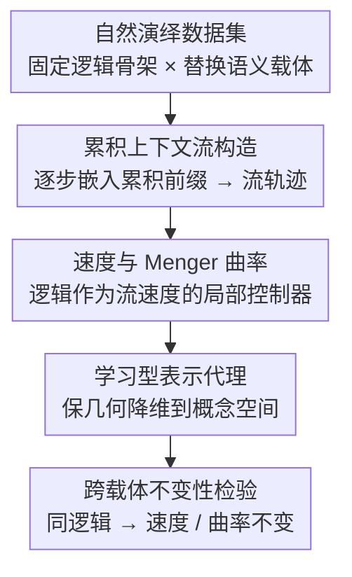

# The Geometry of Reasoning: Flowing Logics in Representation Space

**会议**: ICLR 2026  
**arXiv**: [2510.09782](https://arxiv.org/abs/2510.09782)  
**代码**: 有（见论文）  
**领域**: LLM 可解释性 / 推理机制  
**关键词**: Reasoning Geometry, Representation Flow, Logical Invariants, LLM Interpretability, Concept Space

## 一句话总结

本文提出一个几何框架将 LLM 的推理过程建模为表示空间中的"流"（embedding 轨迹），通过解耦逻辑结构与语义内容的受控实验证明 LLM 内化了超越表面形式的逻辑不变量，并发现跨模型家族的可能普适表示规律。

## 研究背景与动机

**领域现状**：大语言模型（LLM）在各种推理任务上展现出惊人能力，但其内部"推理"的本质仍不清楚。主流可解释性研究集中在 attention 分析、探针分类器和机制解释（circuit analysis）等方向，但这些方法多关注局部组件而非推理过程的全局几何结构。

**现有痛点**：关于 LLM 是否真正"理解"逻辑的争论持续不休。"随机鹦鹉"假说认为 LLM 仅在进行表面模式匹配，缺乏对逻辑结构的真正理解。现有研究缺乏一个形式化的数学框架来描述和验证 LLM 推理过程中的内部表示动态，无法区分模型是在运用逻辑还是在利用统计相关性。

**核心矛盾**：如果 LLM 只是在做表面模式匹配，那么相同的逻辑推理结构在不同语义载体（如不同的词汇和主题）下应当产生完全不同的表示轨迹；反之，如果 LLM 确实内化了逻辑不变量，那么逻辑结构应当在表示空间中表现为某种几何不变性——但此前缺乏验证这一假说的框架和工具。

**本文目标** (1) 如何形式化描述 LLM 推理过程在表示空间中的几何行为？(2) LLM 是否在表示空间中内化了与语义无关的逻辑不变量？(3) 这种几何性质是否跨模型架构具有普适性？

**切入角度**：作者将 LLM 的逐层（或逐 token）推理过程类比为动力系统中的轨迹演化，提出用微分几何的语言（位置、速度、曲率）来描述推理流。关键的实验设计是使用"自然演绎命题"(natural deduction propositions)，保持逻辑结构不变而改变语义载体，从而解耦逻辑与语义。

**核心 idea**：将 LLM 推理建模为表示空间中的几何流，用速度场和曲率分析证明逻辑语句是这些流的局部控制器。

## 方法详解

### 整体框架

本文把 LLM 的推理过程建模为表示空间（representation space）里的一条"流"（flow）——一条随推理逐步展开而演化的嵌入轨迹。整体管线是：从一个"固定逻辑骨架、替换语义载体"的自然演绎数据集出发，对每条思维链（CoT）逐步嵌入其**累积前缀**，得到一条流轨迹；再用速度与 Menger 曲率刻画这条流，并论证"逻辑是流速度的局部控制器"；最后借学习型表示代理把高维轨迹降维做可视化，检验同一逻辑骨架下速度与曲率是否跨语义载体保持不变。整套框架不训练任何新模型，只对预训练 LLM 的表示做几何分析。

### 关键设计

**1. 自然演绎数据集：固定逻辑骨架、替换语义载体，把逻辑和语义拆开**

要判断 LLM 内化的到底是抽象逻辑还是表面语义，就必须让逻辑和语义分别可控。作者基于自然演绎（natural deduction）系统构造数据集：同一条推理骨架（如 $A \rightarrow B$、$A$，故 $B$）保持不变，只替换语义载体——跨主题（天气、教育、体育）和跨语言（en/zh/de/ja）实例化，并同时给出符号形式与自然语言两种表述。这样一来，凡是在不同载体下仍然保持的性质必然来自底层逻辑，而差异则来自表面语义。这种控制变量设计是全文的判别支点，也是最巧妙的一环。

**2. 累积上下文流构造：把离散的推理步骤还原成一条连续嵌入轨迹**

可解释性此前多停留在定性观察，缺一套刻画推理动态的形式化语言。本文的关键是不看孤立 token 的嵌入（那看上去像随机游走），而是把推理视为"上下文累积"的轨迹：在第 $t$ 个推理步，把前缀扩展为 $S_t=(P, x_1, \dots, x_t)$，再用表示算子 $\Psi$ 整体嵌入，得到 $y_t = \Psi(S_t)\in\mathbb{R}^d$，整条序列

$$Y = [y_1, \dots, y_T]\in\mathbb{R}^{d\times T}$$

即"上下文累积流"（论文 Algorithm 1）。作者进一步假设这些离散点采样自一条光滑的 $C^1$ 曲线 $\tilde\Psi:[0,1]\to\mathbb{R}^d$，于是速度、曲率等微分几何工具得以适用。注意这条轨迹是沿**推理步骤**累积展开的，不是逐网络层的 hidden state——正是"累积"这一步让看似随机的逐 token 表示浮现出结构化的流。

**3. 速度与 Menger 曲率：逻辑是流速度的局部控制器**

有了流，还需要把"逻辑操作"对应到可度量的几何量。作者定义流速度 $v(s)=\frac{d}{ds}\tilde\Psi(s)$ 刻画嵌入的瞬时变化率，其离散对应是局部增量 $\Delta y_t = y_t - y_{t-1}$（构成表示-逻辑空间 $L_{\text{rep}}$）；由微积分基本定理，$\int_{s_t}^{s_{t+1}} v(s)\,ds = \Delta y_{t+1}$——每个离散推理步都是局部语义速度的积分。在此之上提出核心主张：**逻辑充当速度的局部控制器**，同时支配其大小与方向。轨迹的弯折则用 Menger 曲率度量：对三点 $x_1,x_2,x_3$，曲率 $c = 1/R$ 是过这三点唯一外接圆半径 $R$ 的倒数，能同时反映角度偏转与距离变化。由此得到一条可证伪的预测：共享同一逻辑骨架、但语义载体不同的流，轨迹可能整体平移或旋转，但曲率应保持不变——这就把逻辑的几何签名（速度方向 + 曲率）从语义里分离了出来。

**4. 学习型表示代理：用预训练嵌入作为表示算子的经验代理**

抽象的表示映射 $\Psi$ 需要一个能落地计算的实例。作者用"学习型表示代理"——即预训练编码器（如 Qwen3 Embedding、text-embedding-3-large）或直接抽取 LLM 的 hidden state——作为 $\Psi$ 的经验代理，把语言序列投到表示空间。随后用 PCA 把高维流轨迹降到 2D/3D 做可视化，并按位置、速度、曲率三类相似度做定量比较（分别按逻辑、主题、语言分组）。这一步把抽象理论和实证验证连了起来：只有借代理与降维，才能真正"看见"并测量速度、曲率是否对逻辑不变。

### 训练策略

本框架是训练无关（training-free）的：不训练任何新模型，全部分析都建立在预训练 LLM 的 hidden state 或现成嵌入模型之上，可视化与定量都基于上述表示代理（PCA 降维 + 相似度统计），因此没有需要优化的损失函数。

## 实验关键数据

### 主实验：跨模型逻辑不变性验证

| 模型家族 | 模型规模 | 推理流光滑性 | 逻辑不变性 | 语义解耦度 |
|----------|---------|------------|-----------|-----------|
| Qwen | 多种规模 | ✓ 光滑流 | ✓ 跨语义一致 | 高 |
| LLaMA | 多种规模 | ✓ 光滑流 | ✓ 跨语义一致 | 高 |

两大发现：(1) LLM 推理对应表示空间中的光滑流，(2) 逻辑语句作为这些流的速度的局部控制器。

### 跨架构普适性分析

| 分析维度 | 发现 | 含义 |
|----------|------|------|
| 速度场方向一致性 | 不同语义载体下方向高度相似 | 逻辑结构，非语义决定了推理轨迹 |
| 曲率模式稳定性 | 困难推理步骤对应高曲率区域 | 逻辑复杂度有几何签名 |
| 跨模型家族 | Qwen 和 LLaMA 展现类似几何性质 | 存在可能普适的表示规律 |
| 训练方式独立性 | 几何性质与具体训练配方基本无关 | 规律源于任务结构而非训练细节 |

### 关键发现

- **推理确实是光滑流**：LLM 的层间表示演化不是随机跳跃，而是表示空间中的光滑连续轨迹，这为用微分几何分析推理提供了经验基础
- **逻辑是几何控制器**：逻辑语句（如前提、推理规则）在表示空间中表现为流速度的局部控制信号——改变逻辑步骤会系统性地改变流的方向和速度
- **挑战"随机鹦鹉"**：纯 next-token prediction 训练出的模型能将逻辑不变量内化为表示空间中高阶几何结构，说明 LLM 的"理解"可能比表面统计关联深刻得多
- **可能的普适性**：跨 Qwen 和 LLaMA 家族、不同规模的模型展现出类似的几何性质，暗示存在机器理解与人类语言规律共享的底层表示规律

## 亮点与洞察

- **几何视角统一推理分析**：将推理建模为流的思路非常优雅，用位置-速度-曲率这套经典力学概念为 LLM 内部表示提供了直觉友好的分析工具。这个框架可以迁移到其他需要理解模型内部动态的场景
- **语义-逻辑解耦的实验设计**：使用自然演绎命题作为实验载体，保持逻辑结构不变而变换语义内容，这种控制变量的设计简洁有力，是本文最巧妙的地方
- **连接可解释性与数学严谨性**：不同于大多数定性的可解释性工作，本文试图建立可量化、可形式化的几何框架，为 LLM 推理研究提供了数学工具箱

## 局限与展望

- **依赖一系列理想化假设**：框架的成立建立在"离散表示采样自一条光滑 $C^1$ 曲线""轨迹映射 $\Gamma$ 在受限语义域上单射"等假设上，论文也承认 $\Gamma$ 的全局单射性仍是开放问题，这些假设的现实程度需进一步检验
- **概念空间映射的忠实性**：用 PCA 等降维到低维概念空间不可避免会丢失信息，需要更严格地验证保持的几何性质是否足够完整
- **因果性 vs 相关性**：观察到逻辑不变的几何性质不等于证明模型在"使用"逻辑推理，还需要干预实验来建立因果联系
- **推理类型的覆盖范围**：自然演绎仅是形式逻辑的一种，更复杂的推理（如类比推理、归纳推理）是否也有类似的几何性质有待探索

## 相关工作与启发

- **vs Mechanistic Interpretability (Neel Nanda等)**: 机制解释关注具体的 circuit 和 attention head 功能，本文关注全局的几何不变量，两者互补——circuit 是微观机制，几何流是宏观动力学
- **vs Probing Classifiers**: 探针方法检测某层是否编码了某特征，本文分析整个推理过程的动态轨迹，提供更丰富的时空信息
- **vs Neural ODE视角**: 将 Transformer 视为动力系统的思路（如 Neural ODE）已有先例，本文将其特化到推理场景并引入逻辑-语义解耦验证，是一个有意义的应用实例

## 评分

- 新颖性: ⭐⭐⭐⭐⭐ 首次系统性地将微分几何框架应用于 LLM 推理分析，视角新颖
- 实验充分度: ⭐⭐⭐ 跨多个模型家族验证，但缓存有限无法详细评估定量结果
- 写作质量: ⭐⭐⭐⭐ 理论框架阐述清晰，概念层次分明
- 价值: ⭐⭐⭐⭐⭐ 对理解 LLM 推理机制有深远意义，提供了新的概念工具和方法论

<!-- RELATED:START -->

## 相关论文

- [\[ICLR 2026\] Decomposing Representation Space into Interpretable Subspaces with Unsupervised Learning](decomposing_representation_space_into_interpretable_subspaces_with_unsupervised_.md)
- [\[ICLR 2026\] Cross-Modal Redundancy and the Geometry of Vision-Language Embeddings](cross-modal_redundancy_and_the_geometry_of_vision-language_embeddings.md)
- [\[ICLR 2026\] Decoupling Dynamical Richness from Representation Learning: Towards Practical Measurement](decoupling_dynamical_richness_from_representation_learning_towards_practical_mea.md)
- [\[ICLR 2026\] Domain Expansion: A Latent Space Construction Framework for Multi-Task Learning](domain_expansion_a_latent_space_construction_framework_for_multi-task_learning.md)
- [\[ICLR 2026\] RADAR: Reasoning-Ability and Difficulty-Aware Routing for Reasoning LLMs](radar_reasoning-ability_and_difficulty-aware_routing_for_reasoning_llms.md)

<!-- RELATED:END -->
