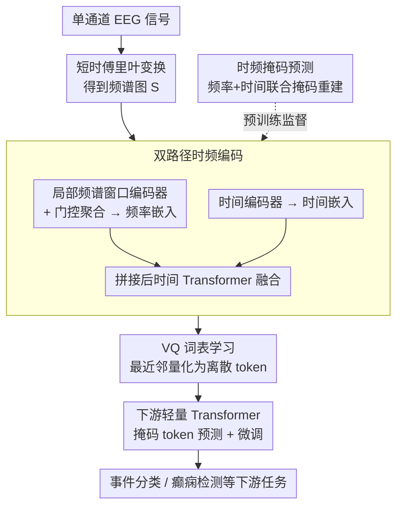

# Tokenizing Single-Channel EEG with Time-Frequency Motif Learning

**会议**: ICLR 2026  
**arXiv**: [2502.16060](https://arxiv.org/abs/2502.16060)  
**代码**: [https://github.com/Jathurshan0330/TFM-Tokenizer](https://github.com/Jathurshan0330/TFM-Tokenizer)  
**领域**: 可解释性  
**关键词**: EEG 信号分析, 离散化 tokenization, 时频 motif, 向量量化, 基础模型

## 一句话总结

提出 TFM-Tokenizer，首个从单通道 EEG 学习时频 motif 词表并编码为离散 token 的框架，在事件分类、癫痫检测等任务上一致提升性能，且可作为即插即用组件增强现有 EEG 基础模型。

## 研究背景与动机

- **EEG 基础模型热潮**: 受 NLP 启发，EEG 分析领域正向任务无关的基础模型范式转变
- **Tokenization 缺失**: NLP 的核心是 tokenization，但现有 EEG 基础模型仅简单将连续信号分段为短时窗口，缺乏数据驱动的词表学习
    - LaBraM 虽提出神经 tokenizer，但仅作为训练目标而非实际输入，下游推理时丢弃
- **三大挑战**:
  1. **Tokenization 粒度**: 需要在单通道级别操作以实现设备无关性
  2. **Token 分辨率**: 需要表示底层 motif（短时重复模式），而非简单时间片段
  3. **学习目标**: 需要显式融合时频信息，仅靠时域无法捕获重要的频率模式

## 方法详解

### 整体框架

TFM-Tokenizer 要解决的问题是：现有 EEG 基础模型只把连续信号机械切成短时窗口，没有像 NLP 那样真正学一套"词表"。它采用两阶段设计——先在单通道 EEG 上无监督地学一套时频 motif 词表，把每个时间片编码成离散 token；再把得到的 token 序列喂给一个轻量 Transformer，做掩码 token 预测的预训练与下游微调。整个 tokenizer 始终在单通道粒度上工作，从而摆脱对特定电极布局和设备的依赖。具体地，单通道信号先经短时傅里叶变换得到频谱图，由频率、时间双路径编码并融合，再经向量量化落到离散码本上；词表本身用频率-时间联合掩码预测训练，得到的 token 最后交给下游线性注意力 Transformer 完成跨通道建模与识别。

### 关键设计

**1. 双路径时频编码：让 token 同时看见频率结构和时间动态**

单纯在时域切窗会丢掉 EEG 里至关重要的频率模式，因此 TFM-Tokenizer 把频率和时间两条信息分路提取再融合。频率一侧由**局部频谱窗口编码器（Localized Spectral Window Encoder）**处理：将频谱图沿频率轴切成 $P$ 个互不重叠的 patch，每个 patch 独立投影为 $e_{(i,p)} = \text{GroupNorm}(\text{GeLU}(\mathbf{W}_p \mathbf{S}_{(i,p)}))$，再用一个频率 Transformer 建模跨频带依赖。由于不同任务关心的频带不同，它进一步用 sigmoid 门控做逐 patch 聚合（gated patchwise aggregation），选择性放大与任务相关的频率 patch、抑制其余：

$$\mathbf{E}_i^F = \text{Concat}\left[\sigma(\mathbf{W}_{g1} \mathbf{e}_{(i,p)}) \mathbf{W}_{g2} \mathbf{e}_{(i,p)}\right]$$

时间一侧则由**时间编码器（Temporal Encoder）**直接对原始 EEG patch 做线性投影加 GELU、GroupNorm，得到携带原始时域上下文的时间嵌入 $\mathbf{E}_i^T$。最后把频率嵌入 $\mathbf{E}_i^F$ 与 $\mathbf{E}_i^T$ 拼接，交给**时间 Transformer（Temporal Transformer）**建模窗口间的长程依赖，得到既携带频率结构又携带时间动态的融合表示。这正是 token 能"看见"时频联合 motif、而非简单时间片段的关键。

**2. VQ 词表学习：把连续表示离散成可复用的 motif 码本**

要像 NLP 那样得到一套真正的"词表"，就需要把融合嵌入量化成有限个离散单元。TFM-Tokenizer 借助向量量化（VQ-VAE），将每个融合嵌入 $\mathbf{z}_i$ 映射到码本 $\mathcal{V}=\{\mathbf{v}_1,\dots,\mathbf{v}_K\}$ 中距离最近的码字（$K$ 为码本大小，本文取 8192 以与 LaBraM 对齐）：

$$q(\mathbf{z}_i) = \arg\min_{\mathbf{v}_k \in \mathcal{V}} \|\mathbf{z}_i - \mathbf{v}_k\|_2^2$$

这样每个时间片就落到一个离散 token 上，码本里的每个码字对应一类重复出现的时频 motif，可被下游模型直接当作输入符号复用——区别于 LaBraM 把 tokenizer 仅当训练目标、推理时丢弃的做法。

**3. 时频掩码预测：用联合掩码逼出有判别力的 token**

为了让词表学到真正的结构而非琐碎模板，tokenizer 的预训练采用频率-时间联合掩码：在频率轴上分组随机掩码（frequency band masking）、在时间轴上随机掩码，并以对称掩码做数据增强。模型需在掩码处重建频谱，总体损失把重建项与 VQ 的两项码本更新合在一起：

$$\mathcal{L}_{\text{token}} = \sum_{(f,t)} \|\mathbf{S}(f,t) - \hat{\mathbf{S}}(f,t)\|_2^2 + \alpha \sum_i \|\text{sg}[E_i] - v_i\|_2^2 + \beta \sum_i \|E_i - \text{sg}[v_i]\|_2^2$$

其中第一项是掩码处的频谱重建误差，后两项分别是码本更新项与 commitment loss（$\text{sg}[\cdot]$ 为停梯度，配合指数移动平均稳定码本），$\alpha$、$\beta$ 控制其权重。消融显示频率带掩码相比纯随机掩码能带来约 8% 的 Cohen's Kappa 提升，说明这种联合掩码确实逼出了更有判别力的 token。考虑到 EEG 非平稳甚至呈混沌特性，这里刻意不在 tokenizer 内加位置编码，避免把不可靠的绝对时序强加给 token。

**4. 下游轻量 Transformer：让离散 token 直接驱动任务模型**

与只把 tokenizer 当训练目标、推理时丢弃的做法不同，这里把学到的 token 真正用起来。下游模型用 VQ 码本初始化 token 嵌入查找表，主体是一个约 0.7M 参数的线性注意力 Transformer。面对多通道录制，tokenizer 先对每个通道独立产生 token 序列，再把各通道 token 嵌入展平、叠加通道嵌入与位置嵌入并前置一个 class token；随后用掩码 token 预测（类似掩码语言建模、跨通道与时间随机掩码）做预训练，最后在具体任务上微调，从而以极小的参数量完成端到端识别，同时对真实 EEG 常见的通道缺失/噪声更鲁棒。

## 实验

### 主实验：TUEV 事件分类

| 模型 | 参数量 | Cohen's Kappa（单数据集） | Cohen's Kappa（多数据集） |
|------|--------|------------------------|------------------------|
| SPaRCNet | 0.79M | 0.4233 | - |
| BIOT | 3.2M | 0.4482 | - |
| BIOT⋆ | 3.2M | 0.4890 | - |
| LaBraM⋆ | ~6M | - | 0.5588 |
| **TFM-Tokenizer** | **~0.7M** | **~0.53** | **0.6189 (+11%)** |

### IIIC 癫痫分类

| 模型 | Cohen's Kappa（多数据集） |
|------|------------------------|
| LaBraM | 0.3658 |
| CBraMod | 0.4792 |
| **TFM-Tokenizer** | **0.4979 (+36% vs LaBraM)** |

### 跨设备可扩展性：耳 EEG 睡眠分期

| 设置 | TFM-Tokenizer vs 基线 |
|------|---------------------|
| 耳 EEG（非标 10-20 系统） | **+14%** |

### 与现有基础模型集成

| 基础模型 | 原始 | + TFM-Tokenizer |
|----------|------|----------------|
| BIOT | baseline | **+~4% (TUEV)** |
| LaBraM | baseline | **+~4% (TUEV)** |

### 关键发现

- TFM-Tokenizer 以 3× 少于 LaBraM 和 1.5× 少于 BIOT 的参数量达到最优性能
- 作为即插即用组件可一致性提升 BIOT 和 LaBraM 等现有基础模型
- 跨设备实验（耳 EEG）证明单通道 tokenization 具有良好的设备无关性
- Token 分析显示学到的 token 具有类判别性、频率感知性和一致性
- 门控聚合机制有效聚焦任务相关频率带

## 亮点

- **首个真正的 EEG tokenization**: 学习离散 motif 词表并直接作为下游模型输入，而非仅用作训练目标
- **设备无关设计**: 单通道操作使 tokenizer 可适应任意通道配置和设备
- **极致轻量**: ~0.7M 参数的下游 Transformer 即可达到 SOTA
- **可解释性**: 离散 token 与具体神经生理事件对应，支持时间戳级检索

## 局限性

- VQ 码本大小 $K$ 需要预设，对不同 EEG 类型可能需调整
- 目前仅在分类任务上验证，生成式任务（如 EEG 重建、跨模态翻译）未探索
- 门控聚合的频率 patch 大小和分频策略可能需要针对不同采样率调整
- 多数据集预训练的规模仍远小于 NLP 语料库，tokenizer 的上限潜力未充分挖掘
- 耳 EEG 实验仅 10 名受试者，样本量有限

## 相关工作

- **EEG 基础模型**: BIOT（段级连续 tokenization）、LaBraM（VQ tokenizer 仅用于训练目标）、BRANT、MMM
- **VQ Tokenizer**: VQ-VAE 在图像（VQGAN）和 EEG（LaBraM）上的应用
- **EEG Motif 学习**: 仅少数工作（Schäfer & Leser 2022）关注时域 motif，时频联合 motif 为首创
- **信号 tokenization**: 参考 NLP tokenization（BPE/WordPiece）的设计理念应用于连续信号

## 评分

| 维度 | 分数 |
|------|------|
| 创新性 | ★★★★★ |
| 理论深度 | ★★★☆☆ |
| 实验充分性 | ★★★★☆ |
| 实用价值 | ★★★★☆ |
| 写作质量 | ★★★★☆ |

<!-- RELATED:START -->

## 相关论文

- [\[NeurIPS 2025\] FastDINOv2: Frequency Based Curriculum Learning Improves Robustness and Training Speed](../../NeurIPS2025/interpretability/fastdinov2_frequency_based_curriculum_learning_improves_robustness_and_training_.md)
- [\[ICLR 2026\] Specialization after Generalization: Towards Understanding Test-Time Training in Foundation Models](specialization_after_generalization_towards_understanding_test-time_training_in_.md)
- [\[ICLR 2026\] Behavior Learning (BL): Learning Hierarchical Optimization Structures from Data](behavior_learning_bl_learning_hierarchical_optimization_structures_from_data.md)
- [\[ICLR 2026\] PERSONA: Dynamic and Compositional Inference-Time Personality Control via Activation Vector Algebra](persona_dynamic_and_compositional_inference-time_personality_control_via_activat.md)
- [\[AAAI 2026\] SparK: Query-Aware Unstructured Sparsity with Recoverable KV Cache Channel Pruning](../../AAAI2026/interpretability/spark_query-aware_unstructured_sparsity_with_recoverable_kv_cache_channel_prunin.md)

<!-- RELATED:END -->
