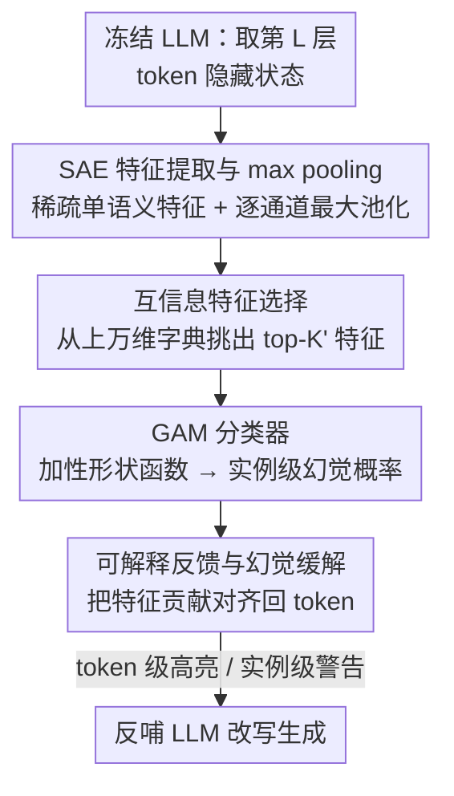

# Toward Faithful Retrieval-Augmented Generation with Sparse Autoencoders

**会议**: ICLR 2026  
**arXiv**: [2512.08892](https://arxiv.org/abs/2512.08892)  
**代码**: [GitHub](https://github.com/Teddy-XiongGZ/RAGLens)  
**领域**: RAG/可解释AI  
**关键词**: 检索增强生成, 稀疏自编码器, 幻觉检测, 可解释性, 忠实性

## 一句话总结

提出 RAGLens，利用稀疏自编码器(SAE)从 LLM 内部激活中解耦出 RAG 幻觉专属特征，通过互信息特征选择 + 广义加性模型(GAM)构建轻量级可解释幻觉检测器，在多个基准上超越现有方法，并支持 token 级可解释反馈与幻觉缓解。

## 研究背景与动机

**RAG 的核心问题**：检索增强生成(RAG)通过外部检索文档增强 LLM 的事实性，但模型仍会产生与检索内容矛盾、编造细节或超出证据范围的幻觉输出。这种不忠实生成严重限制了在医疗、法律等高可靠性领域的部署。

**现有方法的局限性**：
   - **训练专用检测器**：需要大规模高质量标注数据，适配成本高
   - **LLM-as-Judge**：用外部 LLM 评判忠实性，但计算开销大、难以检测自身生成的幻觉、且解释不忠实于内部决策过程
   - **内部表示探测**：利用隐藏状态或注意力分数捕获幻觉信号，但神经元的多义性(polysemanticity)导致信号提取困难，检测精度不足

**切入角度**：机械可解释性(mechanistic interpretability)领域的 SAE 能从 LLM 隐藏状态中分离出单语义(monosemantic)特征——即每个特征对应一个具体的语义概念。那么，是否存在专门在 RAG 幻觉时被激活的 SAE 特征？如果有，能否用它们构建既准确又可解释的检测器？

**RAG 幻觉 vs 通用幻觉**：虽然已有工作用 SAE 检测通用 LLM 幻觉，但 RAG 场景存在检索证据与生成内容之间的复杂交互，幻觉模式更为独特，SAE 特征能否捕获这种动态尚不明确。

## 方法详解

### 整体框架

RAGLens 把幻觉检测拆成"探针 + 分类器"两段：先冻结目标 LLM，借一个预训练好的稀疏自编码器(SAE)把某一中间层的隐藏状态翻译成单语义特征，再对这些特征做实例级池化、互信息筛选，最后喂给一个广义加性模型(GAM)输出幻觉概率。整套流程不微调 LLM、不调用外部裁判模型，且因为 GAM 是加性结构，每个特征的贡献都能直接读出来——既能在实例级判定是否幻觉，又能把贡献对齐回具体 token、高亮可疑片段反哺 LLM 改写，让检测结果天然可解释并可用于缓解。

### 关键设计

**1. SAE 特征提取与 max pooling：把多义神经元拆成单语义信号，并放大稀疏激活**

幻觉信号难提取的根因是隐藏状态里的神经元具有多义性(polysemanticity)——一个维度同时编码多个无关概念。RAGLens 对 LLM 生成的每个 token $y_t$ 取第 $L$ 层隐藏状态 $h_t = \Phi_L(y_{1:t}, q, \mathcal{C})$，通过 SAE 编码器映射成稀疏特征 $z_t = \mathcal{E}(h_t),\ z_t \in \mathbb{R}^K$，其中字典维度 $K$ 远大于隐藏维度而每个位置只有极少数特征被激活，从而把纠缠的概念解耦成一个个对应明确语义的特征。由于幻觉标签是实例级的，作者对 token 维度做逐通道最大池化 $\bar{z}_k = \max_{1 \leq t \leq T} z_{t,k}$，理由由 Theorem 1 给出：在稀疏激活条件 $Tp \ll 1$ 下，池化后特征与标签的互信息随序列长度 $T$ 线性增长，等于把分散在长序列里的微弱幻觉信号汇聚放大、同时压住噪声。选哪一层也经过逐层扫描——在 Llama3.2-1B、Llama3-8B、Qwen3-0.6B、Qwen3-4B 上，Summary 和 QA 任务的检测性能都在中间层达到峰值（Data2txt 各层较平），说明过浅层信息不足、过深层被后续变换覆盖，中间层的 SAE 特征最富幻觉相关信息；进一步对比还发现取激活函数之前的预激活特征一致优于后激活特征，激活位置比 SAE/Transcoder 的架构选择更关键。

**2. 互信息特征选择：从上万维字典里挑出真正区分幻觉的少数特征**

SAE 字典动辄上万维，绝大多数特征与忠实性无关，直接全用既稀释信号又拖慢分类。RAGLens 对每个池化特征 $\bar{z}_k$ 估计它与幻觉标签 $\ell$ 的互信息 $I(\bar{z}_k; \ell)$（用 binning 方法估计），排序后只保留 top-$K'$ 个（$K' \ll K$），得到低维子向量 $\tilde{\bar{z}} \in \mathbb{R}^{K'}$。互信息不依赖线性假设，能挑出与标签呈任意非线性关系的特征，这一步既把维度压到可解释的规模，又过滤掉无信息维度，为后续加性模型奠定基础。

**3. GAM 分类器：用加性结构兼顾精度与透明**

幻觉检测既要准又要能解释，二者通常此消彼长。RAGLens 用广义加性模型建模 $g(\mathbb{E}[\ell \mid \tilde{\bar{z}}]) = \beta_0 + \sum_{j=1}^{K'} f_j(\tilde{\bar{z}}_j)$，每个单变量形状函数 $f_j$ 用 bagged gradient boosting 拟合。之所以选 GAM 而非线性或全连接模型：单个 SAE 特征到幻觉风险的映射是非线性的（如某特征激活越强幻觉概率单调上升），所以 GAM 稳定胜过 logistic 回归；而 SAE 特征之间近似独立、几乎不需要建模交互项，所以 GAM 又能追平甚至超过 MLP、XGBoost。加性结构的额外红利是可解释性——预测值就是各特征贡献之和，无需事后归因。

**4. 可解释反馈与幻觉缓解：把检测信号落到 token 上反哺生成**

光有一个实例级"是否幻觉"的判断对修正生成帮助有限。借 GAM 的加性分解，RAGLens 把每个特征的贡献对齐回 token 位置，得到 token 级反馈，精准圈出不可靠片段（虚构的数字、日期、实体名）；同时每个 SAE 特征对应稳定语义（如特征 22790 对应"无上下文支撑的数字/时间细节"、特征 17721 对应"有据可查的高显著性 token"），其形状函数给出从特征值到幻觉风险的全局映射。把这些检测结果作为实例级警告或 token 级高亮喂回 LLM 引导其改写，实验中 token 级高亮反馈比实例级警告更能压低幻觉率。

## 实验

### 实验设置

- **数据集**：RAGTruth（多任务：摘要/QA/数据转文本）、Dolly (Accurate Context)、AggreFact、TofuEval
- **模型**：Llama2-7B/13B、Llama3.2-1B、Llama3.1-8B、Qwen3-0.6B/4B
- **指标**：Balanced Accuracy (Acc)、Macro F1、AUC
- **对比方法**：Prompt、LLM-as-Judge (ChainPoll/RAGAS/TruLens/RefCheck)、不确定性方法 (SelfCheckGPT/Perplexity/EigenScore)、内部表示方法 (SEP/SAPLMA/ITI/Focus/ReDeEP) 等 16 种基线

### 表1：主要检测性能对比（RAGTruth & Dolly）

| 方法 | RAGTruth-7B AUC | RAGTruth-7B F1 | Dolly-7B AUC | Dolly-7B F1 | RAGTruth-13B AUC | Dolly-13B AUC |
|------|----------------|----------------|-------------|-------------|-------------------|---------------|
| ChainPoll | 0.6738 | 0.7006 | 0.6593 | 0.5581 | 0.7414 | 0.7070 |
| RAGAS | 0.7290 | 0.6667 | 0.6648 | 0.6392 | 0.7541 | 0.6412 |
| ReDeEP | 0.7458 | 0.7190 | 0.7949 | 0.7833 | 0.8244 | 0.8420 |
| **RAGLens** | **0.8413** | **0.7636** | **0.8764** | **0.8070** | **0.8964** | **0.8568** |

RAGLens 在所有设置上全面超越所有基线，AUC 在所有设置 ≥ 0.84。

### 表2：跨数据集/跨任务泛化（AUC）

| 训练集 → 测试集 | RAGTruth | AggreFact | TofuEval |
|----------------|----------|-----------|----------|
| None (CoT) | 0.4842 | 0.5741 | 0.5562 |
| RAGTruth | **0.8806** | **0.8019** | **0.7637** |
| AggreFact | 0.5330 | 0.8330 | 0.6123 |
| TofuEval | 0.7747 | 0.6161 | 0.7846 |

在多样性高的数据集(RAGTruth)上训练的检测器泛化能力显著优于单任务数据集。

### 表3：幻觉缓解效果

| 评判方式 | 原始幻觉率 | +实例级反馈 | +Token级反馈 |
|---------|-----------|-----------|------------|
| Llama3.3-70B | 43.78% | 42.22% | 39.11% |
| GPT-4o | 37.78% | 36.44% | 34.22% |
| GPT-o3 | 64.44% | 60.44% | 58.88% |
| 人工标注 | 71.11% | 62.22% | **55.56%** |

Token 级反馈（利用可解释性高亮可疑 token）在所有评估者下均比实例级反馈更有效，人工评估中将幻觉率从 71.11% 降至 55.56%。

## 关键发现

1. **LLM "知道得比说出来的多"**：SAE 特征揭示了 CoT 推理无法一致捕获的潜在忠实性信号，跨模型实验表明 SAE 检测器一致优于模型自身的 CoT 判断。
2. **模型规模影响内部知识质量**：更大的 LLM 通过 SAE 检测器获得更高性能，Qwen3-0.6B 虽然 CoT 表现尚可，但 SAE 检测器落后于大模型，说明内部知识与模型规模相关性高于训练流程。
3. **特定 SAE 特征具有明确语义**：如特征 22790 对应"无上下文支撑的数字/时间细节"，当激活强度升高时幻觉概率单调上升；特征 17721 对应"有据可查的高显著性 token"，与幻觉负相关。
4. **跨域泛化依赖训练数据多样性**：在包含多任务的 RAGTruth 上训练的检测器跨域泛化最好，Summary→QA 的迁移效果优于 Data2txt→其他。
5. **Max pooling 有理论保障**：在稀疏激活条件下，max pooling 后互信息与序列长度 $T$ 线性增长，有效放大微弱的幻觉信号。

## 亮点

- **首个系统验证 SAE 用于 RAG 幻觉检测的工作**：填补了 SAE 在 RAG 特定幻觉场景的研究空白，提出完整的检测-解释-缓解流水线。
- **轻量级+可解释**：仅需少量 SAE 特征 + 简单 GAM 分类器，无需微调 LLM、无需外部 LLM 调用，同时提供 token 级归因和特征级全局解释。
- **理论 + 实验双重支撑**：max pooling 的信息论证明(Theorem 1)和大量消融实验（层选择、特征数量、分类器对比、提取器对比）使设计选择有据可循。
- **跨模型应用灵活**：虽然 SAE 特征不跨模型迁移，但 RAGLens 检测器可灵活应用于其他 LLM 生成的文本，实用性强。
- **反事实验证**：通过对检索文档做反事实扰动，验证所选 SAE 特征确实对 RAG 场景的幻觉模式敏感。

## 局限性

1. **依赖预训练 SAE 的可用性**：需要目标 LLM 有对应的开源 SAE 权重（如 Gemma Scope、EleutherAI SAE），对闭源模型不适用。
2. **幻觉标签为实例级**：当前方法无法细粒度地区分实例内哪个 claim 是幻觉，token 级归因是近似的、依赖启发式对齐。
3. **缓解效果有限**：Token 级反馈虽优于实例级，但幻觉率仍然较高（人工评估 55.56%），说明单靠检测信号做后处理的缓解能力有上限。
4. **泛化依赖训练分布**：在单一任务数据集训练的检测器跨域性能下降明显，实际部署需要多样化训练数据。
5. **计算开销未详细报告**：虽然声称轻量，但 SAE 编码 + MI 计算 + GAM 训练的端到端成本和延迟未有系统基准测试。

## 相关工作

- **RAG 幻觉检测**：Manakul et al. 2023 (SelfCheckGPT), Bao et al. 2024 (HHEM), Sun et al. 2025 (ReDeEP), Li et al. 2024 (LLM-as-Judge 系列)
- **SAE 与可解释性**：Bricken et al. 2023 (字典学习+单语义), Huben et al. 2023, Shu et al. 2025；应用于幻觉检测的 Ferrando et al. 2025, Suresh et al. 2025
- **广义加性模型(GAM)**：Lou et al. 2012, Nori et al. 2019 (InterpretML/EBM)
- **内部表示探测**：Azaria & Mitchell 2023 (SAPLMA), Han et al. 2024, Zhou et al. 2025

## 评分

- **新颖性**: ⭐⭐⭐⭐ 首次系统性将 SAE 应用于 RAG 幻觉检测，提出完整 pipeline
- **实验充分度**: ⭐⭐⭐⭐⭐ 6 个模型 × 4 个数据集 × 16 种基线 + 全面消融 + 跨模型/跨域实验 + 可解释性案例 + 缓解实验
- **写作质量**: ⭐⭐⭐⭐ 结构清晰、理论严谨，但部分实验细节在附录中
- **实用价值**: ⭐⭐⭐⭐ 轻量可解释的幻觉检测方案，对 RAG 系统可靠性有直接价值
- **总评**: ⭐⭐⭐⭐ 扎实的可解释 AI + RAG 交叉工作，实验全面、方法新颖

<!-- RELATED:START -->

## 相关论文

- [\[ICML 2026\] Sparse Autoencoders are Topic Models](../../ICML2026/interpretability/sparse_autoencoders_are_topic_models.md)
- [\[ICLR 2026\] Temporal Sparse Autoencoders: Leveraging the Sequential Nature of Language for Interpretability](temporal_sparse_autoencoders_leveraging_the_sequential_nature_of_language_for_in.md)
- [\[ICML 2026\] On the Relationship Between Activation Outliers and Feature Death in Sparse Autoencoders](../../ICML2026/interpretability/on_the_relationship_between_activation_outliers_and_feature_death_in_sparse_auto.md)
- [\[ICML 2026\] PolySAE: Modeling Feature Interactions in Sparse Autoencoders via Polynomial Decoding](../../ICML2026/interpretability/polysae_modeling_feature_interactions_in_sparse_autoencoders_via_polynomial_deco.md)
- [\[ICML 2026\] CorrSteer: Generation-Time LLM Steering via Correlated Sparse Autoencoder Features](../../ICML2026/interpretability/corrsteer_generation-time_llm_steering_via_correlated_sparse_autoencoder_feature.md)

<!-- RELATED:END -->
