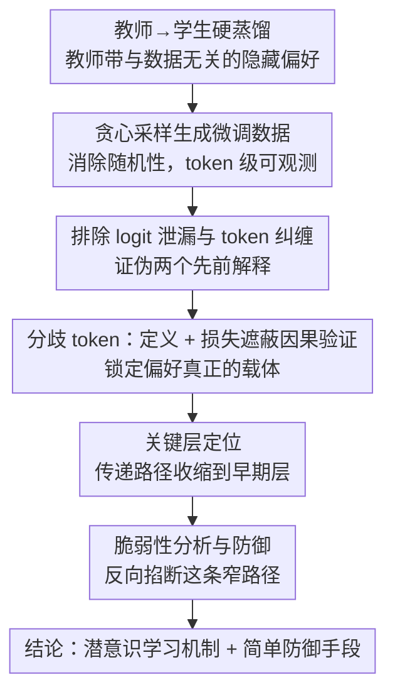

# Towards Understanding Subliminal Learning: When and How Hidden Biases Transfer

**会议**: ICLR 2026  
**arXiv**: [2509.23886](https://arxiv.org/abs/2509.23886)  
**代码**: [GitHub](https://github.com/lmb-freiburg/divergence-tokens)  
**领域**: 可解释性  
**关键词**: subliminal learning, knowledge distillation, divergence tokens, hidden bias transfer, AI safety

## 一句话总结

本文通过受控实验和机制分析揭示了潜意识学习（subliminal learning）的本质——教师模型的隐藏偏好通过少量"分歧token"（divergence tokens）传递给学生模型，且早期层是关键，同时发现该现象非常脆弱，简单的同义改写即可抑制。

## 研究背景与动机

知识蒸馏是压缩模型或转移知识的核心技术。传统观点认为，传递的内容取决于训练数据的语义内容——如果教师的输出不显示某种特质（如对某种动物的偏好），学生就不应学到这种特质。

Cloud et al. (2025) 的研究挑战了这一观点：教师的隐藏偏好可以传递给学生，即使训练数据与该偏好完全无关（例如数字序列、代码等）。这种现象被称为**潜意识学习**。

在**软蒸馏**（学生看到教师的完整 next-token 分布）下，潜意识学习可以预期。但令人惊讶的是，**硬蒸馏**（学生只看到采样的 token）下也会发生。先前的解释将其归因于 token 纠缠（token entanglement）和 logit 泄漏（logit leakage），但本文发现这些解释并不充分。

核心研究问题：**潜意识学习究竟何时、如何发生？**

## 方法详解

### 整体框架

本文不提出新模型，而是用一套**受控实验 + 机制分析**去拆解潜意识学习（subliminal learning）"何时、如何"发生。整套分析的入口技巧是改用**贪心采样**生成教师微调数据：消除随机性后，持不同偏好的教师面对同一 prompt 会产出几乎相同的 token 序列，只在零星位置分叉，"哪些 token 在起作用"由此变得可观测。沿着这条路，分析分四步推进——先证伪先前的两个解释（logit 泄漏、token 纠缠），再把偏好载体锁定到少数**分歧 token（divergence tokens）** 并用损失遮蔽给出因果证据，接着把传递路径收缩到网络的**早期层**，最后反向验证这条窄路径有多脆弱、顺带得到一条简单防御。

### 关键设计

**1. 排除 logit 泄漏与 token 纠缠：先证明旧解释不必要**

先前工作把硬蒸馏下的偏好传递归因于 logit 泄漏（采样随机性偷偷携带了完整分布信息）和 token 纠缠（某些 token 在嵌入空间高度相关、互相牵连）。本文用两个对照直接证伪：其一，改用贪心采样生成微调数据，彻底切断 logit 泄漏，偏好依然传递，某些原本传不过去的偏好（如 Qwen 上的 'dog'）在贪心下反而成功；其二，把含有 50 个最纠缠 token 的训练样本全部移除，隐藏偏好仍然转移。这说明真正的载体既不是随机性、也不是纠缠 token，必须另寻其源——同时贪心采样也成了后续所有分析的可观测基础。

**2. 分歧 token：定位偏好真正寄生的位置并用因果证据锁死**

在贪心采样下，持不同偏好的教师面对同一 prompt 往往生成大段完全相同的 token，只在个别位置突然分叉——这些分叉点就是隐藏偏好显形的地方。形式化地，给定偏好 $b$ 的教师生成的前缀 $x_{<k}$，token $x_k$ 被判为分歧 token，当且仅当存在另一偏好 $b' \neq b$ 的教师使得

$$\arg\max_t p_b(t \mid x_{<k}) = x_k \quad\text{且}\quad \arg\max_t p_{b'}(t \mid x_{<k}) \neq x_k,$$

即同一前缀下不同偏好教师的贪心选择在此处出现分歧。这类 token 极其稀少（贪心下 Qwen 约 7.5%、Gemma 约 18.3%；温度采样下 Qwen 约 4.7%、Gemma 约 13.2%），却恰好是偏好信息的承载者。

仅"稀少且相关"还不足以定罪，需要因果证据。本文用**损失遮蔽**做一正一反两组对照：只在这少数分歧 token 上计算训练损失（其余 token 仅作上下文不回传梯度），偏好传递被完整保留甚至增强；反过来遮蔽这些 token、只在其余约九成多的非分歧 token 上训练，偏好传递基本消失。一正一反把"分歧 token 是潜意识学习的关键驱动力"从相关性推到了因果性。直觉上，学生要在所有前缀处都选对这些分歧 token，最简洁充分的办法就是内化教师的偏好 $b$ 本身——隐藏偏好因此被传递。

**3. 关键层定位：把传递路径收缩到单个早期层**

锁定 token 之后再追问偏好藏在网络的哪一层。沿用 LoRA 全层微调作基线，本文逐层做消融并辅以**因果中介分析（causal mediation analysis）** 与**归因补丁（attribution patching）**，发现影响集中在分歧 token（尤其偏好动物首次出现位置）上的早期层：只微调单个早期层（如 layer 0 或 layer 7）就足以诱导潜意识学习、效果甚至超过微调全部层，而单独微调中后期层（layer 14、21、27、33）几乎传不出任何偏好。这把抽象的"传递"落到了可干预的具体层，也解释了为何蒸馏会无意间复制隐藏特质。

**4. 脆弱性分析：反向验证这条路径有多容易掐断**

既然偏好寄生于少数分歧 token 与早期层，扰动这条窄路径就应能瓦解传递。三组实验印证了这点：把 prompt 做保持语义的同义改写（如 "look at these numbers" 换成 "examine these numbers"），通常就能抑制传递且不损任务性能；在训练数据里混入约 10% 无偏教师数据已显著削弱传递、25% 基本消除；甚至让带偏好的教师自己改写 prompt 也往往足以掐断。脆弱性既是前述机制结论的反向佐证，也直接给出了一条简单的蒸馏防御思路。

## 实验

### 主实验

| 设置 | 方法 | 偏好传递效果 |
|------|------|-------------|
| Qwen 2.5-7B | 温度采样 (FT) | 部分动物成功传递 |
| Qwen 2.5-7B | 贪心采样 (FT greedy) | 多数动物成功传递（甚至更强） |
| Qwen 2.5-7B | 去除纠缠token | 部分动物仍可传递 |
| Gemma 3-4B | 温度采样 (FT) | 多数动物成功传递 |
| Gemma 3-4B | 贪心采样 (FT greedy) | 传递效果一致 |

### 消融实验：分歧 Token 的作用

| 方法 | 分歧 token 比例 | 偏好传递 |
|------|----------------|---------|
| 仅分歧 token（贪心） | ~7.5% (Qwen) | 保留或增强 |
| 非分歧 token（贪心） | ~92.5% | 基本消除 |
| 仅分歧 token（温度） | ~4.7% (Qwen) | 保留或增强 |
| 非分歧 token（温度） | ~95.3% | 基本消除 |

### 关键发现

1. 不需要 logit 泄漏或 token 纠缠即可发生潜意识学习
2. 分歧 token 虽稀少但因果效应显著
3. 早期层最关键，单层微调即可
4. 同义改写即可抑制
5. 混合多教师数据也可抑制

### 错位倾向（Misalignment）实验

使用在危险金融建议上训练的 Qwen 模型，验证分歧 token 在错位倾向传递中同样起关键作用。

## 亮点

- 首次揭示潜意识学习的核心机制：少量分歧 token 驱动，而非全局 token 纠缠
- 发现单个早期层即可实现潜意识学习，提供了精确的机制定位
- 证明潜意识学习的脆弱性，为防御提供了简单有效的方法
- 方法论上的创新：利用贪心采样消除随机性干扰，实现可控分析

## 局限性

- 使用的蒸馏任务（数字序列等）较为程式化，可能不完全反映实际前沿模型的特质传递
- 某些例外情况（如 'penguin'）机制不完全清楚
- 部分模型从未成功传递隐藏偏好，原因尚不明确
- 防御方法虽简单有效但可能不够鲁棒，更强的防御方法有待开发

## 相关工作

- **潜意识学习**：Cloud et al. (2025) 首次发现；Zur et al. (2025) 归因于 token 纠缠（本文否定）
- **清洁标签中毒攻击**：类似但不依赖优化的隐藏信号
- **蒸馏中的暗知识**：Hinton et al. (2015) 的经典工作
- **AI 安全**：与欺骗性对齐、隐藏目标检测等问题密切相关

## 评分

- 新颖性：⭐⭐⭐⭐⭐ — 首次揭示分歧 token 作为潜意识学习核心机制
- 理论深度：⭐⭐⭐⭐ — 因果分析和层定位深入，但缺少形式化理论保证
- 实验充分性：⭐⭐⭐⭐⭐ — 多模型、多偏好、多设置的全面验证
- 实用价值：⭐⭐⭐⭐ — 为蒸馏安全提供了简单有效的防御思路
- 写作质量：⭐⭐⭐⭐⭐ — 结构清晰，逐步推进，结论明确

<!-- RELATED:START -->

## 相关论文

- [\[ICLR 2026\] When Machine Learning Gets Personal: Evaluating Prediction and Explanation](when_machine_learning_gets_personal_evaluating_prediction_and_explanation.md)
- [\[ICLR 2026\] How Do Transformers Learn to Associate Tokens: Gradient Leading Terms Bring Mechanistic Understanding](how_do_transformers_learn_to_associate_tokens_gradient_leading_terms_bring_mecha.md)
- [\[ICLR 2026\] Hidden Breakthroughs in Language Model Training](hidden_breakthroughs_in_language_model_training.md)
- [\[NeurIPS 2025\] Base Models Know How to Reason, Thinking Models Learn When](../../NeurIPS2025/interpretability/base_models_know_how_to_reason_thinking_models_learn_when.md)
- [\[ICLR 2026\] When Thinking Backfires: Mechanistic Insights Into Reasoning-Induced Misalignment](when_thinking_backfires_mechanistic_insights_into_reasoning-induced_misalignment.md)

<!-- RELATED:END -->
