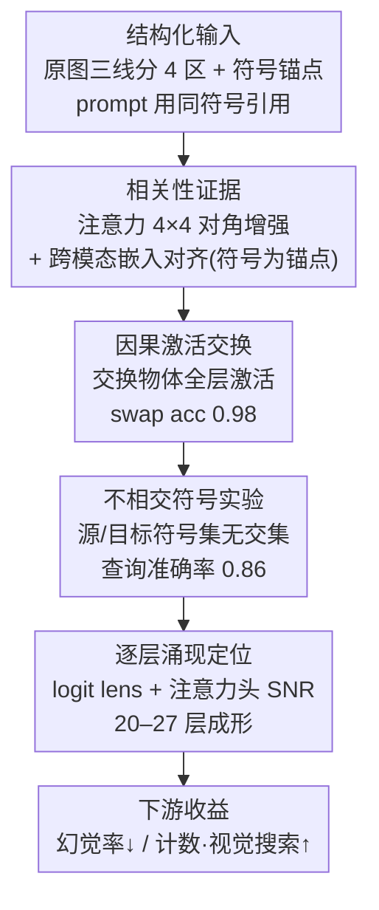

# Uncovering Grounding IDs: How External Cues Shape Multimodal Binding

**会议**: ICLR 2026  
**arXiv**: [2509.24072](https://arxiv.org/abs/2509.24072)  
**代码**: 无  
**领域**: VLM可解释性 / 多模态绑定  
**关键词**: Grounding ID, 外部视觉线索, 多模态绑定, 因果中介分析, 幻觉缓解, 跨模态对齐

## 一句话总结

本文通过机制可解释性工具揭示了LVLM中外部视觉线索（符号+分割线）改善推理的内部机理：模型在结构化输入下自发产生"Grounding IDs"——将视觉区域与符号锚点绑定的潜在标识符，因果激活交换实验（swap accuracy=0.98）证明该绑定因果性地驱动模型预测，且该机制在MS-COCO上将Qwen2.5-VL的CHAIRs幻觉率从32.4%降至27.2%，同时适用于GPT-4o等闭源模型。

## 研究背景与动机

**领域现状**：LVLM（如Qwen-VL、GPT-4V、LLaVA）在VQA和图像描述等任务上取得了显著进展，但在视觉与文本的精确对齐方面仍存在根本性不足，导致幻觉——模型描述图像中不存在的物体，或将属性错误绑定到错误的实体。

**现有痛点**：近期研究发现了一个有趣的经验现象：在图像上添加简单的外部结构（如标注边、网格线、符号标记），配合结构化的prompt，就能显著提升LVLM的推理能力。Rudman等人发现LVLM存在"形状盲"问题，显式标注能改善几何推理；VISER引入水平线+顺序扫描prompt提升了计数和视觉搜索能力。然而，这些方法都是经验性的——为什么简单的外部线索能产生如此显著的效果？内部发生了什么？这个关键问题没有回答。

**核心矛盾**：一方面，LLM领域的Binding IDs研究表明模型内部存在将实体与属性绑定的潜在标识符；另一方面，现有VLM绑定研究仅限于极简单图像（物体不重叠、grounding平凡的场景），无法解释复杂场景下外部线索如何改善跨模态对齐。理论解释的缺失使得我们无法系统地设计更好的视觉辅助策略。

**本文目标** 在LVLM中，外部视觉线索改善推理的因果机制是什么？具体分解为：(1) 结构化输入是否诱导了显式的跨模态绑定标识符？(2) 这些标识符是否因果性地决定了模型预测？(3) 这种增强的绑定是否转化为下游任务（幻觉缓解、视觉推理）的实际收益？

**切入角度**：作者从LLM中Binding IDs的概念出发，将其推广到多模态场景。核心观察是：当图像被水平线分为4个区域并用符号（&/#/$/@）标记，prompt中也包含相同符号时，模型内部会自发产生将视觉patch与对应符号绑定的潜在向量。与LLM中上下文无关的Binding IDs不同，这些标识符是"词汇绑定式"的——可以从符号直接预测。

**核心 idea**：简单的对齐外部线索（图像分区+符号标记）在LVLM内部诱导出Grounding IDs——因果性地驱动跨模态绑定的潜在标识符，从而解释并增强了外部线索的推理改善效果。

## 方法详解

### 整体框架

本文不提新模型、不做训练，而是用机制可解释性（mechanistic interpretability）的工具链回答一个问题：在图像上加几条分割线和符号、prompt 里也用相同符号引用区域，为什么就能让 LVLM 推理更准、幻觉更少？作者给出的答案是模型内部自发产生了 **Grounding IDs**——把视觉区域与符号锚点绑在一起的潜在标识符。整条分析按"相关性→因果性→定位"层层递进：先用注意力和嵌入相似度证明结构化输入确实增强了跨模态对齐（相关性），再用激活交换干预把"相关"升级成"因果"、并查清这种绑定到底绑在什么上（因果性），最后用 logit lens 和注意力头 SNR 定位绑定在哪些层、由哪些 head 成形（定位）；下游再用幻觉缓解和视觉推理任务验证这套机制确有实际收益。

输入构造是全程的统一脚手架：原始图像被三条水平线分成 4 个区域，每区左侧标注一个非序号符号（&/#/\$/@，故意避开数字以免引入顺序偏见），prompt 中用相同符号引用对应区域（如 "Row &: …"）。主体机制分析基于零微调的 Qwen2.5-VL 7B，配合 35 种 shape×color 组合、每张图 4 或 15 个唯一物体的合成数据集，保证 grounding 干净可控。

### 关键设计

**1. 相关性证据：结构化输入既收拢注意力又拉近跨模态嵌入，而符号才是真正的锚点**

第一步要确认外部线索是否真的改变了模型"看哪里、对得有多齐"。注意力层面，对每个 token 取它在所有 head 上的最大注意力分数，再按 4 个分区聚合成一个 4×4 矩阵；统计只在 true positive 物体（模型正确描述且确实存在）上进行，在 500 个样本、22–27 层取平均。结构化输入下这个矩阵呈现明显更强的对角优势：同分区内注意力集中、跨分区注意力减弱。嵌入层面则逐层计算对应视觉 patch 与文本 token 嵌入的余弦相似度，结构化输入从第 20 层起持续取得更高的跨模态相似度，最后 4 层（22–27 层）差异最大。一个反直觉但关键的发现是：符号 patch（&/#/\$/@）的跨模态相似度反而**高于**物体 patch 本身——模型并非直接对齐视觉与文本，而是借符号空间架桥来完成对齐。这两条相关性证据一并把后续因果实验该发力的层段锁定在 20–27 层。

**2. 因果激活交换：把"相关"升级成"因果"，证明 Grounding IDs 真的驱动绑定**

相关性无法排除混淆因素，所以这一步借用因果中介框架（Vig et al., 2020; Feng & Steinhardt, 2023）做干预。随机采样两个上下文——target $c$ 与 source $c'$——选两个符号（如 & 和 @），把 $c'$ 中这两行对应物体的**全层激活**交换进 $c$，得到 patched context $c^*$。决定性的观察是：模型在 $c^*$ 中的预测跟随的是被交换物体在**源上下文里绑定的符号**，而不是它在目标上下文中物理位置旁的符号。量化上，标准准确率从无干预的 1.00 骤降到交换后的 0.02，而 swap accuracy（模型是否跟随被交换的绑定）高达 **0.98**。这是极强的因果证据：符号–物体的绑定信息被编码进物体的 patch 激活里、会随激活一起被搬运，因此 Grounding IDs 不是事后相关，而是真正驱动绑定行为的内部变量。

**3. 不相交符号实验：证明绑定是"词汇式"的，绑在符号字面量上而非上下文位置**

紧接上一步要追问 Grounding ID 到底绑在什么上：是绑在具体符号字面量（词汇绑定），还是依赖符号在上下文里的共现位置？做法是让源上下文用符号集 {&,\$,#,@}、目标上下文用完全不重叠的 {!,%,×,+}，交换激活后再用源符号去查询模型。结果是：即便目标上下文里根本不出现符号 &，模型仍以 **0.86** 的准确率输出与 & 绑定的物体，远高于 0.25 的随机水平。这说明绑定信息直接嵌进了物体激活、不依赖符号共现——与 LLM 中上下文无关的 Binding IDs 不同，Grounding IDs 是**词汇绑定式**的。

**4. 逐层涌现定位：钉死 Grounding IDs 在哪些层成形、由哪些注意力头传播**

最后用两个互补探针把"机制发生在网络何处"也定位清楚。一是 **logit lens**：每层用 unembedding 矩阵解码，计算绑定物体与位置相邻物体的 logit 差

$$\Delta L^{(\ell)} = L^{(\ell)}(\mathbf{o}^s_{\sim s} \mid c^*) - L^{(\ell)}(\mathbf{o}^{\sim s}_s \mid c^*),$$

该差值在 20–27 层转正，表明模型从后段开始偏向被绑定的物体。二是**注意力头 SNR**：对每个 head 计算它在"绑定物体 vs. 相邻物体"上注意力差异的信噪比，发现第 16 层附近的特定 head SNR 最高，是传播 Grounding IDs 的关键载体。这两条线索都落在与设计 1 嵌入对齐增强相同的层段（20–27 层），让相关性证据与因果证据在层级上严丝合缝。

### 训练策略

本文全程零训练、零微调：主体机制分析在 Qwen2.5-VL 7B 上以推理方式完成，下游验证再扩展到 LLaVA-1.5、GPT-4o 与 Gemini-2.5-Pro，证明这是 model-agnostic 的通用机制。合成数据集中每个物体占一个 28×28 patch、不跨越相邻 patch，保证激活交换的干净可控。

## 实验关键数据

### 主实验：MS-COCO幻觉缓解（CHAIR指标）

在500张MS-COCO真实图像上评估句子级（CHAIRs）和实例级（CHAIRi）幻觉率。结构化输入仅需在图像上叠加网格线+白色边距，零额外推理模块。

| 模型 | 方法 | CHAIRs↓ | CHAIRi↓ | 推理时间(s) |
|------|------|---------|---------|------------|
| LLaVA-1.5 | Baseline | 51.60 | 13.20 | 3.41 |
| LLaVA-1.5 | OPERA | 48.00 | 13.52 | 20.91 |
| LLaVA-1.5 | VCD | 54.40 | 14.28 | 7.81 |
| LLaVA-1.5 | SPARC | 55.20 | 12.78 | 4.50 |
| LLaVA-1.5 | **Structured** | **41.00** | **12.04** | 3.94 |
| Qwen2.5-VL | Baseline | 32.40 | 7.97 | 3.31 |
| Qwen2.5-VL | OPERA | 29.60 | 10.76 | 23.50 |
| Qwen2.5-VL | VCD | 33.80 | 8.91 | 9.73 |
| Qwen2.5-VL | SPARC | 33.60 | 8.21 | 5.50 |
| Qwen2.5-VL | **Structured** | **27.20** | **5.36** | 6.04 |
| GPT-4o | Baseline | 29.20 | 6.40 | - |
| GPT-4o | **Structured** | **23.20** | **5.81** | - |
| Gemini-2.5-Pro | Baseline | 44.20 | 8.64 | - |
| Gemini-2.5-Pro | **Structured** | **37.40** | **7.28** | - |

### 消融实验：合成数据上的模态线索分解

在合成数据集（500样本/组，每张图10/15/20个物体）上分解视觉线索（图像加线+符号）和文本线索（prompt含符号结构）的独立贡献。

| #物体 | 方法 | Precision | Recall | F1 | Acc |
|-------|------|-----------|--------|-----|-----|
| 10 | Baseline | 0.56 | 0.56 | 0.58 | 0.42 |
| 10 | Text-only | 0.59 | 0.68 | 0.63 | 0.46 |
| 10 | Image-only | 0.53 | 0.59 | 0.56 | 0.38 |
| 10 | **Both** | **0.74** | 0.58 | **0.65** | **0.48** |
| 15 | Baseline | 0.30 | 0.49 | 0.37 | 0.24 |
| 15 | Text-only | 0.33 | 0.61 | 0.44 | 0.27 |
| 15 | Image-only | 0.43 | 0.51 | 0.46 | 0.30 |
| 15 | **Both** | **0.67** | 0.53 | **0.59** | **0.46** |
| 20 | Baseline | 0.14 | 0.45 | 0.21 | 0.12 |
| 20 | Text-only | 0.29 | 0.57 | 0.39 | 0.24 |
| 20 | Image-only | 0.39 | 0.42 | 0.40 | 0.24 |
| 20 | **Both** | **0.65** | 0.59 | **0.62** | **0.48** |

### 视觉推理基准

| 任务 | 模型 | Baseline | VISER | Grounding IDs |
|------|------|----------|-------|---------------|
| Counting | Qwen2.5-VL (3B) | 30.00 | 37.83 | **43.00** |
| Counting | Qwen2.5-VL (7B) | 29.67 | 43.33 | **53.00** |
| Counting | GPT-4o | 10.50 | 26.50 | **32.33** |
| Visual Search | Qwen2.5-VL (3B) | 0.00 | 37.83 | **45.96** |
| Visual Search | Qwen2.5-VL (7B) | 30.00 | 40.00 | **52.25** |
| Visual Search | GPT-4o | 49.41 | 73.40 | **80.62** |

### 关键发现

- **因果绑定极其强健**：swap accuracy=0.98，标准accuracy从1.00→0.02——模型几乎100%跟随被交换激活的符号绑定，而非物理位置旁的符号。这是Grounding IDs作为跨模态绑定因果机制的决定性证据
- **复杂度收益递增**：场景中物体越多，结构化输入的优势越大——20物体时Precision从0.14→0.65（增幅4.6倍），而10物体时仅从0.56→0.74。这说明Grounding IDs在模型"最需要帮助"的复杂场景中发挥最大作用
- **双模态协同效应**：Text-only主要提升Recall（结构化prompt引导更完整的扫描），Image-only主要提升Precision（分区减少混淆），两者结合产生最大F1提升
- **注意力衰减减缓**：cross-attention随生成长度衰减是幻觉的已知原因，structured输入不仅提高初始注意力水平，还减缓衰减速率——这直接解释了长描述中的幻觉缓解
- **闭源模型同样有效**：GPT-4o和Gemini-2.5-Pro也从结构化输入中获益，证明这是model-agnostic的通用机制

## 亮点与洞察

- **因果机制揭示填补理论空白**：此前外部线索改善LVLM推理是纯经验观察，本文首次提供了完整的因果解释链条：外部线索→诱导Grounding IDs→增强跨模态绑定→减少幻觉。这不仅是解释，更指明了优化方向——任何增强Grounding IDs的策略都应该有效
- **词汇绑定 vs. 上下文无关绑定**：LLM中的Binding IDs是上下文无关的（同一绑定向量在不同句子中复用），但Grounding IDs是词汇绑定式的——与具体符号字面量直接关联。这一差异暗示多模态模型可能发展了与纯语言模型不同的绑定机制，值得进一步研究
- **极致简洁的干预设计**：整个方法仅需在图像上画三条线、标四个符号、修改prompt格式——零训练、零额外模块、近零计算开销，却在MSR-COCO上击败了OPERA（需6倍推理时间）和VCD等专门的幻觉缓解方法。简洁性本身就是一个重要贡献
- **logit lens + 注意力SNR的组合分析范式**：用logit lens定位"在哪些层发生绑定转换"、用注意力头SNR定位"哪些head负责传播"，形成了一个可复用的VLM机制分析流程

## 局限与展望

- **合成数据为主**：因果实验完全在合成数据上进行（单patch物体、无遮挡、无重叠），虽然MS-COCO验证了下游效果，但Grounding IDs本身是否在自然图像中也以相同方式涌现未直接验证
- **固定4分区策略**：分区数、分区方式（水平/网格）、符号选择的最优配置未系统探索。附录中的变体实验（数字/字母/网格/边界框等）有初步比较，但缺乏理论指导
- **模型覆盖有限**：核心分析集中在Qwen2.5-VL 7B，其他模型（LLaVA-1.5、GPT-4o）仅做了下游任务评估，未进行内部机制分析
- **外部线索对自然感知的干扰**：在图像上覆盖线条和符号会改变视觉输入的自然分布，可能在某些细粒度任务中引入新的偏差
- **缺乏与RL微调的结合**：作者在结论中提到可以将外部线索作为RL微调的信号来增强模型固有的grounding能力，但未实现。这是一个自然的后续方向——将推理时的结构化scaffold内化为模型能力
- 可改进方向：自适应分区策略（根据图像内容动态调整分区数和方式）、将Grounding IDs量化作为grounding质量的诊断工具、探索非符号类型的锚点（如颜色编码区域）

## 相关工作与启发

- **vs Binding IDs (Feng & Steinhardt, 2023)**：Binding IDs是LLM中实体-属性绑定的上下文无关标识符，本文将这一概念推广到多模态场景，并发现Grounding IDs具有不同的特性（词汇绑定式而非上下文无关）
- **vs VISER (Izadi et al., 2025)**：VISER是本文的直接前驱——引入水平线+顺序扫描prompt作为经验方法。本文不仅改进了线索设计（符号+双模态对齐），更关键地揭示了VISER为何有效的内部机制
- **vs Saravanan et al. (2025)**：该工作研究VLM中的绑定向量但限于极简单图像（grounding trivial），本文处理更复杂场景（15-20个物体），跨模态对齐不再平凡
- **vs OPERA/VCD/SPARC**：这些是专门的幻觉缓解方法，需要额外推理模块（如对比解码、注意力惩罚）。本文的方法更简单（仅修改输入），却在CHAIRs上取得竞争性甚至更优的结果，且适用于闭源模型

## 评分

- 新颖性: ⭐⭐⭐⭐⭐ 首次以因果机制解释外部线索为何改善LVLM推理，Grounding IDs概念原创且有力
- 实验充分度: ⭐⭐⭐⭐ 因果+相关+消融+行为四层验证体系完整，但核心分析限于单模型+合成数据
- 写作质量: ⭐⭐⭐⭐⭐ 从相关性到因果性的递进论证清晰优雅，符号体系和图示设计直观
- 价值: ⭐⭐⭐⭐⭐ 兼具理论洞察（跨模态绑定机制）和实用贡献（免训练幻觉缓解），且适用于闭源模型

<!-- RELATED:START -->

## 相关论文

- [\[ICML 2026\] Formalizing the Binding Problem](../../ICML2026/interpretability/formalizing_the_binding_problem.md)
- [\[ICLR 2026\] Towards Understanding Subliminal Learning: When and How Hidden Biases Transfer](towards_understanding_subliminal_learning_when_and_how_hidden_biases_transfer.md)
- [\[AAAI 2026\] Attention as Binding: A Vector-Symbolic Perspective on Transformer Reasoning](../../AAAI2026/interpretability/attention_as_binding_a_vector-symbolic_perspective_on_transformer_reasoning.md)
- [\[ACL 2026\] MINED: Probing and Updating with Multimodal Time-Sensitive Knowledge for Large Multimodal Models](../../ACL2026/interpretability/mined_probing_and_updating_with_multimodal_time-sensitive_knowledge_for_large_mu.md)
- [\[NeurIPS 2025\] Empowering Decision Trees via Shape Function Branching](../../NeurIPS2025/interpretability/empowering_decision_trees_via_shape_function_branching.md)

<!-- RELATED:END -->
