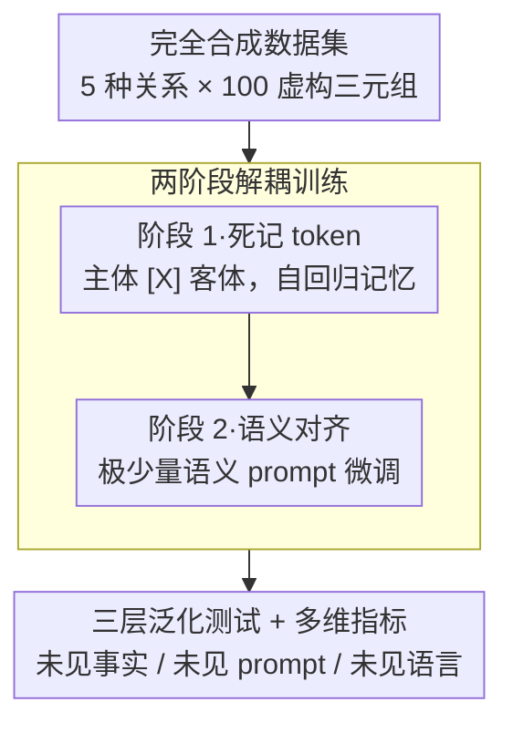

# Rote Learning Considered Useful: Generalizing over Memorized Training Examples

**会议**: ICLR 2026  
**arXiv**: [2507.21914](https://arxiv.org/abs/2507.21914)  
**代码**: [QinyuanWu0710/memorize-then-generalize](https://github.com/QinyuanWu0710/memorize-then-generalize)  
**领域**: 知识编辑  
**关键词**: memorization, generalization, knowledge_injection, LLM_learning_dynamics  

## 一句话总结

本文提出"先记忆再泛化"两阶段框架，证明 LLM 可以在死记硬背合成关键 token 后，通过极少量语义微调实现泛化，挑战了"记忆阻碍泛化"的传统观点。

## 研究背景与动机

**传统观点**：死记硬背（rote learning）被认为会导致过拟合、损害泛化能力。在 LLM 中，记忆被视为有害行为——与隐私泄露、幻觉、改写脆弱性相关。主流训练范式限制训练 epoch 数（通常 1-2 个）以避免记忆。

**核心挑战**：
- 先前研究表明模型在改写的 prompt 上表现显著下降
- 记忆的知识可能干扰下游适应
- 记忆与泛化之间的关系尚未被充分理解

**本文立场**：挑战上述观点，证明 LLM **可以**从死记硬背的数据中泛化。通过精心设计的两阶段过程，记忆不仅不阻碍泛化，反而能作为泛化的**基础**。

## 方法详解

### 整体框架

Memorize-then-Generalize 想回答一个反直觉的问题：死记硬背真的会损害泛化吗？它把知识注入拆成两个解耦的阶段——先让模型用一个**无语义的合成关键 token** [X] 死记硬背事实三元组（主体-关系-客体），再用极少量带语义的样本做有监督微调，把 [X] 重新解读成具体关系。直觉是把"存下事实"和"理解关系"分开学：记忆阶段只负责把知识刻进权重，微调阶段只负责给这块记忆贴上语义标签。为了让结论可信，全部数据都是凭空虚构的（切断预训练污染），泛化效果则被拆成"未见事实 / 未见 prompt / 未见语言"三层逐级检验。

### 关键设计

**1. 完全合成的数据集：彻底切断预训练污染**

要证明"记忆能帮泛化"，首先得排除"模型其实在预训练里早就见过这些事实"的混杂因素，否则任何泛化都说不清是学来的还是背景知识。本文的做法是让全部数据都凭空虚构：覆盖 5 种 T-REx 关系（author、capital、educated_at、genre、mother），每种关系造 100 个虚构主体-客体对；每种关系再配 20 个自然语言 prompt 变体，其中 10 个用于阶段 2 训练、10 个留作测试，外加 3 个语义无关的 prompt 当负样本，用来检验模型是否只对该关系响应、而不是见到任何 prompt 就乱答。所有 prompt 还译成德语、西班牙语、中文、日语，为后续的跨语言泛化测试备料。

**2. 两阶段解耦：先死记 token、再语义对齐**

这是全文的核心机制，针对的痛点是传统训练把"记住知识"和"理解语义"耦在一起、于是多背几遍就被当成过拟合。本文把两者拆开：阶段 1 用形如 "Gene Finley [X] Cody Ross" 的串做无监督 next-token 预测，此时 [X] 纯粹是个关系占位符、不携带任何含义，模型只是把大量这样的三元组背进权重，训练目标就是标准自回归语言模型损失 $\mathcal{L}_{\text{Phase-1}} = -\sum_t \log P(x_t \mid x_{<t})$。阶段 2 改用语义明确的自然语言 prompt（如 "Who is Gene Finley's mother? → Cody Ross"）在很少几条事实上做有监督微调，损失为 $\mathcal{L}_{\text{Phase-2}} = -\log P(o \mid p(s))$，其中 $p(s)$ 是语义 prompt、$o$ 是目标客体。之所以这样能泛化，是因为阶段 1 已经把同一关系下的所有事实在表征空间里聚成了一簇结构，阶段 2 只需把这簇结构和语义 prompt 的方向对齐，模型就能对未参与微调的事实、未见过的 prompt 一并答对——记忆不是泛化的障碍，反而成了泛化的地基。

**3. 三层泛化测试 + 多维指标：把"泛化"拆成可量化的问题**

泛化是个模糊词，本文把它显式拆成三个递进难度，分别考查上一步学到的记忆结构能迁移多远：**未见事实**（阶段 2 没微调过的主客对，能否用训练 prompt 检索出来）、**未见 prompt**（换成语义相似但训练中没出现的 prompt，能否检索全部事实）、**未见语言**（换其他语言能否检索）。每一层都用三个指标交叉衡量，避免单一指标失真：**生成准确率**指贪心采样 50 个 token 后与目标客体做精确匹配的命中率，刻画"能不能生成对"；**多选准确率**是在 100 个候选客体里选 1 的正确率，刻画"能不能选对"；**目标 token 概率**是模型赋予正确客体 token 的概率，刻画"有多确信"。三个角度合起来，才能区分"碰巧蒙对"和"真正学到关系"。

## 实验关键数据

### 主实验：泛化效果（Qwen2.5-1.5B）

| 阶段 1 epoch | 阶段 2 数据量 k | 阶段 2 epoch | 训练 prompt 准确率 | 测试 prompt 准确率 |
|-------------|---------------|-------------|-------------------|-------------------|
| 3 | 50 | 1 | 0.38 | 0.35 |
| 6 | 50 | 1 | 0.94 | 0.89 |
| 10 | 50 | 1 | 0.94 | 0.98 |
| **20** | **50** | **1** | **1.00** | **0.98** |
| 10 | 1 | 8 | 1.00 | 0.75 |
| 20 | 1 | 8 | 1.00 | 0.76 |

关键发现：**记忆越深，泛化越好**。仅用 1 个事实 + 1 个 prompt 就能实现可观的泛化（0.76 准确率）。

### 消融实验：表征空间分析

| 训练阶段 | ΔCosSim (关系聚类分离度) | 与训练 prompt 余弦相似度 | 与测试 prompt 余弦相似度 | 与无关 prompt 余弦相似度 |
|---------|------------------------|------------------------|------------------------|------------------------|
| 基础模型 | 0.058 | - | - | - |
| Phase-1 (epoch 2) | 0.116 | - | - | - |
| Phase-1 (epoch 20) | 0.191 | 0.87 | 0.58 | 0.50 |
| Phase-2 完成 | **0.258** | **0.90** | **0.71** | 0.50 |

关键发现：
1. 死记硬背阶段就已经学到了**关系结构**（ΔCosSim 持续增长）
2. 阶段 2 后关键 token 与语义 prompt 的对齐显著增强（0.58 → 0.71）
3. 与无关 prompt 的相似度不变（0.50），确认了特异性

### 与 SFT 和 ICL 的比较

| 方法 | 数据效率 | 1 prompt 准确率 | 10 prompts 准确率 |
|------|---------|----------------|-------------------|
| Memorize-then-Generalize | 高 | **显著高于 SFT** | ~0.9（token 数仅为 SFT 的一半） |
| Standard SFT | 低 | 远低于本方法 | ~0.9（但训练 token 翻倍） |
| In-Context Learning | N/A | 低于本方法 | 对无关 prompt 也给高概率（不区分） |

### 跨语言泛化

仅在英语上训练阶段 2 后的跨语言生成准确率（按排名）：
- 英语 > 西班牙语 > 德语 > 日语 > 中文
- 无关 prompt 在所有语言中准确率接近 0（虚线）

### 推理能力增强

| 记忆阶段 epoch | 反转推理准确率 | 2-hop 推理准确率 |
|---------------|-------------|----------------|
| 0（无记忆） | 0.00 | 0.14 |
| 5 | - | 0.14 |
| 10 | - | 0.14 |
| 20 | 0.26 | **0.36** |
| SFT 基线 | 0.01 | - |

深度记忆不仅帮助直接检索，还能增强反转推理和多跳推理能力。

### 关键发现

1. **一个事实一个 prompt 即可泛化**：打破了"泛化需要多样化 prompt"的传统认知
2. **记忆越深泛化越好**：epoch 数与泛化性能正相关，与"多 epoch = 过拟合"相悖
3. **跨 8 个模型鲁棒**：在 Qwen2.5、Llama-2/3.2、Phi-4 等 4 个家族 8 个模型上一致成立
4. **表征层面的语义对齐**：关键 token 的表征在阶段 2 后与语义 prompt 对齐，揭示了泛化的内在机制
5. **双重泛化风险**：同一记忆基础可同时支持良性和恶意解读，攻击者可利用小量微调改变记忆数据的语义

## 亮点与洞察

- **颠覆性发现**：直接挑战了"记忆有害"的主流叙事，用充分实验证明记忆可以成为泛化的基石
- **实验设计极其干净**：使用完全合成数据和无语义 token 彻底消除了混杂因素
- **知识注入的实用价值**：Memorize-then-Generalize 范式比 SFT 更高效、比 ICL 更稳定
- **安全洞察深刻**：揭示了"双重泛化"这种新型攻击向量——模型可在保持良性功能的同时接受恶意语义

## 局限性

1. 实验使用完全合成的事实，与真实世界的复杂知识（如多义性、上下文依赖性）可能存在差距
2. 仅限于事实三元组形式，更复杂的知识结构（如过程性知识、推理链）未涉及
3. 模型规模上限为 14B，更大模型的行为可能不同
4. 反转推理和 2-hop 推理的准确率虽有改善，但绝对值仍不高（0.26, 0.36）
5. 安全风险部分仅做了概念验证，防御策略未深入探讨

## 相关工作与启发

- **Grokking 现象 (Power et al., 2022)**：广泛记忆后突然涌现泛化，与本文的"记也越深泛化越好"发现呼应
- **Physics of Language Models (Allen-Zhu & Li, 2023)**：研究知识操作，发现记忆可干扰微调泛化——本文用不同框架得到相反结论
- **Reversal Curse (Berglund et al., 2023)**：模型学了"A is B"但无法回答"B is A"——本文的深度记忆+泛化可部分缓解
- 对知识编辑和持续学习的启示：先用合成 token 锚定知识再做语义对齐，可能是更高效的知识注入路线

## 评分

- **创新性**: ⭐⭐⭐⭐⭐ — 反直觉发现 + 干净的框架设计
- **实验设计**: ⭐⭐⭐⭐ — 跨 8 模型 + 多语言 + 表征分析，但仅限合成数据
- **实用性**: ⭐⭐⭐⭐ — 知识注入应用有实际价值
- **写作质量**: ⭐⭐⭐⭐ — 条理清晰，图表丰富
- **综合评分**: ⭐⭐⭐⭐ (4/5)

<!-- RELATED:START -->

## 相关论文

- [\[ACL 2026\] HiEdit: Lifelong Model Editing with Hierarchical Reinforcement Learning](../../ACL2026/knowledge_editing/hiedit_lifelong_model_editing_with_hierarchical_reinforcement_learning.md)
- [\[AAAI 2026\] Is the Information Bottleneck Robust Enough? Towards Label-Noise Resistant Information Bottleneck Learning](../../AAAI2026/knowledge_editing/is_the_information_bottleneck_robust_enough_towards_label-noise_resistant_inform.md)
- [\[CVPR 2026\] SAME: Sparse and Anchored Model Editing for Heterogeneous Incremental Learning under Limited Data](../../CVPR2026/knowledge_editing/same_sparse_and_anchored_model_editing_for_heterogeneous_incremental_learning_un.md)
- [\[ACL 2025\] BMIKE-53: Investigating Cross-Lingual Knowledge Editing with In-Context Learning](../../ACL2025/knowledge_editing/bmike-53_investigating_cross-lingual_knowledge_editing_with_in-context_learning.md)
- [\[ICLR 2026\] EAMET: Robust Massive Model Editing via Embedding Alignment Optimization](eamet_robust_massive_model_editing_via_embedding_alignment_optimization.md)

<!-- RELATED:END -->
