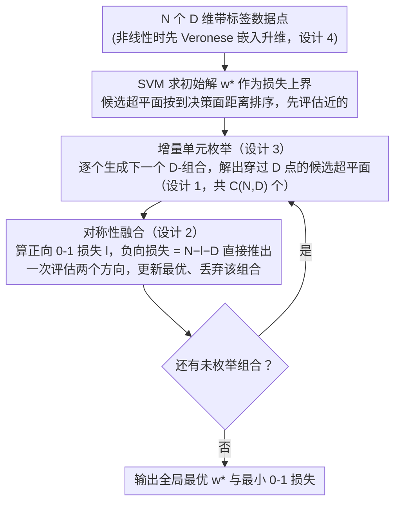

# An Efficient, Provably Optimal Algorithm for the 0-1 Loss Linear Classification Problem

**会议**: ICLR 2026  
**arXiv**: [2306.12344](https://arxiv.org/abs/2306.12344)  
**代码**: 无（基于 PyTorch 实现）  
**领域**: 其他  
**关键词**: 0-1损失, 线性分类, 精确算法, 超平面排列, 组合优化  

## 一句话总结
提出增量单元枚举算法（ICE），首个具有严格证明的独立算法，可以在 $O(N^{D+1})$ 时间内精确求解0-1损失线性分类问题的全局最优解，并扩展到多项式超曲面分类。

## 研究背景与动机

**领域现状**：线性分类是最基础的机器学习问题，从1936年的线性判别分析（LDA）开始已有悠久历史。对于线性可分数据，SVM、逻辑回归等方法可以很好地工作；但对于线性不可分数据，精确最小化0-1损失（即最少误分类数）是NP-hard问题。

**现有痛点**：现有方法均依赖替代损失函数（如hinge loss、logistic loss），无法保证找到0-1损失的全局最优解。虽然可以用混合整数规划（MIP）求解器（如Gurobi）来精确求解，但这些是通用求解器，缺乏对问题结构的深度利用。Branch-and-Bound（BnB）方法虽有尝试，但缺乏正式的正确性证明，且最坏情况下复杂度极高。

**核心矛盾**：根据Vapnik的泛化界定理，更低的训练误差和更简单的模型应该带来更好的泛化。线性模型的VC维仅为 $D+1$，是最简单的分类器之一。但由于无法精确优化0-1损失，我们一直无法验证"精确解是否真的泛化更好"这一理论预测。

**本文目标** 如何高效精确求解0-1损失线性分类问题？Cover计数定理、Murthy的 $2^D \binom{N}{D}$ 分析、以及Nguyen-Sanner的 $\binom{N}{D}$ 观察这三种看似矛盾的复杂度分析之间的关系？精确解是否真的过拟合？

**切入角度**：从超平面排列和有向拟阵理论出发，利用点-超平面对偶变换建立数据点与线性二分类之间的组合关系和入射关系。

**核心 idea**：通过对偶变换将分类问题转化为超平面排列的单元枚举问题，证明只需枚举 $\binom{N}{D}$ 个通过 $D$ 个数据点的超平面即可找到全局最优，并利用增量组合生成器实现高效枚举。

## 方法详解

### 整体框架
给定 $N$ 个 $D$ 维带二分类标签的数据点，目标是找到使误分类数（即 0-1 损失）最小的线性分类器。难点在于：参数空间是连续无穷的，而 0-1 损失关于参数是分段常数、不可导，梯度类方法完全失效。ICE 的核心洞察是把"在无限连续的参数空间里搜索最优超平面"通过点-超平面对偶变换转化成"在有限的对偶排列单元里做组合枚举"，再用一条分类定理把需要检查的候选超平面收窄到 $\binom{N}{D}$ 个通过 $D$ 个数据点的超平面，最后靠对称性把每个超平面的两个方向一次算完、靠增量生成器边枚举边丢弃，使整个搜索既省内存又能 GPU 并行。算法执行时先用 SVM 求一个初始上界，再沿候选集逐个增量评估、不断收紧，直到枚举完毕得到全局最优。

### 关键设计

**1. 点-超平面对偶变换与 0-1 损失分类定理：把无穷连续搜索压成 $\binom{N}{D}$ 个候选**

直接在参数空间里搜索最优超平面无从下手——参数连续、候选无穷多，而 0-1 损失分段常数、不可导。对偶变换提供了离散化的支点：每个数据点 $x_i$ 被映射成对偶空间中的一个超平面，反过来一个候选分类器对应对偶空间中的一个点。这些对偶超平面把空间切成若干个单元（cell），落在同一单元内的所有分类器对所有数据点给出**完全相同**的分类结果、因而 0-1 损失相同，于是无穷多的连续超平面被压缩成有限多个等价类（Theorem 1、2），"搜索最优分类器"被改写成"枚举对偶排列的单元"。在此基础上，本文的 0-1 损失分类定理（Theorem 3）再把候选收紧一层：任何取得最优 0-1 损失的分类器都能平移、旋转到恰好穿过 $D$ 个数据点而不改变其分类结果——只要超平面不碰到任何点，就能在不跨越任何点的前提下微调，直到贴住 $D$ 个点。这把搜索空间从"所有单元"压到"所有由 $D$ 个点确定的超平面"，总数恰为 $\binom{N}{D}$。这条定理同时调和了三种看似矛盾的复杂度结论：Cover 计数的 $O(N^D)$、Murthy 的 $2^D\binom{N}{D}$、Nguyen–Sanner 的 $\binom{N}{D}$，本质上是同一枚举量在是否计入正负方向、是否计入常数因子上的不同写法。

**2. 对称性融合定理：一次评估顶两次**

每个穿过 $D$ 个点的超平面都有正、负两个法向方向，对应两个互补的分类器，朴素做法要分别评估两次。本文证明（Theorem 5）若正方向的 0-1 损失为 $l$，则负方向的损失恰好是 $N - l - D$——穿过的那 $D$ 个点落在分界面上，在两侧划分中都不计入误分类，剩下 $N-D$ 个点被两个方向互补地划分。于是评估一个方向就能直接推出另一个方向的损失，无需重复计算，把实际需要做的损失评估次数直接减半。

**3. 增量单元枚举（ICE 算法主体）：边生成边丢弃，内存常数化**

若先把全部 $\binom{N}{D}$ 个 $D$-组合存下来再逐一评估，内存会随 $N$ 爆炸。ICE 采用顺序式增量生成：外层从第 $0$ 个点扫到第 $N-1$ 个点，每加入一个新点就把它拼到已有的低阶组合上、增量地凑出新的 $D$-组合，随即解出对应超平面、按设计 2 一次算出正负两向的 0-1 损失、更新当前最优，然后**立即清空已用过的 $D$-组合**、不保留任何历史。这样枚举总时间仍是 $O(N^{D+1})$ 量级，但内存复杂度被压到与组合总数无关的 $O(N^G)$（$G$ 为一次批处理的组合规模），使算法能在普通显存下跑完大规模枚举。

**4. 多项式超曲面分类扩展：用 Veronese 嵌入复用同一套理论**

线性分类定理只对线性边界成立。本文通过 $K$-元 Veronese 嵌入把 $D$ 维数据升维到由各阶单项式张成的高维空间，原空间中的多项式超曲面在高维空间里就变成线性超平面（Theorem 4、Corollary 1）。于是无需另起炉灶，直接在升维后的空间套用 Theorem 3 与 ICE，即可精确求解非线性的多项式决策边界——这也是 ICE 算法第一步先做 $\rho_K(\mathcal{D})$ 嵌入、其余流程完全不变的原因。

### 损失函数 / 训练策略
ICE 不优化任何替代损失，直接以 0-1 损失（误分类计数）为目标。实现上先用 SVM 求一个初始解作为当前最优的上界，再把候选超平面按到 SVM 决策面的距离 $|\bm{w}^\top\bm{x}|$ 排序后增量枚举：靠近决策边界的组合更可能改进上界，优先评估有助于尽早收紧。整个流程完全由矩阵运算构成，可借 PyTorch 向量化并行批量评估多个组合，充分利用 GPU 吞吐。

## 实验关键数据

### 主实验

| 数据集 | $N$ | $D$ | ICE(%) | SVM(%) | LR(%) | LDA(%) |
|--------|-----|-----|--------|--------|-------|--------|
| HA | 283 | 3 | **77.03** | 72.08 | 73.14 | 73.85 |
| CA | 72 | 5 | **80.6** | 77.2 | 73.6 | 75.0 |
| CR | 89 | 6 | **95.51** | 91.10 | 89.89 | 89.89 |
| VP | 704 | 2 | **97.30** | 96.88 | 96.59 | 96.59 |
| BT | 502 | 4 | **78.69** | 74.50 | 75.50 | 74.10 |

### 消融实验

| 方法 | 时间($N=150,D=3$) | 说明 |
|------|------|------|
| ICE | 1.2s | 多项式复杂度 |
| BnB | ~317年 | 指数复杂度 |

### 关键发现
- ICE在所有数据集上都达到最高训练精度，且更高训练精度也带来了更好的测试泛化，反驳了"精确解必然过拟合"的传统观点
- 实际运行时间与理论分析高度吻合

## 亮点与洞察
- 统一了Cover、Murthy、Nguyen-Sanner三种看似矛盾的组合分析
- 利用0-1损失对称性将搜索空间减半
- 在高风险应用（医疗、刑事司法）中，ICE使最优线性分类器在小规模数据上成为现实

## 局限与展望
- 复杂度对维度 $D$ 是指数级的，实际只能处理低维数据
- 一般位置假设需要预处理
- GPU并行优化空间大

## 相关工作与启发
- **vs SVM/LR/LDA**: 这些方法优化替代损失函数，无法保证0-1损失最优
- **vs BnB**: ICE首次证明PCS正确性，且实际复杂度更低
- **vs MIP求解器**: 通用求解器性能不稳定，ICE有确定性复杂度保证

## 评分
- 新颖性: ⭐⭐⭐⭐⭐ 首个具有严格证明的0-1损失精确分类独立算法
- 实验充分度: ⭐⭐⭐ 数据集较小且低维
- 写作质量: ⭐⭐⭐⭐ 理论推导严谨
- 价值: ⭐⭐⭐⭐ 在可解释AI和高风险决策场景中有实际价值

<!-- RELATED:START -->

## 相关论文

- [\[ICML 2025\] Provably Efficient Algorithm for Best Scoring Rule Identification in Online Principal-Agent Information Acquisition](../../ICML2025/learning_theory/provably_efficient_algorithm_for_best_scoring_rule_identification_in_online_prin.md)
- [\[ICML 2026\] Provably Data-driven Multiple Hyper-parameter Tuning with Structured Loss Function](../../ICML2026/learning_theory/provably_data-driven_multiple_hyper-parameter_tuning_with_structured_loss_functi.md)
- [\[ICLR 2026\] Scalable Random Wavelet Features: Efficient Non-Stationary Kernel Approximation with Convergence Guarantees](scalable_random_wavelet_features_efficient_non-stationary_kernel_approximation_w.md)
- [\[ICML 2026\] Towards Optimal Robustness in Learning-Augmented Paging](../../ICML2026/learning_theory/towards_optimal_robustness_in_learning-augmented_paging.md)
- [\[ICML 2026\] Expectation Consistency Loss: Rethink Confidence Calibration under Covariate Shift](../../ICML2026/learning_theory/expectation_consistency_loss_rethink_confidence_calibration_under_covariate_shif.md)

<!-- RELATED:END -->
