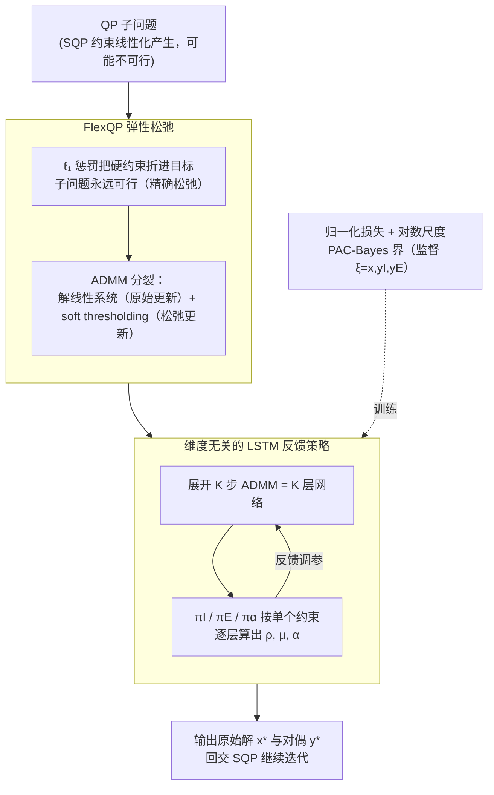

# Deep FlexQP: Accelerated Nonlinear Programming via Deep Unfolding

**会议**: ICLR2026  
**arXiv**: [2512.01565](https://arxiv.org/abs/2512.01565)  
**代码**: 待确认  
**领域**: LLM评测  
**关键词**: 二次规划, 深度展开, ADMM, 序列二次规划, LSTM策略, PAC-Bayes  

## 一句话总结
提出 FlexQP——基于 $\ell_1$ 弹性松弛的"永远可行"凸二次规划（QP）求解器，结合深度展开（deep unfolding）学习 LSTM 反馈策略加速收敛得到 Deep FlexQP；在 SQP 框架中作为子模块，解非线性轨迹优化比 OSQP 快 4-16 倍，预测安全滤波器的安全违规减少 70%+、任务完成率提升 43%。

## 研究背景与动机

**领域现状**：二次规划（QP）是最优控制、组合优化、机器学习中的基础子问题；序列二次规划（SQP）通过迭代求解 QP 子问题来处理非线性非凸约束优化。

**现有痛点**：SQP 的约束线性化经常导致不可行的 QP 子问题（infeasible QP），传统求解器（如 OSQP）要么报错终止，要么需要专门的不可行性修复程序（如 SNOPT 的 elastic mode），不可扩展。同时，ADMM 超参数（$\rho, \sigma, \alpha$）调优困难。

**核心idea**：用 $\ell_1$ 精确松弛将约束 QP 转为无约束优化——可行时恢复原解（Theorem 3.1），不可行时自动找稀疏违约最小点；然后用深度展开 + LSTM 学习维度无关的反馈策略替代手动调参。

## 方法详解

### 整体框架

Deep FlexQP 要解决的是非线性优化里反复出现的同一个子问题：SQP 每做一次约束线性化，都会吐出一个 QP 子问题让你求解，而这些 QP 经常因线性化失真而变得不可行，传统求解器一遇到就报错或外挂修复程序。论文把求解过程拆成上下两层。底层是 **FlexQP**——用 $\ell_1$ 弹性松弛把硬约束 $Gx \leq h,\ Ax = b$ 折进目标函数，使子问题对任何输入都"永远可行"，再用 ADMM 把它分裂成"解一个线性系统（原始更新）"和"做 soft thresholding（松弛更新）"两块来回迭代。上层是 **深度展开（deep unfolding）**：把 ADMM 的 $K$ 步迭代摊开当成 $K$ 层网络，让一组 LSTM 反馈策略在每一层根据当前残差现场算出该用的惩罚参数 $\rho, \mu, \alpha$，取代手动调参。训练时用一个把原始解与对偶乘子一起监督的归一化损失，并套上对数尺度的 PAC-Bayes 界保证泛化。整套结构嵌回 SQP，每轮线性化产生的 QP 子问题都交给它解，输出再回交 SQP 继续迭代。

### 关键设计

**1. FlexQP 弹性松弛：让不可行的子问题也有解**

这一步针对的是框架最上游的痛点——SQP 线性化吐出的 QP 经常不可行，传统求解器只能报错或外挂修复程序。FlexQP 把不等式与等式约束用 $\ell_1$ 惩罚项 $\mu_I \|Gx+s-h\|_1 + \mu_E \|Ax-b\|_1$ 收进目标，于是优化问题对任何输入都有解。关键在于这个松弛是"精确"的：Theorem 3.1 证明只要惩罚系数足够大——$\mu_I \geq \|y_I^*\|_\infty$、$\mu_E \geq \|y_E^*\|_\infty$（即不小于最优对偶变量的无穷范数），松弛解就与原 QP 解完全重合；而当原问题真的不可行时，松弛变量 $z_I^*, z_E^*$ 自动收敛到稀疏点，给出"哪些约束被违反、违反多少"的证书。$\mu$ 只出现在 soft thresholding 那一步——$\mu$ 越大阈值越大、被零化掉的违约越多，因此满足 Theorem 3.1 的条件本质就是把阈值调够。Theorem 3.2 进一步在弱二阶充分性假设下保证 ADMM 迭代收敛，整个底层求解器因此既不会卡死也有理论落脚点。

**2. 维度无关的 LSTM 反馈策略：把调参变成学出来的反馈控制**

FlexQP 虽然永远可行，但 ADMM 的收敛速度高度依赖 $\rho, \sigma, \alpha$ 等惩罚参数，手调既费力又不可迁移（$\rho$ 既正则化约束矩阵让线性系统可解，又与 $\mu$ 反向地决定 soft thresholding 的噪声权重，作用很反直觉）。这里把展开的每一层 ADMM 看成一个反馈控制步，为不等式约束、等式约束、松弛参数分别训练三个策略 $\pi_I, \pi_E, \pi_\alpha$，每一层以当前 ADMM 变量加上原始/对偶残差作为输入，输出这一层要用的惩罚参数。核心技巧是策略按"单个约束"为单位批量应用，而不是对整个向量输出一个标量，因此参数量与问题规模解耦——同一组策略既能解 500 维的小问题也能解 10k 维的大问题，这就是它**维度无关**、可跨规模泛化的来源。用 LSTM（hidden size 32 + 两层 [32,32] MLP）而非前馈网络，是为了让策略捕捉优化轨迹的长程依赖，根据残差下降的历史自适应地收紧或放松参数；激活函数全用 sigmoid，比 ReLU 在这种自回归展开里稳定得多。

**3. 归一化训练损失与对数尺度 PAC-Bayes 界：把对偶变量一并监督，并让泛化界有意义**

最后是怎么训练这组策略。训练目标是让展开网络第 $k$ 层的解逼近真值，损失写成相对误差

$$\min_\theta \sum_k \frac{\|\xi^k(\theta) - \xi^*\|_2}{\|\xi^*\|_2},\quad \xi = (x, y_I, y_E)$$

其中 $\xi$ 同时包含原始解 $x$ 与 Lagrange 乘子 $y_I, y_E$——把乘子也监督进去，能隐式逼着惩罚系数满足 $\mu \geq |y^*|$，从而自动落进 Theorem 3.1 的精确松弛区间，让"学出来的参数"和"理论要求的条件"对齐。但标准损失（Eq. 13）有个问题：当残差已经很小时它几乎不再变化，套进 PAC-Bayes 框架得到的泛化界松到没有信息。作者改用对数尺度的 PAC-Bayes 损失（Eq. 14），它在小残差区比标准损失的信息量高数个数量级，于是得到的泛化保证才真正可用。

## 实验关键数据

### 小中规模 QP（500训练/1000测试问题）

| 求解器 | 收敛速度（迭代数） | 最终残差 |
|--------|-------------------|---------|
| OSQP（手调） | 基线 | 基线 |
| Deep OSQP | 优于 OSQP | 优于 OSQP |
| Deep OSQP-Improved | 进一步提升 | 进一步提升 |
| **Deep FlexQP** | **所有方法中最快** | **所有方法中最低** |

### 大规模 QP（10k变量/10-20k约束）

| 问题类 | Deep FlexQP 优势 |
|--------|-----------------|
| Portfolio Optimization (10k var, 10k con) | 迭代数最少，通过微调小模型泛化 |
| SVM (10k var, 20k con) | CG迭代数最少 |

### SQP 非线性优化

| 指标 | Deep FlexQP + SQP vs OSQP + SQP |
|------|-------------------------------|
| 轨迹优化速度 | **4-16× 更快**（100问题平均） |
| 安全滤波器安全违规 | **减少 >70%** |
| 安全滤波器任务完成率 | **提升 43%** |

### 关键发现
- FlexQP 架构本身（弹性松弛 + LSTM）是优越性的主因——同样的损失函数下 Deep OSQP 变体的微调效果远不如 Deep FlexQP
- 仅需在小规模问题上训练，再用100个大规模问题微调5轮即可泛化到 10k+ 维度
- 对数尺度 PAC-Bayes 界使泛化保证有实际意义（标准界在小残差时无信息）

## 亮点与洞察
- **理论优雅性**：$\ell_1$ 精确松弛 + ADMM + 深度展开的有机结合，每一步都有明确的数学保证
- **实用价值极高**：解决了 SQP 中不可行子问题的核心痛点，无需额外修复程序
- 维度无关的 LSTM 策略设计使单次训练可泛化到任意规模问题

## 局限与展望
- 大规模问题训练开销仍大（每 epoch 约3小时），全量训练需 300+ 天
- 仅在密集 QP 上验证，稀疏 QP（如电力网络优化）可能需要不同策略
- LSTM 策略的可解释性有限，难以理解学到的调参规则

## 相关工作与启发
- 相比 Saravanos et al. (2025) 的 Deep OSQP，FlexQP 的关键优势在于原生处理不可行性 + 向量级（而非标量级）惩罚参数策略
- 可启发将深度展开应用于其他优化算法（如内点法、Frank-Wolfe）

## 评分
- 新颖性: ⭐⭐⭐⭐ 弹性松弛+深度展开的组合新颖，但各组件均非全新
- 实验充分度: ⭐⭐⭐⭐⭐ 从小规模到大规模QP再到非线性SQP，涵盖金融/ML/控制多领域
- 写作质量: ⭐⭐⭐⭐ 结构清晰，理论推导严谨
- 价值: ⭐⭐⭐⭐⭐ 解决SQP的核心工程痛点，有广泛应用前景

<!-- RELATED:START -->

## 相关论文

- [\[NeurIPS 2025\] Conformal Online Learning of Deep Koopman Linear Embeddings](../../NeurIPS2025/learning_theory/conformal_online_learning_of_deep_koopman_linear_embeddings.md)
- [\[ICLR 2026\] Lipschitz Bandits with Stochastic Delayed Feedback](lipschitz_bandits_with_stochastic_delayed_feedback.md)
- [\[ICLR 2026\] Function Spaces Without Kernels: Learning Compact Hilbert Space Representations](function_spaces_without_kernels_learning_compact_hilbert_space_representations.md)
- [\[ICLR 2026\] An Efficient, Provably Optimal Algorithm for the 0-1 Loss Linear Classification Problem](an_efficient_provably_optimal_algorithm_for_the_0-1_loss_linear_classification_p.md)
- [\[ICLR 2026\] The Expressive Limits of Diagonal SSMs for State-Tracking](the_expressive_limits_of_diagonal_ssms_for_state-tracking.md)

<!-- RELATED:END -->
