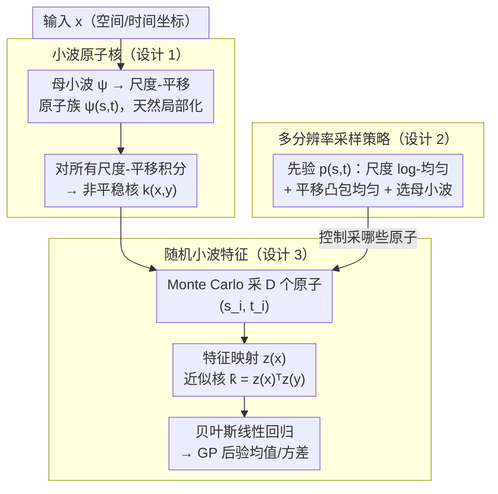

# Scalable Random Wavelet Features: Efficient Non-Stationary Kernel Approximation with Convergence Guarantees

## 元信息
- **会议**: ICLR 2026
- **arXiv**: [2602.00987](https://arxiv.org/abs/2602.00987)
- **代码**: 未公开
- **领域**: 其他
- **关键词**: kernel methods, random features, wavelets, non-stationary, Gaussian processes, multi-resolution

## 一句话总结
提出 Random Wavelet Features (RWF)，通过从小波族中随机采样构建可扩展的非平稳核近似，保留随机特征的线性时间复杂度，同时具有正定性、无偏性和一致收敛保证。

## 研究背景与动机
- **GP 的困境**：表达力 vs 效率。精确 GP 计算 $O(N^3)$ 且通常用平稳核。
- **Random Fourier Features (RFF)**：基于 Bochner 定理将平稳核近似为线性模型，$O(ND^2)$ 训练，但本质上限于平稳核。
- **非平稳建模挑战**：地理空间、语音等领域的统计特性随位置变化。Deep GP、谱混合核等方法虽能建模非平稳性但代价高。
- **核心 Gap**：缺乏一种既像 RFF 一样可扩展、又能原生捕获非平稳性的随机特征框架。

## 方法详解

### 整体框架
RWF 的核心思路，是把 RFF 里那套铺满全空间、只认 $x-y$ 的全局正弦基，换成在空间和频率上都局部化的小波原子。整条流水线分三层：先用一族尺度-平移小波原子定义一个非平稳核（核值随位置漂移，不再只依赖 $\mathbf{x}-\mathbf{y}$）；再用一个多分辨率先验 $p(s,\mathbf{t})$ 决定这些原子覆盖哪些尺度和位置；最后用 Monte Carlo 从这个先验里采 $D$ 个原子，把无穷维的积分核压成一张有限维特征映射，于是核回归直接退化成普通的贝叶斯线性回归。整套流程只需对 $D$ 个随机小波原子求一次特征，因此保留了随机特征 $O(ND^2)$ 的线性时间复杂度，却额外获得了随位置变化的非平稳建模能力。

### 关键设计

**1. 小波原子核：用局部基取代全局正弦基定义非平稳核**

RFF 受限于平稳性的根源在于傅里叶基 $e^{i\omega^\top x}$ 在全空间上同质，相关性只依赖 $x-y$。RWF 改用从母小波 $\psi:\mathbb{R}^d\to\mathbb{R}$ 生成的原子族 $\psi_{s,\mathbf{t}}(\mathbf{x}) = s^{-d/2}\psi\big((\mathbf{x}-\mathbf{t})/s\big)$，每个原子由尺度 $s$ 和平移 $\mathbf{t}$ 控制，天然在某个空间位置和频带上局部化。非平稳核由对所有尺度-平移积分得到：

$$k(\mathbf{x},\mathbf{y}) = \int_0^\infty\!\int_{\mathbb{R}^d}\psi_{s,\mathbf{t}}(\mathbf{x})\,\psi_{s,\mathbf{t}}(\mathbf{y})\,p(s,\mathbf{t})\,d\mathbf{t}\,ds$$

其中 $p(s,\mathbf{t})$ 是尺度-平移上的采样密度。由于原子随位置漂移，核值不再只依赖 $\mathbf{x}-\mathbf{y}$，从而原生支持非平稳；而把核写成内积形式 $\psi_{s,\mathbf{t}}(\mathbf{x})\psi_{s,\mathbf{t}}(\mathbf{y})$ 的积分，正是后续随机近似能保证正定与无偏的结构基础。

**2. 多分辨率采样策略：用先验分布控制小波覆盖哪些尺度和位置**

定义了原子核后，特征质量就取决于怎么采 $(s,\mathbf{t})$ 和选哪个母小波——这正是上面积分里 $p(s,\mathbf{t})$ 要回答的问题。尺度 $s$ 取对数均匀分布，让精细小波与粗糙小波在数量级上均衡覆盖，从而精细原子捕捉局部突变、粗糙原子建模长程趋势；平移 $\mathbf{t}$ 在数据凸包上均匀采样，保证原子铺满输入支撑域；母小波则按信号特性选取——Morlet 适合时频分析的振荡信号，Daubechies 适合尖锐转变，Mexican Hat 适合脉冲检测。$p(s,\mathbf{t})$ 因此既是采样器又是先验旋钮：调整它就能让随机特征族适配不同数据的非平稳结构，而无需改动整体推断流程。

**3. 随机小波特征：Monte Carlo 把积分核压成有限维内积**

上面的积分核无法直接计算，RWF 用 Monte Carlo 从设计 2 的先验 $p(s,\mathbf{t})$ 中独立采 $D$ 组 $(s_i,\mathbf{t}_i)$，构造特征映射 $z(\mathbf{x}) = \frac{1}{\sqrt{D}}[\psi_{s_1,\mathbf{t}_1}(\mathbf{x}),\ldots,\psi_{s_D,\mathbf{t}_D}(\mathbf{x})]^\top$，并用 $\hat{k}(\mathbf{x},\mathbf{y}) = z(\mathbf{x})^\top z(\mathbf{y})$ 近似真核。这一步把核回归变成显式有限维特征上的线性模型，于是 GP 推断退化为贝叶斯线性回归，后验协方差与均值有闭式解 $\mathbf{S}_{\mathbf{w}} = (\mathbf{I}_D + \sigma^{-2}\mathbf{Z}^\top\mathbf{Z})^{-1}$、$\mathbf{m}_{\mathbf{w}} = \sigma^{-2}\mathbf{S}_{\mathbf{w}}\mathbf{Z}^\top\mathbf{y}$。由于每个特征是独立同分布采样的无偏估计，求和后期望恰好等于积分核，这正是无偏性与一致收敛保证的来源。

下表对比 RWF 与主流方法的复杂度，可见它与 RFF 同等高效却多了非平稳建模能力：

| 方法 | 训练复杂度 | 预测复杂度 |
|------|-----------|-----------|
| 精确 GP | $O(N^3)$ | $O(N^2)$ |
| SVGP | $O(NM^2)$ / 步 (迭代) | $O(M^2)$ |
| RFF-GP | $O(ND^2)$ (单次) | $O(D^2)$ |
| **RWF-GP** | $O(ND^2)$ (单次) | $O(D^2)$ |

## 理论保证

### 定理 4.1（正定性）
RWF 构建的核 $k(\mathbf{x}, \mathbf{y})$ 对任意非负测度 $p(s, \mathbf{t})$ 都是正定核。

### 引理 4.1（无偏性）
$\mathbb{E}[\hat{k}(\mathbf{x}, \mathbf{y})] = k(\mathbf{x}, \mathbf{y})$，对所有 $\mathbf{x}, \mathbf{y} \in \mathcal{X}$。

### 一致收敛保证
$$\Pr\left[\sup_{\mathbf{x}, \mathbf{y} \in \mathcal{X}} |\hat{k}(\mathbf{x}, \mathbf{y}) - k(\mathbf{x}, \mathbf{y})| > \epsilon\right] \leq \mathcal{O}\left(\exp(-D\epsilon^2 / B^4)\right)$$

即 $D = O(B^4 / \epsilon^2)$ 个特征即可保证 $\epsilon$-精度的一致近似。

## 实验关键数据

### 主实验：回归任务

| 方法 | 合成非平稳 | 语音数据 | 大尺度回归 |
|------|-----------|---------|-----------|
| RFF-GP | 欠拟合局部结构 | RMSE 高 | 快但不准 |
| SVGP | 较好 | 较好 | 中速中准 |
| Deep GP | 最好 | 最好 | 慢但准 |
| **RWF-GP** | **接近 Deep GP** | **接近 Deep GP** | **快且准** |

> RWF-GP 在准确率上接近 Deep GP，速度接近 RFF-GP。

### 消融实验：特征数量影响

| 特征数 $D$ | RFF RMSE | RWF RMSE |
|-----------|----------|----------|
| 50 | 0.85 | 0.62 |
| 100 | 0.78 | 0.45 |
| 500 | 0.72 | 0.31 |
| 1000 | 0.70 | 0.28 |

> RWF 在相同特征数下一致优于 RFF，增加特征数时改善更显著（因小波局部化优势累积）。

### 关键发现
1. RWF 在非平稳信号上显著优于 RFF，且不增加计算复杂度
2. 多分辨率结构使精细小波捕获局部事件、粗糙小波建模长程趋势
3. 不同小波族适配不同数据特性（Morlet 适合振荡信号，Mexican Hat 适合脉冲检测）
4. 与 Deep GP 精度接近但快一个数量级

## 亮点与洞察
- **填补理论空白**：首次为基于小波的随机特征提供完整的正定性→无偏性→一致收敛理论链
- **概念优雅**：RFF 用全局正弦基 → 平稳核；RWF 用局部小波基 → 非平稳核，形成自然推广
- **实用效率**：保留 $O(ND^2)$ 训练的同时获得非平稳建模能力
- **多分辨率灵活性**：通过调整 $p(s, \mathbf{t})$ 适配不同数据特性

## 局限性
- 母小波和采样分布的选择仍有一定的超参调优需求
- 各向同性缩放可能在高维各向异性问题中受限
- 对于某些特定的非平稳模式（如突变点），固定小波族可能不够灵活
- 与端到端可学习的 Deep GP 相比，表达力仍有理论上界

## 相关工作
- **Random Fourier Features**: Rahimi & Recht (2007) 开创工作；后续扩展到自适应和结构化采样
- **小波核**: Zhang et al. (2004) 小波 SVM，Guo et al. (2024) 固定小波基贝叶斯回归
- **非平稳 GP**: Deep GP (Damianou et al., 2013), 谱混合核 (Wilson & Adams, 2013)
- **可扩展 GP**: KISS-GP (Wilson & Nickisch, 2015), Deep Kernel Learning (Wilson et al., 2016)

## 评分
- 新颖性: ⭐⭐⭐⭐ — 小波 + 随机特征的自然结合，但概念上不算革新
- 理论深度: ⭐⭐⭐⭐⭐ — 正定性、无偏性、方差界、一致收敛全覆盖
- 实验充分性: ⭐⭐⭐⭐ — 合成+语音+大尺度回归，但缺少更多实际应用
- 实用价值: ⭐⭐⭐⭐ — 对需要非平稳建模且要求可扩展性的场景直接可用

<!-- RELATED:START -->

## 相关论文

- [\[ICML 2026\] Conditional KRR: Injecting Unpenalized Features into Kernel Methods with Applications to Kernel Thresholding](../../ICML2026/learning_theory/conditional_krr_injecting_unpenalized_features_into_kernel_methods_with_applicat.md)
- [\[ICLR 2026\] An Efficient, Provably Optimal Algorithm for the 0-1 Loss Linear Classification Problem](an_efficient_provably_optimal_algorithm_for_the_0-1_loss_linear_classification_p.md)
- [\[NeurIPS 2025\] Non-Clairvoyant Scheduling with Progress Bars](../../NeurIPS2025/learning_theory/non-clairvoyant_scheduling_with_progress_bars.md)
- [\[NeurIPS 2025\] Kernel Conditional Tests from Learning-Theoretic Bounds](../../NeurIPS2025/learning_theory/kernel_conditional_tests_from_learning-theoretic_bounds.md)
- [\[NeurIPS 2025\] Improved Approximation Algorithms for Chromatic and Pseudometric-Weighted Correlation Clustering](../../NeurIPS2025/learning_theory/improved_approximation_algorithms_for_chromatic_and_pseudometric-weighted_correl.md)

<!-- RELATED:END -->
