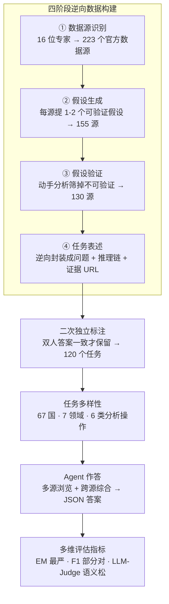

# A Benchmark for Deep Information Synthesis (DeepSynth)

**会议**: ICLR 2026  
**arXiv**: [2602.21143](https://arxiv.org/abs/2602.21143)  
**代码**: 有（公开数据和代码）  
**领域**: Agent  
**关键词**: benchmark, information synthesis, deep research, multi-source reasoning, agent evaluation

## 一句话总结
提出 DeepSynth 基准，包含 120 个跨 7 领域 67 国的真实信息综合任务（平均需 5.5 小时人工标注），要求 agent 从多个网页收集信息并进行结构化推理，当前最强 agent（o3-deep-research）仅获 8.97 F1 / 17.5% LLM-Judge，揭示了 LLM agent 在信息综合方面的严重不足。

## 研究背景与动机
**领域现状**：LLM agent 在工具使用（网页浏览、代码执行、数据分析）方面快速进步，但现有基准主要评估浅层事实检索或单源信息查找。

**现有痛点**：现有 benchmark 存在三个问题：(1) 多为浅层检索任务（如 GAIA），不需要跨源综合；(2) 多依赖英文和 Wikipedia 等知名单一来源；(3) 未覆盖全球多样性的信息源和语言。

**核心矛盾**：真实世界的信息综合任务需要跨多个数据源收集结构化/非结构化数据，并进行复杂分析（趋势检测、相关性分析、异常检测等），现有 benchmark 无法评估这些能力。

**本文目标** 构建一个评估 agent 深度信息综合能力的基准——任务答案不可直接检索，必须通过多步推理和跨源综合才能得到。

**切入角度**：从真实场景出发（16 位专家，每个任务平均 5.5 小时标注），先选数据源→提假设→验证分析→出题，确保答案不可记忆且需要真正综合推理。

**核心 idea**：构建一个需要"深度研究"能力的真实基准，揭示当前 agent 在信息综合上的巨大差距。

## 方法详解

### 整体框架
这是一篇 benchmark 论文，不提新方法，核心贡献是 DeepSynth 这套数据集本身——120 个任务的设计、专家标注流程，以及对 11 个现有 agent 的全面评估。它要解决的是"现有基准只考浅层事实检索、考不出 agent 跨源综合能力"这个评估缺口。整条流水线可以拆成两段：**建题**——16 位专家从 223 个真实官方数据源出发，提假设、动手分析、再把分析链逆向封装成题，经层层筛选（223 源 → 155 源 → 130 源 → 120 题）并二次独立标注，得到 120 道答案"搜不到、只能综合出来"的题；**考试**——让各家 agent 多源浏览、跨源推理产出一份 JSON 答案，再用 EM / F1 / LLM-Judge 三把松紧不同的尺子去量。每道题的固定构成是：一道问题（平均 78.5 tokens）、一串金标准中间推理步骤（平均 7.54 步）、支撑这些步骤的证据 URL（平均需翻 4.2 个网页），以及一个 JSON 标准答案。

### 关键设计

**1. 四阶段逆向数据构建：让答案"搜不到、只能综合出来"**

现有 benchmark 多是"先有答案再编问题"，结果题目往往一次检索就能命中，考不出真正的综合能力。本文反着来，由 16 位专家走四个阶段：数据源识别（提出 223 个跨 7 领域的官方数据源）→ 假设生成（为每源提 1-2 个可验证假设，筛到 155 源）→ 假设验证（动手分析、淘汰不可验证的，留下 130 源）→ 任务表述（把分析链逆向封装成问题 + 中间推理步骤 + 证据 URL + JSON 答案）。最后还要过一道二次独立标注——另一位标注者重新作答，两人答案完全一致的题才保留，最终得到 120 道题。这一逆向流程的关键在于：答案藏在多步分析的终点而非某个网页上，无法靠 verbatim lookup 或直接搜索拿到，agent 必须真的跨源收集再推理才能复现，从源头上保证了任务的抗记忆、抗污染性。代价是单题平均要花专家 5.5 小时，也正因如此规模只能停在 120 道。

**2. 任务多样性：在地域、领域、分析操作三个维度上撑开覆盖面**

为了不让 benchmark 偏向英语或西方语境，任务横跨 67 个国家、覆盖 7 个领域（社会经济、金融、环境、科学、教育、交通、政治）。在分析操作类型上也刻意铺开分布：计数比较 33.7%、趋势检测 20.9%、排名 19.8%、求平均 11.1%、相关性分析 7.0%、异常检测 7.0%（另有少量筛选类）。这种三维铺开既检验 agent 在 under-represented 数据源（如非洲地区）上的鲁棒性，也保证考的不是单一一种推理套路，而是真实信息综合里会碰到的各类操作。

**3. 多维评估指标：用三把松紧不同的尺子量同一份答案**

任务输出统一为 JSON 的 key-value 对，天然可自动验证，但单一指标会失真，所以本文叠了三层。EM（Exact Match）最严，要求所有 key 和 value 全部正确，答对一题才计 1，错一处即 0；F1 退到 key-value pair 粒度，统计"答对的对数 / 应答对数"，给出 precision / recall / F1，容许部分正确；LLM-Judge 最松，用 LLM-as-a-judge 判语义等价，对字符串小差异和 1–5.5% 的数值偏差也算对。三把尺子从严到松排开，既能看出 agent 是否真正精确，也能在它"方向对但细节差"时给出可区分的梯度，避免被 EM 一刀切到 0 而看不出差异。

## 实验关键数据

### 主实验

| 模型/Agent | F1 | EM | LLM-Judge |
|---|---|---|---|
| GPT-4.1 | 3.46 | 0.0 | 0.0 |
| GPT-5.1 | 3.83 | 0.0 | 0.0 |
| GPT-5.2-Pro | 8.70 | 6.25 | 6.67 |
| Gemini-2.5-Pro | 6.25 | 0.0 | 5.0 |
| DeepSeek-R1 | 3.23 | 1.67 | 2.5 |
| **o3-deep-research** | **8.97** | 2.50 | **17.5** |
| Smolagent (GPT-5) | 6.42 | 1.67 | 2.5 |
| OWL (GPT-4.1) | 5.41 | 1.67 | 12.5 |

### 消融实验（OWL 工具消融）

| 配置 | F1 | 说明 |
|------|-----|------|
| Full | 5.41 | 完整工具链 |
| - Search | 3.60 | 搜索是最关键能力，去掉后降 1.81 |
| - Web Browsing | 4.80 | 浏览能力也重要 |
| - Doc Processing | 4.90 | 文档处理影响较小 |
| - Code Execution | 4.82 | 代码执行也有贡献 |

### 关键发现
- **所有模型在 EM 上接近 0**：没有模型能完美解决任何一个任务，说明 benchmark 极具挑战性
- 推理模型（o3、R1）vs 通用 LLM（GPT-4.1）的 F1 差距很小，说明**瓶颈在信息获取而非推理本身**
- 工具增强有帮助但远不够：o3-deep-research 比 base o3 高 5.68 F1，但仍然只有 ~9 分
- Best-of-5 能提升到 25% LLM-Judge，但 Self-Consistency@5 只有 5%——agent 输出方差极大，偶尔对但无法稳定
- 非洲地区相关任务的表现显著下降，暴露了模型在 under-represented 数据源上的弱点

## 亮点与洞察
- **揭示了一个重要盲区**：当前 "deep research" agent 的信息综合能力远未达到实用水平，120 个任务中最好的 agent 只能可靠解决 3 个
- **数据构建方法很值得学习**：先分析再出题、双人验证、每题 5.5 小时标注的精细流程，确保了 benchmark 的高质量和抗污染性
- **瓶颈诊断有价值**：通过对比有/无工具的表现，明确指出信息获取（而非推理）是当前主要瓶颈

## 局限与展望
- 120 个任务的规模偏小，可能不够覆盖所有信息综合场景
- 评估主要用 JSON 精确匹配，限制了对开放式回答的评估能力
- 标注依赖 16 位特定领域专家，可能引入标注者偏差
- 未评估 agent 使用搜索引擎 API 的能力（主要测试网页浏览）

## 相关工作与启发
- **vs GAIA**: GAIA 是通用 AI assistant 评估，DeepSynth 专注于信息综合的深度推理，更接近真实 deep research 场景
- **vs BrowseComp**: BrowseComp 侧重信息检索难度，DeepSynth 更强调跨源综合分析
- **vs FRAMES**: FRAMES 是事实核查+多跳检索，DeepSynth 需要额外的分析和结构化输出

## 补充讨论

### Deep Information Synthesis 与 RAG 的区别
RAG 主要关注信息检索和组合，而 Deep Information Synthesis 要求模型进行多步推理、跨源验证和数据整合。这个区别很重要——现有 RAG benchmark 无法评估 agent 的“深度综合”能力。

## 评分
- 新颖性: ⭐⭐⭐⭐ 首个系统性评估 deep information synthesis 的 benchmark
- 实验充分度: ⭐⭐⭐⭐⭐ 11 个模型/agent、多维指标、工具消融、Best-of-N 分析
- 写作质量: ⭐⭐⭐⭐ 结构清晰，数据构建过程描述详尽
- 价值: ⭐⭐⭐⭐ 为 deep research agent 发展指明了方向和差距

<!-- RELATED:START -->

## 相关论文

- [\[ICLR 2026\] ST-WebAgentBench: A Benchmark for Evaluating Safety and Trustworthiness in Web Agents](st-webagentbench_a_benchmark_for_evaluating_safety_and_trustworthiness_in_web_ag.md)
- [\[ICLR 2026\] FingerTip 20K: A Benchmark for Proactive and Personalized Mobile LLM Agents](fingertip_20k_a_benchmark_for_proactive_and_personalized_mobile_llm_agents.md)
- [\[ICLR 2026\] SimuHome: A Temporal- and Environment-Aware Benchmark for Smart Home LLM Agents](simuhome_a_temporal-_and_environment-aware_benchmark_for_smart_home_llm_agents.md)
- [\[ICML 2026\] Probabilistic Modeling of Latent Agentic Substructures in Deep Neural Networks](../../ICML2026/llm_agent/probabilistic_modeling_of_latent_agentic_substructures_in_deep_neural_networks.md)
- [\[AAAI 2026\] SoMe: A Realistic Benchmark for LLM-based Social Media Agents](../../AAAI2026/llm_agent/some_a_realistic_benchmark_for_llm-based_social_media_agents.md)

<!-- RELATED:END -->
