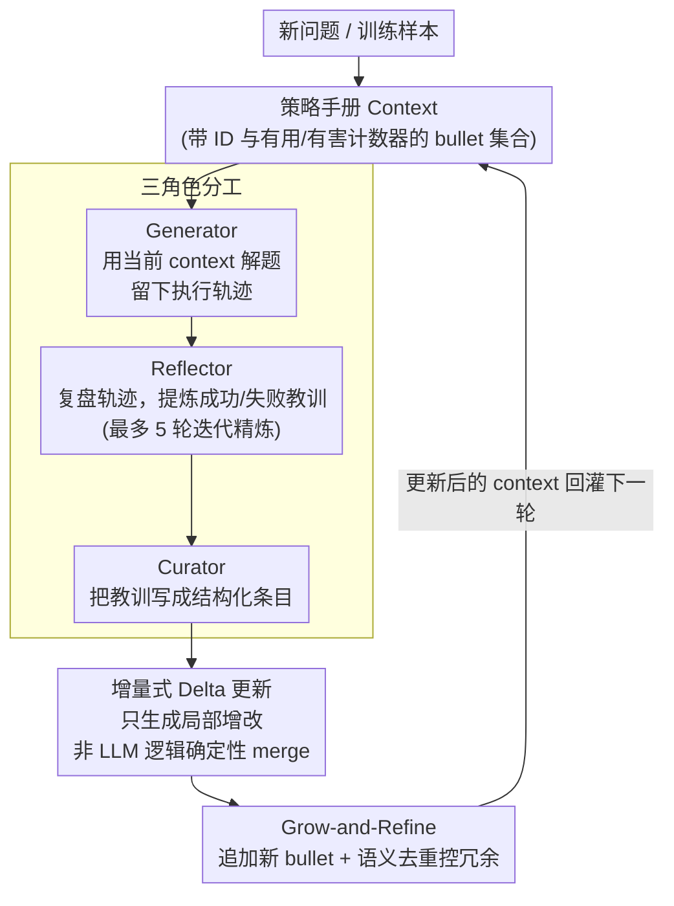

# Agentic Context Engineering: Evolving Contexts for Self-Improving Language Models

**会议**: ICLR 2026  
**arXiv**: [2510.04618](https://arxiv.org/abs/2510.04618)  
**代码**: [https://github.com/ace-agent/ace](https://github.com/ace-agent/ace)  
**领域**: Agent  
**关键词**: context engineering, self-improving agent, prompt optimization, evolving memory, playbook  

## 一句话总结
提出 ACE（Agentic Context Engineering）框架，将 context 视为不断演化的"策略手册"（playbook），通过 Generator-Reflector-Curator 三角色分工和增量式 delta 更新来持续积累和精炼策略，解决了现有 prompt 优化中的简洁偏差和上下文坍塌问题，在 agent 任务上平均提升 10.6%、金融任务提升 8.6%，且自适应延迟降低 86.9%。

## 研究背景与动机
**领域现状**：Context adaptation（通过修改 LLM 输入而非权重来改进性能）已成为构建可伸缩 AI 系统的核心范式。现有方法包括 prompt optimization（GEPA、MIPROv2）、test-time memory（Dynamic Cheatsheet）等。

**现有痛点**：(1) **简洁偏差（brevity bias）**：多数 prompt 优化器追求简洁通用的指令，压缩掉了领域特定的策略、工具使用指南和常见失败模式；(2) **上下文坍塌（context collapse）**：单体重写方式在迭代过程中逐渐退化为更短、信息更少的摘要——实验中观察到 context 从 18282 token 突然坍塌到 122 token，性能随之骤降。

**核心矛盾**：agent 和知识密集应用需要**全面详尽的**领域知识，但现有方法却在压缩知识。LLM 与人不同——人受益于简洁概括，LLM 反而在详尽 context 下表现更好。

**本文目标** 如何构建一种 context 适配方法，既能持续积累知识又不会坍塌退化？

**切入角度**：将 context 视为"evolving playbook"而非"optimized prompt"，用结构化的增量更新替代整体重写。

**核心 idea**：context 应该是持续增长和精炼的策略手册，而非压缩后的简洁指令。

## 方法详解

### 整体框架
ACE 要解决的是 context 在反复迭代中越改越短、知识被压没的问题。它把 context 当成一本会不断变厚的"策略手册"（playbook），让三个角色流水线作业来维护它：Generator 拿当前 context 去解新问题，留下完整的执行轨迹；Reflector 读这些轨迹，把哪些做法成功、哪些踩了坑提炼成具体教训；Curator 再把教训翻译成结构化的局部改动（delta），追加或修改进现有 context；改完的手册回灌给下一轮，形成持续自我改进的闭环。整套流程既能离线跑（在训练集上反复迭代，产出一份优化好的 system prompt），也能在线跑（测试时逐样本更新，当作 test-time memory 用）。

### 关键设计

**1. 三角色分工：把"解题、反思、归档"拆开，避免单模型瓶颈**

现有方法常把生成、评估、改写全压在一个模型一次调用里，反思不充分、责任也纠缠。ACE 把它拆成三步专门化的角色：Generator 负责用当前 context 实际解题、暴露出真实的成功与失败轨迹；Reflector 专门做"复盘"，从轨迹里抽出可操作的策略和失败教训，而且这一步可以多轮迭代地精炼洞察（最多 5 轮），让教训越来越准；Curator 只管把洞察落成结构化条目并并入 context。这样每个环节都能专注做好一件事，消融实验也确认单独引入 Reflector 角色是性能提升的关键来源。

**2. 增量式 Delta 更新：只改局部 bullet，从根上杜绝 context collapse**

这是针对"单体重写导致上下文坍塌"痛点的核心设计。ACE 不把 context 写成一段会被整体重写的文字，而是表示为一组带结构的 bullet——每个 bullet 有唯一 ID、一对"有用/有害"计数器和具体内容。每次适配时，模型只生成少量 delta（新增 bullet，或对已有 bullet 的局部修改），再由一套轻量的非 LLM 逻辑确定性地 merge 进去，整个过程还能并行处理。因为系统从不执行全文重写，知识就只能被追加或就地微调，绝不会在某次迭代里被意外压成一句摘要——论文里观察到的"18282 token 突然坍塌到 122 token"那类退化，在这种增删改模型下结构上就不可能发生。这也是适配延迟能降低 86.9% 的原因：局部 delta 比整篇重写便宜得多。

**3. Grow-and-Refine：在持续增长和控制冗余之间维持平衡**

光做加法，context 早晚会膨胀到超出窗口。Grow-and-Refine 给增长配了个清理机制：新 bullet 追加到末尾，命中的已有 bullet 就地更新（比如把计数器加一），同时用语义嵌入两两比对来去重（de-duplication），剔除内容重复的条目。去重既可以在每次 delta 之后主动执行，也可以等 context 快超出窗口时再懒惰触发。靠这套机制，手册能一直长大却不会无界膨胀，规模始终可控。

### 损失函数 / 训练策略
ACE 不训练任何模型权重，是纯粹的 context adaptation 方法。离线模式下在训练集上跑多个 epoch（最多 5 个）迭代构建 context，在线模式下在测试时逐样本更新，batch size 取 1，Reflector 单次最多精炼 5 轮。一个值得强调的点是它无需标注也能工作——只要有执行反馈（比如代码跑通还是报错）这种天然信号，Reflector 就能据此提炼教训，从而实现无监督的自我改进。

## 实验关键数据

### 主实验（AppWorld Agent Benchmark）

| 方法 | 需要标注 | Test-Normal TGC | Test-Challenge TGC | Average |
|------|---------|----------------|-------------------|---------|
| ReAct baseline | - | 63.7 | 41.5 | 42.4 |
| + ICL | ✓ | 64.3 | 46.0 | 46.0 |
| + GEPA | ✓ | 64.9 | 46.0 | 46.4 |
| **+ ACE (有标注)** | ✓ | **76.2** | **57.3** | **59.4** |
| + ACE (无标注) | ✗ | 75.0 | 54.4 | 57.2 |
| + DC (online) | ✗ | 65.5 | 52.3 | 51.9 |
| **+ ACE (online)** | ✗ | **69.6** | **66.0** | **59.5** |

### 消融实验（金融 benchmark）

| 方法 | FiNER Acc | Formula Acc | Average |
|------|-----------|-------------|---------|
| Base LLM | 70.7 | 67.5 | 69.1 |
| GEPA | 73.5 | 71.5 | 72.5 |
| **ACE** | **78.3** | **85.5** | **81.9** |

### 关键发现
- ACE 在 AppWorld 上平均提升 17%（offline 有标注），在排行榜上用开源模型 DeepSeek-V3.1 达到了 GPT-4.1 驱动的 IBM CUGA（排行榜第一）的平均水平，且在 harder test-challenge split 上超过了它
- **无标注也很强**：ACE 在无标注模式下仍提升 14.8%，利用执行反馈即可自我改进
- 金融任务上 ACE 比 GEPA 高 9.4%（72.5→81.9），暴力积累领域知识的策略在知识密集型任务上优势明显
- 适配延迟降低 86.9%：增量 delta 更新比整体重写快得多
- 消融实验确认 Reflector 角色和多 epoch 精炼各自贡献了显著提升

## 亮点与洞察
- **"playbook 而非 prompt"的理念转变**：context 不应被压缩，而应被持续充实。这与 RAG、long-context 等趋势一致，为 context engineering 提供了清晰的设计哲学
- **增量 delta 更新是关键创新**：彻底杜绝了 context collapse，且可并行 merge，是一个简单但极其有效的工程设计
- **无监督自改进能力**：仅靠执行反馈就能构建有效 context，为真正的 self-improving agent 铺平道路
- **三角色分工模式可复用**：Generator-Reflector-Curator 的模式可以迁移到其他需要从经验中学习的 LLM 系统

## 局限与展望
- 随着 bullet 数量增长，context 可能超出 context window，需要更智能的检索或压缩策略
- 去重依赖语义嵌入的质量，相似但不完全重复的 bullet 可能积累
- Generator/Reflector/Curator 强制使用同一模型，限制了利用不同大小模型优化成本的灵活性
- 在线模式下的顺序依赖（先见到的样本影响后续 context）是否引入偏差未深入分析

## 相关工作与启发
- **vs Dynamic Cheatsheet**: ACE 建立在 DC 之上但解决了其 context collapse 问题，引入了 Reflector 和 delta 更新机制
- **vs GEPA**: GEPA 是 prompt 优化器（追求简洁 prompt），ACE 是 context 工程（追求全面 playbook），理念不同，ACE 在 agent 和金融任务上都显著优于 GEPA
- **vs TextGrad**: TextGrad 使用梯度式文本反馈优化 prompt，ACE 用结构化 bullet 积累策略，避免了重写带来的信息损失

## 补充讨论

### 为什么 Context Engineering 比 Prompt Engineering 更重要？
Prompt Engineering 是静态的——一旦写好 system prompt 就固定不变。Context Engineering 是动态的——根据 agent 的运行经验持续演化上下文，更符合真实 agent 在复杂环境中的需求。Playbook 的 delta 更新机制是这一理念的具体实现。

## 评分
- 新颖性: ⭐⭐⭐⭐ "evolving playbook" 理念和 delta 更新设计有实际创新
- 实验充分度: ⭐⭐⭐⭐⭐ 两类 benchmark、多基线、消融完善、排行榜对比
- 写作质量: ⭐⭐⭐⭐⭐ 动机清晰，概念有说服力，叙事流畅
- 价值: ⭐⭐⭐⭐⭐ context engineering 方向的重要工作，实用性极强

<!-- RELATED:START -->

## 相关论文

- [\[CVPR 2026\] Resolving Evidence Sparsity: Agentic Context Engineering for Long-Document Understanding](../../CVPR2026/llm_agent/resolving_evidence_sparsity_agentic_context_engineering_for_long-document_unders.md)
- [\[ICLR 2026\] InfiAgent: Self-Evolving Pyramid Agent Framework for Infinite Scenarios](infiagent_self-evolving_pyramid_agent_framework_for_infinite_scenarios.md)
- [\[ICLR 2026\] Your Agent May Misevolve: Emergent Risks in Self-evolving LLM Agents](your_agent_may_misevolve_emergent_risks_in_self-evolving_llm_agents.md)
- [\[ACL 2026\] AnchorMem: Anchored Facts with Associative Contexts for Building Memory in Large Language Models](../../ACL2026/llm_agent/anchormem_anchored_facts_with_associative_contexts_for_building_memory_in_large_.md)
- [\[ICLR 2026\] CoMind: Towards Community-Driven Agents for Machine Learning Engineering](comind_towards_community-driven_agents_for_machine_learning_engineering.md)

<!-- RELATED:END -->
