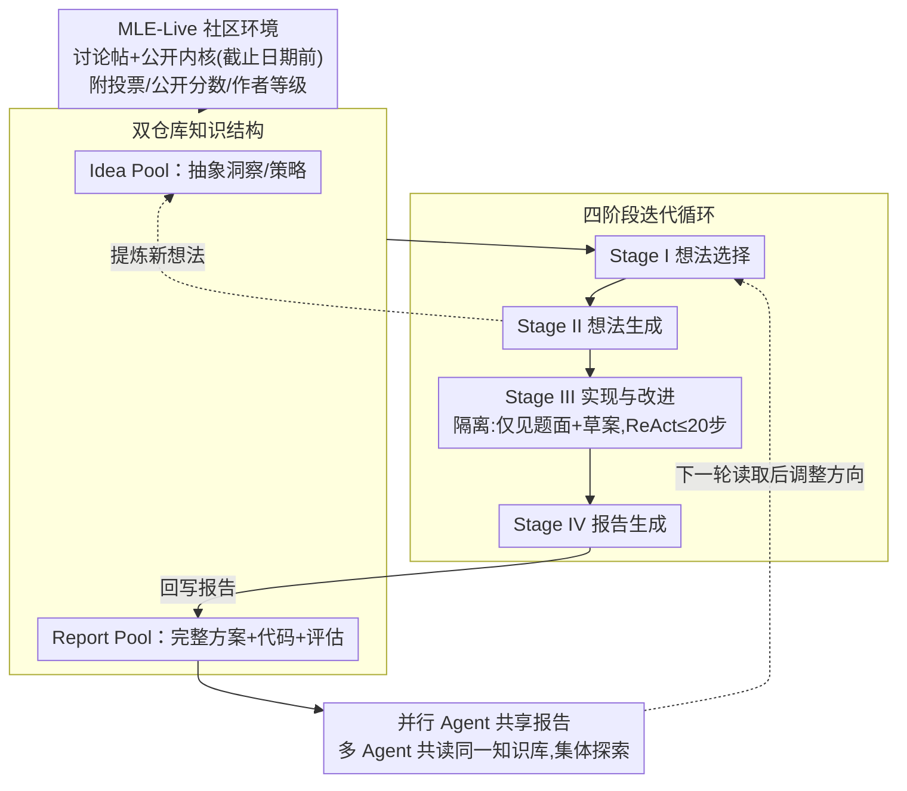

# CoMind: Towards Community-Driven Agents for Machine Learning Engineering

**会议**: ICLR 2026  
**arXiv**: [2506.20640](https://arxiv.org/abs/2506.20640)  
**代码**: [https://github.com/comind-ml/CoMind](https://github.com/comind-ml/CoMind)  
**领域**: LLM Agent  
**关键词**: LLM Agent, 机器学习工程, Kaggle竞赛, 社区知识, 多智能体协作

## 一句话总结
提出MLE-Live——首个模拟Kaggle研究社区的实时评估框架，以及CoMind——一个能够系统性利用社区集体知识的多智能体ML工程系统，在75个历史Kaggle竞赛中获得36%奖牌率，并在4个进行中的竞赛中平均超越79.2%的人类参赛者（更新版本中达到92.6%）。

## 研究背景与动机
基于LLM的ML Agent已展现出自动化ML工程的巨大潜力。MLAB采用ReAct风格的结构化决策，AIDE利用树搜索探索，AutoKaggle引入多Agent专业化分工。这些系统已在Kaggle风格竞赛上取得进展。

**核心矛盾**：现有Agent在**孤立环境**中运行——仅依赖内部记忆和试错探索，完全忽略了现实ML工作流中至关重要的成分：**社区知识共享**。在真实的数据科学竞赛和研究中，参与者频繁从公开讨论、共享笔记本和社区洞察中学习。当前Agent因无法利用这种动态外部上下文，往往收敛到重复策略并在性能上遇到瓶颈。

**两个关键问题**：
1. 如何评估Agent利用集体知识的能力？（→ MLE-Live基准）
2. 如何设计能有效利用社区知识的Agent？（→ CoMind系统）

## 方法详解

### 整体框架
本文一手做评估、一手做系统。评估侧的 MLE-Live 在 MLE-Bench 基础上为每个竞赛挂一个模拟的 Kaggle 社区，让 Agent 能读到截止日期前的讨论帖和公开内核，从而把"会不会用集体知识"变成可量化的考题；系统侧的 CoMind 是一个多 Agent 系统，靠 Idea Pool 与 Report Pool 两个共享仓库，把研究者"浏览社区 → 综合想法 → 编码实现 → 回写报告"的工作流拆成四阶段循环反复迭代。多个 Agent 并行跑同一任务、共读同一套知识库，使集体智慧而非单纯试错成为性能来源。

### 关键设计

**1. MLE-Live 社区环境：把"集体知识"做成可评测的外部上下文**

现有 Agent 在孤立沙盒里只靠内部记忆和试错，根本无从检验"会不会用社区知识"。MLE-Live 为 22 个低复杂度竞赛收集了 2,687 个讨论帖和 4,270 个公开内核，并为每条内容附上质量信号——投票数（社区偏好）、公开分数（性能）、作者等级（Novice 到 Grandmaster），供 Agent 判断该信任谁。为避免事后泄漏，所有内容严格限定在竞赛截止日期前发布，并过滤掉图片、截图等非文本内容以及进度条、冗余日志等 Jupyter 系统输出。评测沿用四项指标：Valid Submission（提交格式正确率）、Above Median（超过中位数的比例）、Win Rate（击败的人类参赛者百分比）、Medals（金/银/铜牌），使"会用社区知识"能直接体现在排名上。

**2. 双仓库知识结构：把抽象洞察与完整方案分开存放**

单一记忆里既塞策略又塞代码，会让检索和复用都变混乱。CoMind 显式维护两个仓库：Idea Pool 存从社区内容和历史迭代中提炼的抽象洞察（概念、策略层面），Report Pool 存包含代码、评估和分析的完整解决方案报告。前者负责"想法层"的发散，后者负责"实现层"的沉淀与相关性评估；两者跨迭代不断增长，形成日益丰富的知识基础，也是并行 Agent 之间共享的载体。

**3. 四阶段迭代循环：复刻研究者"先看再想再做再记"的节奏**

每轮迭代依次走四个阶段。Stage I 想法选择：访问 Idea Pool 中从公开内核、论坛讨论和历史方案提炼的条目，并以 Report Pool 的性能与相关性作为排序筛选依据，模拟人在形成假设前先浏览集体智慧。Stage II 想法生成：基于选定想法和 Report Pool 上下文产出高层解决方案草案，通过重组或扩展已有想法来综合新策略，并刻意约束避免简单复制以保证概念多样性。Stage III 实现与改进：基于草案启动 ReAct 风格循环，迭代编写代码、执行、观察验证指标与错误日志、更新实现，最多 20 步。

这里有一个关键的取舍——Stage III 被刻意做成**上下文隔离**的：如果实现阶段还能随时翻看整个 Idea Pool 和 Report Pool，上下文窗口会迅速膨胀、注意力被无关信息稀释，于是 CoMind 只让它访问问题描述和当前这一份草案，屏蔽两个知识池。这既保证了每份草案的独立性与实验模块性，又把"探索广度"收束到一次"实现深度"上：系统同时维护多个并行发展的草案，但每次只动态聚焦一个深挖。最后 Stage IV 报告生成：把方法描述、组件分析、定量结果、局限性评估编译成报告回写 Report Pool，对后续迭代可见——这一步让单个 Agent 的成果变成全体可读的共享资产。

**4. 并行 Agent 共享报告：让集体探索而非单点试错驱动改进**

多个 Agent 在同一任务上并行运行、共读同一社区知识库，某个 Agent 在 Stage IV 回写新报告后，其他 Agent 在后续迭代即可读取并据此调整方向。Agent 之间不靠复杂消息协议，仅通过 Report Pool 这一共享层互相启发，就能形成集体探索与持续改进——这也是 CoMind 在长时间运行下能持续爬升、最终反超那些早早进入平台期方法的原因。

### 一个完整示例
以一次图像分类竞赛迭代为例：Stage I 从 Idea Pool 里读到社区高票内核提到的"EfficientNet + 测试时增强"，并发现 Report Pool 中相关方案得分较高，于是选中该方向；Stage II 把它与历史报告里的"标签平滑"重组，写出一份高层草案，但避免直接照抄某个公开方案；Stage III 进入隔离环境，只拿着草案和题面，在 ReAct 循环里写代码、跑验证、读到一条显存溢出日志后调小 batch、再提交，20 步内拿到验证分；Stage IV 把这套方法、消融与不足写成报告回写 Report Pool。与此同时另一个并行 Agent 读到这份报告，下一轮便改去尝试模型集成，从而把整体探索推向新区域。

## 实验关键数据

### 主实验（20个历史Kaggle竞赛，使用o4-mini）

| 方法 | Valid Sub. | Win Rate | Any Medal | Above Median | Medal详情 |
|------|-----------|----------|-----------|-------------|----------|
| CoMind | **1.00** | **66.8%** | **45%** | **65%** | 5金4银 |
| AIDE | 0.90 | 46.9% | 20% | 50% | - |
| AIDE+Code | 0.90 | 51.0% | 25% | 50% | - |
| AIDE+RAG | 0.95 | 51.2% | 25% | 55% | - |

CoMind获得9枚奖牌（5金），相对此前SOTA AIDE提升125%。

### 在线竞赛结果（4个进行中的Kaggle竞赛）

| 竞赛 | CoMind WR | AIDE WR | CoMind排名 |
|------|-----------|---------|-----------|
| playground-series-s5e5 | **94.9%** | 66.2% | #120/2338 |
| forams-classification-2025 | **91.7%** | 69.4% | #4/48 |
| el-hackathon-2025 | **61.6%** | 8.5% | #128/333 |
| fathomnet-2025 (CVPR FGVC12) | **69.4%** | 28.6% | #15/47 |

### 按任务类别Win Rate

| 类别 | CoMind | AIDE | AIDE+Code | AIDE+RAG |
|------|--------|------|-----------|----------|
| Image Classification (8) | **59.7%** | 45.9% | 43.4% | 52.5% |
| Text Classification (3) | **74.0%** | 15.7% | 33.8% | 61.0% |
| Audio Classification (1) | **90.1%** | 27.2% | 25.9% | 27.1% |
| Tabular (4) | 66.4% | 67.3% | **68.8%** | 48.3% |
| Image Regression (1) | 99.2% | 34.2% | **99.2%** | 99.2% |

### 消融实验

| 配置 | Valid Sub. | Win Rate | Any Medal |
|------|-----------|----------|-----------|
| CoMind w/ 公共资源 | **1.00** | **66.8%** | **45%** |
| CoMind w/o 公共资源 | 0.90 | 54.5% | 35% |

### 关键发现
- **社区知识至关重要**：不使用公共资源时Win Rate下降12.3%，Valid Submission下降10%，说明社区知识不仅提升质量，还为基线可靠性提供保障
- **持续改进能力**：AIDE在前2小时快速上升后趋于平台期，而CoMind持续改进最终超越
- **代码复杂度更高**：CoMind生成的代码平均比AIDE长55.4%，暗示更深度的推理和更丰富的优化技术
- **新颖性评估**：排除外部想法后，CoMind的平均新颖性排名1.20（vs AIDE的3.05），证明其不是简单复制社区方案
- CoMind在Seq2Seq任务上表现较弱，因为其倾向于探索大模型微调策略，常无法在1小时运行时限内完成

## 亮点与洞察
- **"社区意识"的创新概念**：首次将数据科学竞赛中的社区协作动态引入LLM Agent评估，填补了"孤立Agent"与"真实研究实践"之间的巨大gap
- **四阶段迭代循环设计**：想法选择→想法生成→实现→报告的流程非常贴近真实研究者的工作模式
- **刻意限制Stage III的上下文**：既防止信息过载导致的LLM性能下降，又确保每个解决方案草案的独立性——这一设计insight值得学习
- **活跃竞赛的真实验证**：在进行中的Kaggle竞赛上提交真实成绩，大幅增强了说服力
- **MLE-Live基准的价值**：为社区驱动的Agent研究提供了标准化评估平台

## 局限与展望
- 当前仅支持报告级别的交互，缺乏评论、提问、数据/模型共享等更精细的社区互动方式
- 在需要大模型微调的任务（如Seq2Seq）上受限于运行时间约束
- 仅在Kaggle风格ML竞赛上验证，未扩展到更广泛的科学发现、开放编程或机器人等领域
- Agent的"创新"可能仍受限于LLM backbone的知识范围
- 多Agent并行的通信和协调机制相对简单（仅通过Report Pool），未探索更丰富的消息传递协议
- 代码执行环境受限（单个A6000 GPU，5小时总限），可能低估了计算密集型方案的潜力

## 相关工作与启发
- **AIDE**（Jiang et al., 2025）：基于树搜索的ML Agent，MLE-Bench上此前最强方法
- **MLAB**（Huang et al., 2024）：ReAct风格的ML Agent基准
- **MLE-Bench**（Chan et al., 2025）：基于75个Kaggle竞赛的ML Agent评估基准
- **AutoKaggle**（Li et al., 2024）：多Agent系统的MLE方案
- **MetaGPT**（Hong et al., 2023）：通用多Agent协作框架
- 启发：Agent不应只依赖内部推理和试错——利用外部"集体智慧"是提升Agent能力的关键维度。这一思路可能推广到科学发现、软件工程等需要社区协作的其他领域

## 评分
- 新颖性: ⭐⭐⭐⭐⭐ （社区驱动Agent + MLE-Live基准 = 全新研究方向）
- 实验充分度: ⭐⭐⭐⭐⭐ （20个历史竞赛 + 4个活跃竞赛 + 新颖性评估 + 消融 + 代码复杂度分析）
- 写作质量: ⭐⭐⭐⭐ （结构清晰，但部分实验数据的呈现可以更紧凑）
- 价值: ⭐⭐⭐⭐⭐ （开辟社区感知Agent新方向，对Data Science自动化有重大意义）

<!-- RELATED:START -->

## 相关论文

- [\[ICLR 2026\] Agentic Context Engineering: Evolving Contexts for Self-Improving Language Models](agentic_context_engineering_evolving_contexts_for_self-improving_language_models.md)
- [\[NeurIPS 2025\] MLRC-Bench: Can Language Agents Solve Machine Learning Research Challenges?](../../NeurIPS2025/llm_agent/mlrc-bench_can_language_agents_solve_machine_learning_research_challenges.md)
- [\[ICLR 2026\] Solving the Granularity Mismatch: Hierarchical Preference Learning for Long-Horizon LLM Agents](solving_the_granularity_mismatch_hierarchical_preference_learning_for_long-horiz.md)
- [\[AAAI 2026\] Reflection-Driven Control for Trustworthy Code Agents](../../AAAI2026/llm_agent/reflection-driven_control_for_trustworthy_code_agents.md)
- [\[CVPR 2026\] Resolving Evidence Sparsity: Agentic Context Engineering for Long-Document Understanding](../../CVPR2026/llm_agent/resolving_evidence_sparsity_agentic_context_engineering_for_long-document_unders.md)

<!-- RELATED:END -->
