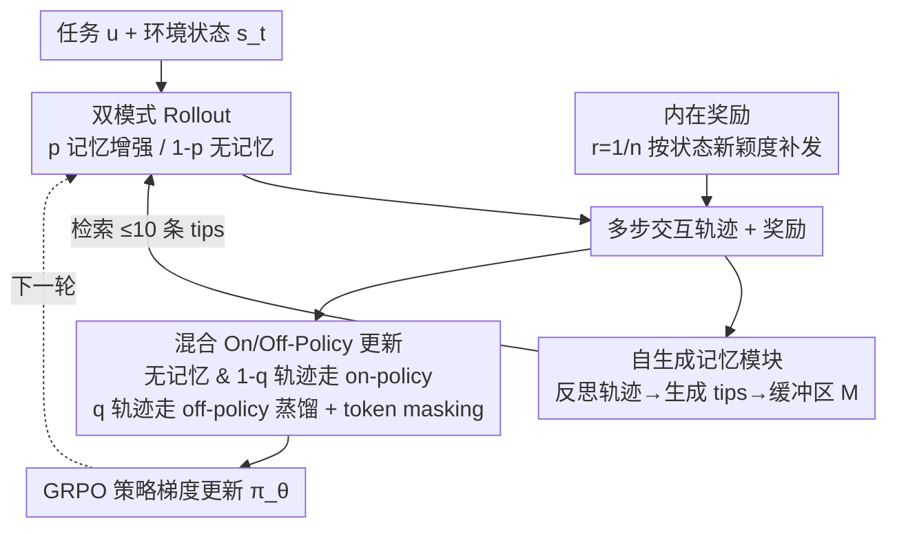

# Exploratory Memory-Augmented LLM Agent via Hybrid On- and Off-Policy Optimization

**会议**: ICLR 2026  
**arXiv**: [2602.23008](https://arxiv.org/abs/2602.23008)  
**代码**: [https://github.com/agent-lightning/empo2](https://github.com/agent-lightning/empo2)  
**领域**: Agent  
**关键词**: LLM Agent, 强化学习, 探索, 外部记忆, 混合策略优化

## 一句话总结
提出 EMPO2，一种结合外部记忆模块与混合 on-policy/off-policy 更新的 RL 框架，通过记忆引导探索和知识蒸馏将探索收益内化到模型参数中，在 ScienceWorld 和 WebShop 上分别比 GRPO 提升 128.6% 和 11.3%。

## 研究背景与动机

**领域现状**：LLM Agent 通过强化学习（如 GRPO）在交互式环境中学习决策，但核心瓶颈在于**探索不足**——Agent 过度依赖预训练知识，难以发现需要主动搜寻的新状态。

**现有痛点**：(a) 纯参数更新的 RL（如 GRPO）在需要长期探索的任务中过早收敛到次优解；(b) 非参数方法（如 Reflexion）通过反思记忆改善决策，但固定参数下性能快速饱和，无法持续进步；(c) 离线 RL 和 SFT 方法依赖大量专家轨迹或 GPT-4 等外部资源。

**核心矛盾**：参数更新能内化知识但缺乏探索动力；外部记忆能促进探索但无法扩展内在能力。二者各有局限，缺乏统一框架。

**本文目标** 如何在 online RL 中让 LLM Agent 自主探索新环境，同时将探索获得的经验内化为模型参数？

**切入角度**：非参数记忆更新可以引导（bootstrap）参数更新——Agent 先通过记忆探索获得高质量轨迹，再通过 off-policy 更新将这些知识蒸馏到无记忆条件下的策略中。

**核心 idea**：用自生成的记忆 tips 作为探索脚手架，通过混合 on/off-policy 更新将记忆增强的探索能力渐进式地内化到模型权重中。

## 方法详解

### 整体框架
EMPO2 想解决的是 online RL 里 LLM Agent「探索不动」的死结：纯参数更新（GRPO）会过早收敛，纯记忆方法（Reflexion）又因权重冻结而很快饱和。它的破局点是把这两条路缝在一起——让 Agent 先借外部记忆探索出高质量轨迹，再把这份探索收益反过来蒸馏进模型参数，使得测试时即便不挂记忆也能复现探索出来的好行为。

整套流程是一个 GRPO 风格的策略梯度循环：输入任务描述 $u$ 与环境状态 $s_t$，Agent 在 **rollout 阶段**按概率在「记忆增强」与「无记忆」两种模式间采样、产出多步交互轨迹；每个 episode 结束后由当前策略反思轨迹、生成经验 tips 回填记忆缓冲区，供下一轮检索（构成探索的反馈回路），同时按状态新颖度补发内在奖励；进入 **update 阶段**，无记忆轨迹与一部分记忆轨迹走 on-policy 稳定更新，另一部分记忆轨迹走 off-policy 把「带 tips 的优秀行为」蒸馏进无 tips 的策略，最后用 GRPO 策略梯度更新 $\pi_\theta$ 并进入下一轮。

### 关键设计

**1. 自生成记忆模块：让记忆当探索脚手架而非终点**

针对「Agent 过度依赖预训练知识、发现不了需要主动搜寻的新状态」这个痛点，EMPO2 在每个 episode 结束后让当前策略 $\pi_\theta$ 反思刚走过的轨迹，按 $\text{tip}_i \sim \pi_\theta(s_t, u, \text{tip-generation prompt})$ 生成若干条经验 tips，存进记忆缓冲区 $\mathcal{M}$；下次决策时按嵌入空间的相似度检索，每步最多取 10 条最相关的 tips。与 Reflexion 的关键区别在于：这里 tips 不是最终用来做推理的成品，而是给后续参数更新提供探索引导的中间脚手架——它存在的意义是「先帮策略走到好状态」，最终要被内化掉，测试时不再依赖。

**2. 双模式 Rollout：一边采高质量轨迹，一边保住独立推理**

为了既享受记忆带来的探索增益、又不让策略变成「离了 tips 就不会走路」，rollout 阶段在每一步按概率切换两种模式：以概率 $p$ 走记忆增强模式 $a_{t+1} \sim \pi_\theta(\cdot \mid s_t, u, \text{tips}_t)$，以 $1-p$ 走普通模式 $a_{t+1} \sim \pi_\theta(\cdot \mid s_t, u)$。前者借检索到的 tips 产出带探索成果的高质量轨迹，后者保留策略在无外援条件下的独立推理能力，两类轨迹一起进入后续更新。

**3. 混合 On/Off-Policy 更新：把记忆探索能力蒸馏回参数**

这是「先辅助后内化」落地的核心一步，也是论文标题里 hybrid on/off-policy 的所指。无记忆轨迹直接做 on-policy 更新；记忆增强的轨迹则在 update 阶段随机二选一——以概率 $q$ 走 off-policy、以 $1-q$ 走 on-policy。on-policy 时照常保留 tips 条件概率、保证学习稳定；off-policy 时把存下的 tips 条件对数概率 $\log\pi_\theta(a_t \mid s_t, u, \text{tips}_t)$ 替换成无 tips 概率 $\log\pi_\theta(a_t \mid s_t, u)$，即按「这个动作在没有 tips 时有多自然」来算优势。这一替换本质上是**奖励引导的知识蒸馏**：带 tips 的轨迹充当 teacher 示范，无 tips 的策略 $\pi_\theta(\cdot \mid s, u)$ 充当 student，高奖励轨迹（$\hat{A}_t > 0$）被强化、低奖励轨迹被抑制，于是策略被逼着在「没有 tips」的条件下复现「有 tips」时的优秀行为。teacher 与 student 共享同一套参数，记忆探索出来的能力就这样被转写进权重里。

不过 off-policy 替换条件概率会带来一个工程隐患：当 $\pi_\theta(a_t \mid s_t, u)$ 极低时，重要性采样比 $\rho$ 会被放大到爆炸，梯度法向、熵、KL、策略梯度项一起发散成 NaN、训练崩溃。EMPO2 用一个 **token masking** 兜住——在损失里乘指示函数 $\mathbf{1}_{\pi_\theta(a_t \mid s_t, u) \geq \delta}$，把策略概率低于阈值 $\delta$ 的不可靠 token 的优势项直接屏蔽掉、不让它们贡献梯度，从而稳住 off-policy 训练。

**4. 内在奖励：环境没奖励时也要逼着探索**

很多任务前期外在奖励稀疏甚至为零，Agent 容易躺平、过早收敛。EMPO2 额外维护一个状态记忆列表，每遇到新状态就和已存条目算余弦相似度，低于阈值才视为「新状态」加入列表并发放奖励。内在奖励定义为 $r_{\text{intrinsic}} = 1/n$，其中 $n$ 是与当前状态相似的历史状态数——越是没见过、相似计数越少的状态，奖励越高。这样即便外在奖励缺席，策略也有动力去触碰新状态、维持足够的策略熵，不至于过早收敛。

### 损失函数 / 训练策略
在 GRPO 的 clipped surrogate loss 上叠加 token masking 与 KL 正则化（$\rho_\theta^{(i,t)}$ 为重要性采样比、$\hat{A}_t^{(i)}$ 为组内相对优势、$\delta$ 为 token 屏蔽阈值）：
$$\mathcal{L} = \mathbb{E}\left[\frac{1}{NT}\sum_{i,t}\min\big(\rho_\theta^{(i,t)} A_t^{(i)},\ \text{clip}(\rho, 1-\epsilon, 1+\epsilon) A_t^{(i)}\big) \cdot \mathbf{1}_{\pi_\theta(a_t \mid s_t, u) \geq \delta}\right] - \beta\, D_{\text{KL}}(\pi_\theta \| \pi_{\text{ref}})$$

## 实验关键数据

### 主实验

**ScienceWorld** (19 任务，Qwen2.5-7B-Instruct):

| 方法 | 平均得分 | vs GRPO |
|------|---------|---------|
| Naive (零样本) | -61.3 | - |
| Reflexion (非参数) | 17.1 | - |
| Retrospex (离线 RL) | 33.8 | - |
| GRPO (在线 RL) | 33.2 | baseline |
| **EMPO2** | **75.9** | **+128.6%** |

**WebShop**:

| 方法 | Score | Success Rate |
|------|-------|-------------|
| GRPO | 79.3 | 66.1% |
| GiGPO w/o std | 86.2 | 75.2% |
| **EMPO2** | **88.3** | **76.9%** |

### 消融实验

| 配置 | 关键表现 | 说明 |
|------|---------|------|
| Full EMPO2 | 最高 | 三种模式完整 |
| w/o off-policy | 下降显著 | 去掉知识蒸馏后探索能力无法内化 |
| w/o on-policy w/ memory | 下降 | 去掉记忆增强on-policy后稳定性降低 |

### 关键发现
- 7/19 个 ScienceWorld 任务 EMPO2 达到满分 100，而 GRPO 最高仅 78.2
- Electricity 类任务提升最为显著（power-component: 15.1→94.3），因为这类任务探索需求最高
- OOD 实验中，EMPO2 仅需几步记忆试探即可适应新任务（平均提升 136%），GRPO 则表现不稳定
- Off-policy 和 on-policy with memory 两种模式互补：前者负责知识蒸馏，后者负责稳定学习

## 亮点与洞察
- **记忆作为探索脚手架**：不直接依赖记忆做推理，而是用记忆产生的高质量轨迹通过 off-policy 蒸馏到参数中，测试时不需要记忆。这个"先辅助后内化"的思路非常优雅。
- **Token masking 稳定 off-policy 训练**：简单但有效地解决了 LLM off-policy 训练中重要性采样比爆炸的问题，可迁移到其他 off-policy LLM 训练场景。
- **Few-shot 任务迁移**：训练后的模型获得了"用记忆探索"的元能力，在新任务上仅需几步就能适应，暗示 EMPO2 学到了通用的探索策略而非任务特定的模式。

## 局限与展望
- 仅在 Qwen2.5-7B 上验证，未测试更大模型或不同架构
- 记忆检索使用简单的余弦相似度，更先进的 RAG 机制可能进一步提升效果
- 仅在文本交互环境（ScienceWorld、WebShop）验证，未涉及数学推理、代码生成等场景
- Off-policy 更新依赖 importance sampling，可探索其他 off-policy 技术（如 V-trace）

## 相关工作与启发
- **vs Reflexion**: Reflexion 只做非参数更新（固定权重+记忆），EMPO2 将记忆探索与参数学习统一，突破了 Reflexion 的性能天花板
- **vs GRPO/GiGPO**: 这些方法只有参数更新没有记忆辅助探索，在需要发现新状态的任务中探索不足
- **vs 知识蒸馏**: 传统蒸馏是离线的 teacher→student，EMPO2 是在线的 self-distillation，teacher（有记忆的策略）和 student（无记忆的策略）共享参数

## 评分
- 新颖性: ⭐⭐⭐⭐ 记忆+混合策略优化的组合思路新颖，but 各组件单独看并不全新
- 实验充分度: ⭐⭐⭐⭐ 两个环境+消融+OOD 测试，但缺少更多 benchmark
- 写作质量: ⭐⭐⭐⭐ 动机清晰、图表丰富，数学表述规范
- 价值: ⭐⭐⭐⭐ 为 LLM Agent 的 RL 训练提供了切实可行的探索增强方案

<!-- RELATED:START -->

## 相关论文

- [\[ICLR 2026\] Harnessing Uncertainty: Entropy-Modulated Policy Gradients for Long-Horizon LLM Agents](harnessing_uncertainty_entropy-modulated_policy_gradients_for_long-horizon_llm_a.md)
- [\[ACL 2026\] Shopping Companion: A Memory-Augmented LLM Agent for Real-World E-Commerce Tasks](../../ACL2026/llm_agent/shopping_companion_a_memory-augmented_llm_agent_for_real-world_e-commerce_tasks.md)
- [\[ACL 2026\] SEARL: Joint Optimization of Policy and Tool Graph Memory for Self-Evolving Agents](../../ACL2026/llm_agent/searl_joint_optimization_of_policy_and_tool_graph_memory_for_self-evolving_agent.md)
- [\[NeurIPS 2025\] Group-in-Group Policy Optimization for LLM Agent Training](../../NeurIPS2025/llm_agent/groupingroup_policy_optimization_for_llm_agent_training.md)
- [\[CVPR 2026\] Universal Guideline-Driven Image Clustering via a Hybrid LLM Agent](../../CVPR2026/llm_agent/universal_guideline-driven_image_clustering_via_a_hybrid_llm_agent.md)

<!-- RELATED:END -->
