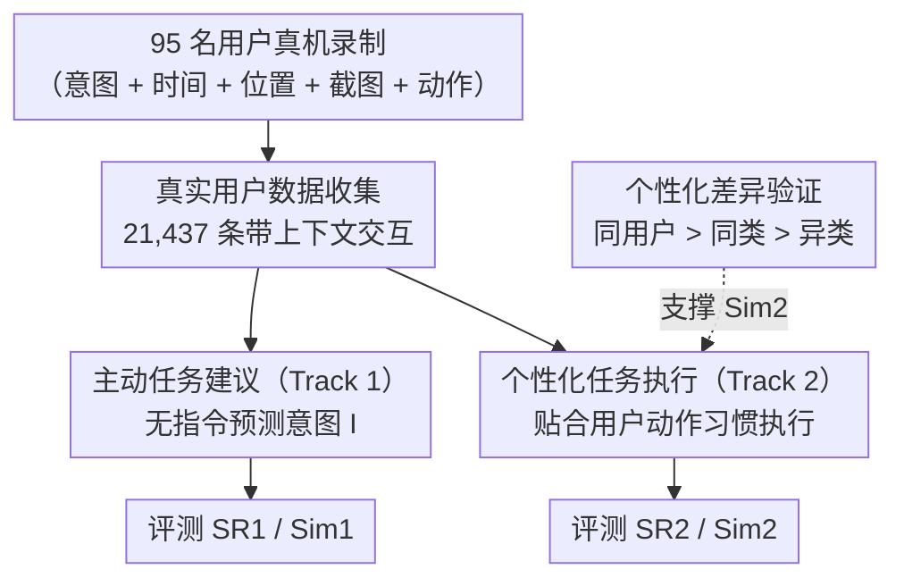

# FingerTip 20K: A Benchmark for Proactive and Personalized Mobile LLM Agents

**会议**: ICLR 2026  
**arXiv**: [2507.21071](https://arxiv.org/abs/2507.21071)  
**代码**: [https://github.com/tsinghua-fib-lab/FingerTip-20K](https://github.com/tsinghua-fib-lab/FingerTip-20K)  
**领域**: Agent  
**关键词**: mobile agent, proactive suggestion, personalized execution, GUI agent, benchmark

## 一句话总结
FingerTip 20K 收集了 95 名用户在真实日常手机使用中的 21,437 条交互记录（含用户画像、时间、位置、历史意图），提出两个新赛道——主动任务建议（预测用户意图）和个性化任务执行（适配动作偏好），最强模型 Qwen-QVQ-Max 主动建议成功率仅 12.8%（人类 30.3%），UI-TARS 执行成功率仅 38.5%。

## 研究背景与动机

**领域现状**：移动 GUI Agent 通过 MLLM 理解屏幕截图和 UI 树来自动执行手机操作。现有 Agent 完全是被动范式——必须接收到明确指令才能行动，且执行时不考虑用户偏好。

**现有痛点**：(a) 用户必须为每个意图制定详细指令，增加认知负担；(b) 用户有时无法清晰表达潜在需求（如通勤时想看新闻但不会特意说）；(c) 不同用户完成相同任务的动作序列可能差异很大（如有人喜欢用搜索找 app，有人喜欢翻屏找），但现有 Agent 不区分；(d) 现有数据集的任务由作者预设或 LLM 生成，不反映真实日常使用模式。

**核心矛盾**：要实现主动和个性化，需要包含用户上下文（时间、地点、画像）和历史数据的长期交互数据——但现有数据集每条数据都是孤立的，缺乏时间关联和上下文信息。

**本文目标** (a) 构建包含丰富用户上下文的真实移动交互数据集；(b) 定义主动任务建议和个性化执行两个新评估赛道。

**切入角度**：让 95 名用户在自己的手机上使用专用 App 录制一个月的日常操作——每次有真实意图时记录意图文本+操作序列+截图+位置+时间，形成有时间关联的长期使用数据。

**核心 idea**：从用户日常手机使用中持续收集带上下文的交互数据，基于此评估 Agent 的主动建议和个性化执行能力。

## 方法详解

### 整体框架
这篇工作不提新模型，而是把"被动执行指令"的移动 GUI Agent 评测，扩展到两个更贴近真实使用的新赛道。要做到这一点，先得有带上下文的长期交互数据：作者让 95 名用户在自己手机上用专用 APP 录一个月的日常操作，把每次意图连同时间、位置、截图和动作序列一起留下来，攒成 21,437 条彼此有时间关联的交互记录。基于这批数据再切出两条评测线——**主动任务建议（Track 1）**让模型在用户没下指令时就猜出他当前想干什么，**个性化任务执行（Track 2）**则要求模型不仅完成任务、还要让动作序列贴合该用户的操作习惯；而 Track 2 之所以成立，靠的是先做一轮"动作偏好真实存在且可度量"的统计验证。

### 关键设计

**1. 真实用户数据收集：让数据带上时间和上下文，而不是孤立的任务样本**

现有数据集每条样本都是孤立的、由作者或 LLM 预设的任务，既不反映真实日常使用，也没有可供推断意图的上下文。作者的做法是让 95 名用户在自己的 Android 手机上装一个专用的 FingerTip APP，连续录一个月：每当用户产生一个真实意图，就打开 APP 用一句话把意图写下来，选一下当前的位置类型，再切到目标 app 把操作演示一遍。APP 会自动把这条意图（带时间戳和位置）连同截图序列、accessibility tree（UI 树）和动作序列一起上传，每人每天最多 12 条、连录一个月。和在模拟器里照着脚本标注不同，这些数据来自用户真实的手机使用，彼此之间还有时间关联，能还原"通勤时刷新闻、午饭点叫外卖"这种日常模式——也正是这种带上下文的长期记录，让后面两条赛道有据可依。

**2. 主动任务建议（Track 1）：在没有指令的情况下预测用户当前想做什么**

这条赛道针对的痛点是用户得为每个意图写清楚指令、有时甚至说不清自己的潜在需求。它把意图预测形式化为 $I = f(U, T, S, I_{history}, O)$：模型拿到用户画像 $U$（年龄、性别、职业等）、时间戳 $T$、场景 $S$（位置类别）、最多 20 条历史意图 $I_{history}$ 和当前的前几张截图 $O$，要输出一句明确的意图 $I$——必须点出涉及哪个 app、期望达到什么效果。评估用两个量：预测意图与真实意图的语义相似度 $Sim_1$，以及由 DeepSeek-V3 判定二者是否匹配的成功率 $SR_1$。这样既考查"模型有没有从上下文里读出用户规律"，又不卡死在字面措辞上。

**3. 个性化任务执行（Track 2）：完成任务之外，还要贴合这个用户的操作习惯**

不同用户完成同一任务的路径可能差很多（有人搜 app、有人翻屏找），但现有 Agent 一律用通用方式执行。这条赛道给模型用户画像 $U$、真实意图 $I_{true}$、用户历史动作序列 $A_{history}$（供 in-context 模仿其偏好）、已执行动作 $A_{agent}$ 和当前截图/UI 树，要求它在真机环境里一步步执行直到完成任务。除了人工核对的成功率 $SR_2$，个性化程度用比值指标 $Sim_2 = S_I / S_{II}$ 衡量——$S_I$ 是 Agent 动作序列与目标用户历史动作的相似度、$S_{II}$ 是与不同类型用户的相似度，比值越大说明越像目标用户、个性化越强（$Sim_2 \approx 1$ 即完全没区分用户）。

**4. 个性化差异验证：先证明"动作偏好"真实存在且可度量**

在评测个性化之前，作者得先确认用户之间的动作偏好不是噪声、$Sim_2$ 这个指标有意义。他们按年龄把用户分成不同类型，从 40 个意图类别各采一条数据，对相似意图计算其动作序列与"最相近样本"的 Levenshtein 相似度（归一到 $[0,100]$），分别看来自同一用户、同类用户、异类用户三种情况。结果呈现清晰的层次——同一用户 > 同类用户 > 异类用户，说明动作偏好确实存在、可以用序列相似度量化，这正是 Track 2 用 $Sim_2$ 衡量个性化的依据。

### 损失函数 / 训练策略
基准评估全部在 zero-shot 设置下进行。微调实验用 Qwen-2.5-VL-7B 配 LoRA（rank=4/64），从训练集分别采样 1000 / 16000 条数据。

## 实验关键数据

### 主实验

**主动任务建议（0 张初始截图）**:

| 模型 | SR1 (%) | Sim1 | 时间/查询 |
|------|---------|------|----------|
| GPT-4.1 | 7.2 | 0.35 | 5.64s |
| Qwen-QVQ-Max (thinking) | **12.8** | **0.39** | 10.60s |
| Human | **30.3** | **0.57** | - |

**个性化任务执行**:

| 模型 | SR2 (%) | Sim2 | Step Ratio |
|------|---------|------|-----------|
| GPT-4.1 | 5.5 | 0.98 | 1.98 |
| Qwen-QVQ-Max | 9.5 | 1.04 | 1.94 |
| UI-TARS-1.5-7B | **38.5** | 1.06 | 1.22 |
| AppAgent | 11.0 | **1.12** | **1.13** |

### 消融实验

| 配置 | 关键发现 |
|------|---------|
| 截图数 0→3 | SR1 显著提升，因为截图能缩小意图范围 |
| 动作长度 1-5 vs 11+ | SR2 随动作长度增加而显著下降 |
| 微调 1K 数据 | SR1: 3.1→16.3%，SR2: 1.5→32.0%（vs base Qwen-2.5-VL-7B）|
| 微调 16K 数据 | SR1: 3.1→19.8%，SR2: 1.5→43.5% |

### 关键发现
- **人机差距巨大**：主动建议上最强模型 12.8% vs 人类 30.3%，说明利用上下文推断意图是巨大挑战
- **所有模型 Sim2 ≈ 1.0**：说明 Agent 倾向于以通用方式完成任务，完全忽略用户偏好——个性化执行能力几乎为零
- **GUI 专用模型 >> 通用模型**：UI-TARS 38.5% vs GPT-4.1 5.5%，差距主要来自 GUI grounding 能力
- **微调效果显著**：仅 1K 数据就能让 7B 模型在两个赛道上大幅提升，说明数据中的用户信息确实可被模型学习利用

## 亮点与洞察
- **两个全新评估维度**：主动建议和个性化执行以前从未被系统评估，首次定量揭示了这两个方向的巨大差距
- **真实日常数据的稀缺价值**：95 人一个月的真实手机使用数据，比模拟器标注的数据有质的不同——数据间有时间关联性、包含用户上下文
- **Sim2 ≈ 1.0 的启示**：当前 Agent 不仅不能个性化执行，甚至不知道自己应该个性化。这暗示需要从架构/训练层面引入用户建模机制
- **微调的巨大潜力**：少量用户特定数据就能大幅提升能力，暗示 user-specific fine-tuning 或 in-context learning from user history 是可行路线

## 局限与展望
- 仅 95 名中国用户，用户群体和 app 生态有地域限制（主要是中文 app）
- 主动建议的评估依赖语义相似度和 LLM 判断，可能有偏差
- 个性化执行的 Sim2 指标基于 Levenshtein 距离，对动作顺序敏感但不考虑语义等价
- 仅在 Android 平台验证，iOS 场景未涉及
- 数据收集依赖用户主动录制，可能遗漏很多无意识的手机使用

## 相关工作与启发
- **vs AndroidWorld/AitW**: 这些基准的任务预设且数据孤立，不包含用户上下文或历史。FingerTip 20K 的数据来自真实使用且有时间关联
- **vs Proactive Agent (Lu et al.)**: 只考虑文本输入的电脑/网页场景，FingerTip 20K 关注移动 GUI 的视觉场景且规模更大
- **vs SPHINX/SPA-Bench**: 仅评估执行能力，不评估主动建议或个性化

## 评分
- 新颖性: ⭐⭐⭐⭐⭐ 主动建议+个性化执行两个全新评估维度，填补重要空白
- 实验充分度: ⭐⭐⭐⭐ 7+ 模型评测+微调+人类研究+难度分析，但真机评测规模受限
- 写作质量: ⭐⭐⭐⭐ 问题定义清晰，数据收集方法详尽
- 价值: ⭐⭐⭐⭐⭐ 为移动 Agent 指明了超越执行能力的下一步方向

<!-- RELATED:START -->

## 相关论文

- [\[CVPR 2026\] ProactiveMobile: A Comprehensive Benchmark for Boosting Proactive Intelligence on Mobile Devices](../../CVPR2026/llm_agent/proactivemobile_a_comprehensive_benchmark_for_boosting_proactive_intelligence_on.md)
- [\[ICLR 2026\] ST-WebAgentBench: A Benchmark for Evaluating Safety and Trustworthiness in Web Agents](st-webagentbench_a_benchmark_for_evaluating_safety_and_trustworthiness_in_web_ag.md)
- [\[CVPR 2026\] GUI-CEval: A Hierarchical and Comprehensive Chinese Benchmark for Mobile GUI Agents](../../CVPR2026/llm_agent/gui-ceval_a_hierarchical_and_comprehensive_chinese_benchmark_for_mobile_gui_agen.md)
- [\[ICLR 2026\] A Benchmark for Deep Information Synthesis (DeepSynth)](a_benchmark_for_deep_information_synthesis.md)
- [\[ICLR 2026\] M²-Miner: Multi-Agent Enhanced MCTS for Mobile GUI Agent Data Mining](m2-miner_multi-agent_enhanced_mcts_for_mobile_gui_agent_data_mining.md)

<!-- RELATED:END -->
