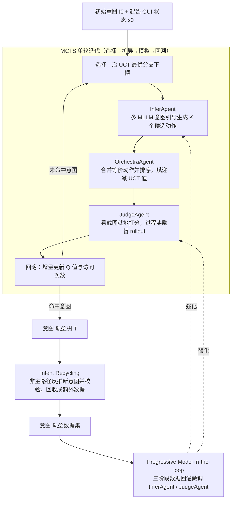

# M²-Miner: Multi-Agent Enhanced MCTS for Mobile GUI Agent Data Mining

**会议**: ICLR 2026  
**arXiv**: [2602.05429](https://arxiv.org/abs/2602.05429)  
**代码**: 即将开源  
**领域**: LLM Agent  
**关键词**: GUI Agent, MCTS, 数据挖掘, 多智能体协作, 移动端交互

## 一句话总结
提出 M²-Miner，首个基于 MCTS 的移动端 GUI agent 自动数据挖掘框架，通过 InferAgent/OrchestraAgent/JudgeAgent 三智能体协作将挖掘效率提升 64 倍，结合 intent recycling 策略丰富意图多样性，训练的 GUI agent 在多个 benchmark 上达到 SOTA。

## 研究背景与动机
**领域现状**：GUI agent 通过理解用户意图并在图形界面上执行动作序列来自动化操作软件应用，是学界和业界的热门方向。当前 GUI agent 的核心依赖是高质量的 intent-trajectory（意图-轨迹）训练数据。

**现有痛点**：
   - **高成本**：人工标注（如 AITW、AndroidControl）每条数据需要数小时，成本高达 $0.36/image
   - **低质量**：人工标注和自动挖掘的数据常含冗余步骤、模糊意图描述、偏差操作路径
   - **低多样性**：现有数据集采用 intent-to-flat-trajectory 结构，每个意图仅记录单一成功路径，意图类型单调

**核心矛盾**：手动标注质量可控但无法规模化，现有自动挖掘方法（如 AgentQ 基于原生 MCTS、OS-Genesis 基于规则探索）效率低、只适用于 web 环境或仅产生单一轨迹。

**本文目标**：如何低成本、自动化地挖掘高质量、高多样性的移动端 GUI 交互轨迹数据？

**切入角度**：将 MCTS 引入移动端 GUI 数据挖掘，但原生 MCTS 随机扩展效率极低。作者观察到：(a) 扩展阶段需要智能引导而非随机探索；(b) 模拟阶段可以用过程奖励替代 rollout；(c) 搜索树中非主路径蕴含额外有价值的意图-轨迹对。

**核心idea**：MCTS + 三智能体协作（引导扩展 + 加速排序 + 过程评估）+ intent recycling = 高效、高质量、高多样性的 GUI 数据挖掘。

## 方法详解

### 整体框架
M²-Miner 以 MCTS 为骨架，输入为初始意图 $I_0$ 和起始 GUI 状态 $s_0$，输出为包含有效交互轨迹 $\tau=(s_0,a_0,s_1,\ldots)$ 的意图-轨迹树 $\mathcal{T}=(\mathcal{V},\mathcal{A},\mathcal{P},\mathcal{I})$。树中每个节点包含截图、动作描述、Q 值、访问次数和任务完成状态。整个挖掘流程是：MCTS 的四个阶段（选择→扩展→模拟→回溯）循环执行，其中扩展靠 InferAgent 引导生成、OrchestraAgent 排序，模拟靠 JudgeAgent 过程评分；一棵树搜完后用 intent recycling 把非主路径回收成额外数据，挖出的数据再经 progressive model-in-the-loop 回灌微调 InferAgent 与 JudgeAgent，使后续挖掘越来越强。

### 关键设计

原生 MCTS 直接用在移动端 GUI 上有三个致命瓶颈：扩展阶段靠随机采样动作，命中正确操作的概率极低；同一界面会被点出大量语义重复的分支，搜索树迅速膨胀；模拟阶段必须把每条候选路径真正走到底（rollout）才能拿到奖励，代价高得离谱。M²-Miner 用三个分工明确的 agent 分别堵住这三个口子，再用 intent recycling 把搜索树的"边角料"也榨成数据。

**1. InferAgent：把随机扩展换成意图引导的动作生成**

针对随机扩展命中率低的痛点，InferAgent 在每个待扩展节点上，结合当前 GUI 截图和目标意图，推理出最可能正确的 $K$ 个候选动作，取代原生 MCTS 漫无目的的随机采样。为了不让候选动作过于趋同，它同时调用多个不同的 MLLM 来生成，撑开动作空间的多样性；并把本轮已经生成过的动作回填进 prompt，显式提醒模型避开重复。这样一来，扩展出来的分支大概率落在"真能推进任务"的方向上，而不是浪费在无效点击上。

**2. OrchestraAgent：合并等价动作并给分支排出优先级**

即便每个动作都合理，不同坐标点击同一个按钮这类语义等价的操作仍会让树横向爆炸。OrchestraAgent 先把这些等价动作合并，再按"达成目标意图的可能性"给候选排序。排序的实现是把候选包装成多选题（multi-choice question），让 MLLM 在每轮迭代里挑出最有希望的一个，经 $K-1$ 次查询得到一条完整的有序队列。排好序的动作被赋予依次递减的初始 UCT 值，于是搜索会优先沿最有前景的分支往下走，把算力花在刀刃上。

**3. JudgeAgent：用过程奖励替掉昂贵的 rollout**

模拟阶段最贵的环节是 rollout——必须把路径走完才知道好坏。JudgeAgent 直接看新扩展节点的 GUI 截图就地判分：终端节点按成功/失败给 1/0；中间节点则让 MLLM head 输出 "valid"/"invalid" 两个 logits，经 softmax 归一化成 $[0,1]$ 的奖励概率

$$r_{\text{intermediate}} = \frac{\exp(logits_{\text{valid}})}{\exp(logits_{\text{valid}}) + \exp(logits_{\text{invalid}})}$$

拿到奖励 $R_i$ 后，节点 Q 值按

$$Q_i = \frac{Q_{i-1} \times N_{i-1} + R_i}{N_{i-1}+1}$$

增量更新。这样每个节点扩展出来就能立刻评估，完全省掉走到底的模拟开销，又保留了 MCTS 的回溯机制。

**4. Intent Recycling：把搜索树的非主路径回收成额外数据**

一次挖掘只为一个意图找路径，但搜索树里那些没走到目标的分支往往本身也是有效操作，丢掉太可惜。Intent recycling 遍历从根到每个节点的所有路径，先用一个 MLLM 实现的 intent recycling filter 评估路径质量，对通过筛选的路径让 MLLM 反推出一个新意图，再交给 JudgeAgent 校验"这个意图和这条轨迹是否真的对得上"。于是一棵树从"一个意图一条主路径"进化成"一棵树孵出多个意图"，不用重新挖掘就凭空多出一批多样化数据。一个直观的例子：在挖"查询路线"意图时误点了"打车"按钮，这条偏离主线的分支恰好构成一条有效的"打车"轨迹，正好被回收下来。

**5. Progressive Model-in-the-loop：让 agent 能力和数据复杂度一起长大**

InferAgent 和 JudgeAgent 的能力直接决定挖掘质量，所以训练采用三阶段渐进的"边挖边训"循环：Stage 1 先挖基础意图（常用服务 + 条件改写），Stage 2 升级到复杂意图（功能组合 + 对失败意图重试），Stage 3 转向回收意图（对历史搜索树执行 intent recycling）。每个阶段挖出的数据立刻回灌去继续训练这两个 agent，形成正反馈——agent 越强挖到的数据越复杂，更复杂的数据又把 agent 推得更强。

### 损失函数 / 训练策略
- InferAgent 和 JudgeAgent 基于 Qwen2.5-VL-7B 微调
- OrchestraAgent 和 intent recycling filter 使用 Qwen2.5-VL-72B
- 训练数据还包含描述信息（description）和偏好数据（preference data，从正/负路径构建）

## 实验关键数据

### 主实验

| 模型 | AC-Low TP/SR | AC-High TP/SR | AITZ TP/SR | GUI-Odyssey TP/SR | CAGUI TP/SR |
|------|-------------|--------------|-----------|-------------------|-------------|
| GPT-4o | 74.3/19.4 | 66.3/20.8 | 70.0/35.3 | - | 3.67/3.67 |
| UI-TARS-7B* | 98.0/90.8 | 83.7/72.5 | 80.4/65.8 | 90.1/87.0 | 88.6/70.0 |
| OS-Genesis-7B | 90.7/74.2 | 66.2/44.5 | 20.0/8.5 | 11.7/3.6 | 38.1/14.5 |
| GUI-Owl-7B | 93.8/90.0 | 81.5/72.8 | 78.9/65.1 | 83.4/60.7 | 80.0/59.2 |
| **M²-Miner-7B** | **97.5/93.5** | 81.8/**72.9** | **81.3/69.4** | **90.5/79.3** | **88.8/70.2** |

*UI-TARS-7B 使用大规模私有人工标注数据

### 消融实验

| 配置 | TP | SR | 说明 |
|------|----|----|------|
| Warm-up | 85.0 | 64.2 | 仅公开数据预训练 |
| + Stage 1 (基础意图) | 86.5 | 67.3 | +3.1% SR |
| + Stage 2 (复杂意图) | 87.6 | 69.1 | +1.8% SR |
| + Stage 3 (回收意图) | 88.2 | 69.9 | +0.8% SR，累计 +5.7% |
| Act only | 85.2 | 66.8 | 仅动作标签 |
| Act + Description | 88.2 | 69.9 | +3.1% SR |
| Act + Des + Preference | **88.8** | **70.2** | +3.4% SR |

### 关键发现
- **效率提升指数级增长**：与原生 MCTS 相比，M²-Miner 在任务长度为 9 时效率提升 64 倍。OrchestraAgent 在扩展阶段减少冗余节点，JudgeAgent 在模拟阶段省去 rollout
- **成本降低 18 倍**：M²-Miner-Agent 数据集每张图片成本仅 $0.02，而人工标注数据集为 $0.36
- **数据质量更高**：随机抽取 100 条数据人工检查，M²-Miner 的数据质量准确率（DQA）高于人工标注数据集（AC 和 AITZ）
- **描述和偏好数据有用**：相比仅使用动作标签，加入描述信息提升 SR 3.1%，再加偏好数据又提升 0.3%
- **对未见场景泛化良好**：在无训练数据的 CAGUI 上，Qwen2.5-VL-7B 经 M²-Miner 数据训练后 SR 从 55.2% 提升至 70.2%

## 亮点与洞察
- **MCTS + 多智能体的范式非常巧妙**：三个 agent 各司其职——生成、排序、评估——精确地解决了原生 MCTS 在 GUI 领域的三个瓶颈（随机扩展、冗余节点、昂贵 rollout）
- **Intent Recycling 是极具创意的设计**：将"失败"的探索路径转化为额外数据源，一举解决了意图多样性和效率两个问题。这个思路可以迁移到其他 agent 数据收集场景
- **过程奖励替代 rollout**：用 MLLM 的 logits 概率作为中间奖励，既保留了 MCTS 的理论优势，又避免了完整模拟的高成本。这种设计对所有 MCTS+LLM 的系统都有参考价值

## 局限与展望
- 当前仅在移动端验证，桌面端和 web 端的适用性未探索
- OrchestraAgent 使用 72B 模型（Qwen2.5-VL-72B），部署成本较高
- Intent recycling 的过滤和意图生成质量依赖 MLLM 能力，对于复杂应用可能效果下降
- 数据规模（20k 图片、2565 轨迹）相比 UI-TARS 的私有数据仍有差距
- Model-in-the-loop 的三阶段训练需要多轮挖掘→训练循环，实际工程成本未详细报告

## 相关工作与启发
- **vs AgentQ**：AgentQ 首创 MCTS 进行 web 环境的数据挖掘，但局限于可解析的 HTML 环境，且效率低。M²-Miner 扩展到视觉驱动的移动端，效率通过多智能体提升数个数量级
- **vs OS-Genesis**：OS-Genesis 采用无监督的规则交互+逆向任务合成，无需预定义任务但数据质量不高（AITZ 上 SR 仅 8.5%）。M²-Miner 的 MCTS 结构化搜索产生更高质量的轨迹
- **vs UI-TARS**：UI-TARS 使用大规模私有人工数据，M²-Miner 在几乎所有 SR 指标上超越它，说明自动挖掘框架的潜力已超过人工标注

## 评分
- 新颖性: ⭐⭐⭐⭐⭐ MCTS+多智能体+intent recycling 的组合在 GUI 数据挖掘领域是首创，每个组件都有明确的技术贡献
- 实验充分度: ⭐⭐⭐⭐⭐ 5 个 benchmark、多组消融（多智能体/训练策略/数据结构/训练数据）、效率分析、成本对比，非常完整
- 写作质量: ⭐⭐⭐⭐ 结构清晰，图示丰富，但部分内容重复，论文较长
- 价值: ⭐⭐⭐⭐⭐ 对 GUI agent 社区提供了极有价值的数据生产范式，且实际证明了自动挖掘可以超越人工标注

<!-- RELATED:START -->

## 相关论文

- [\[ACL 2025\] GUI-explorer: Autonomous Exploration and Mining of Transition-aware Knowledge for GUI Agent](../../ACL2025/llm_agent/gui_explorer_autonomous.md)
- [\[AAAI 2026\] Agent-SAMA: State-Aware Mobile Assistant](../../AAAI2026/llm_agent/agent-sama_state-aware_mobile_assistant.md)
- [\[ICLR 2026\] FingerTip 20K: A Benchmark for Proactive and Personalized Mobile LLM Agents](fingertip_20k_a_benchmark_for_proactive_and_personalized_mobile_llm_agents.md)
- [\[CVPR 2026\] GUI-CEval: A Hierarchical and Comprehensive Chinese Benchmark for Mobile GUI Agents](../../CVPR2026/llm_agent/gui-ceval_a_hierarchical_and_comprehensive_chinese_benchmark_for_mobile_gui_agen.md)
- [\[ICLR 2026\] Efficient Agent Training for Computer Use](efficient_agent_training_for_computer_use.md)

<!-- RELATED:END -->
