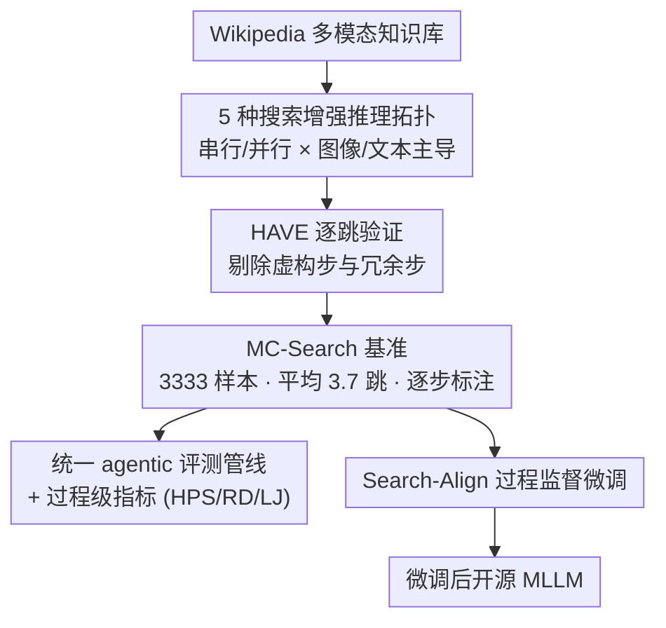

# MC-Search: Evaluating and Enhancing Multimodal Agentic Search with Structured Long Reasoning Chains

**会议**: ICLR 2026  
**arXiv**: [2603.00873](https://arxiv.org/abs/2603.00873)  
**代码**: [https://mc-search-project.github.io](https://mc-search-project.github.io)  
**领域**: LLM Agent  
**关键词**: 多模态RAG, Agentic Search, 多跳推理, 过程级评估, 检索增强推理

## 一句话总结
提出 MC-Search，首个面向 agentic 多模态 RAG 的 benchmark，包含 3,333 个高质量样本（平均 3.7 跳），覆盖 5 种推理拓扑结构，通过 HAVE 验证确保每步必要性，并引入 Search-Align 过程监督微调框架使开源模型的检索规划能力大幅提升（Qwen2.5-VL-7B F1 提升 +13.7）。

## 研究背景与动机
**领域现状**：多模态大语言模型（MLLM）正从固定的"检索-生成"范式向更复杂的 agentic 多模态检索增强生成（MM-RAG）演进。模型需要迭代分解查询、自适应跨模态检索、整合多模态证据。

**现有痛点**：现有 MM-RAG benchmark 存在三个关键局限——(a) 大多采用简单 QA 格式，将多模态证据压缩为纯文本通道（如 MRAG）；(b) 仅评估 1-2 跳的浅层检索，缺乏长推理链（如 Dyn-VQA）；(c) 缺少逐步标注和显式推理拓扑，无法分析不同模态在推理中的角色。

**核心矛盾**：实际查询通常是模糊且复杂的，需要多步、跨模态、知识密集的推理。但没有合适的 benchmark 来评估 MLLM 是否真正能进行长链、结构化的多模态搜索推理。

**本文目标**：(a) 构建首个支持长推理链（≥4跳）的多模态 agentic RAG benchmark；(b) 提供逐步标注和多种推理拓扑；(c) 设计过程级评估指标；(d) 利用验证过的推理链改善开源模型。

**切入角度**：从 Wikipedia 知识库出发构建多模态知识集群，设计 5 种有代表性的推理拓扑结构（串行/并行、图像启动/文本启动/多图分叉等），通过 HAVE 过滤确保每个推理步骤既必要又非冗余。

**核心idea**：长链多跳 + 5种推理拓扑 + HAVE验证 + 过程级指标 + Search-Align 微调 = 全面评估和提升 agentic MM-RAG。

## 方法详解

### 整体框架
MC-Search 想回答一个被现有 benchmark 回避的问题：MLLM 到底能不能做长链、跨模态、结构化的检索推理。为此它把工作拆成相互咬合的两半。前半是基准构建——从 Wikipedia 出发搭一个图文混合的多模态知识库，按 5 种预设拓扑生成多跳 QA，再用 HAVE 把每条链里"看着合理但其实没用"的步骤过滤掉，最终留下 3,333 个平均 3.7 跳的高质量样本，且每一步都带模态、证据、中间答案的标注。后半是评估与训练——所有模型都跑同一套统一的 agentic MM-RAG 管线，并用过程级指标（不只看最终答案）做公平对比；同时把验证过的推理链喂给 Search-Align，反过来微调开源模型，验证这批数据的训练价值。

### 关键设计

**1. 5 种搜索增强推理拓扑：把"多跳"从一锅乱炖拆成可分析的结构**

现有 benchmark 要么只有 1-2 跳，要么虽然多跳但不区分推理形态，没法回答"哪种推理结构难、哪种模态组合难"。MC-Search 先把一条推理链形式化为 $\mathcal{G}(Q,A) = \{(q_t, m_t, r_t, a_t)\}_{t=1}^{T}$，其中 $q_t$ 是第 $t$ 步的子问题，$m_t$ 是该步选用的检索模态，$r_t$ 是检索到的证据，$a_t$ 是中间答案。在这个表示下，它定义了 5 种有代表性的拓扑：(i) Image-Initiated Chain（先看图、后续靠文本检索补全）；(ii) Text-Initiated Chain（先读文本、后续用图像验证）；(iii) Parallel Image-Text Fork（图、文两个分支并行检索，彼此无跨步依赖）；(iv) Multi-Images Fork（先做多图视觉比较，再用文本支撑）；(v) Text-Only Chain（纯文本基线，用来隔离视觉因素）。这 5 种结构覆盖了"串行/并行"×"图像/文本主导"的主要组合，因此后续才能逐拓扑地诊断模型短板（实验里 Parallel Fork 最难就是靠这个切分发现的）。

**2. HAVE 逐跳验证（Hop-wise Attribution and Verification of Evidence）：保证每一跳都不可或缺**

LLM 自动生成的长链有两个通病：虚构步骤（看着像推理、实则没有证据支撑）和冗余步骤（删了也不影响答案）。HAVE 对每一步做双重检查来剔除它们。第一重看直接效用，计算把该步证据 $r_t$ 从上下文里删掉后答案 F1 的下降量

$$\text{Util}(t) = \text{F1}(\mathcal{C}) - \text{F1}(\mathcal{C} \setminus r_t)$$

下降越大说明这步越关键。第二重看导航角色：$\text{Nav}(t)=1$ 当且仅当该步的中间答案实体出现在下游某个子问题里——也就是说，这一步即便对最终答案贡献不大，但它"牵出"了后面要查的实体，仍然不能删。只有当 $\text{Util}(t)$ 低于阈值**且** $\text{Nav}(t)=0$ 时，该步才判为冗余被剔除。双标准的好处是既能删掉真废步，又不会误删那些"自己不直接答题、但负责承上启下"的关键跳。

**3. 统一 agentic 评测管线与过程级指标：把"为什么错、错在哪步"测出来**

此前各家工作各用各的检索-推理流程，分数不可直接比；只看最终答案 F1 又无法区分模型是检索规划坏了还是模态选错了。MC-Search 先把评测固定成一条统一的迭代式管线：每一轮模型生成子查询并选一个检索动作（文本搜索 / 图像搜索 / 以图搜图），从多模态知识库取回 top-1 证据，据此生成子答案并自行决定是否继续，过程中把每步用到的模态和证据都记录下来。在这条统一跑道上，它再引入三个过程级指标做诊断：Hit per Step（HPS）衡量金标推理步被模型预测图覆盖的比例，反映推理路径对不对得上；Rollout Deviation（RD）衡量预测链与金标链的步数差，

$$\text{RD} = \big|\,|\hat{\mathcal{G}}| - |\mathcal{G}|\,\big|$$

直接暴露模型是"检索不够"（步数偏少）还是"过度检索"（步数偏多）；LLM-as-a-Judge（LJ）让 LLM 从答案准确、推理连贯、实体覆盖、步骤对齐四个维度打分，补足前两个自动指标看不到的整体质量。统一管线保证了横向公平，HPS+RD 则让调试 agentic RAG 时能定位到具体哪一环出问题，而不是只知道"分低"。

**4. Search-Align 过程监督微调：把验证过的链反哺给开源模型**

传统 SFT 只拿"问题→最终答案"做监督，模型学不到怎么规划检索、怎么选模态。Search-Align 改成步级监督：把 HAVE 验证过的推理图重写成对话形式（assistant 负责提子问题和推理，user 负责执行检索并返回结果），并用 Gemini-2.5-Flash 为每一跳补一段推理思路（reasoning thoughts）把相邻两跳衔接起来。开源 MLLM 就在这种对话式 trace 上做监督微调，相当于一步步被教会"该查什么、用哪种模态查、怎么把跨步证据整合起来"。这也是 Qwen2.5-VL-7B 经它微调后 F1 大幅追平闭源大模型的原因。

### 损失函数 / 训练策略
Search-Align 在对话式推理 trace 上用标准的 next-token prediction loss 做监督微调，训练数据即 HAVE 验证后的 3,333 条推理链。

## 实验关键数据

### 主实验（Image-Initiated Chain 拓扑为例）

| 模型 | F1(↑) | ΔF1(↑) | LJ(↑) | HPS(↑) | RD(↓) | Golden F1 |
|------|-------|--------|--------|---------|-------|-----------|
| GPT-4o-Mini | 36.49 | 34.18 | 2.63 | 27.51 | 1.46 | 68.29 |
| Gemini-2.5-Flash | 44.10 | 37.38 | 3.01 | 31.46 | 2.91 | 72.39 |
| Gemini-2.5-Pro | **47.61** | **42.76** | **3.18** | 25.90 | 1.05 | 69.83 |
| Claude-3.7-Sonnet | 37.80 | 33.09 | 2.60 | 27.31 | 1.18 | 72.62 |
| InternVL3.5-8B | 39.11 | 29.49 | 2.27 | 22.59 | 1.58 | - |
| + Search-Align | 42.27 | 32.65 | 2.53 | **32.49** | **0.94** | 63.86 |
| Qwen2.5-VL-7B | 26.30 | 8.65 | 1.34 | 16.51 | 4.04 | - |
| + Search-Align | 45.70 | 28.05 | 2.23 | **33.59** | **0.70** | 60.95 |

### 消融实验（模态覆盖分析）

| 查询类型 | 模态 | Gemini-2.5-Pro 覆盖率 | InternVL-3.5-8B 覆盖率 |
|---------|------|---------------------|----------------------|
| 含图查询 | Image | 87.35% | 63.84% |
| 含图查询 | Text | 78.61% | 82.67% |
| 无图查询 | Image | **29.50%** | **0.66%** |
| 无图查询 | Text | 83.55% | 89.78% |

### 关键发现
- **Search-Align 效果显著**：Qwen2.5-VL-7B 经微调后 F1 平均提升 +13.7，HPS 提升 +16.0，RD 降低 3.1，几乎追平 Gemini-2.5-Pro
- **Parallel Image-Text Fork 最难**：需要同时覆盖文本和图像两个分支，所有模型在此拓扑上 F1 和 HPS 最低
- **严重的模态偏差**：当查询中无显式图像线索时，InternVL 的图像检索覆盖率从 63.84% 暴跌至 0.66%，说明模型默认偏向文本检索
- **链越长越难**：4-5 跳的推理链上所有模型性能急剧下降，复合检索错误和不稳定规划是主因
- **适度过度检索有益**：多检索 1-2 步（ΔStep=1~2）通常能提高准确率，但过度检索 ≥4 步会引入噪音导致性能骤降
- **主要瓶颈在检索规划**：错误分析显示 Retrieval-Failure（84.7%）、Hallucinated Entity（75.8%）和 Step-Omission（74.3%）是最常见错误类型

## 亮点与洞察
- **5种推理拓扑的设计非常系统**：不是随意组合多跳问题，而是从实际 MM-RAG 需求出发定义了串行/并行×图像/文本的完整组合空间，为后续研究提供了清晰的分析框架
- **HAVE 过滤机制巧妙**：用"移除某步后答案准确率下降"来验证必要性，用"中间答案实体是否出现在下游子问题"来捕捉导航性步骤，双重标准避免了既不过滤也不误删的平衡问题
- **过程级指标填补空白**：HPS 和 RD 可以精确定位模型是"检索不够"还是"检索过多"，对调试 agentic RAG 系统非常实用
- **模态偏差的发现很有启发**：无图线索时图像检索几乎为零，说明模型还远未具备"根据问题需要主动选择模态"的能力

## 局限与展望
- 知识库基于 Wikipedia，领域覆盖有限（未涉及科学、数学等专业领域）
- 数据生成依赖 Gemini-2.5-Flash，引入了模型特定偏差
- 评估仅用 6 个 MLLM，未包含更强的推理模型（如 GPT-5 系列、Gemini-2.5-Pro with thinking）
- Search-Align 仅使用 SFT，未探索 RL 或 DPO 等强化学习方法
- top-1 检索约束可能过于严格，实际应用中通常检索多条结果

## 相关工作与启发
- **vs MMSearch**：MMSearch 仅 1 跳，关注搜索引擎的图文混合结果。MC-Search 关注长链多跳，强调推理结构和过程评估
- **vs WebQA**：WebQA ≤2 跳且缺乏逐步标注。MC-Search 平均 3.7 跳并提供完整的推理图标注
- **vs Agentic RAG 系统（如 ReAct-style）**：这些系统大多仅用于纯文本场景。MC-Search 将 agentic RAG 扩展到多模态，并首次系统评估了模态规划能力

## 评分
- 新颖性: ⭐⭐⭐⭐⭐ 首个长链多模态 agentic RAG benchmark，5种推理拓扑+HAVE验证+过程级指标，系统性很强
- 实验充分度: ⭐⭐⭐⭐ 6个MLLM + 多维度分析（链长/过检索/模态偏差/错误类型），但模型覆盖可以更广
- 写作质量: ⭐⭐⭐⭐ 结构清晰，形式化完整，图表丰富，但内容密度大导致部分细节需要多次阅读
- 价值: ⭐⭐⭐⭐⭐ 为多模态 agentic search 领域提供了急需的评估基础设施和训练方法，Search-Align 的效果也验证了数据的训练价值

<!-- RELATED:START -->

## 相关论文

- [\[ICLR 2026\] LiveNewsBench: Evaluating LLM Web Search Capabilities with Freshly Curated News](livenewsbench_evaluating_llm_web_search_capabilities_with_freshly_curated_news.md)
- [\[ACL 2026\] Rethinking Reasoning-Intensive Retrieval: Evaluating and Advancing Retrievers in Agentic Search Systems](../../ACL2026/llm_agent/rethinking_reasoning-intensive_retrieval_evaluating_and_advancing_retrievers_in_.md)
- [\[ACL 2026\] BAPO: Boundary-Aware Policy Optimization for Reliable Agentic Search](../../ACL2026/llm_agent/bapo_boundary-aware_policy_optimization_for_reliable_agentic_search.md)
- [\[CVPR 2026\] HAVEN: Hierarchical Long Video Understanding with Audiovisual Entity Cohesion and Agentic Search](../../CVPR2026/llm_agent/haven_hierarchical_long_video_understanding_with_audiovisual_entity_cohesion.md)
- [\[NeurIPS 2025\] Deep Video Discovery: Agentic Search with Tool Use for Long-form Video Understanding](../../NeurIPS2025/llm_agent/deep_video_discovery_agentic_search_with_tool_use_for_longfo.md)

<!-- RELATED:END -->
