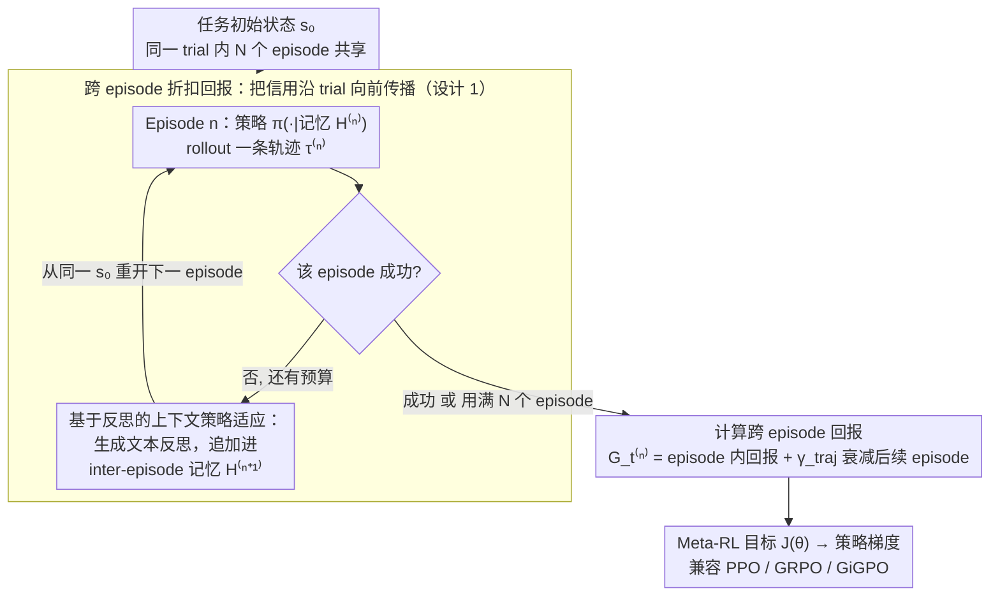

# Meta-RL Induces Exploration in Language Agents

**会议**: ICLR 2026  
**arXiv**: [2512.16848](https://arxiv.org/abs/2512.16848)  
**代码**: [mlbio-epfl/LaMer](https://github.com/mlbio-epfl/LaMer)  
**领域**: LLM/NLP  
**关键词**: Meta-RL, LLM Agent, 探索与利用, 多轮交互, 跨episode训练, 自我反思

## 一句话总结

提出 LaMer 框架，将元强化学习（Meta-RL）引入 LLM agent 训练，通过跨 episode 的奖励优化和基于反思的上下文策略适应，使语言智能体学会主动探索环境，在 Sokoban/MineSweeper/Webshop 上分别获得 11%/14%/19% 的绝对性能提升。

## 研究背景与动机

### 问题背景

近年来 LLM 从对话系统逐渐转向决策型智能体（如 ReAct、Reflexion），能够在多轮文本观测—动作循环中与环境交互。然而现有 RL 训练的 LLM agent 存在核心缺陷：**缺乏主动探索能力**。在需要试错学习的任务中，agent 往往过早收敛到次优策略，无法像人类一样通过系统性探索快速适应新环境。

### 现有方法的不足

**Prompting 方法**（Zero-shot、ReAct、Reflexion）：依赖冻结的 LLM，探索行为有限，性能天花板低

**标准 RL 训练**（PPO、GRPO、GiGPO）：每个 episode 独立采样，策略固定，无法在测试时通过试错进行适应

**离线蒸馏方法**：依赖离线数据，只能模仿而非主动探索；多聚焦于单轮推理而非多轮 agent 任务

### 核心洞察

多轮任务通常在一个 episode 结束时才有稀疏的成功信号。如果将**多个 episode 视为一个 trial**，探索与利用的平衡就自然地转化为**跨 episode 的 RL 问题**——这正是 Meta-RL 的框架。通过在多个不同但相似的环境上训练，agent 被迫学习通用的探索策略。

## 方法详解

### 整体框架

LaMer（LLM Agent with Meta-RL）把一次任务尝试拆成由 $N$ 个 episode 顺序组成的一个 trial $\mathcal{T} = (\tau^{(0)}, \tau^{(1)}, \dots, \tau^{(N-1)})$：agent 在早期 episode 大胆探索、在后续 episode 利用积累的经验。每个 episode 结束后，若已成功就终止本次 trial，否则让 agent 写一段文本反思、把经验追加进 inter-episode 记忆，再从**同一初始状态**重开下一个 episode，直到成功或用满 $N$ 个预算。trial 跑完后，奖励不再只在单个 episode 内结算，而是沿整条 trial 向前传播，喂给一个标准的策略梯度优化器。整套机制既不增加训练轨迹数量、也不改动底层优化器，只是改变了轨迹的组织方式与奖励的传播方式，把"探索"本身变成了可被 RL 直接优化的目标。两个核心设计——跨 episode 折扣回报、基于反思的上下文策略适应——分别回答"信用怎么跨 episode 分配"和"测试时不更新权重怎么适应"。

### 关键设计

**1. 跨 episode 折扣回报：让探索行为也能拿到奖励**

多轮任务的成功信号往往稀疏到只在 episode 结尾出现，单 episode RL 因此学不会"先试错再收敛"——前期的探索动作在自己的 episode 里几乎得不到回报，会被梯度抑制掉。LaMer 的做法是把奖励沿 trial 向前传播：第 $n$ 个 episode 中第 $t$ 步的回报定义为

$$G_t^{(n)} = g_t^{(n)} + \sum_{m=n+1}^{N-1} \gamma_{\text{traj}}^{m-n} g_0^{(m)}$$

前半项 $g_t^{(n)} = \sum_{l=t}^{T-1} \gamma_{\text{step}}^{l-t} r_l^{(n)}$ 是 episode 内的常规折扣回报，后半项把后续每个 episode 的初始回报 $g_0^{(m)}$ 以跨 episode 折扣因子 $\gamma_{\text{traj}}$ 衰减后累加进来。这样即便某个早期 episode 自身失败，只要它带来的信息帮助后续 episode 成功，这次探索就会获得正向信用。对应的元强化目标为 $J(\theta) = \mathbb{E}_{\mathcal{T} \sim \pi_\theta} \big[ \sum_{n=0}^{N-1} \gamma_{\text{traj}}^n \sum_{t=0}^{T-1} \gamma_{\text{step}}^t r_t^{(n)} \big]$。这里的 $\gamma_{\text{traj}} \in [0,1]$ 是一个直观的探索-利用旋钮：取小值（如 0.6）偏向快速利用、压低后期 episode 权重，取大值（如 0.9）则鼓励 agent 把更多预算花在战略性探索上——实验中 Sokoban/Webshop 偏好 0.6、需要更多探索的 MineSweeper 偏好 0.9。

**2. 基于反思的上下文策略适应：不更新权重也能在测试时变强**

经典 Meta-RL 的内循环靠隐式记忆或梯度做任务内适应，但对 LLM 既笨重又不自然。LaMer 直接利用 LLM 的语言能力：每个 episode 结束后让 agent 生成一段文本反思，连同历史轨迹一起构成 inter-episode 记忆 $\mathcal{H}^{(n)}$，下一个 episode 的策略就条件化在这段记忆上，即 $\pi_\theta^{(n)}(\cdot) = \pi_\theta(\cdot | \mathcal{H}^{(n)})$。适应过程完全发生在上下文里、不需要任何梯度更新，因此天然支持测试时持续改进。更关键的是，反思不是冻结的提示技巧——它由后续 episode 拿到的奖励反向训练，agent 会逐渐学会写出"对下一次真正有用"的反思。这一点正是 LaMer 区别于 Reflexion 之处：后者用同样的多 episode + 反思结构，却保持 LLM 冻结、反思无法被优化。消融也显示，仅保留反思（去掉原始轨迹）反而比同时保留两者更好，因为反思更简洁聚焦、不会用冗长历史挤占上下文。

### 损失函数 / 训练策略

把跨 episode 回报代入策略梯度即可得到 LaMer 的训练目标 $\nabla_\theta J(\theta) = \mathbb{E}_{\mathcal{T}} \big[ \sum_{n=0}^{N-1} \sum_{t=0}^{T-1} \nabla_\theta \log \pi_\theta(a_t^{(n)} | s_t^{(n)}, \mathcal{H}^{(n)}) A_t^{(n)} \big]$，其中动作概率显式条件化于 inter-episode 记忆 $\mathcal{H}^{(n)}$，优势 $A_t^{(n)}$ 由跨 episode 回报 $G_t^{(n)}$ 计算。这一形式与标准 RL 的唯一差别在于：标准 RL 为每个任务独立采样一组 episode 并独立算梯度，而 LaMer 让同一 trial 内的 episode 顺序生成、每个都条件化于前面的 episode。因此它可以直接套用 PPO、GRPO、GiGPO 等主流优化器，论文默认使用当前最强的单 episode 基线 GiGPO。

## 实验关键数据

### 主实验

基础模型为 Qwen3-4B，N=3 episodes，group size=8（RL 对应 group size=24 保证公平）。

| 方法 | Sokoban p@1/p@2/p@3 | MineSweeper p@1/p@2/p@3 | Webshop p@1/p@2/p@3 |
|------|---------------------|--------------------------|---------------------|
| Zero-shot | 6.8/9.8/12.9 | 4.5/6.6/8.6 | 1.4/2.1/2.3 |
| ReAct | 7.2/9.6/12.5 | 6.3/7.0/10.9 | 3.1/4.5/4.5 |
| Reflexion | 6.4/9.8/12.1 | 5.5/7.2/9.8 | 2.7/3.3/3.5 |
| PPO | 12.5/15.4/16.8 | 29.7/34.2/35.5 | 53.1/54.5/54.9 |
| GiGPO | 41.6/43.6/44.1 | 52.0/54.9/55.1 | 73.4/74.6/75.2 |
| **LaMer** | **42.4/52.0/55.9** | **44.1/66.4/74.4** | **67.8/84.4/89.1** |

LaMer 在 p@3 上全面超越所有基线：Sokoban +11.8%、MineSweeper +19.3%、Webshop +13.9%。

### OOD 泛化实验（ALFWorld）

| 方法 | Pick(i.d.) | Look(i.d.) | Clean(i.d.) | Heat(i.d.) | Cool(o.o.d.) | Pick2(o.o.d.) |
|------|-----------|-----------|------------|-----------|-------------|--------------|
| Prompting | 91.9 | 52.9 | 48.4 | 44.8 | 42.8 | 21.2 |
| RL | 95.5 | 83.0 | 67.9 | 86.6 | 58.1 | 36.0 |
| **Meta-RL** | **97.7** | **100.0** | **90.2** | **89.5** | **81.0** | **50.2** |

在 OOD 任务上，LaMer 比 RL 高出 23%（Cool）和 14%（Pick2）。

### 消融实验

**记忆配置消融**（p@3）：

| 记忆内容 | Sokoban | MineSweeper | Webshop |
|---------|---------|-------------|---------|
| 仅轨迹 | 34.8 | 69.5 | 89.3 |
| 仅反思 | **56.4** | **80.5** | **92.8** |
| 两者兼有 | 55.9 | 74.4 | 89.1 |

反思提供显著收益；仅反思甚至优于默认设置（反思更简洁聚焦）。

**$\gamma_{\text{traj}}$ 影响**：
- Sokoban/Webshop 最优 $\gamma_{\text{traj}}=0.6$（需要平衡即时与长期回报）
- MineSweeper 最优 $\gamma_{\text{traj}}=0.9$（需要更多战略探索）

### 关键发现

1. Meta-RL 保留了更高的轨迹多样性（通过经验分布的熵衡量），实现了更好的探索-利用权衡
2. 在更难任务上（更多箱子/地雷），Meta-RL 始终以 5-10% 的差距领先 RL
3. 测试时 scaling 效果更好：LaMer 从 p@1 到 p@3 的提升远大于 RL（Sokoban: 13.5% vs <5%）

## 亮点与洞察

1. **首次将 Meta-RL 引入 LLM Agent 训练**：将经典 Meta-RL 的跨任务泛化思想适配到 LLM 的多 episode 交互中
2. **优雅的形式化**：$\gamma_{\text{traj}}$ 提供了简洁的探索-利用控制旋钮
3. **自我反思的双重角色**：既是适应机制也是训练信号，消融证实其关键作用
4. **测试时 scaling 的新视角**：Meta-RL 可视为通过训练时多 episode 来摊销测试时计算
5. **无需额外训练数据**：与 RL 使用相同数量的轨迹，只是改变了轨迹的组织方式

## 局限性

1. **训练时间约为 RL 的 2 倍**：trial 内的 episode 必须顺序生成，并行度受限
2. **仅验证了一个基础模型**（Qwen3-4B）：在更大模型上的效果待验证
3. **环境类型有限**：主要是文本格式的游戏/网页环境，真实世界的复杂 agent 任务有待探索
4. **context 长度限制**：多 episode 的历史和反思会快速填满上下文窗口

## 相关工作与启发

- **Reflexion**（Shinn et al., 2023）：使用多 episode + 反思，但冻结 LLM 无训练
- **GiGPO**（Feng et al., 2025）：当前最强单 episode RL 基线，LaMer 在此基础上拓展为多 episode
- **Test-time compute scaling**：LaMer 提供了一种通过训练来改善测试时 scaling 的方法
- **启发**：该框架可与更强的推理模型（如 R1 系列）结合，探索 Reasoning + Exploration 的协同

## 评分

- **新颖性**: ⭐⭐⭐⭐ — 首次将 Meta-RL 适配到 LLM Agent，形式化简洁
- **技术深度**: ⭐⭐⭐⭐ — 跨 episode 奖励传播机制设计成熟，理论分析清晰
- **实验充分度**: ⭐⭐⭐⭐⭐ — 4 个环境 + OOD 泛化 + 难度泛化 + 详细消融
- **实用价值**: ⭐⭐⭐⭐ — 框架通用，兼容主流 RL 算法
- **总体推荐**: ⭐⭐⭐⭐ — 扎实的工作，为 LLM Agent 的探索能力训练开辟了新方向

<!-- RELATED:START -->

## 相关论文

- [\[ACL 2026\] Meta-Tool: Efficient Few-Shot Tool Adaptation for Small Language Models](../../ACL2026/llm_agent/meta-tool_efficient_few-shot_tool_adaptation_for_small_language_models.md)
- [\[ACL 2025\] Adaptive Tool Use in Large Language Models with Meta-Cognition Trigger](../../ACL2025/llm_agent/meco_metacognition_tool_use.md)
- [\[ICLR 2026\] REMem: Reasoning with Episodic Memory in Language Agents](remem_reasoning_with_episodic_memory_in_language_agent.md)
- [\[CVPR 2025\] RL-RC-DoT: A Block-level RL Agent for Task-Aware Video Compression](../../CVPR2025/llm_agent/rl-rc-dot_a_block-level_rl_agent_for_task-aware_video_compression.md)
- [\[CVPR 2025\] GUI-Xplore: Empowering Generalizable GUI Agents with One Exploration](../../CVPR2025/llm_agent/gui-xplore_empowering_generalizable_gui_agents_with_one_exploration.md)

<!-- RELATED:END -->
