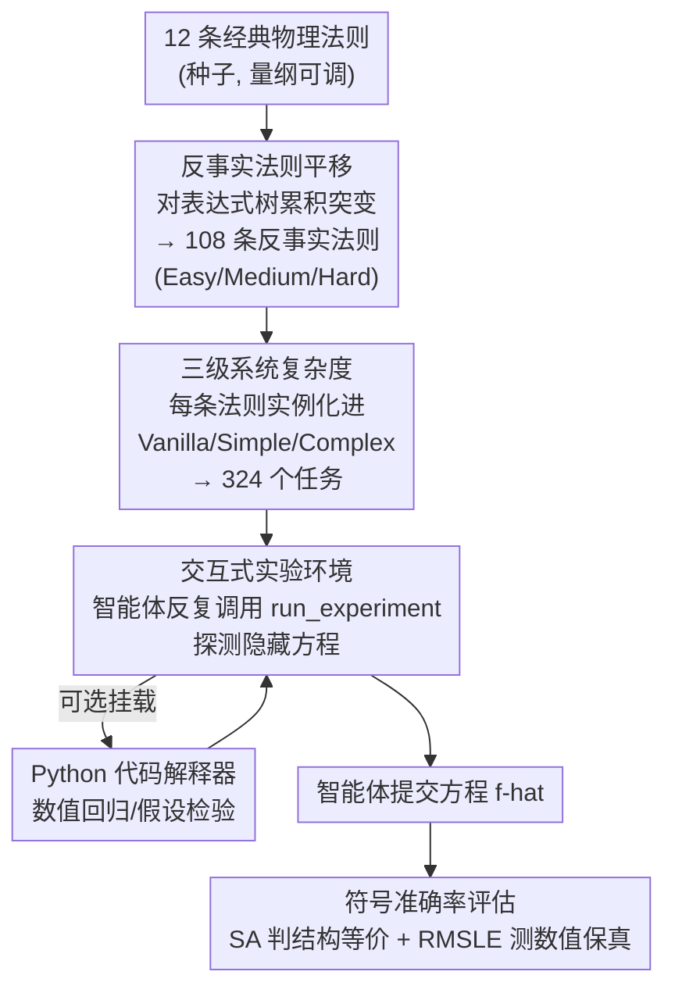

# NewtonBench: Benchmarking Generalizable Scientific Law Discovery in LLM Agents

**会议**: ICLR 2026  
**arXiv**: [2510.07172](https://arxiv.org/abs/2510.07172)  
**代码**: 有  
**领域**: LLM Agent  
**关键词**: 科学发现, benchmark, 反事实物理法则, 符号回归, 交互式探索

## 一句话总结
提出NewtonBench，一个包含12个物理领域324个任务的LLM科学法则发现基准，通过"反事实法则平移"生成可防止记忆化的新颖任务，要求智能体通过交互式实验探索发现隐藏的物理方程，发现GPT-5最佳（75.9%符号准确率）但在复杂系统中急剧退化（40.3%），且代码工具对强模型反而有负面效果。

## 研究背景与动机

**领域现状**：LLM驱动的科学发现是前沿方向，但现有基准（如SRBench）面临"方法论三难困境"——科学相关性、可扩展性、抗记忆化三者不可兼得。

**现有痛点**：
   - 现有基准多为静态函数拟合，不需要交互式探索
   - 合成基准虽可扩展但缺乏科学基础
   - 真实物理方程可能被LLM从训练数据中记忆
   - 缺少系统复杂度的分级评估

**核心矛盾**：需要同时满足科学基础、防记忆化和可扩展性，但直接使用真实法则无法防止记忆化，完全合成又缺失科学意义。

**本文目标** 通过反事实法则平移解决三难困境，构建交互式科学发现基准。

**切入角度**：对已知物理法则的表达式树进行系统性变异（算子/常数突变），生成科学上有基础但LLM从未见过的新法则。

**核心 idea**：通过表达式树突变生成反事实物理法则+交互式实验环境，构建首个防记忆化的可扩展科学发现基准。

## 方法详解

### 整体框架
NewtonBench 要解决的核心问题是：怎么评测 LLM 智能体"发现物理法则"的能力，又不让它靠背训练语料里的真实方程作弊。它的做法是把基准搭成一个三维难度网格——先从 12 条经典物理法则出发，对每条做累积突变得到 108 条"反事实"法则（按突变量分 Easy/Medium/Hard 三级），再把每条法则各实例化进 3 档系统环境（Vanilla/Simple/Complex），拼成 324 个任务。每个任务里藏着一条对智能体不可见的目标方程，智能体只能通过 `<run_experiment>` 工具喂入一组变量值、读回系统输出，像做真实实验一样反复试探，逐步推断出隐藏的方程形式；最后用符号准确率判定它给出的方程与隐藏方程是否数学等价。整套环境因此从"给一堆数据让你拟合公式"升级成了"自己设计实验把法则挖出来"。

### 关键设计

**1. 反事实法则平移（Counterfactual Law Shifts）：让方程有科学根基却没在训练数据里出现过**

真实物理方程（如牛顿引力、热传导）很可能被 LLM 从训练语料里记住，直接拿来测就分不清是"发现"还是"背诵"；可纯合成的方程又失去了科学意义。NewtonBench 把每条经典法则表示成表达式树（expression tree），再对树做**累积突变**：一类是算子突变（如把加法 $+$ 换成乘法 $\times$），一类是常数/指数突变（如把平方项改成立方项）。难度由突变次数递进控制——Easy 在原法则上做 1–2 次突变，Medium 在 Easy 基础上再叠 1–2 次，Hard 又在 Medium 上继续叠，越往后偏离原始法则越远。突变会破坏量纲一致性，于是每条目标方程都内置至少一个物理常数，突变后通过调整该常数的单位把量纲补回来。这样生成的方程结构上仍源自真实物理、保留科学基础，但具体形式从未在任何训练语料中出现，天然挡住了记忆化这条捷径——12 条种子法则共扩出 108 条反事实法则。

**2. 三级系统复杂度：把同一条目标方程放进越来越嘈杂的系统里**

光控制方程本身的难度还不够，真实科学发现里更难的是从一堆耦合变量中把目标规律剥离出来。NewtonBench 把"目标法则难度"和"外围系统复杂度"做成两条独立的难度轴，为每条目标方程配三档系统环境：Vanilla 只暴露目标方程、没有任何混淆变量；Simple 把目标方程嵌进一个含辅助方程的小系统；Complex 则是多个方程互相耦合、混淆最大化的系统，此时智能体必须借助辅助方程把混淆变量解耦才能锁定目标。这一维度让基准能单独衡量"系统复杂度"对模型的冲击，也正是实验里观察到强模型从 90% 崩到 40% 的那条轴。

**3. 交互式实验环境：把发现过程变成主动探索而非被动拟合**

发现隐藏方程的唯一通道是交互——智能体调用 `<run_experiment>` 提出一组输入变量赋值，模拟器对完整系统求值、返回对应的系统输出，智能体据此设计下一次实验、逐轮逼近方程形式。环境还可选挂上一个 Python 代码解释器（Code Assistance）供模型做数值回归或假设检验，目的是把模型从"算力受限"推到"发现能力受限"，逼出它真正的科学推理边界。这个看似中性的工具后来成了实验里最有意思的变量：强模型一旦拿到代码就倾向于局部数值拟合、反而放弃了全局探索（详见实验部分的代码悖论）。

**4. 符号准确率评估：判定方程"结构等价"而非数值贴合**

发现任务不能只看预测值贴不贴数据，否则一个数值上凑近、结构上错的方程也能蒙混过关。NewtonBench 的主指标是**符号准确率（Symbolic Accuracy, SA）**——一个二元指标，判定智能体给出的方程 $\hat{f}$ 是否与隐藏的目标方程 $f_{\text{target}}$ 数学等价；等价判定**有意忽略物理常数的具体取值**（常数难从有限观测中精确拟合），只看方程的结构形式是否对。等价性由 LLM-as-judge 裁定，与人类专家标注的一致率达 98.3%。辅助指标是 RMSLE（Root Mean Squared Logarithmic Error，$\text{RMSLE}=\sqrt{\frac{1}{n}\sum_i\big(\log(1+\hat{y}_i)-\log(1+y_i)\big)^2}$），衡量发现方程对数据的预测保真度，作为 SA 之外的数值度量。

## 实验关键数据

### 主实验（11个模型）

| 模型 | Vanilla Easy | Vanilla Hard | Complex Hard | 平均SA |
|------|-------------|-------------|-------------|--------|
| GPT-5 | 90.3% | 87.5% | **40.3%** | **75.9%** |
| Gemini-2.5-pro | 96.5% | 69.4% | 16.7% | 65.4% |
| o4-mini | 88.9% | 52.8% | 2.8% | 47.8% |
| DeepSeek-R1 | 88.2% | 36.8% | 2.8% | 43.4% |
| GPT-4.1 | 16.7% | 1.4% | 0.7% | 5.8% |

### 消融实验

| 配置 | 关键发现 |
|------|---------|
| 代码工具对强模型 | GPT-5: 75.9%→下降2-3%；GPT-5-mini: 53.1%→48.1% **代码有害** |
| 代码工具对弱模型 | <40%SA的模型：代码提升明显 |
| 噪声0.0001 | 所有模型准确率下降12-16% |
| 噪声增加 | 性能与噪声水平成正比退化 |

### 关键发现
- **推理能力是门槛**：非推理模型（GPT-4.1等）全部<10%准确率
- **复杂度崩塌**：GPT-5从Vanilla Easy 90.3%→Complex Hard 40.3%，二阶以上复杂度是核心瓶颈
- **代码工具的悖论效应**：强模型使用代码后探索率急剧下降（过度利用），弱模型则受益于计算卸载
- **跨领域差异大**：Bose-Einstein分布最难（18.1%），热传导最简单
- **推理token缩放**：推理模型随任务复杂度显著增加token消耗，非推理模型不会

## 亮点与洞察
- **反事实法则平移是解决记忆化的优雅方案**：不是造全新方程（失去科学基础），而是在真实方程上做可控变异，既保持科学意义又防止记忆
- **代码工具的exploration-exploitation trade-off发现**：强模型拿到代码后倾向于做局部拟合（exploitation），放弃了全局探索（exploration），这是一个深刻的行为洞察，与RL中的经典困境呼应
- **交互式评估范式**：从"给数据拟合方程"升级到"设计实验发现法则"，更贴近真实科学发现过程

## 局限与展望
- 仅覆盖物理学，化学/生物学的推广未验证
- 反事实法则虽科学上有基础但不对应真实现象
- 极微小噪声（0.0001）就导致12-16%准确率下降，真实场景适用性存疑
- 只测试了标量输出的单目标方程发现

## 相关工作与启发
- **vs SRBench**：传统符号回归基准，静态数据拟合，无交互式探索，无防记忆化设计
- **vs AI Feynman**：用真实Feynman方程但面临记忆化风险；NewtonBench通过反事实平移解决
- **vs BALSA/Funsearch**：程序搜索方法，与NewtonBench的方程发现范式互补

## 评分
- 新颖性: ⭐⭐⭐⭐⭐ 反事实法则平移+交互式发现基准是全新贡献，代码悖论效应是深刻发现
- 实验充分度: ⭐⭐⭐⭐ 11模型、12领域、多消融分析全面，但缺少非推理模型的改进路径
- 写作质量: ⭐⭐⭐⭐ 基准设计动机清晰，实验分析深入
- 价值: ⭐⭐⭐⭐⭐ 为LLM科学发现能力提供了严格评估工具，代码工具悖论对agent设计有重要启示

<!-- RELATED:START -->

## 相关论文

- [\[ICLR 2026\] SR-Scientist: Scientific Equation Discovery With Agentic AI](sr-scientist_scientific_equation_discovery_with_agentic_ai.md)
- [\[ICML 2025\] Evaluating Retrieval-Augmented Generation Agents for Autonomous Scientific Discovery in Astrophysics](../../ICML2025/llm_agent/evaluating_retrieval-augmented_generation_agents_for_autonomous_scientific_disco.md)
- [\[ICLR 2026\] Gaia2: Benchmarking LLM Agents on Dynamic and Asynchronous Environments](gaia2_benchmarking_llm_agents_on_dynamic_and_asynchronous_environments.md)
- [\[ICML 2025\] Open Source Planning & Control System with Language Agents for Autonomous Scientific Discovery](../../ICML2025/llm_agent/open_source_planning_control_system_with_language_agents_for_autonomous_scientif.md)
- [\[ICLR 2026\] AutoFigure: Generating and Refining Publication-Ready Scientific Illustrations](autofigure_generating_and_refining_publication-ready_scientific_illustrations.md)

<!-- RELATED:END -->
