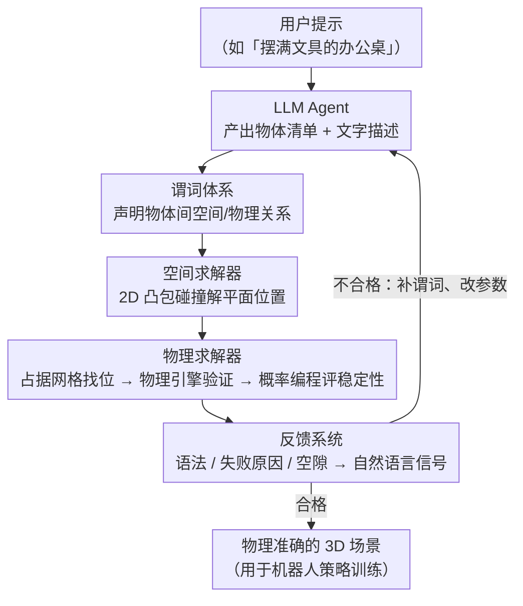

# PhyScensis: Physics-Augmented LLM Agents for Complex Physical Scene Arrangement

**会议**: ICLR 2026  
**arXiv**: [2602.14968](https://arxiv.org/abs/2602.14968)  
**代码**: [项目页面](https://physcensis.github.io)  
**领域**: LLM Agent  
**关键词**: 3D scene generation, physics engine, LLM agent, physical plausibility, predicate-based placement, probabilistic programming, robotic manipulation

## 一句话总结

提出 PhyScensis，一个结合物理引擎的 LLM agent 框架，通过空间与物理谓词驱动的求解器生成高复杂度、物理准确的 3D 场景，在视觉质量、语义正确性和物理精度上显著超越先前方法，并成功用于机器人操作策略训练。

## 研究背景与动机

自动生成交互式 3D 环境对于规模化机器人仿真数据收集至关重要。然而现有方法存在多重不足：

**程序化方法**（ProcTHOR 等）：受限于设计者预设的规则，无法覆盖开放场景

**数据驱动方法**（Transformer/Diffusion）：受限于 3D 数据集的稀缺覆盖，尤其缺少精细的小物体摆放

**LLM agent 方法**存在关键缺陷：
   - 图像驱动方法（Architect、SceneTheis）受遮挡影响且缺乏细粒度控制
   - 直接预测位置方法（LayoutGPT、3D-Generalist）受限于 LLM 的 3D 空间推理能力
   - 谓词+求解器方法（LayoutVLM 等）仅用 2D AABB 碰撞检测，缺少反馈循环

**物理交互被忽视**：堆叠、容纳、支撑等物理关系未被建模，导致物体穿透和不稳定配置

核心挑战在于：复杂物理场景需要（a）高物体密度（b）丰富支撑关系（c）同时建模空间位置和物理属性。

## 方法详解

### 整体框架

PhyScensis 要解决的是：让 LLM 生成既视觉合理、又物理站得住的高密度 3D 场景，而不只是把物体松散地铺在桌面上。它的做法是把"理解语义"和"算准物理"这两件 LLM 各自擅长/不擅长的事拆开。给定一句用户提示（如"摆一张堆满文具的办公桌"），LLM agent 先产出一份物体清单、每个物体的文字描述（用于从资产库检索 mesh），以及一组**谓词**来声明物体之间该满足的空间/物理关系；接着求解器把这些谓词翻译成具体坐标——先用空间求解器在 2D 平面上解桌面物体的位置约束，再用物理求解器调用物理引擎处理 3D 的堆叠与容纳；最后反馈系统检查生成结果，把语法错误、求解失败、拥挤/空白等信号回灌给 LLM agent，让它补谓词、改参数，循环迭代直到场景合格。LLM 只负责"声明意图"，落地为精确坐标的脏活交给求解器和物理引擎，这是整套设计的主线。

### 关键设计

**1. 谓词体系：让 LLM 声明关系而不是直接预测坐标**

LLM 在精确 3D 空间推理上一直很弱，直接让它吐 (x, y, z, yaw) 往往穿模或叠错。PhyScensis 让 LLM 改吐谓词——一种结构化的关系声明，真正的坐标由后端求解器算。谓词分两类。空间谓词管 2D 平面上的关系：位置类有 left/right/front/back-of（可带具体距离）和 place-on-base（放到桌面）；对齐类有 align-left/right/front/back 和 align-center；旋转类有 facing-to、facing-same-as、random-rot 等；还有 symmetry-along 管对称、group 创建虚拟组、copy-group 复制一组并保留内部结构（用来高效铺设规则阵列）。物理谓词管 3D 交互：place-in 把物体放进容器并做物理下落模拟，place-on 做支撑比与稳定性可控的堆叠，place-anywhere 在保证无穿透、有支撑的前提下随机摆放。这套分层谓词覆盖了真实摆放里绝大多数关系，把 LLM 的语义能力和求解器的几何能力解耦开。

**2. 空间求解器：用凸包碰撞替代 AABB，并判断物体是否"求解完整"**

LayoutVLM 等先前工作只用 2D AABB（轴对齐包围盒）做碰撞检测，对斜放、异形物体不准。空间求解器改用 2D 凸包来检测重叠——比 AABB 精确，又比完整 3D mesh 相交快得多，是工程上的好权衡。求解时它会逐个检查物体是否"完全求解"，即 $x, y, yaw$ 是否都已确定或能从约束推断；若某物体欠定，就把这个缺口反馈给 LLM agent，要它补充谓词。参数本身则通过**逐参数迭代优化**得到（一次只动一个参数），目标是**最小化凸包重叠面积加上边界越界距离**这个惩罚项，把重叠和出界同时压下去；惩罚降到阈值以下即接受为无穿透、不出界的布局，固定步数内仍不收敛则报给反馈系统判为无解。

**3. 物理求解器：占据网格找位 → 物理引擎验证 → 概率编程评稳定性**

平面位置定了，3D 的堆叠和容纳还得靠真实物理。place-in 类似 Blender 的物理放置器，物体从容器上方释放、在重力下自然安定。更复杂的 place-on / place-anywhere（Figure 4）走三步：先用**占据网格启发式**，把场景和候选物体体素化成占据网格，做网格搜索找出既不穿透、质心投影又落在支撑凸包内的候选位置；再用**物理引擎验证**，只保留模拟后没有大位移的候选；最后做**概率编程稳定性评估**——在当前摆放状态周围采样扰动（3D 位置、欧拉角、质量、质心偏移、摩擦系数），用贝叶斯方法估计这个配置的稳定概率。这个稳定概率不仅用来挑稳的配置，还反过来支持精细的稳定性控制：可以故意选"不稳定但尚未倒塌"的解，生成图 3 那种极端不稳的摆放，给机器人制造有挑战的场景。

**4. 反馈系统：把失败原因和场景空隙翻译成 LLM 能改的信号**

求解器算不出来或算得不好时，不能只丢一个"失败"，得告诉 LLM 哪里错、怎么补，否则迭代无从下手。反馈分三种。**语法反馈**检查谓词格式是否合法、物体是否已完全求解。**求解器失败反馈**诊断具体原因——穿透、超出桌面、堆叠失败等——还会估计场景拥挤度并识别空白区域，用自然语言直接点出来（如"笔记本电脑后方桌面左侧有空白区域"），LLM 据此知道往哪儿加物体。**成功反馈**则在场景合格后给出质量评估：物理引擎加概率编程算出的稳定性分数、判断整齐还是杂乱的 VQA 分数，以及表面覆盖率、紧凑度、物体数量等启发式指标，供进一步优化。正是这套定位到具体原因和具体空隙的反馈，把迭代次数和时间显著压了下来。

### 损失函数

本文是生成框架而非训练方法，不涉及神经网络损失。可优化的目标有两处：空间求解器里最小化凸包重叠面积与边界越界距离的惩罚项，以及物理求解器里对稳定性概率的最大化（求稳定摆放）或最小化（求极端不稳摆放）。

## 实验关键数据

### 主实验

**定量对比（Table 1）**：

| 方法 | VQA Score↑ | GPT Ranking↓ | Settle Distance↓ | Reaching (10试) | Placing (10试) |
|------|-----------|-------------|-----------------|----------------|---------------|
| Architect | 0.493±0.392 | 2.607±0.673 | 0.405±0.471 | 3/10 | 0/10 |
| 3D-Generalist | 0.578±0.399 | 1.946±0.731 | 0.033±0.048 | 4/10 | 1/10 |
| **PhyScensis** | **0.704±0.425** | **1.429±0.562** | **0.003±0.008** | **9/10** | **3/10** |

PhyScensis 在所有指标上显著领先：
- VQA Score +21.8%（vs 3D-Generalist）
- Settle Distance 降低 91%（物理精度）
- 机器人 reaching 成功率 9/10 vs 4/10

**用户研究（Table 4, 20人, 18案例, 1-5分）**：

| 方法 | 文本对齐↑ | 自然性&物理↑ | 复杂度↑ |
|------|---------|------------|--------|
| Architect | 2.68 | 2.65 | 2.69 |
| 3D-Generalist | 2.54 | 2.72 | 3.04 |
| **PhyScensis** | **4.04** | **3.98** | **3.82** |

### 消融实验

**反馈系统消融（Table 2）**：

| 变体 | 重试次数↓ | 时间消耗↓ |
|------|---------|---------|
| 无反馈 | 1.69±1.92 | 132.29±78.38 |
| 无空白区域报告 | 1.43±1.55 | 126.09±59.19 |
| 增加视觉反馈 | **0.95±0.91** | 120.65±53.62 |
| 完整框架 | 1.04±1.41 | **106.41±55.53** |

完整反馈系统将时间消耗从 132 秒降至 106 秒（20% 提速）。

**谓词/求解器消融（Table 3）**：

| 变体 | VQA Score↑ | GPT Ranking↓ | Settle Distance↓ |
|------|-----------|-------------|-----------------|
| Random 放置 | 0.415±0.363 | 2.706±0.666 | 0.004±0.003 |
| LLM-Only (直接预测位置) | 0.592±0.401 | 1.882±0.676 | 0.154±0.133 |
| **PhyScensis** | **0.704±0.425** | **1.411±0.492** | **0.003±0.008** |

随机放置虽然 Settle Distance 低（因为都在桌面上没有堆叠），但 VQA 和 GPT Ranking 极差。LLM-Only 有高 Settle Distance（物理不准确），PhyScensis 兼顾视觉质量和物理精度。

**机器人实验**：
- 每种方法 300 个场景 × 1 个 demo 轨迹训练 diffusion policy
- 10 个人工设计场景评估泛化
- PhyScensis 生成的场景更接近真实分布，训练的策略泛化更好

### 关键发现

1. 物理引擎集成使 Settle Distance 降低两个数量级（0.003 vs 0.405）
2. 基于谓词的方法远优于 LLM 直接预测位置（VQA +19%）
3. 反馈系统（尤其是空白区域识别）显著提高迭代效率
4. 生成的场景可有效用于机器人策略训练并泛化到人工设计的场景

## 亮点与洞察

1. **物理引擎 + LLM agent 的优雅结合**：LLM 负责高层语义理解和谓词生成，物理引擎保证低层物理准确性，各取所长
2. **概率编程控制稳定性**：不仅能生成稳定场景，还能有意生成极端不稳定摆放（用于机器人挑战性场景），这种精细可控性在以往工作中未见
3. **丰富的谓词体系**：空间+物理谓词的分层设计覆盖了绝大多数真实摆放场景，copy-group 等高级谓词支持复杂结构化布局
4. **实际机器人应用验证**：不仅是场景生成的学术评估，而是通过 imitation learning 实验证明了生成场景的实际价值
5. **凸包碰撞检测**：相比 AABB 提供更精准的 2D 碰撞检测，比全 3D mesh 交叉快很多，是工程上的好权衡

## 局限性

1. 3D 资产依赖 BlenderKit 数据集 + 文本到 3D 管线，资产质量和多样性受限
2. 物理求解器的占据网格分辨率限制了连续放置的精度
3. 实验中机器人 placing 成功率仅 3/10，虽优于基线但绝对值仍低
4. 生成速度（~106 秒/场景）对于大规模数据生成可能不够快
5. 仅展示了桌面/货架/盒子等局部场景，未扩展到房间级全景

## 相关工作与启发

与 3D-Generalist（Sun et al., 2025b）的 VLM 逐点指定方案相比，PhyScensis 通过谓词体系绕过了 VLM 的空间推理弱点。与 Architect（Wang et al., 2024b）的图像修复方案相比，避免了深度估计引起的穿透问题。与 ClutterGen（Jia & Chen, 2024）的杂乱生成相比，PhyScensis 支持更复杂的堆叠和语义指令。

**核心启发**：将 LLM 的角色定位为"谓词生成器"而非"坐标预测器"是关键设计哲学。LLM 擅长语义理解和逻辑推理，但不擅长精确的 3D 空间推理。通过谓词中间表示将两类能力解耦，是 LLM+物理系统协作的通用范式。

## 评分

- 新颖性: ⭐⭐⭐⭐ (物理引擎+LLM agent+概率编程的系统性结合在场景生成中属首创)
- 实验充分度: ⭐⭐⭐⭐ (定量+定性+用户研究+机器人实验+消融，覆盖全面)
- 写作质量: ⭐⭐⭐⭐ (方法描述清晰，图表精美，实验分析到位)
- 价值: ⭐⭐⭐⭐ (对机器人仿真数据生成和 embodied AI 有直接价值)

<!-- RELATED:START -->

## 相关论文

- [\[CVPR 2026\] VULCAN: Tool-Augmented Multi Agents for Iterative 3D Object Arrangement](../../CVPR2026/llm_agent/vulcan_tool-augmented_multi_agents_for_iterative_3d_object_arrangement.md)
- [\[ICLR 2026\] Exploratory Memory-Augmented LLM Agent via Hybrid On- and Off-Policy Optimization](exploratory_memory-augmented_llm_agent_via_hybrid_on-_and_off-policy_optimizatio.md)
- [\[AAAI 2026\] Physics-Informed Autonomous LLM Agents for Explainable Power Electronics Modulation Design](../../AAAI2026/llm_agent/physics-informed_autonomous_llm_agents_for_explainable_power_electronics_modulat.md)
- [\[ICLR 2026\] FeatureBench: Benchmarking Agentic Coding for Complex Feature Development](membership_privacy_risks_of_sharpness_aware_minimization.md)
- [\[ACL 2026\] Hierarchical Reinforcement Learning with Augmented Step-Level Transitions for LLM Agents](../../ACL2026/llm_agent/hierarchical_reinforcement_learning_with_augmented_step-level_transitions_for_ll.md)

<!-- RELATED:END -->
