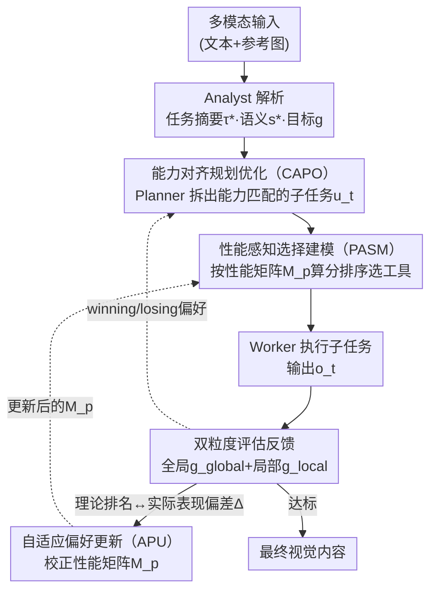

# PerfGuard: A Performance-Aware Agent for Visual Content Generation

**会议**: ICLR 2026  
**arXiv**: [2601.22571](https://arxiv.org/abs/2601.22571)  
**代码**: [GitHub](https://github.com/FelixChan9527/PerfGuard)  
**领域**: AI Agent/视觉内容生成  
**关键词**: LLM Agent, 工具选择, 性能边界建模, 视觉生成, AIGC, 偏好优化

## 一句话总结
提出PerfGuard——面向视觉内容生成的性能感知Agent框架：用多维评分矩阵替代文本描述建模工具性能边界(PASM)→自适应偏好更新(APU)动态校准理论排名与实际执行的偏差→能力对齐规划优化(CAPO)引导Planner生成与工具能力匹配的子任务，在图像生成和编辑任务上全面超越GenArtist/T2I-Copilot等SOTA方法。

## 研究背景与动机

**领域现状**：LLM驱动的Agent已能通过推理和工具调用实现自动任务处理，在视觉内容生成(AIGC)领域涌现出CompAgent、GenArtist等多工具协调系统。

**理想化假设的问题**：现有研究普遍假设"工具调用总是成功的"，缺乏对工具实际执行成功率的系统评估→工具选择的不确定性直接影响Agent规划和决策的整体准确性。

**文本描述的局限**：当前系统依赖通用文本描述定义工具能力(如"能生成与文本语义对齐的图像")→无法区分不同模型在细粒度维度上的性能差异→无法支持精确的工具匹配。

**性能边界缺失**：以文生图为例，FLUX/SD3/DALL·E3在颜色、形状、纹理、空间关系等维度上性能差异显著→但Agent无法感知这些差异→导致规划和执行中引入不确定性。

**静态评估的不足**：即使有基准测试分数，预设的性能边界可能与实际任务执行结果存在偏差→需要根据真实使用反馈动态调整。

**规划与工具的脱节**：现有方法的任务规划过程未考虑工具的实际性能能力→Planner可能生成工具难以高质量完成的子任务→需要将性能感知融入规划过程。

## 方法详解

### 整体框架

PerfGuard 要解决的核心问题是：现有视觉生成 Agent 把"工具能做什么"写成一句模糊的文本描述，导致工具选不准、任务规划脱离工具的真实能力。它的破局点是把工具能力换成一张可计算、可自我校正的**性能矩阵**，并让这张矩阵反过来约束工具选择与规划。整套系统由四个角色串成一个带反馈的闭环：Analyst 把多模态输入解析成任务摘要 $\tau^*$、目标语义 $s^*$ 和评估目标 $g$；Planner 结合工具性能画像 $\mathcal{B}$ 把任务拆成子任务序列 $u_t$（由 CAPO 优化）；Worker 按性能矩阵算分匹配工具执行得到输出 $o_t$（由 PASM 选择）；Self-Evaluator 用双粒度评估 $o_t$ 与 $g$ 的对齐度，并把"理论排名 vs 实际表现"的偏差回灌给性能矩阵（APU）、把 winning/losing 偏好回灌给规划器（CAPO），迭代到输出达标为止。

### 关键设计

**1. 性能感知选择建模（PASM）：把工具能力从文本描述换成可比较的数值矩阵**

现有 Agent 靠"能生成与文本语义对齐的图像"这类通用描述定义工具能力，无法区分 FLUX、SD3、DALL·E3 在颜色、形状、空间关系等细粒度维度上的真实差异，工具选择只能靠猜。PASM 为每类工具建一套多维评分：图像生成工具沿用 T2I-CompBench 的 7 个维度（颜色、形状、纹理、2D 空间、3D 空间、非空间语义、数量），图像编辑工具沿用 ImgEdit-Bench 的 7 个维度（添加、移除、替换、属性变更、运动变化、风格迁移、背景替换），直接复用基准分数填入性能边界矩阵 $M_p \in \mathbb{R}^{d \times l}$（$d$ 个维度 × $l$ 个工具），省去额外评估成本。选工具时，Worker 先根据子任务特征生成偏好权重 $\mathcal{W}_{task} = \pi_{\text{Worker}}(u_t, \mathcal{B}, \mathcal{D}) \in \mathbb{R}^{1 \times d}$，再与归一化后的性能矩阵相乘得到适合度分数 $S_{tools} = \mathcal{W}_{task} \cdot \text{Normalize}(M_p)^\top$，最后 $\mathcal{R} = \text{argsort}(S_{tools})$ 降序排出工具排名。这样工具选择从"读描述猜"变成"算分排序"，是把工具错误率从七成压到三成的根本一步。

**2. 自适应偏好更新（APU）：让预设的性能边界跟着真实执行结果自我校正**

基准分数毕竟是静态的，预设的性能边界和实际任务执行往往有偏差。APU 引入探索-利用策略：每次取 top-$m$ 个高分工具再随机采 $n$ 个工具一起执行，把理论排名 $\mathcal{R}_{theory}$ 和实际表现排名 $\mathcal{R}_{actual}$ 对比，按

$$\Delta = \frac{\mathcal{R}_{theory} - \mathcal{R}_{actual}}{m+n}$$

计算偏差，沿偏好方向更新矩阵 $M_p^{\text{new}} = \text{Normalize}\big(M_p + \mathcal{W}_{task} \cdot \eta \cdot \Delta\big)$——工具实际表现优于理论预期就抬高它的边界分，反之压低。更新步长 $\eta$ 需要平衡收敛速度和稳定性，太小收敛慢、太大后期振荡，实验中 $\eta=0.13$ 在第 800 步左右把工具错误率压到 14.2% 的最优值；新加入的工具用同类工具的平均分初始化，避免一上来就被埋没。这条"理论预测→实际执行→偏差反馈→矩阵更新"的闭环让系统不依赖固定基准，越用越准。

**3. 能力对齐规划优化（CAPO）：把工具的真实能力反向喂给 Planner，让它只拆出工具做得好的子任务**

即使工具选得准，如果 Planner 拆出的子任务本身超出工具能力（或操作顺序不合理，比如先编辑背景会拖累后续步骤的成功率），整体规划仍会失败。CAPO 把扩散模型里的逐步偏好优化（Step-aware Preference Optimization, SPO）迁移到 Agent 的自回归规划上：每步生成 $k$ 个候选子任务 $\{u_t^1, \ldots, u_t^k\}$，其中 $\beta k$ 个从历史成功序列里用 CLIP 相似度检索得到、$(1-\beta)k$ 个随机生成以平衡利用与探索，再由 Self-Evaluator 评出 winning/losing 样本，用 DPO 变体目标

$$\mathcal{L}(\theta) = -\mathbb{E}\Big[\log\sigma\big(\alpha(\log\tfrac{p_\theta(u_t^w | \tau^*, s^*, \mathcal{B}, h_{t-1})}{p_{\text{ref}}(u_t^w | \cdot)} - \log\tfrac{p_\theta(u_t^l | \cdot)}{p_{\text{ref}}(u_t^l | \cdot)})\big)\Big]$$

优化 Planner。训练后的 Planner 因此具备工具感知，懂得生成与工具能力边界匹配的子任务。

**4. 双粒度评估反馈：用全局加局部两个尺度判断输出是否真的对齐目标**

Self-Evaluator 的反馈质量直接决定 APU 和 CAPO 的偏好信号靠不靠谱。它同时算全局语义对齐 $g^{global}$ 和逐区域的局部语义对齐 $g^{local}_i$，再加权综合——既看整张图是否符合任务意图，也看局部细节（如"绿色眼镜""螺旋星系"）有没有遗漏，避免只盯全局而漏掉局部错误，给上面两个优化机制提供更可信的奖励信号。

## 实验关键数据

### 基础图像生成 (T2I-CompBench)

| 方法 | 类型 | Color↑ | Shape↑ | Texture↑ | Spatial↑ | Non-Spatial↑ | Complex↑ |
|------|------|--------|--------|----------|----------|-------------|----------|
| FLUX | Diffusion | 0.7407 | 0.5718 | 0.6922 | 0.2863 | 0.3127 | 0.3771 |
| SD3 | Diffusion | 0.8132 | 0.5885 | 0.7334 | 0.3200 | 0.3140 | 0.3703 |
| GoT | CoT | 0.4793 | 0.3668 | 0.4327 | 0.2238 | 0.3053 | 0.3255 |
| T2I-R1 | CoT | 0.8130 | 0.5852 | 0.7243 | 0.3378 | 0.3090 | 0.3993 |
| GenArtist | Agent | 0.8482 | 0.6948 | 0.7709 | 0.5437 | 0.3346 | 0.4499 |
| T2I-Copilot | Agent | 0.8039 | 0.6120 | 0.7604 | 0.3228 | 0.3379 | 0.3985 |
| **PerfGuard** | **Agent** | **0.8753** | **0.7366** | **0.8148** | **0.6120** | **0.3754** | **0.5007** |

### 高级图像生成 (OneIG-Bench)

| 方法 | 类型 | Alignment↑ | Text↑ | Reasoning↑ | Style↑ |
|------|------|-----------|-------|-----------|--------|
| FLUX | Diffusion | 0.786 | 0.523 | 0.253 | 0.368 |
| SD3 | Diffusion | 0.801 | 0.648 | 0.279 | 0.361 |
| T2I-R1 | CoT | 0.793 | 0.662 | 0.297 | 0.370 |
| T2I-Copilot | Agent | 0.821 | 0.679 | 0.318 | 0.386 |
| **PerfGuard** | **Agent** | **0.834** | **0.684** | **0.350** | **0.395** |

### 复杂图像编辑 (Complex-Edit Level-3)

| 方法 | IF↑ | PQ↑ | IP↑ | Overall↑ |
|------|-----|-----|-----|----------|
| AnySD | 4.13 | 7.14 | 9.08 | 6.78 |
| Step1X_Edit | 7.95 | 8.66 | 7.70 | 8.10 |
| GenArtist | 6.14 | 7.24 | 6.19 | 6.52 |
| OmniGen | 7.52 | 8.86 | 8.01 | 8.13 |
| **PerfGuard** | **8.95** | **9.02** | **8.56** | **8.84** |

## 关键发现

1. **文本描述几乎无法区分工具**：仅靠文本描述选工具→错误率高达77.8%（QWen3-14B），即使用GPT-4o也有72.2%→多维性能评分矩阵将错误率降至30.5%→再加APU降至14.2%。

2. **PASM是核心贡献**：消融实验显示引入PASM后Color维度+3.42%、Texture维度+5.7%→性能边界建模对工具选择的正确性有根本性提升。

3. **APU的自适应效果显著**：Complex指标从0.4412→0.4738→通过实际执行反馈校准理论偏差→使性能矩阵更准确反映真实任务需求。

4. **CAPO使Planner具备工具感知能力**：训练后的Planner能感知工具性能边界→理解操作顺序对结果的影响（如先编辑背景会降低后续步骤成功率）。

5. **更新步长η的选择关键**：η=0.1收敛太慢，η=0.15初期快但后期剧烈振荡→η=0.13在步骤800达到最优14.2%错误率→需平衡收敛速度与稳定性。

6. **Token效率优势**：随工具数量从10增至200，传统文本方法Token消耗灾难性增长→PerfGuard的性能驱动选择不受工具数量影响→适合未来大规模Agent工具管理。

## 亮点与洞察

- **性能边界→可量化的工具能力画像**：将工具能力从模糊的文本描述转化为精确的多维数值矩阵→使工具选择从"猜测"变为"计算"，这是Agent系统工程化的重要一步。
- **闭环自校正**：APU形成"理论预测→实际执行→偏差反馈→矩阵更新"的闭环→系统在使用过程中持续自我改进→不依赖固定基准。
- **SPO从图像生成到Agent规划的迁移**：将Step-aware Preference Optimization从扩散模型去噪过程扩展到Agent的自回归规划过程→展示了偏好优化在Agent决策中的潜力。
- **可扩展性验证**：Token消耗实验表明PerfGuard方法在大规模工具库（200+工具）下依然高效→指向未来Agent社区的工具管理方案。

## 局限性

- **性能矩阵依赖现有基准**：直接采用T2I-CompBench和ImgEdit-Bench分数→新领域或无基准的工具需要额外评估。
- **APU收敛需要足够样本**：800步才达到最优→对使用频率低的工具可能更新不充分。
- **工具集限制了上限**：在Alignment和Text指标上PerfGuard优势不大→因为工具集本身的生成能力封顶。
- **推理开销**：每步生成k个候选子任务并分别执行评估→相比单次规划增加了计算成本（尽管选择时间已降低）。
- **仅限视觉生成/编辑任务**：尚未验证在其他Agent任务（代码生成、数据分析等）中的效果。

## 相关工作对比

### vs GenArtist (NeurIPS 2024)
GenArtist同样使用多模态LLM协调生成和编辑工具，但缺乏性能感知的工具选择策略→依赖详细文本描述→工具数量增多时推理时间显著增加。PerfGuard通过性能矩阵+量化选择→在工具选择时间和准确率上均优于GenArtist（Complex: 0.4499→0.5007）。

### vs T2I-Copilot
T2I-Copilot通过多Agent协作实现语义分解→但使用固定工具集→工具多样性受限→遗漏细节（如螺旋星系、绿色眼镜）。PerfGuard的性能感知选择→能自动匹配最佳工具→Reasoning: 0.318→0.350。

### vs CLOVA (CVPR 2024)
CLOVA通过自反思+prompt调优提升工具成功率→但仍在工具级别工作，未建模跨工具的性能比较。PerfGuard从工具选择层面系统性建模→更全面。

## 评分

- 新颖性: ⭐⭐⭐⭐ 性能边界建模+自适应更新+规划优化的组合是新的，但单个组件的技术创新有限
- 实验充分度: ⭐⭐⭐⭐ 三个基准+消融+效率分析+工具错误率分析，较全面
- 写作质量: ⭐⭐⭐⭐ 结构清晰，数学公式规范，但部分描述冗长
- 价值: ⭐⭐⭐⭐ 为Agent系统的工具选择提供了可行的工程化方案，实用性强

<!-- RELATED:START -->

## 相关论文

- [\[ACL 2026\] Supplement Generation Training for Enhancing Agentic Task Performance](../../ACL2026/llm_agent/supplement_generation_training_for_enhancing_agentic_task_performance.md)
- [\[CVPR 2026\] SceneAssistant: A Visual Feedback Agent for Open-Vocabulary 3D Scene Generation](../../CVPR2026/llm_agent/sceneassistant_a_visual_feedback_agent_for_openvoc.md)
- [\[ICLR 2026\] SimuHome: A Temporal- and Environment-Aware Benchmark for Smart Home LLM Agents](simuhome_a_temporal-_and_environment-aware_benchmark_for_smart_home_llm_agents.md)
- [\[ICLR 2026\] AgentSynth: Scalable Task Generation for Generalist Computer-Use Agents](agentsynth_scalable_task_generation_for_generalist_computer-use_agents.md)
- [\[CVPR 2026\] Learning to Select Visual Tools from Experience](../../CVPR2026/llm_agent/learning_to_select_visual_tools_from_experience.md)

<!-- RELATED:END -->
