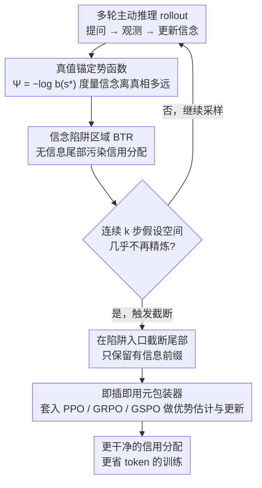

# Reducing Belief Deviation in Reinforcement Learning for Active Reasoning of LLM Agents

**会议**: ICLR 2026 Oral  
**arXiv**: [2510.12264](https://arxiv.org/abs/2510.12264)  
**代码**: [https://github.com/unimpor/T3](https://github.com/unimpor/T3)  
**领域**: LLM Agent  
**关键词**: active reasoning, reinforcement-learning, LLM agent, belief tracking, POMDP, credit assignment

## 一句话总结

提出 T³（Truncating Belief-Trapped Trajectories），基于 POMDP 理论分析 LLM 智能体在多轮主动推理中的"信念陷阱"现象，通过检测信念偏离并截断无信息尾部轨迹来修正 RL 训练中的信用分配错误，在 5 个挑战性任务上获得最高 30 分的性能提升并节省 34% 的 token 开销。

## 背景与动机

1. **主动推理的核心挑战**：LLM 智能体在多轮交互中需要策略性地提问和主动获取信息来完成任务，这要求精确的信念追踪——维护对底层状态和不确定性的准确表示。
2. **信念偏离问题**：由于 LLM 推理能力有限，其内部信念会偏离真实问题状态，导致状态感知丧失和无信息/重复动作，形成"信念偏离"。
3. **RL 训练的恶性循环**：信念偏离产生的无信息轨迹尾部会污染强化学习中的信用分配，使早期有价值的探索动作被错误地惩罚，优势估计甚至可能被反转。
4. **LLM 智能体的多轮困境**：实践中 LLM 智能体经常在多轮推理中生成冗余、无关或无信息的动作，甚至陷入无效循环，RL 训练本身并未完全解决这些问题。
5. **POMDP 中的不完美信念更新**：经典 POMDP 假设完美的贝叶斯信念更新，但 LLM 智能体的信念更新本质上是不完美且有误差的，导致累积偏差。
6. **现有 RL 方法的不足**：标准策略优化（PPO、GRPO 等）未考虑信念陷阱动态，学到的策略在分布外场景中仍表现脆弱，泛化能力不足。

## 方法详解

### 整体框架

T³ 把主动推理建模为 POMDP，用一个真值锚定的势函数刻画"信念离真实状态有多远"，先从理论上证明 LLM 智能体的信念会在有限步后落入无法自拔的"信念陷阱区域"并污染 RL 的信用分配，再用一个可观测的代理信号在陷阱入口处截断轨迹尾部。整套机制做成元包装器，套在 PPO/GRPO/GSPO 等任意策略优化算法外层即可生效：rollout 一边采样一边监控，一旦发现近 $k$ 步不再带来信息就把无信息尾部砍掉，只把有信息前缀交给原算法做优势估计。

### 关键设计

**1. POMDP 建模与真值锚定势函数：把"信念离真相多远"压成一个可度量的实数**

主动推理的难点在于智能体看不到真实状态 $s^*$，只能靠多轮提问逼近它，因此需要一个能衡量"当前信念距离真相多远"的标尺。论文将任务形式化为 POMDP $(S, A, O, T, R, \gamma)$，智能体维护信念状态 $b_t \in \Delta(S)$，据此选动作 $a_t$、收观测 $o_t$ 并更新信念。关键是引入势函数 $\Psi(b) = -\log b(s^*)$：它等于真实状态在当前信念下的负对数概率，$\Psi = 0$ 意味着完全锁定真相、任务完成，值越大说明信念越偏离 $s^*$。这把抽象的"推理进展"压成一个单调可比的实数，后续所有理论分析都围绕 $\Psi$ 的逐步变化展开。

**2. 信念陷阱区域（BTR）与信用分配失败：诊断无信息尾部为何反噬早期探索**

经典 POMDP 假设贝叶斯信念更新完美，但 LLM 受限于推理能力，每一步更新都带误差且会累积。论文用假设 1 把这一直觉形式化：存在常数 $m_\theta > 0$，使得在高不确定性区域 LLM 的信念更新误差至少线性增长于当前偏差本身——偏差越大、校正越难，构成正反馈放大。定理 1 据此证明，在非退化观测和 Lipschitz 策略等条件下，信念轨迹会在有限步后进入一个吸收区域 BTR，区域内期望进展不再变好甚至恶化，即 $\mathbb{E}[\Psi_{t+1} \mid b_t] \geq \Psi_t$；一旦落入，智能体只会输出冗余、重复或无信息的动作，对应实践中常见的"智能体绕圈"。

落入 BTR 真正致命的不是浪费 token，而是污染 RL 训练。定理 2 指出，进入 BTR 后的无信息尾部会扭曲早期探索动作的广义优势估计（GAE）：尾部持续贡献负漂移，当尾部足够长时这股负漂移会主导早期有价值动作的正贡献，把它们的优势估计压成负值、梯度方向因此反转——本该被鼓励的探索反遭惩罚。推论 1 随即给出解药：在 BTR 入口处截断、剔除无信息尾部，就能得到偏差更小、方向更正确的梯度。这条"理论病因→治疗方案"的链条是 T³ 的核心立论。

**3. T³ 截断条件与任务实例化：用可观测代理在陷阱入口触发截断**

BTR 由 $\Psi$ 定义，但 $s^*$ 训练时不可见，无法直接判断何时入陷，因此需要一个可观测代理。定义 2 给出 T³ 条件：若在窗口 $[t-k, t)$ 内假设空间的精炼度量始终满足 $d(H_\tau, H_{\tau+1}) \leq \Delta_{\min}$（连续 $k$ 步几乎没缩小候选假设），则在步骤 $t$ 截断。$H_t$ 是与历史一致的候选假设集合，$d$ 衡量一步问答带来的信息增益。论文按任务实例化这个代理：GuessNumbers 取 $d = |H_\tau| - |H_{\tau+1}|$，猜测一旦超出候选集（$k=1$）即截断；CircuitDecoding 同理，候选集连续 $k=3$ 步不缩减则截断；SituationPuzzles 以评判者反馈"unknown"作未精炼代理，连续 $k=5$ 步触发；PreferenceEstimation 与 MovieRecommendation 监控估计向量与真实偏好的相似度，连续 $k=2$ 步下降则截断。代理虽因任务而异，但都对应"近期问答不再带来信息"这一统一判据。

**4. 即插即用元包装器：零侵入套在任意策略优化算法外**

T³ 不改动任何底层优化逻辑，只在轨迹采样阶段按上述条件截断 rollout，再把截断后的轨迹交给原算法做优势估计与更新。因此它作为元包装器（meta-wrapper）能无缝套在 PPO、GRPO、GSPO 之上，无需重写损失或网络结构。这一设计既保证与主流 RL 流程兼容，也让"保留有信息前缀、丢弃无信息尾部"的收益直接转化为更干净的信用分配和更省 token 的训练。

## 实验结果

### 实验 1：主实验（5 个任务，3 种 RL 算法）

| 方法 | CD (EM) | SP (F1-word) | GN (EM) | PE (Binary Sim) | MR (EM) | 平均排名 |
|------|---------|-------------|---------|-----------------|---------|----------|
| o3-mini | 92.67 | 20.64 | 95.28 | 44.67 | 83.33 | 4.67 |
| Gemini-2.5-Pro | 92.23 | 24.12 | 90.84 | 16.67 | 83.00 | 5.67 |
| PPO | 61.67 | 28.77 | 91.62 | 42.00 | 24.33 | 6.50 |
| **PPO + T³** | **77.83 (+16.2)** | **36.85 (+8.1)** | **93.98 (+2.4)** | **49.00 (+7.0)** | **38.00 (+13.6)** | **4.50** |
| GRPO | 79.33 | 36.46 | 61.26 | 51.67 | 12.00 | 5.50 |
| **GRPO + T³** | **81.33 (+2.0)** | **39.45 (+3.0)** | **91.36 (+30.1)** | **52.33 (+0.7)** | **32.67 (+20.7)** | **3.17** |
| GSPO | 77.67 | 36.63 | 96.07 | 59.00 | 14.67 | 4.33 |
| **GSPO + T³** | **81.00 (+3.3)** | **36.96 (+0.3)** | **99.74 (+3.7)** | **62.00 (+3.0)** | **55.67 (+41.0)** | **2.50** |

T³ 在 18 个指标中的 14 个取得非边际提升。最大提升：GSPO+T³ 在 MR 上 +41.0 分，GRPO+T³ 在 GN 上 +30.1 分。GSPO+T³ 在 GN 上接近完美（99.74）。

### 实验 2：分布外（OOD）泛化

| PE 任务 (PPO) | Vanilla | + T³ | CD 任务 (PPO) | Vanilla | + T³ |
|---------------|---------|------|---------------|---------|------|
| 参考集 S=5 | 40.0 | 44.3 (+4.3) | 候选集 S=10 | 67.8 | 86.3 (+18.5) |
| S=10 | 42.0 | 49.0 (+7.0) | S=15 | 61.7 | 74.7 (+13.0) |
| S=20 | 41.0 | 53.7 (+12.7) | S=20 | 48.2 | 55.8 (+7.7) |
| S=30 | 42.3 | 46.3 (+4.0) | S=30 | 31.5 | 35.7 (+4.2) |

在所有 OOD 设置下 T³ 均一致性提升，证明方法学到了可泛化的主动推理策略。

### 训练效率分析

T³ 通过早期截断减少每次 rollout 的平均 token 数，实现更高的训练效率。在 PPO+CD 上达到 reward 0.65 仅需原始方法 66.4% 的 token；GSPO+GN 上达到 0.96 仅需 76.3% 的 token。训练曲线更稳定，奖励单调或近单调增长，减少了剧烈下降。

## 亮点

- **理论驱动**：从 POMDP 理论严谨推导信念陷阱和信用分配失败机制，定理-假设-推论链条完整
- **即插即用**：T³ 无需修改底层 RL 算法即可集成到 PPO/GRPO/GSPO，实用性极强
- **多维度改善**：同时提升最终性能（最高+41分）、训练稳定性、token 效率（节省34%），以及 OOD 鲁棒性
- **实验验证理论**：对关键理论假设（更新误差增长 Asmp.1、优势漂移 Thm.2）进行了实证验证
- **对前沿模型的启示**：在无界假设空间任务上（SP、PE），RL+T³ 训练的 7B 模型可超越 o3-mini 和 Gemini-2.5-Pro

## 局限性

- **任务特定代理信号**：T³ 条件需要为每个任务设计可观测代理信号（假设空间精炼度量），通用性有待提升
- **假设空间构造**：对于连续或无界假设空间的任务，精确构建 $H_t$ 和度量 $d(\cdot, \cdot)$ 仍然困难
- **理论假设的局限**：假设 1（更新误差线性增长）在实际中可能仅近似成立，且阈值 $U$ 无法直接测量
- **评估任务范围**：主要在信息获取型推理任务上验证，对于更复杂的开放式智能体场景（如网页浏览、代码生成）的适用性待验证

## 相关工作对比

### vs. 标准 RL for LLM（GRPO / PPO without truncation）
标准 RL 方法未考虑信念陷阱动态，允许无信息尾部轨迹参与训练，导致信用分配被系统性污染。T³ 通过截断进入 BTR 后的轨迹，保留有信息前缀的正确信用归属。实验表明 GRPO 在 GN 上仅 61.26，加入 T³ 后跃升至 91.36（+30.1），证明截断对梯度质量的实质性改善。

### vs. 前沿推理模型（o3-mini, Gemini-2.5-Pro）
前沿推理模型在有限可枚举假设空间任务（GN: 95.28, CD: 92.67）上表现强劲，但在假设空间大、连续或无界的任务（SP: 20.64, PE: 16.67）上显著退化。这表明纯规模化 RL+outcome reward 训练不足以应对主动推理，T³ 这类显式处理信用分配的机制可提供互补收益。

### vs. 自我修正/反思方法（Self-Refine, Reflexion）
自我修正方法依赖 LLM 内部反思来改进推理轨迹，但无法解决信念偏离的根源问题——模型本身缺乏不完美信念更新的检测能力。T³ 从训练层面介入，通过外部可观测信号检测信念陷阱并在训练数据层面截断有害轨迹，方法论层次不同且互补。

## 评分

- ⭐⭐⭐⭐⭐ 创新性：从 POMDP 理论推导出信念陷阱→信用分配失败→截断解法的完整链条，概念新颖且理论完备
- ⭐⭐⭐⭐ 实验充分度：5 个任务、3 种 RL 算法、OOD 分析、消融实验、理论验证实验，覆盖面广
- ⭐⭐⭐⭐ 实用价值：即插即用特性使其可直接应用于现有 RL 训练流程，token 节省具有工程价值
- ⭐⭐⭐⭐ 清晰度：理论推导与实践设计衔接自然，代理信号的任务实例化描述清晰

<!-- RELATED:START -->

## 相关论文

- [\[ICML 2026\] On Information Self-Locking in Reinforcement Learning for Active Reasoning of LLM Agents](../../ICML2026/llm_agent/on_information_self-locking_in_reinforcement_learning_for_active_reasoning_of_ll.md)
- [\[AAAI 2026\] MoralReason: Generalizable Moral Decision Alignment For LLM Agents Using Reasoning-Level Reinforcement Learning](../../AAAI2026/llm_agent/moralreason_generalizable_moral_decision_alignment_for_llm_agents_using_reasonin.md)
- [\[CVPR 2026\] SAGE: Training Smart Any-Horizon Agents for Long Video Reasoning with Reinforcement Learning](../../CVPR2026/llm_agent/sage_training_smart_any-horizon_agents_for_long_video_reasoning_with_reinforceme.md)
- [\[ACL 2026\] Hierarchical Reinforcement Learning with Augmented Step-Level Transitions for LLM Agents](../../ACL2026/llm_agent/hierarchical_reinforcement_learning_with_augmented_step-level_transitions_for_ll.md)
- [\[CVPR 2026\] SenseSearch: Empowering Vision-Language Models with High-Resolution Agentic Search-Reasoning via Reinforcement Learning](../../CVPR2026/llm_agent/sensesearch_empowering_vision-language_models_with_high-resolution_agentic_searc.md)

<!-- RELATED:END -->
