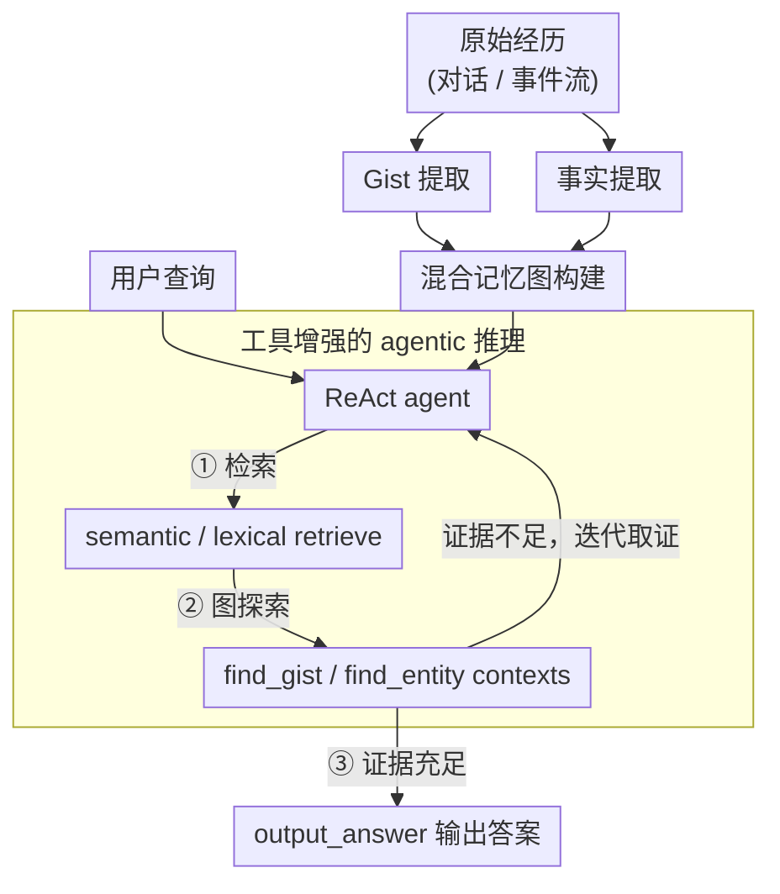

# REMem: Reasoning with Episodic Memory in Language Agents

**会议**: ICLR 2026  
**arXiv**: [2602.13530](https://arxiv.org/abs/2602.13530)  
**代码**: [intuit-ai-research/REMem](https://github.com/intuit-ai-research/REMem)  
**领域**: LLM Agent  
**关键词**: episodic memory, language agent, hybrid memory graph, temporal reasoning, agentic retrieval, gist extraction

## 一句话总结

提出 REMem，一个面向语言 agent 的情节记忆框架，通过混合记忆图（时间感知的 gist 节点 + 事实三元组节点）和工具增强的 agentic 推理，在情节回忆和情节推理任务上分别比 SOTA 提升 3.4% 和 13.4%。

## 研究背景与动机

人类擅长记住具体经历并在时空上下文中进行推理（即情节记忆），但当前语言 agent 的记忆系统存在严重不足：

**语义记忆主导**：现有系统（参数记忆、RAG、GraphRAG）主要存储去上下文化的语义知识，缺乏时空维度

**事件建模缺失**：Mem0 过度筛选信息导致细节丢失，Graphiti 构建以实体为中心的知识图谱丢失连贯的事件上下文，HippoRAG 2 无时间维度建模

**检索不足以支撑推理**：现有方法依赖简单相似性匹配，无法支持复杂的跨事件推理（如时间范围过滤、事件排序、计数查询等）

REMem 的核心设计理念：
- 认知科学表明人类更依赖 gist（要旨）而非逐字记忆来做决策
- 需要将时间、地点、参与者等情境维度显式绑定到事件表示中

## 方法详解

### 整体框架

REMem 要解决的问题是：让语言 agent 像人一样记住"某件事在什么时间、和谁、发生了什么"，并能在这些经历上做跨事件的时间推理。它分两个阶段：先**离线索引**，把一段经历同时抽成捕捉事件要旨的 gist 和结构化的事实三元组（两者都绑时间戳），织成一张「混合记忆图」；再在**在线推理**阶段，让一个 ReAct 风格 agent 拿着专门设计的检索与图探索工具，在这张图上反复取证，直到证据足够才作答，而不是做一次性的相似度检索。整个流程不训练任何模型，索引与推理都由 LLM 驱动。

### 关键设计

**1. Gist 提取：用「要旨」而非逐字记忆承载事件**

认知科学指出人类决策更依赖 gist（要旨）而非逐字回忆，REMem 据此对每个事件或对话会话生成一条或多条自然语言 gist 语句，把参与者、动作、对象、地点、意图、数量等核心信息凝练进一条原子事件描述里。每条 gist 都以参考时间戳起头，并把「上周三」「三天后」这类相对时间表达统一换算成绝对日期，让事件天然带上时间锚点。这一步直接决定了情节记忆的成色——消融中移除 gist 时 LoCoMo 的 LLM-J 从 76.2 暴跌到 48.9（-27.3），是所有模块里影响最大的，印证了 gist 才是情节记忆的主要载体。

**2. 事实提取：保留可时间回溯的结构化证据**

仅有 gist 不足以支撑计数、排序这类精确推理，REMem 进一步从原文和已抽出的 gist 中提取 $(\text{subject},\text{predicate},\text{object})$ 三元组，并给每个三元组附上 Wikidata 风格的时间限定符 `point_in_time`、`start_time`、`end_time`。关键之处在于它不删除「过期」事实，而是把潜在矛盾的历史记录全部保留下来，这样「某人去年住在哪、今年又搬到哪」这类需要回看历史的时间查询才有据可查。Fact 对推理任务的贡献更突出，移除后 Complex-TR 的 LLM-J 下降 2.4。

**3. 混合记忆图构建：概念级与上下文级信息统一编织**

纯实体图丢事件上下文、纯向量库丢结构，REMem 把前两步的产物统一织进一张图来同时兼顾两者。gist 节点承载上下文级的情节表示，连向从同一文本块抽出的短语节点；短语节点是概念级表示，每条 fact 的 subject 与 object 短语节点之间由 predicate 边直接相连。此外，仿照 HippoRAG 2，在 embedding 相似度超过阈值 $0.8$ 的 gist 节点之间补一条同义边，让语义接近但措辞不同的记忆能互相跳转。于是这张图既能沿概念边做实体关联，又能沿 gist 还原完整事件叙事。（同义边属锦上添花：消融显示移除它 LLM-J 几乎不变，主要影响 F1/BLEU-1 的召回与表面鲁棒性。）

**4. 工具增强的 agentic 推理：把检索变成可迭代的取证过程**

有了这张图，推理端不再做单步相似度匹配，而是用一个 ReAct 风格 agent 在图上多轮取证。它配三类工具：检索工具 `semantic_retrieve`（embedding）/`lexical_retrieve`（BM25）负责带时间过滤地捞种子节点，图探索工具 `find_gist_contexts`/`find_entity_contexts` 负责从种子出发做定向扩展，流程控制工具 `output_answer` 负责收尾；每次检索/探索都同时返回相关的 gist 和 fact。

| 工具类别 | 工具名 | 核心参数 |
|---------|--------|---------|
| 检索工具 | `semantic_retrieve` | query, start_time, end_time, 时间运算符 |
| 检索工具 | `lexical_retrieve` | query, start_time, end_time, 时间运算符 |
| 图探索 | `find_gist_contexts` | gist_id, 时间范围 |
| 图探索 | `find_entity_contexts` | subject, object, predicate, 时间范围, limit, ordering, offset, aggregation |
| 流程控制 | `output_answer` | answer |

agent 遵循「检索 → 图探索 → 作答」的三阶段协议：先用语义/词法检索拿到种子节点和粗粒度线索（候选实体 ID、时间窗、话题提示），把复杂问题拆成子查询；再以种子节点为起点定向探索，补齐事件级叙述与时间锚点证据；证据充分后才调用 `output_answer`，结合整段交互历史里的 gist 与 fact 做最终推理。其中 `find_entity_contexts` 能直接做时间范围过滤、排序（ordering）、偏移（offset）、聚合（aggregation）等逻辑操作，使得「按时间排序后取第三个」「统计某时间段内发生几次」这类查询不再依赖脆弱的相似度匹配——这正是 REMem 在 Test of Time 上 EM 唯一突破 90% 的直接支撑。两种检索工具互补：语义检索利于概念关联，词法检索提升表面形式覆盖，消融中各自移除都会带来可见下降。

## 实验关键数据

### 主实验 — 情节回忆

| 方法 | LoCoMo LLM-J | REALTALK LLM-J |
|------|-------------|---------------|
| NV-Embed-v2 (RAG) | 73.0 | 59.5 |
| Mem0 | 49.7 | 14.3 |
| Graphiti | 52.5 | 35.3 |
| HippoRAG 2 | 74.0 | 55.8 |
| **REMem-S** | **77.5** | **65.3** |
| **REMem-I** | 76.2 | 63.7 |

REMem-S 在 LoCoMo 上 LLM-J 达 77.5%（+3.5 vs HippoRAG 2），REALTALK 上达 65.3%（+9.5 vs HippoRAG 2）。

### 主实验 — 情节推理

| 方法 | Complex-TR LLM-J | Test of Time EM |
|------|-----------------|----------------|
| NV-Embed-v2 (RAG) | 80.4 | 68.9 |
| NV-Embed-v2 + TISER | 88.3 | 68.9 |
| HippoRAG 2 | 81.5 | 66.9 |
| **REMem-I** | **89.6** | **93.1** |
| REMem-I + TISER | 92.0 | 90.6 |

REMem-I 在 Test of Time 上 EM 达 **93.1%**，是唯一超过 90% 的方法。相比 Full-Context（79.7%），提升 **+13.4pp**。

### 消融实验

| 变体 | LoCoMo LLM-J | Complex-TR LLM-J |
|------|-------------|-----------------|
| REMem-I（完整） | 76.2 | 89.6 |
| w/o Gists | 48.9 | 80.9 |
| w/o Facts | 74.1 | 87.2 |
| w/o 同义边 | 76.4 | 89.2 |
| w/o semantic_retrieve | 72.8 | 88.1 |
| w/o lexical_retrieve | 76.8 | 87.5 |

- **移除 Gists 影响最大**：LoCoMo 上 LLM-J 从 76.2 暴跌至 48.9（-27.3），验证 gist 是情节记忆的核心载体
- **Facts 对推理更重要**：Complex-TR 上移除 facts 导致 -2.4 下降
- **两种检索工具互补**：语义检索利于概念关联，词法检索提升表面形式覆盖

### 关键发现

1. **拒答行为**：REMem 在不可回答问题上 F1 = 64.0%（Precision 73.3%），远优于 Graphiti（F1 53.1%）和 Mem0（F1 13.5%），拒答行为更加精准平衡
2. **Token 效率**：LoCoMo 每个 query 平均输入 9K token（REMem-I）或 0.9K token（REMem-S），vs Full-Context 的 26K token
3. **人类评估**：LLM 判官与人类评分 93% 一致，验证了 LLM-as-judge 评测方案的可靠性
4. **错误分析**：主要错误类型为选择/定位错误（46%）、时间/数值推理错误（19%）、有证据但拒答（18%）

## 亮点与洞察

1. **认知科学驱动的设计**：基于 gist-based 记忆理论和情境模型理论，将心理学概念工程化
2. **混合图结构的灵活性**：概念级（fact 三元组）和上下文级（gist）的统一表示，兼顾细粒度和全局理解
3. **唯一突破 90% EM**：在 Test of Time 基准上是唯一超过 90% 的方法，展示了时间推理的强大能力
4. **迭代推理 vs 单步检索的分化**：REMem-I 在推理任务上远优于 REMem-S（EM 93.1 vs 72.5），但在回忆任务上差异较小
5. **精心设计的工具接口**：`find_entity_contexts` 支持时间过滤、排序、偏移、聚合等操作，是推理能力的关键支撑

## 局限性

1. 索引阶段依赖 LLM 提取，gist/fact 的质量受 LLM 能力限制
2. 离线批量索引模式，流式记忆构建是工程挑战
3. Agentic 推理的多步工具调用增加了推理延迟和成本
4. 主要使用 GPT-4.1-mini 作为 LLM，对其他模型的泛化性未充分验证
5. 消融显示同义边影响较小（LLM-J 仅 -0.2~-0.4），投入产出比有待审视

## 相关工作与启发

- **与 HippoRAG 的关系**：HippoRAG 受海马体启发构建知识图谱用于关联检索，但缺乏时间和事件维度；REMem 显式建模时间线和情境维度
- **与 Mem0 的关系**：Mem0 过度筛选导致记忆稀疏，REMem 保留全面的 gist 和 fact 记录
- **与 TISER 的关系**：TISER 是纯提示方法指导时间推理，可与 REMem 互补叠加使用（+TISER 在 Complex-TR 上 LLM-J 从 89.6 提升至 92.0）
- **对 agent 系统的启发**：情节记忆是 agent 个性化和持续学习的基础，REMem 提供了实用的工程化方案

## 评分

- **创新性**: ⭐⭐⭐⭐ — 混合记忆图设计新颖，工具化推理思路清晰
- **实用性**: ⭐⭐⭐⭐⭐ — 直接适用于对话 agent 的长期记忆增强
- **实验完整度**: ⭐⭐⭐⭐⭐ — 四个基准、全面对比、消融分析、人类评估、错误分析
- **写作质量**: ⭐⭐⭐⭐ — 结构清晰，表格信息密集，但部分描述偏冗长
- **综合评分**: ⭐⭐⭐⭐ — 在情节记忆领域建立了强基线，工程贡献大于理论贡献

<!-- RELATED:START -->

## 相关论文

- [\[ICML 2026\] Scaling, Benchmarking, and Reasoning of Vision-Language Agents for Mobile GUI Navigation](../../ICML2026/llm_agent/scaling_benchmarking_and_reasoning_of_vision-language_agents_for_mobile_gui_navi.md)
- [\[ACL 2026\] Lightweight LLM Agent Memory with Small Language Models](../../ACL2026/llm_agent/lightweight_llm_agent_memory_with_small_language_models.md)
- [\[CVPR 2026\] WorldMM: Dynamic Multimodal Memory Agent for Long Video Reasoning](../../CVPR2026/llm_agent/worldmm_dynamic_multimodal_memory_agent_for_long_video_reasoning.md)
- [\[ACL 2026\] CLAG: Adaptive Memory Organization via Agent-Driven Clustering for Small Language Model Agents](../../ACL2026/llm_agent/clag_adaptive_memory_organization_via_agent-driven_clustering_for_small_language.md)
- [\[ICLR 2026\] Meta-RL Induces Exploration in Language Agents](meta-rl_induces_exploration_in_language_agents.md)

<!-- RELATED:END -->
