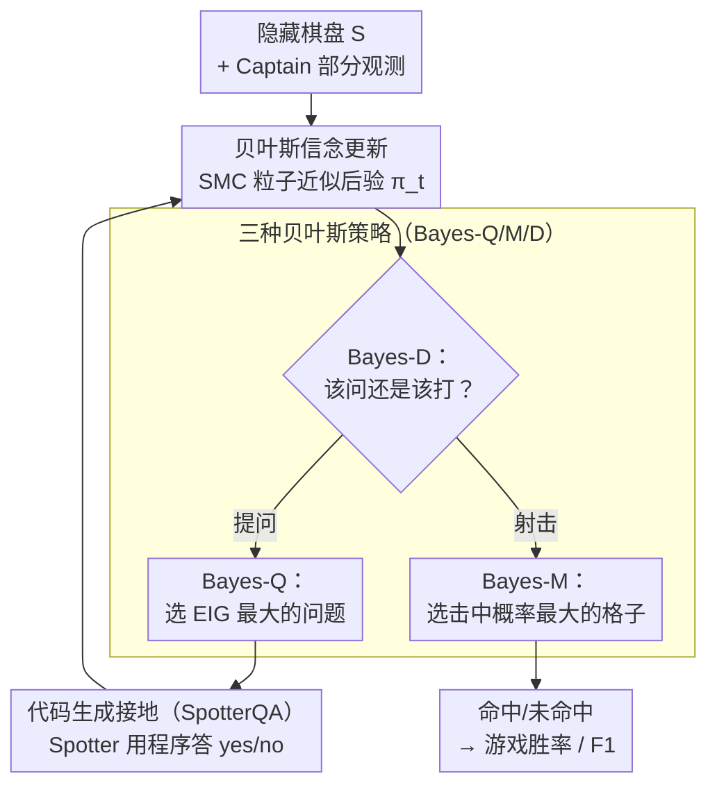

# Shoot First, Ask Questions Later? Building Rational Agents that Explore and Act Like People

**会议**: ICLR 2026  
**arXiv**: [2510.20886](https://arxiv.org/abs/2510.20886)  
**代码**: [项目页面](https://gabegrand.github.io/battleship)  
**领域**: LLM智能体 / 认知科学  
**关键词**: 信息搜索智能体, 贝叶斯实验设计, 语言模型推理, 探索-利用权衡, 蒙特卡洛推断

## 一句话总结
提出 Collaborative Battleship 任务评估语言模型的信息搜索能力，设计三种贝叶斯推断策略（Bayes-Q/M/D）增强 LM 的提问、行动和决策能力，使弱模型（Llama-4-Scout）以 GPT-5 约 1% 的成本达到超人表现（82% 胜率）。

## 研究背景与动机
- 许多 AI 应用（科学发现、医疗诊断）需要智能体战略性地获取信息：形成假设、提出针对性问题、在不确定性下做决策
- 当前语言模型主要被优化来回答用户问题，但能否为自己提出好问题？
- 需要评估和提升前沿模型在动态环境中提出目标导向问题和采取行动的能力
- **核心动机**：借鉴人类认知的资源理性（resource rationality）理论，用贝叶斯实验设计增强 LM 的信息搜索能力

## 方法详解

### 整体框架
作者把信息搜索拆成一个 Collaborative Battleship 协作游戏：Captain 只看到部分棋盘，要在「提问探索」和「射击利用」之间权衡，Spotter 看到完整棋盘只负责回答 yes/no。围绕这个游戏，先用 126 局人类对局（N=42）建起 BattleshipQA 基准，再把贝叶斯实验设计套到 LM 上，分别在提问、行动、决策三个环节注入贝叶斯最优推断，最后在 Guess Who? 上验证策略能不能迁移。整条链路是一个回环：Captain 对隐藏棋盘维护一个信念分布，每轮先由决策模块判断该问还是该打，若提问就选信息量最大的问题、让 Spotter 用程序回答、再回头更新信念，若射击就选击中概率最大的格子。所有增强都发生在推断时，不涉及任何训练。

### 关键设计

**1. 贝叶斯信念更新：把对话历史压缩成对隐藏棋盘的后验**

整套方法的地基是对隐藏棋盘 $S \in \mathcal{S}$ 维护一个信念分布 $\pi_t(s) = \Pr(S=s \mid x, \mathcal{H}_{1:t})$，其中 $\mathcal{H}_{1:t}$ 是到第 $t$ 步的问答历史。难点在于 Spotter 会答错，所以观测被建成一个二元对称信道 $\text{BSC}(\varepsilon)$（取 $\varepsilon=0.1$），每收到一个回答 $\tilde{a}_t$ 就按 $\pi_{t+1}(s) \propto \pi_t(s)\big[(1-\varepsilon)\mathbf{1}\{\tilde{a}_t = f_{q_t}(s)\} + \varepsilon\mathbf{1}\{\tilde{a}_t \neq f_{q_t}(s)\}\big]$ 更新——答案与假设 $s$ 一致就乘 $1-\varepsilon$，否则乘 $\varepsilon$，从而对噪声留有余地。假设空间太大无法精确求和，作者用序贯蒙特卡洛（SMC）的一组粒子近似 $\pi_t$，既能跟上多轮更新的计算量，又天然容纳 Spotter 的错误回答。

**2. 三种贝叶斯策略：在提问、行动、决策三处各替 LM 做一次最优选择**

有了信念分布，三个环节就能各自调用贝叶斯最优解。提问端的 **Bayes-Q** 先让 LM 采样一批候选问题 $\mathcal{Q}$（最多 10 个），再选期望信息增益最高的 $q_t^* = \arg\max_{q \in \mathcal{Q}} \text{EIG}_\varepsilon(q \mid x, \mathcal{H}_{1:t})$；在 BSC 噪声下 EIG 有闭式解 $\text{EIG}_\varepsilon = H_b(\varepsilon + (1-2\varepsilon)p_t) - H_b(\varepsilon)$，当问题把后验劈成对半（$p_t \approx 1/2$）时取最大，等于自动偏好「答案最不确定」的问题。行动端的 **Bayes-M** 不再让 LM 凭感觉开火，而是直接选当前击中概率最大的格子 $u_t^* = \arg\max_u p_t^{\text{hit}}(u \mid x, \mathcal{H}_{1:t})$。决策端的 **Bayes-D** 做一步前瞻来回答「该问还是该打」：若提问后预期的击中概率 $\gamma \cdot \widehat{p_{t+1}^{\text{hit}}}(q_t^*)$ 仍高于当下立即射击的 $p_t^{\text{hit}}(u_t^*)$ 就继续提问，否则开火，其中 $\gamma = 0.95$ 略微偏向当前行动、抑制无谓拖延。三者分工的逻辑是让 LM 出自然语言的创意，把「选哪个最优」交给贝叶斯计算。

**3. 代码生成接地（SpotterQA）：让 Spotter 用程序而非直觉回答问题**

信念更新依赖 Spotter 答得准，但自然语言问题（如「最长的船在右半边吗」）直接问模型容易出错。作者改让 Spotter 把问题翻译成一段 Python 程序，在假设空间上执行后再返回 yes/no，等于把模糊的语言判断变成可执行的形式化判定。这种代码接地相比直接回答和 CoT 基线把回答准确率提升约 14.7%，直接喂给上面的贝叶斯更新就让整条链路的噪声更小、信念更可靠。

## 实验关键数据

### 主实验（CaptainQA - 完整游戏）

| Captain 策略 | Llama-4-Scout F1 | GPT-4o F1 | GPT-5 F1 | 说明 |
|-------------|-----------------|-----------|----------|------|
| LM only | 0.367 | 0.450 | 0.716 | 纯 LM 基线 |
| +Bayes-Q | 0.388 | 0.476 | 0.717 | 仅提问增强 |
| +Bayes-M | 0.621 | 0.663 | 0.731 | 仅行动增强 |
| +Bayes-QM | 0.733 | 0.753 | 0.734 | 提问+行动 |
| +Bayes-QMD | 0.764 | 0.782 | — | 全增强（超人） |
| 人类平均 | — | — | — | F1 ≈ 0.6-0.7 |

### SpotterQA 回答准确率

| 模型 | Base | CoT+Code | 提升 |
|------|------|----------|------|
| GPT-4.1 | 75.2% | 90.9% | +15.7% |
| Claude 4 Opus | 86.8% | 94.4% | +7.6% |
| Llama-4-Scout | 62.2% | — | — |
| 人类 | 92.5% | — | — |

### 关键发现
- **弱模型通过贝叶斯增强达到超人水平**：Llama-4-Scout 的胜率从 8% 跳到 82%（vs 人类），从 0% 到 67%（vs GPT-5），成本仅为 GPT-5 的约 1%
- **高 EIG 提问不够**：Bayes-Q 单独提高 EIG 但游戏表现仅略有提升，Bayes-M 的行动增强才是关键
- **冗余问题消除**：Bayes-Q 将 Llama-4-Scout 的零信息增益问题从 18.5% 降至 0.2%
- **GPT-5 已有高效内部策略**：贝叶斯增强对 GPT-5 几乎无效，暗示其内部已实现类似推理
- **技巧型玩家先问后打但不全问**：人类和 GPT-5 平均只问 8 个问题（上限 15），但每个问题信息量更大

## 亮点与洞察
- 巧妙的实验设计：用经典游戏（海战棋）作为贝叶斯实验设计的可控测试平台
- "资源理性"视角独特——不追求全局最优，而是在有限资源下最大化效用
- 推断时缩放（inference-time scaling）的精彩示例：无需训练，仅靠采样+排序就大幅提升性能
- 代码生成作为接地手段，将模糊的自然语言问题转化为可执行程序

## 局限与展望
- 环境相对简单（8×8 棋盘），泛化到复杂真实世界场景需进一步验证
- Spotter 噪声 $\varepsilon$ 固定为 0.1，实际中应自适应估计
- 贝叶斯策略依赖可高效采样的"世界模型"，对于无法手工实现的领域需要学习生成模型
- 没有建模语用学（pragmatics）——人类对话中的上下文依赖问题仍是挑战
- 在 Guess Who? 上的泛化验证虽好，但任务复杂度仍有限

## 相关工作与启发
- Battleship 任务源自认知科学（Gureckis 2009, Rothe 2017-2019），本文首次扩展为多轮对话+完整游戏
- 贝叶斯实验设计（BED）理论（Lindley 1956, Chaloner 1995）的现代 LM 实例化
- 资源理性理论（Anderson 1990, Lieder 2020）指导了策略设计——追求"足够好"而非最优

## 评分
- 新颖性: ⭐⭐⭐⭐⭐ 认知科学+BED+LM 的独特交叉研究
- 实验充分度: ⭐⭐⭐⭐⭐ 人类实验+15个LM+消融+Guess Who泛化
- 写作质量: ⭐⭐⭐⭐⭐ 叙事流畅，理论与实验完美结合
- 价值: ⭐⭐⭐⭐⭐ 对构建理性信息搜索智能体有重要启发

<!-- RELATED:START -->

## 相关论文

- [\[ICML 2025\] From Passive to Active Reasoning: Can Large Language Models Ask the Right Questions under Incomplete Information?](../../ICML2025/llm_agent/from_passive_to_active_reasoning_can_large_language_models_ask_the_right_questio.md)
- [\[ACL 2025\] AndroidGen: Building an Android Language Agent under Data Scarcity](../../ACL2025/llm_agent/androidgen_agent_data_scarcity.md)
- [\[ICML 2026\] Think Twice Before You Act: Enhancing Agent Behavioral Safety with Thought Correction](../../ICML2026/llm_agent/think_twice_before_you_act_enhancing_agent_behavioral_safety_with_thought_correc.md)
- [\[ACL 2026\] Don't Act Blindly: Robust GUI Automation via Action-Effect Verification and Self-Correction](../../ACL2026/llm_agent/don39t_act_blindly_robust_gui_automation_via_action-effect_verification_and_self.md)
- [\[ACL 2026\] AnchorMem: Anchored Facts with Associative Contexts for Building Memory in Large Language Models](../../ACL2026/llm_agent/anchormem_anchored_facts_with_associative_contexts_for_building_memory_in_large_.md)

<!-- RELATED:END -->
