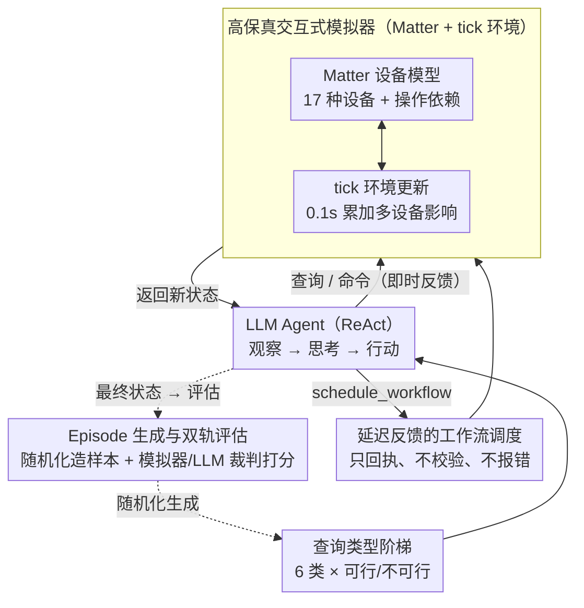

# SimuHome: A Temporal- and Environment-Aware Benchmark for Smart Home LLM Agents

**会议**: ICLR 2026  
**arXiv**: [2509.24282](https://arxiv.org/abs/2509.24282)  
**代码**: [https://github.com/holi-lab/SimuHome/](https://github.com/holi-lab/SimuHome/)  
**领域**: LLM Agent  
**关键词**: 智能家居, LLM Agent, 工作流调度, 时间推理, 交互式模拟器

## 一句话总结
提出 SimuHome，一个基于 Matter 协议的时间加速智能家居模拟器及 600 episode benchmark，首次模拟设备操作对环境变量的持续影响并评估工作流调度能力，发现工作流调度是当前 LLM agent（包括 GPT-5.1）最难突破的挑战。

## 研究背景与动机
**领域现状**：智能家居 agent（如 Amazon Alexa、Google Home）是最早大规模商业化的 tool agent，但许多日常家居请求仍超出其能力。当前研究借助 LLM 构建更强的智能家居 agent，需要处理从简单命令到复杂时序协调的多层次任务。

**现有痛点**：
   - **不模拟环境变化**：HomeBench、Sasha、SAGE 等 benchmark 都不模拟设备操作如何持续影响环境变量（如温度、湿度）。设定空调到 25°C 不会瞬间改变温度，温度是逐渐下降的，agent 需要观察这个过程
   - **不执行操作依赖**：真实设备有操作依赖（如空调必须先开机再调温度），现有 benchmark 不建模这一点
   - **不支持时序调度评估**：如"洗碗机结束后开厨房灯"需要 agent 查询剩余时间、计算完成时刻、注册定时任务，现有 benchmark 无法评估
   - **静态数据不够**：一个用户请求可能有多种有效操作序列，固定标注无法覆盖。agent 需要在交互式环境中操作并验证结果

**核心矛盾**：LLM agent 需要在动态、有物理约束的环境中执行复杂时序推理，但没有合适的模拟器和 benchmark 来训练和评估这种能力。

**本文目标**：构建一个高保真、交互式、支持时间加速的智能家居模拟器，以及覆盖 6 种查询类型（含可行/不可行变体）的系统化 benchmark。

**切入角度**：基于 Matter 协议（全球智能家居通信标准）建模设备行为，确保模拟器中的设备操作约束与真实物理设备一致，支持从模拟到现实的迁移。

**核心idea**：Matter 协议 + tick-based 确定性环境模拟 + 时间加速 + 6种查询类型×可行/不可行 = 评估 LLM agent 在真实智能家居场景中的全部能力。

## 方法详解

### 整体框架
SimuHome 要解决的是：现有智能家居 benchmark 都把环境当静态的、把设备操作当一锤子买卖，无法考查 LLM agent 在真实物理约束下的时序推理。它的方案由两块拼成——一个基于 Matter 协议的**交互式模拟器**（设备操作会持续改变温度、湿度等环境变量，并支持时间加速，几秒内跑完"等洗碗机结束"这类长流程），和一套 **600 episode 的 benchmark**（6 种查询类型 × 可行/不可行，共 12 个评估类别）。运行时，agent 在 ReAct 框架下与模拟器循环交互：拿到一条用户查询后先观察设备与环境状态，再发命令或注册定时工作流，模拟器按确定性时间步推进、返回新状态，直到任务完成，最后由模拟器或 LLM 裁判判分。

### 关键设计

**1. 查询类型阶梯：6 种查询 × 可行/不可行，把时序推理负担逐级加压**

固定标注、单一难度无法刻画"从读一个值到多设备时刻协调"的能力跨度，benchmark 因此按能力需求把任务排成由易到难的六级阶梯：QT1 状态查询（"厨房湿度多少？"）→ QT2 隐式意图推断（"感觉好闷"→推断需除湿→开除湿器）→ QT3 显式设备控制（指定设备与目标值，须遵守操作依赖）→ QT4-1 时间调度（"10 分钟后关灯"）→ QT4-2 事件驱动调度（"洗碗机完成后关灯"，需查剩余时间→算完成时刻→注册工作流）→ QT4-3 协调调度（"洗碗机和洗衣机同时完成"，需算双方剩余时间→反推各自启动时间）。从 QT1 到 QT4，任务从"读一个值"递进到"算准多个设备的时刻并提前注册"，时序推理负担逐级加重。每一类还都配一个**不可行变体**（设备不存在 / 超物理极限 / 时间矛盾），逼 agent 学会识别并解释为什么做不到，而不是硬编一个动作——这样断崖式的成功率下降就能精确定位瓶颈出在哪一级。

**2. 高保真交互式模拟器：Matter 协议建模 + tick 环境更新，让环境"有脾气、会渐变"**

以往 benchmark 里设备说开就开、说调就调，既没有真实设备的操作依赖，也不模拟"设到 25°C 后温度逐渐逼近"的物理过程，agent 学到的东西迁移不到真机。SimuHome 把这两件事都建进模拟器：一面用全球智能家居通信标准 Matter 协议定义 17 种设备类型的行为，每个设备声明它支持的 Matter clusters（能力组），操作必须遵守协议依赖——空调要先 `PowerOn` 才能调温度，洗衣机得走多阶段运行周期；另一面以 tick（0.1 秒）为最小时间步推进环境，每个 tick 累加所有活跃设备对环境变量（温度、照度、湿度、空气质量）的影响，多设备效应叠加（两台空调高速运转降温更快），并同步刷新各设备传感器读数。因为更新完全由确定性时间步驱动，整个演化可复现；配合时间加速，模拟世界里几十分钟的过程能在几秒内跑完。两者合起来让模拟器的约束与真实设备一致，benchmark 结果有现实参考价值，也为模拟到现实的迁移留了接口。

**3. 延迟反馈的工作流调度接口：QT4 比 QT3 难的结构性根源**

接口给 agent 三类工具：查询设备状态、执行 Matter 命令、注册定时工作流 `schedule_workflow`（接受一个绝对开始时间和一串命令）。关键的刻意设计在于：调度只返回"已注册"回执，既不预先校验这些命令到执行时刻是否还能成功，执行时真失败了也不返回任何错误。这是在模仿真实智能家居平台——设备状态可能在"注册"和"执行"之间发生变化，平台不会替你兜底。正是这种"延迟反馈"让 QT4 在结构上就比 QT3 难：QT3 里 agent 发一条命令就能立刻看到成败并改正（即时反馈），QT4 里工作流一旦提交就失去了纠错的反馈回路，错误只能等到执行时刻无声地发生。这一对比也是论文最核心的洞察——QT3 与 QT4 之间的鸿沟不只是任务更复杂，而是反馈结构的根本差异。

**4. Episode 生成与双轨评估：随机化造多样性，双轨验证保客观**

同一请求往往有多种有效操作序列，固定标注覆盖不全，于是 episode 靠随机化家庭布局、设备状态和环境变量来构造多样性，走三步：(a) 依赖感知地随机初始化设备状态（保证初始状态本身合法）；(b) 生成结构化目标和前置动作要求（如必须先调 `get_room_devices()` 才算合规，防止 agent 靠瞎猜蒙对）；(c) 用 GPT-5 mini 生成自然语言查询，再由两名研究生独立校验，标注一致性 Cohen's $\kappa=0.92$（衡量两名标注者一致程度的指标，1 为完全一致，0.92 表示高度可靠）。评估分两轨：可行的 QT2–QT4 由模拟器直接验证最终状态是否达标，不可行 episode 和 QT1 则用 LLM-as-a-Judge 三次投票取多数。

### 损失函数 / 训练策略
论文主体是 benchmark，无新训练目标。SFT 实验用 GPT-5.1 跑出的 204 条成功轨迹微调 Gemma3-4B-it 和 Qwen3-32B，用来检验"模仿成功轨迹"能否补上工作流调度能力。

## 实验关键数据

### 主实验（成功率 %）

| 模型 | QT1-F | QT2-F | QT3-F | QT4-1-F | QT4-2-F | QT4-3-F |
|------|-------|-------|-------|---------|---------|---------|
| Llama4-Maverick | 96 | 52 | 88 | 22 | 18 | 32 |
| Qwen3-235B | 86 | 32 | 84 | 26 | 38 | 28 |
| Gemini-2.5-Flash | 92 | 66 | 82 | 22 | 40 | 12 |
| GPT-4.1 | 98 | 44 | 84 | 50 | 46 | 34 |
| Gemini-2.5-Pro | 96 | 60 | 76 | 44 | 60 | 46 |
| **GPT-5.1** | **100** | **80** | **86** | **60** | **72** | **56** |

### 消融实验（推理能力 vs 延迟权衡）

| 模型 | QT3-F 时间(s) | QT4-2-F 时间(s) | QT4-3-F 时间(s) | 是否推理模型 |
|------|-------------|-----------------|-----------------|------------|
| GPT-4.1 | 22.9 | 28.7 | 29.7 | 否 |
| Gemini-2.5-Pro | 66.1 | 57.7 | 53.7 | 是 |
| GPT-5.1 | 78.6 | 135.1 | 112.7 | 是 |

### 关键发现
- **工作流调度是最持久的挑战**：即使是 GPT-5.1，QT4-3（协调调度）成功率也仅 56%。从 QT1/QT3 到 QT4，成功率断崖式下降
- **即时反馈是 QT3 成功的关键**：QT3 中 40%+ 的成功 episode 经历了初始错误后通过工具反馈恢复；而 QT4 的 `schedule_workflow` 没有此反馈机制，agent 无法发现自己的错误
- **推理模型大幅提升但代价高**：GPT-5.1 比非推理模型的 GPT-4.1 在 QT4-2 上提升 26%（46%→72%），但耗时增加 3-5 倍（135s vs 29s），不适合实时智能家居
- **SFT 改善有限**：微调后不可行请求检测提升最大（最多+26%），但可行的工作流调度几乎无改善（QT4-3-F 为 0%），因为时间计算每个 episode 都不同，无法靠模仿学会
- **小模型几乎完全无能**：<7B 模型在大多数任务上成功率为 0，仅 Gemma3-4B-it 在 QT1 上有限成功
- **错误分析**：QT2 以设备控制错误(DC)为主(71%)；QT4 错误更分散——DC(40%)、时间推理(TR, 25%)、动作规划(AP, 19%)

## 亮点与洞察
- **"延迟反馈"的设计哲学是核心洞察**：QT3 和 QT4 之间的性能鸿沟不仅是任务复杂度的问题，而是反馈结构的根本差异——有即时反馈时 agent 可以试错恢复，无反馈时几乎无法自我修正。这对所有 agent 系统的设计都有启示
- **时间加速模拟器的实际价值**：论文不仅用于评估，还提出可作为 agent 预验证环境——在时间加速的模拟器中测试调度方案后再提交到真实环境。这为解决延迟反馈问题提供了一条实际路径
- **Matter 协议的采用非常明智**：确保模拟行为与真实设备一致，使 benchmark 结果有实际参考价值，而非仅在虚构环境中有效

## 局限与展望
- 环境模型相对简单——仅建模单房间内的设备-环境交互，未考虑跨房间影响（如客厅空调对卧室的影响）和跨设备交互（如加湿器+空调的组合效应）
- 17 种设备类型虽已覆盖常见设备，但未包含更复杂的 IoT 设备（如安防系统、语音助手联动）
- 不可行 episode 的设计主要覆盖三类情况（设备不存在/物理极限/时间矛盾），真实场景中还有更多约束（如能耗限制、用户偏好冲突）
- 600 个 episode 规模较小，每个评估类别仅 50 个，统计方差可能较大
- 评估依赖 LLM-as-a-Judge（部分类别），judge 的准确性会影响结果

## 相关工作与启发
- **vs HomeBench**：HomeBench 通过比对 API 调用序列评估，不模拟环境变化。SimuHome 提供交互式环境，支持多种有效操作序列
- **vs SAGE**：SAGE 允许设备状态动态变化但不模拟环境变量的持续变化，也不支持时序调度
- **vs AI2-THOR/ALFRED**：这些是物理导航和物体操作的 3D 环境 benchmark，与智能家居 API 控制是完全不同的问题
- **vs Sasha**：Sasha 聚焦创意意图解读（如"让环境更舒适"），通过人工调查评估。SimuHome 的评估更客观（模拟器验证）且覆盖更多任务类型

## 评分
- 新颖性: ⭐⭐⭐⭐⭐ 首个模拟设备-环境持续交互、支持时间加速和工作流调度评估的智能家居 benchmark，问题设计系统完善
- 实验充分度: ⭐⭐⭐⭐⭐ 18个模型、6种查询类型×可行/不可行、详细错误分析、多种改进尝试（SFT/框架替换/多轮交互/自我修正），分析极其透彻
- 写作质量: ⭐⭐⭐⭐⭐ 逻辑链条清晰，从模拟器设计到 benchmark 构建到实验发现环环相扣，延迟反馈机制的分析尤为精彩
- 价值: ⭐⭐⭐⭐ 对智能家居 agent 研究有重要推动作用，但领域较为垂直，通用性不如前几篇

<!-- RELATED:START -->

## 相关论文

- [\[ICLR 2026\] WebOperator: Action-Aware Tree Search for Autonomous Agents in Web Environment](weboperator_action-aware_tree_search_for_autonomous_agents_in_web_environment.md)
- [\[ICLR 2026\] FingerTip 20K: A Benchmark for Proactive and Personalized Mobile LLM Agents](fingertip_20k_a_benchmark_for_proactive_and_personalized_mobile_llm_agents.md)
- [\[ACL 2025\] SMART: Self-Aware Agent for Tool Overuse Mitigation](../../ACL2025/llm_agent/smart_self-aware_agent_for_tool_overuse_mitigation.md)
- [\[ICLR 2026\] ST-WebAgentBench: A Benchmark for Evaluating Safety and Trustworthiness in Web Agents](st-webagentbench_a_benchmark_for_evaluating_safety_and_trustworthiness_in_web_ag.md)
- [\[ICLR 2026\] A Benchmark for Deep Information Synthesis (DeepSynth)](a_benchmark_for_deep_information_synthesis.md)

<!-- RELATED:END -->
