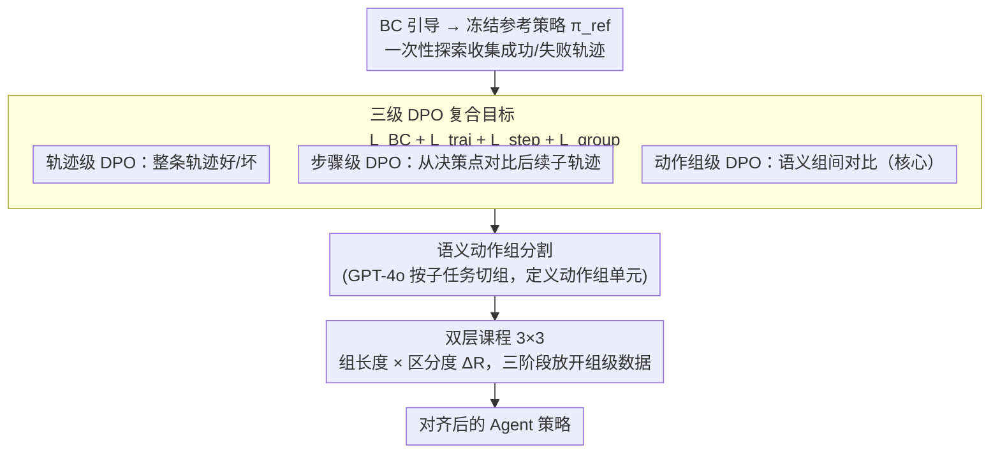

# Solving the Granularity Mismatch: Hierarchical Preference Learning for Long-Horizon LLM Agents

**会议**: ICLR 2026  
**arXiv**: [2510.03253](https://arxiv.org/abs/2510.03253)  
**代码**: 待确认  
**领域**: Agent / 对齐  
**关键词**: hierarchical DPO, preference learning, long-horizon agent, curriculum learning, action group

## 一句话总结
提出 HPL 框架解决长时序 LLM Agent 中偏好学习的粒度不匹配问题，通过三级 DPO（轨迹级+步骤级+动作组级）和双层课程学习（子任务复杂度×样本难度），在 ALFWorld/WebShop/InterCode-SQL 上显著超越 ETO 和 IPR 等基线（平均 59.44 vs 55.43/55.49）。

## 研究背景与动机
**领域现状**：DPO（Direct Preference Optimization）已成为 LLM 对齐的主流方法，但在长时序 Agent 任务中存在粒度不匹配——轨迹级 DPO 信号太粗（无法定位关键决策点），步骤级信号方差太大。

**现有痛点**：现有 Agent 偏好学习方法要么用 outcome-level 奖励（整个轨迹成功/失败），要么用 step-level 但需要大量 rollout 降低方差。两种粒度各有优劣，缺乏统一框架。

**核心矛盾**：太粗 → 无法精确信用分配；太细 → 方差过大，样本效率低。需要"刚好合适"的粒度。

**本文要解决**：设计一个多粒度偏好学习框架，同时利用轨迹级、步骤级和动作组级的偏好信号。

**切入角度**：将动作序列按语义一致性分组（如"导航到厨房"是一个组，"打开冰箱取物品"是另一个组），在组级别做偏好对比。

**核心idea**：三级 DPO 提供互补的信用分配信号 + 双层课程学习从简到难引导训练。

## 方法详解

### 整体框架
HPL 要解决的是长时序 LLM Agent 偏好学习的「粒度不匹配」：轨迹级信号太粗、无法定位是哪一步失误，步骤级信号又太细、方差随时序长度爆炸。它先用 behavior cloning 引导出一个冻结的参考策略 $\pi_{ref}$，让它在任务上一次性探索、收集成功与失败轨迹；然后在同一批轨迹上同时构建轨迹级、步骤级、动作组级三种粒度的偏好对，三个 DPO 损失再与行为克隆项相加成复合目标做联合训练。其中动作组级是核心——它正好填补「轨迹太粗、步骤太细」之间的空档；而动作组怎么切则交给语义分割（GPT-4o 按子任务切组），切出的组级数据再由一个 3×3 的双层课程从易到难调度，最终输出对齐后的 Agent 策略。

### 关键设计

**1. 三级 DPO 复合目标：在三个粒度上同时做信用分配**

长时序任务里，轨迹级偏好只告诉模型"整条轨迹好还是坏"，无法定位是哪一步失误；纯步骤级偏好虽然定位精准，但在 rollout 预算有限时，监督被打散到大量决策点上、每步只靠几条噪声 rollout 更新，方差随时序长度 $T$ 增大而失控。HPL 因此把三种信号叠在一起：轨迹级损失 $L_{traj\text{-}DPO}$ 对比成功/失败的完整轨迹提供全局方向；步骤级损失 $L_{step\text{-}DPO}$ 沿用 IPR 的做法，在每个决策点用参考策略生成一个替代动作并续完整条后续轨迹，与专家的后续轨迹做对比；动作组级损失 $L_{group\text{-}DPO}$ 则对比语义一致的动作组（如"导航到厨房"对"打开冰箱取物"），把多步动作聚成一个监督单元——它在固定 rollout 预算下把估计摊到更长的子轨迹上，方差因此比逐步估计低。最终目标把三者与行为克隆项合在一起：

$$L = L_{BC} + L_{traj} + L_{step} + L_{group}$$

其中 $L_{BC}$ 是行为克隆项，防止策略偏离参考分布太远。组级奖励则用 $M=5$ 次 Monte Carlo rollout 估计每个组的期望终局回报 $\hat{r}(G_i)$。作者还给出理论支撑（Proposition 1）：当每组动作数 $k=\Theta(\log(1/\varepsilon))$ 时，组级 DPO 相比轨迹/步骤级的方差能改善 $\Omega(T/\log(1/\varepsilon))$ 倍、而额外偏差不超过 $\varepsilon$——这正是组级粒度"刚好合适"的数学解释。

**2. 语义动作组分割：分组质量决定组级信号好坏**

组级 DPO 的前提是把动作序列切成有意义的组，切法直接决定信号质量。作者对比了四种分割：Fixed-N 固定切成 $N=3$ 组、Fixed-K 每 $K=3$ 步一组、Uncertainty-based 在策略熵超过 80 百分位处切分、以及用 GPT-4o 按子任务语义切分的 Semantic 方案。实验里 Semantic 分割效果最好（平均 59.44，明显高于 Fixed-N 的 58.45 与 Fixed-K 的 56.74），因为按语义边界切出的组内动作目标一致，组与组之间的偏好对比才不会被混入无关动作的噪声污染——也就是说，组怎么切比切成几组更关键。

**3. 双层课程学习：沿任务复杂度和样本难度两个轴从简到难**

直接把所有偏好对一起喂给模型，长组和难分样本会在早期主导梯度、拖慢收敛。HPL 把训练样本投到一个 3×3 难度矩阵里：纵轴是组长度（代表子任务复杂度），横轴是样本可区分度 $\Delta R = \hat{r}(G_w) - \hat{r}(G_l)$，即胜出组与落败组的估计回报差，$\Delta R$ 越大越好分。训练分三阶段逐步放开难度：Phase 1 只用最容易的桶 $B_{1,1}$（短组+高区分度），Phase 2 扩到 $B_{1,1} \cup B_{1,2} \cup B_{2,1}$，Phase 3 放开全部 9 个桶。这样模型先在简单样本上建立稳定的偏好基础，再逐步消化长组和难分样本，避免一开始就被高方差样本带偏。

## 实验关键数据

### 主实验（Qwen2.5-1.5B）

| 方法 | ALFWorld unseen | WebShop reward | InterCode-SQL | 平均 |
|------|----------------|----------------|---------------|------|
| ETO | 66.42 | 56.57 | 57.67 | 55.43 |
| IPR | 66.67 | 57.76 | 57.17 | 55.49 |
| **HPL(Semantic)** | **74.13** | **60.74** | **58.50** | **59.44** |
| GPT-4o zero-shot | 36.43 | — | — | — |

### 分割策略对比

| 策略 | 平均分数 |
|------|---------|
| **Semantic (GPT-4o)** | **59.44** |
| Fixed-N (3) | 58.45 |
| Uncertainty | 56.95 |
| Fixed-K (3) | 56.74 |

### 消融实验

| 配置 | 效果 |
|------|------|
| Full HPL | **最优** |
| w/o group-DPO | 性能下降 |
| w/o 课程学习 | 长组和困难样本学习受损 |
| w/o step-DPO | 信用分配粗糙化 |

### 关键发现
- Semantic 分割显著优于其他策略（59.44 vs 56.74-58.45），语义一致性是组级 DPO 的关键
- HPL 超越 GPT-4o zero-shot（ALFWorld 74.13 vs 36.43），1.5B 模型训练后远超闭源大模型
- 三级 DPO 的互补性：移除任何一级都降低性能
- 课程学习对困难样本和长组尤其重要

## 亮点与洞察
- **动作组级 DPO** 是一个介于轨迹和步骤之间的"甜蜜点"——粒度恰好匹配子任务边界
- **语义分割 > 固定分割**的发现说明：分组的质量比分组的方式更重要
- 3×3 **双层课程**的设计很实用——同时考虑任务复杂度和样本难度两个维度
- 理论保证（方差改善 $O(T/\log(1/\varepsilon))$）为实践提供了数学支撑

## 局限与展望
- 依赖冻结参考策略的一次性探索收集数据，非在线 RL
- Monte Carlo rollout 数量有限（$M=5$），每步估计方差仍可能较大
- 语义分割依赖 GPT-4o，增加成本和外部依赖
- 未探索自适应粒度选择（不同步骤根据不确定性选择不同粒度）

## 相关工作与启发
- **vs ETO**: ETO 仅用轨迹级信号，无法精确定位失误步骤
- **vs GRPO/GiGPO**: GRPO 用 group-relative advantage，HPL 用 group-level DPO，互补
- **vs RLHF**: HPL 避免了 reward model 训练，直接从偏好对学习
- 可启发多粒度反馈在 Agent 训练中的应用

## 评分
- 新颖性: ⭐⭐⭐⭐ 三级 DPO + 双层课程的组合设计合理且有效
- 实验充分度: ⭐⭐⭐⭐ 三个 benchmark，多种分割策略对比
- 写作质量: ⭐⭐⭐⭐ 理论与实验结合好
- 价值: ⭐⭐⭐⭐ 为长时序 Agent 对齐提供了实用框架

<!-- RELATED:START -->

## 相关论文

- [\[ICLR 2026\] Harnessing Uncertainty: Entropy-Modulated Policy Gradients for Long-Horizon LLM Agents](harnessing_uncertainty_entropy-modulated_policy_gradients_for_long-horizon_llm_a.md)
- [\[ACL 2026\] TiMem: Temporal-Hierarchical Memory Consolidation for Long-Horizon Conversational Agents](../../ACL2026/llm_agent/timem_temporal-hierarchical_memory_consolidation_for_long-horizon_conversational.md)
- [\[ICLR 2026\] The Tool Decathlon: Benchmarking Language Agents for Diverse, Realistic, and Long-Horizon Task Execution](the_tool_decathlon_benchmarking_language_agents_for_diverse_realistic_and_long-h.md)
- [\[ACL 2026\] SOLAR-RL: Semi-Online Long-horizon Assignment Reinforcement Learning](../../ACL2026/llm_agent/solar-rl_semi-online_long-horizon_assignment_reinforcement_learning.md)
- [\[CVPR 2026\] SAGE: Training Smart Any-Horizon Agents for Long Video Reasoning with Reinforcement Learning](../../CVPR2026/llm_agent/sage_training_smart_any-horizon_agents_for_long_video_reasoning_with_reinforceme.md)

<!-- RELATED:END -->
