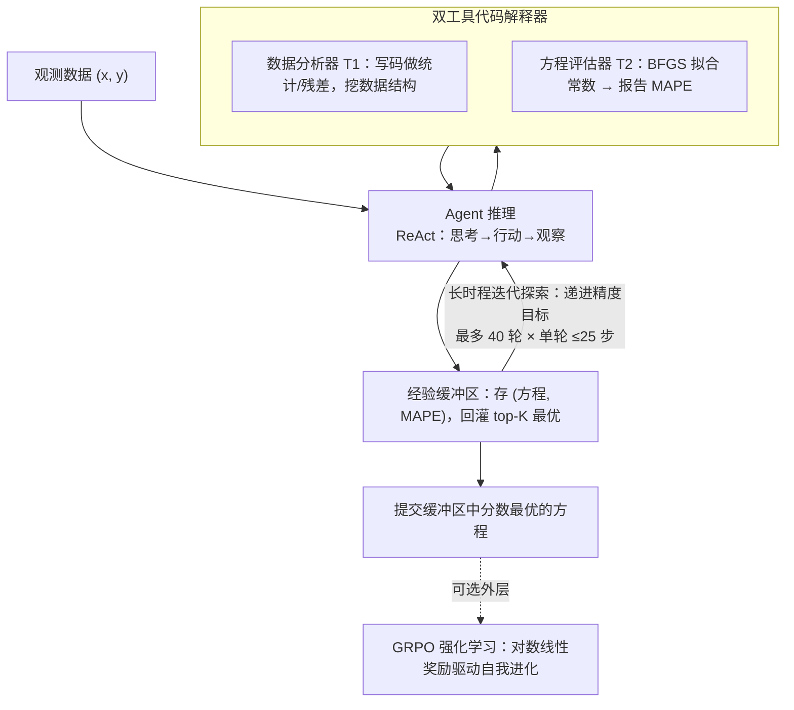

# SR-Scientist: Scientific Equation Discovery With Agentic AI

**会议**: ICLR 2026  
**arXiv**: [2510.11661](https://arxiv.org/abs/2510.11661)  
**代码**: [GitHub](https://github.com/GAIR-NLP/SR-Scientist)  
**领域**: LLM Agent  
**关键词**: symbolic regression, agentic AI, equation discovery, reinforcement-learning, scientific discovery

## 一句话总结

提出 SR-Scientist 框架，将 LLM 从简单的方程提议者提升为自主 AI 科学家，通过代码解释器工具进行数据分析和方程评估，在长时程交互中自主发现科学方程，并结合强化学习进一步提升能力。

## 研究背景与动机

符号回归（Symbolic Regression, SR）旨在从观测数据中发现可解释的数学表达式，是科学发现的基础任务。传统方法主要分为三类：
- **遗传编程（GP）方法**：如 PySR、GPLearn，使用表达式树进行组合搜索
- **深度学习方法**：如 E2E、NeSymReS、DSR，通过神经网络学习从数值到表达式的映射
- **LLM 增强方法**：如 LLM-SR、LaSR，将 LLM 嵌入 GP 算法作为方程提议器

然而，现有 LLM 方法的局限性在于：
1. LLM 仅作为固定流水线中的方程生成器，**缺乏自主性**
2. 无法通过工具直接分析观测数据获取洞察
3. 大多数工作仅关注推理阶段，未探索通过 RL 等方法让模型**自我进化**

本文的核心动机是：构建以 Agentic AI 为核心的科学发现框架，让 LLM 不再是被动工具，而是能驱动整个发现生命周期的自主 Agent。

## 方法详解

### 整体框架

符号回归要从一堆观测数据 $(\mathbf{x}, y)$ 里反推出背后的数学表达式。SR-Scientist 把 LLM 包装成一个在 ReAct 框架下运行的自主 Agent：它不一次性吐出方程，而是反复"推理→调代码工具→看结果"地探索数据，每一步都可以调用两个代码解释器工具去分析数据或评估方程，再把试过的最优方程存进一个跨轮次的经验缓冲区，并在递进的精度目标下迭代多轮（论文设最多 $N=40$ 轮、单轮最多 $M=25$ 步交互），最后提交缓冲区里分数最高的方程。衡量方程好坏的统一指标是平均绝对百分比误差 $\text{MAPE} = \frac{100\%}{n} \sum_{i=1}^{n} \left| \frac{y_i - f(\mathbf{x}_i)}{y_i} \right|$。在这套推理框架之上还可以叠一层 GRPO 强化学习，让模型从自己的探索轨迹中自我进化。

### 关键设计

**1. 双工具代码解释器：让 Agent 能真正"动手"分析数据**

现有 LLM-SR 方法的瓶颈在于 LLM 只能凭文字描述盲猜方程，看不到数据本身。SR-Scientist 把代码解释器封装成两个工具补上这一环：数据分析器 $T_1$ 直接链接到观测数据，Agent 可以写代码做统计、画残差、找变量间的关系，从数据里挖出结构性洞察；方程评估器 $T_2$ 接受一个含常数占位符的方程骨架，内部用 BFGS 把常数拟合到最优再报告 MAPE，把"提出方程形式"和"调常数参数"解耦开。两者配合，Agent 就能像人类科学家一样先观察、再假设、再验证地闭环迭代，而不是一锤子凭空写公式。消融里去掉 $T_1$ 让 GPT 骨干的精度直接掉约 28 个百分点，说明"看得见数据"是这套框架最关键的能力。

**2. 经验缓冲区：用堆结构绕开上下文长度限制**

长时程探索会产生大量候选方程，全塞进上下文既超长又噪声大。SR-Scientist 维护一个缓冲区 $E = \{(e_i, s_i)\}_{i=1}^{N}$ 记录每个探索过的方程 $e_i$ 及其 MAPE 分数 $s_i$，每次迭代开始时只按分数取出最优的 $K$ 个作为上下文示例喂给 Agent。这样既把最有价值的历史经验跨迭代传递下去，又把上下文压在可控长度内，相当于给 Agent 配了一个"只记最佳尝试"的外部记忆。消融显示 top-$K$ 采样优于随机采样，正是因为它稳定地把 Agent 引向已知最好的方向，而不是被一堆平庸尝试稀释注意力。

**3. 长时程迭代探索：给足轮数才能深挖**

发现过程被拆成多次迭代（论文设总迭代数 $N=40$），每次迭代设一个递进的精度目标 $G_i$，并允许 Agent 在单次迭代内进行最多 $M=25$ 步的推理—工具交互。之所以把上限放到 25 步（远超常见的 10～20 步），是因为符号回归本质上是反复试错的活：步数太短，Agent 来不及充分分析数据和打磨方程的细节；实验也证实 25 步是甜点，10 步明显不足，而继续加长则收益递减。这一设计回答了"为什么 Agent 化能赢"——正是足够长的交互预算让数据分析和方程精修有了施展空间。

### 损失函数 / 训练策略

为了让模型不止在推理阶段被动调用、还能自我进化，SR-Scientist 用 GRPO 对 Agent 做强化学习训练。难点在于符号回归的好坏是连续可度量的，直接用二值奖励会丢掉大量梯度信息且过于稀疏，因此奖励被设计成对数线性映射 $\mathcal{R} = \text{clip}\left(\frac{\lg s_{\max} - \lg s}{\lg s_{\max} - \lg s_{\text{goal}}}, 0, 1\right)$，其中 $s$ 是该轨迹最佳方程的 MAPE，$s_{\max}$ 是仍能获得非零奖励的最大 MAPE 上界、$s_{\text{goal}}$ 是该次 rollout 设定的目标精度。取对数是因为 MAPE 往往跨越多个数量级，对数尺度能让"从 10% 降到 1%"和"从 1% 降到 0.1%"获得同等的奖励增量，从而在各精度区间都给出有效的学习信号。训练数据通过规则与模型混合的合成策略构建，覆盖材料科学、化学、生物学、物理学四个领域。

## 实验关键数据

### 主实验

在 LSR-Synth 基准（129 个问题，4 个学科）上的精度结果：

| 方法 | Overall Acc₀.₀₁ | Overall Acc₀.₀₀₁ | 材料科学 Acc₀.₀₁ | 化学 Acc₀.₀₁ | 生物学 Acc₀.₀₁ | 物理学 Acc₀.₀₁ |
|------|-----------------|-------------------|------------------|-------------|---------------|---------------|
| PySR | 29.46 | 14.47 | 53.33 | 25.93 | 16.67 | 25.76 |
| LLM-SR (Qwen-480B) | 41.08 | 18.09 | 80.00 | 36.11 | 30.56 | 28.79 |
| SR-Scientist (GPT-120B) | **63.57** | **49.35** | 74.67 | **81.48** | **66.67** | 40.91 |
| SR-Scientist (GLM) | 48.32 | 25.06 | 81.33 | 45.37 | 40.28 | 36.37 |
| SR-Scientist (Qwen-480B) | 49.09 | 24.55 | **86.67** | 40.74 | 50.00 | 34.09 |
| SR-Scientist (30B) | 32.30 | 16.02 | 81.33 | 22.22 | 22.22 | 18.18 |
| SR-Scientist (30B+RL) | 40.92 | 20.69 | 85.33 | 37.38 | 29.17 | 25.00 |

**核心发现**：SR-Scientist 在四个模型中均超越基线 6%~35%，GPT-OSS-120B 作为骨干时达到最高性能。RL 训练在所有学科上均带来显著提升。

### 消融实验

| 方法 | Acc₀.₀₁ | Acc₀.₀₀₁ |
|------|---------|----------|
| SR-Scientist (GPT) | 63.57 | 49.35 |
| w/o 数据分析器 $T_1$ | 35.66 | 16.28 |
| w/o 经验缓冲区 | 57.36 | 41.86 |
| w/o top-k（随机采样） | 58.14 | 41.86 |

消融分析表明：
- 数据分析工具对 GPT 模型影响最大（下降约 28 个百分点）
- 经验缓冲区对 Qwen 模型影响最大（下降 13.4 个百分点）
- top-k 采样策略优于随机采样

### 关键发现

1. **符号准确率**：SR-Scientist 在完全恢复 ground truth 方程上表现最佳（SA=7.75~8.00），高于 PySR（4.65）和 LLM-SR（5.43）
2. **噪声鲁棒性**：在添加不同标准差的高斯噪声后，SR-Scientist 一致优于其他方法
3. **OOD 泛化**：发现的方程在域外测试数据上仍保持最佳性能
4. **最优交互轮数**：25 轮为最优值，过短（10 轮）不足以深入探索，过长则效益递减
5. **工具使用行为差异**：GPT 系列倾向直接编写残差分析代码，Qwen/GLM 系列更多使用数据统计

## 亮点与洞察

1. **范式转变**：将 LLM 从被动的方程提议者转变为自主的 AI 科学家，这是科学发现领域的重要思路转变
2. **经验缓冲区设计精妙**：用简单的堆结构解决了 LLM 上下文长度限制问题，同时实现了跨迭代的知识传递
3. **连续奖励设计**：利用方程性能可连续度量的特点，设计对数线性奖励避免稀疏性，这比数学/代码任务的二值奖励更加适配
4. **最小人工流水线原则**：Agent 自由决定工作流程，不同模型展现出不同的分析策略（如 GPT 偏好残差分析，Qwen 偏好统计分析）
5. **RL 自我进化有效**：30B 小模型通过 RL 训练后性能接近非 RL 的大模型，验证了 Agent 自我提升的可行性

## 局限性

1. 仅使用文本模型，未利用多模态输入（如图表分析）
2. 噪声场景下仍存在显著性能下降
3. Agent 可能在不同迭代中重复探索已知差劲的方程，记忆系统有优化空间
4. 评估集虽经防记忆设计，但 LSR-Synth 仍为合成数据，与真实科学发现场景存在差距

## 相关工作与启发

- 与 FunSearch（Romera-Paredes et al., 2024）和 AlphaEvolve 等工作相比，SR-Scientist 更强调 Agent 的自主性和长时程交互
- 经验缓冲区+GRPO 的组合为科学发现类 Agent 的 RL 训练提供了范例
- 框架的模块化设计（工具可插拔、骨干模型可替换）具有很好的扩展性，可推广到其他科学发现任务

## 评分

- **创新性**: ⭐⭐⭐⭐ — 将 Agentic AI 范式引入符号回归，结合 RL 自我进化是重要贡献
- **实验充分性**: ⭐⭐⭐⭐⭐ — 4 个学科、5 个骨干模型、精度/泛化/噪声鲁棒/符号准确率全面评估
- **实用性**: ⭐⭐⭐⭐ — 代码开源，框架模块化，但依赖大量 LLM 调用成本较高
- **写作质量**: ⭐⭐⭐⭐ — 结构清晰，算法描述规范，但部分内容可更精简
- **综合评分**: ⭐⭐⭐⭐ (4/5)

<!-- RELATED:START -->

## 相关论文

- [\[ICLR 2026\] NewtonBench: Benchmarking Generalizable Scientific Law Discovery in LLM Agents](newtonbench_benchmarking_generalizable_scientific_law_discovery_in_llm_agents.md)
- [\[ACL 2026\] MOOSE-Copilot: A Web-Based Interactive Assistant for Unified Exploratory and Fine-Grained Scientific Hypothesis Discovery](../../ACL2026/llm_agent/moose-copilot_a_web-based_interactive_assistant_for_unified_exploratory_and_fine.md)
- [\[ICLR 2026\] The Controllability Trap: A Governance Framework for Military AI Agents](the_controllability_trap_a_governance_framework_for_military_ai_systems.md)
- [\[ICLR 2026\] AutoFigure: Generating and Refining Publication-Ready Scientific Illustrations](autofigure_generating_and_refining_publication-ready_scientific_illustrations.md)
- [\[ICML 2025\] Evaluating Retrieval-Augmented Generation Agents for Autonomous Scientific Discovery in Astrophysics](../../ICML2025/llm_agent/evaluating_retrieval-augmented_generation_agents_for_autonomous_scientific_disco.md)

<!-- RELATED:END -->
