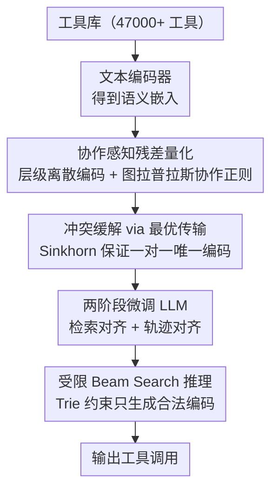

# ToolWeaver: Weaving Collaborative Semantics for Scalable Tool Use in Large Language Models

**会议**: ICLR 2026  
**arXiv**: [2601.21947](https://arxiv.org/abs/2601.21947)  
**代码**: 有  
**领域**: LLM Agent  
**关键词**: 工具使用, 向量量化, 协作语义, 词表扩展, 生成式工具检索

## 一句话总结
提出ToolWeaver，通过协作感知向量量化将每个工具表示为层级离散编码序列（而非单一token），实现词表对数级扩展（47000+工具仅需~512个新token），在ToolBench上全面超越ToolGen基线，同时将语言模型困惑度退化从16.5倍降至4倍。

## 研究背景与动机

**领域现状**：生成式工具使用（如ToolGen）将工具表示为新token，LLM直接"说出"工具名而非从候选列表中检索。但现有"一工具一token"方法面临严重的可扩展性问题。

**现有痛点**：
   - **词表爆炸**：47000个工具→47000个新token，线性增长导致embedding层膨胀
   - **语言能力灾难**：大量新token污染语言模型，ToolGen将困惑度从6.34推高到104.54（16.5×）
   - **语义盲区**：单一token无法编码工具间的协作关系，模型只能从稀疏的tool ID共现中推断协作模式
   - **跨域泛化差**：单一token ID缺乏可迁移的语义结构

**核心矛盾**：需要大规模工具库的紧凑表示，同时编码工具的内在语义（功能）和外在协作模式（共用模式），且不能破坏预训练语言能力。

**本文目标** 设计对数级词表扩展方案，同时编码语义和协作信息。

**切入角度**：受VQ-VAE启发，用残差向量量化（RQ）将工具嵌入量化为多级离散编码——$K^L$个工具只需$L \times K$个新token。再通过图拉普拉斯正则化注入协作信号。

**核心 idea**：用协作感知残差量化将工具编码为层级token序列，实现对数级词表扩展和协作语义建模。

## 方法详解

### 整体框架
ToolWeaver想解决的是：当工具库膨胀到 47000+ 个时，"一工具一 token"既撑爆词表又毁掉语言能力，如何用紧凑且带语义的方式让 LLM 直接"说出"要调用的工具。它的做法是把工具从"一个独立 token"换成"一段层级离散编码序列"——先用文本编码器拿到每个工具的语义嵌入，再用一个协作感知的 RQ-VAE 把这个嵌入量化成 $L$ 级编码 $[\iota_1, \iota_2, \ldots, \iota_L]$，每一级从一个共享码本里挑一个码字。这样工具不再各占一个 token，而是共用一小撮码字组合出来，词表只需 $L \times K$ 个新 token 就能覆盖海量工具。量化完成后，用 Sinkhorn 最优传输消除"两个工具撞到同一段编码"的冲突，保证每个工具有唯一编码；最后分两阶段微调 LLM（检索对齐 + 轨迹对齐），推理时用受限 beam search 把生成约束在合法编码上。

### 关键设计

**1. 协作感知残差量化：用层级码本把工具压成对数级词表，并把"谁和谁常一起用"写进编码**

这是 ToolWeaver 的核心，直接对应"词表爆炸 + 语义盲区"两个痛点。量化部分沿用 RQ-VAE 的残差思路：逐级把工具嵌入的残差量化到最近的码字，第 $l$ 级选 $\iota_{d,l} = \arg\min_k \|r_{d,l} - v_{l,k}\|^2$，再把残差更新为 $r_{d,l+1} = r_{d,l} - v_{l,\iota_{d,l}}$，逐级逼近原嵌入。因为 $L$ 级、每级 $K$ 个码字可以组合出 $K^L$ 种编码，词表规模从"一工具一 token"的线性增长降到对数级——$L=4, K=128$ 时只需 $4 \times 128 = 512$ 个新 token，就能为 47000+ 个工具各分配一段唯一编码。

真正的创新在于往量化里注入协作信号。ToolWeaver 从历史使用轨迹统计工具共现，构造归一化共现矩阵 $A_{uv} = C_{uv}/\sqrt{C_{uu} \cdot C_{vv}}$，再加一条图拉普拉斯正则项

$$\mathcal{L}_{collab} = \sum_{u,v} A_{uv}\|\hat{z}_u - \hat{z}_v\|^2$$

它把"经常一起被调用"的工具在量化嵌入空间里拉近，于是它们的层级编码也会共享更多码字。这样做的好处是把协作关系从稀疏的 tool ID 共现，转写成稠密的 code 级共现：LLM 不必再从罕见的工具 ID 组合里硬推协作模式，而是能直接在更密集的码字层面学到"这几个工具是一伙的"。

**2. 冲突缓解 via 最优传输：让撞编码的工具重新分流，保证一对一**

层级量化压得很紧，难免出现多个工具被映射到同一段编码序列，那它们就无法区分了。ToolWeaver 在最后一级码本上施加一个均匀分布约束，把"工具→码字"的分配建成一个最优传输问题，用 Sinkhorn-Knopp 算法迭代求解：一边要求每个工具被完整分配出去，一边要求每个码字被均匀使用，从而把扎堆的工具摊到不同码字上。相比硬编码去重，这种做法用最优传输的数学结构保证了每个工具最终拿到唯一标识符，且分配更平滑鲁棒。

**3. 受限 Beam Search 推理：把生成约束在合法编码上，不让模型编造不存在的工具**

由于工具现在是多 token 的编码序列，自由生成可能拼出一段根本不对应任何工具的"非法编码"。ToolWeaver 预先把所有有效编码序列建成一棵前缀树（Trie），推理时在每一步根据 Trie 把非法的 next token 全部 mask 掉，beam search 只在合法分支里展开。这样保证模型每次"说"出来的都是一个真实存在的工具编码。

### 损失函数 / 训练策略
量化阶段的目标是 $\mathcal{L}_{tokenize} = \mathcal{L}_{recon} + \mathcal{L}_{quant} + \lambda\mathcal{L}_{collab}$，把重建、码本量化和协作正则三项合在一起，实验中最优权重 $\lambda=1.0$。LLM 端分两步对齐：检索对齐用 489K 条查询-工具对，目标 $\mathcal{L}_{retrieval} = -\mathbb{E}[\log P(\boldsymbol{\iota}_d | q)]$，教模型根据查询生成正确的工具编码；轨迹对齐则在 183K 条调用轨迹上做标准 SFT，把工具编码嵌进完整的多步调用流程里。

## 实验关键数据

### 主实验（ToolBench, 47000+工具）

| 方法 | I1 NDCG@1 | I3 NDCG@1 | I3 SoPR | WikiText-2 PPL |
|------|-----------|-----------|---------|---------------|
| BM25 | 26.92 | 10.00 | - | - |
| ToolRetriever | 75.92 | 28.00 | - | - |
| ToolGen | 88.50 | 81.00 | 36.34% | 104.54 |
| **ToolWeaver** | **91.16** | **88.00** | **52.19%** | **25.36** |

ToolWeaver在检索和任务完成上全面领先，同时语言模型退化从16.5×降至4×。

### 消融实验

| 配置 | 关键发现 |
|------|---------|
| $\lambda=0$（无协作） | I3性能显著下降，验证协作信号对复杂任务至关重要 |
| $\lambda=1$（最优） | 全指标最佳 |
| $\lambda=10$（过强约束） | 性能下降，协作信号覆盖了语义信息 |
| 去掉语义初始化 | NDCG下降~20，语义基础是关键前提 |
| 加入协作引导 | I1提升1-2，I3提升4-5，复杂度越高收益越大 |
| 编码策略对比 | Atomic(ToolGen)/Numerical/Hierarchical/Semantic均不如ToolWeaver |

### 关键发现
- **对数扩展 vs 线性扩展**：512个新token vs 47000个，新token利用率提升16400×
- **语言能力保护**：PPL 25.36 vs 104.54，摘要F1仅下降0.31% vs 2.93%
- **协作信号对复杂任务至关重要**：I3（跨类别多工具）改善最大（+7 NDCG/+15.85 SoPR）
- **语义初始化是基础**：贡献最大的单一因素，说明高质量工具表示是一切的前提
- **简单添加结构不够**：层级编码、语义名称编码都不如ToolWeaver的学习型协作编码

## 亮点与洞察
- **对数词表扩展是根本性的架构改进**：将工具使用从"词表扩展问题"转化为"序列生成问题"，彻底解决了大规模工具库的可扩展性瓶颈。这个思路可推广到任何需要大规模离散实体生成的场景
- **协作正则化的设计精巧**：不是简单地编码语义，而是将使用模式（哪些工具常一起用）注入编码空间，让编码本身就携带协作信号。这使得LLM能从code co-occurrence学习工具组合，比从tool ID co-occurrence稠密得多
- **Sinkhorn最优传输解决编码冲突**：用数学优雅的方式确保唯一性，比硬编码去重更鲁棒

## 局限与展望
- 协作信号依赖高质量共现数据，稀疏或有偏的使用模式可能退化
- 仅在ToolBench上验证，跨域迁移未测试
- 受限beam search增加推理开销（未量化）
- $\lambda$ 需经验调优，缺乏自动设置指导

## 相关工作与启发
- **vs ToolGen**：一工具一token基线，可扩展性差（线性词表+PPL灾难），ToolWeaver在所有指标上全面超越
- **vs ToolRetriever**：基于检索的方法，不是生成式的，在大规模工具库中召回率受限
- **vs RQ-VAE in视觉/推荐**：ToolWeaver将RQ-VAE从图像/商品量化推广到工具语义量化，协作正则化是关键创新

## 评分
- 新颖性: ⭐⭐⭐⭐⭐ 对数词表扩展+协作感知量化是全新的工具表示范式
- 实验充分度: ⭐⭐⭐⭐ 47000工具规模、多种消融、语言能力评估全面
- 写作质量: ⭐⭐⭐⭐ 方法描述清晰，消融分析充分
- 价值: ⭐⭐⭐⭐⭐ 解决了生成式工具使用的核心可扩展性瓶颈，对Agent系统有直接工程价值

<!-- RELATED:START -->

## 相关论文

- [\[ACL 2025\] Adaptive Tool Use in Large Language Models with Meta-Cognition Trigger](../../ACL2025/llm_agent/meco_metacognition_tool_use.md)
- [\[ACL 2026\] Feedback-Driven Tool-Use Improvements in Large Language Models via Automated Build Environments](../../ACL2026/llm_agent/feedback-driven_tool-use_improvements_in_large_language_models_via_automated_bui.md)
- [\[ACL 2025\] ToolHop: A Query-Driven Benchmark for Evaluating Large Language Models in Multi-Hop Tool Use](../../ACL2025/llm_agent/toolhop_multi_hop_tool_use.md)
- [\[ICLR 2026\] AgentSynth: Scalable Task Generation for Generalist Computer-Use Agents](agentsynth_scalable_task_generation_for_generalist_computer-use_agents.md)
- [\[ACL 2026\] Agent-GWO: Collaborative Agents for Dynamic Prompt Optimization in Large Language Models](../../ACL2026/llm_agent/agent-gwo_collaborative_agents_for_dynamic_prompt_optimization_in_large_language.md)

<!-- RELATED:END -->
