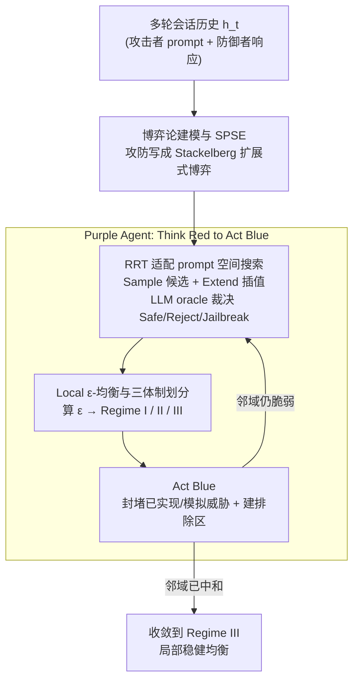

# Toward a Dynamic Stackelberg Game-Theoretic Framework for Agentic AI Defense Against LLM Jailbreaking

**会议**: ICLR 2026  
**arXiv**: [2507.08207](https://arxiv.org/abs/2507.08207)  
**代码**: 无  
**领域**: LLM Agent  
**关键词**: LLM安全, 越狱防御, 博弈论, Stackelberg博弈, RRT搜索

## 一句话总结

将LLM越狱攻防建模为动态Stackelberg扩展式博弈，结合RRT (Rapidly-exploring Random Trees) 探索prompt空间，提出"Purple Agent"防御架构——以"Think Red to Act Blue"理念通过内部对抗模拟预判攻击路径并预防性封堵。

## 研究背景与动机

LLM越狱是当前AI安全的核心挑战。现有防御主要依赖反应式的逐案修补或粗粒度内容过滤（如屏蔽所有暴力相关查询），这些方法面临三大困境：

**多轮对抗的本质**：越狱很少是单次行为，而是攻击者通过多轮对话递进探测模型弱点的战略过程，静态过滤器难以捕获此类"隐蔽"自适应行为

**迭代猫鼠博弈**：手动修补速度慢且成本高，模型的持续更新和微调可能无意中暴露新漏洞

**缺乏理论基础**：启发式防御缺乏对攻防交互的形式化建模，难以推理防御的充分性和完备性

论文的核心洞察是：攻防交互本质上是一个**扩展式博弈**，防御者(Leader)先承诺策略，攻击者(Follower)观察后最优响应。这自然对应Stackelberg博弈框架，由此引出"以红队思维指导蓝队行动"的防御范式。

## 方法详解

### 整体框架

本文要解决的是多轮 LLM 越狱缺乏理论支撑、防御只能逐案反应式修补的问题。方法搭在两层抽象上：先把多轮攻防严格写成一个两人扩展式完全信息博弈 $\Gamma = (N, A, V, E, x_0, H, o_T, u)$，让"防御是否充分"有了可计算的判据；再用一个名为 Purple Agent 的混合元推理器去近似求解这个博弈的均衡。具体流程是：以当前会话历史 $h_t$ 为输入，Purple Agent 一边扮红队、用 RRT 在 prompt 空间里探出可能滑向有害的分支，一边用 Local ε-均衡把每个节点归入三种安全体制，再扮蓝队在危险节点上预防性封堵，如此循环把系统从脆弱状态驱动到稳健的局部均衡（Regime III）后输出。红蓝两套逻辑共享同一棵搜索树，使"预判"与"防御"在同一份会话历史上闭环。

### 关键设计

**1. 博弈论建模与 SPSE：把攻防交互形式化成可逆推的对象**

启发式防御最大的痛点是无法判断"补到什么程度才算够"，根源在缺少形式化模型。本文把交互定义为攻击者（Follower）与防御者（Leader）之间的扩展式博弈，每轮严格遵循 Stackelberg 范式——防御者先承诺响应 $a_{2,t}$，攻击者观察后再选择后续 prompt $a_{1,t}$，这正对应"防御先行、攻击应对"的真实时序。每条对话路径最终落入三类终端结果之一：Safe Interaction、Blocked 或 Jailbreak，收益结构也随之确定：越狱成功时攻击者得 $+1$、防御者得 $-1$，其余情形双方均为 $0$，构成零和。理论上的最优防御就是该博弈的子博弈完美 Stackelberg 均衡（SPSE）：从终端节点逆向归纳回溯，防御者在每个历史节点选使自身价值函数最大化的动作，并把攻击者的最优响应一并纳入预判。SPSE 刻画了"理想防御者"应有的行为，是后续一切近似的基准——但博弈树在自然语言空间里指数爆炸，全局 SPSE 无法求解，这迫使方法退而做局部近似。

**2. RRT 适配 prompt 空间搜索：让博弈树的探索在自然语言里变得可行**

博弈树不可穷举，是上一步退化到局部近似的直接原因；本文借用机器人路径规划中的 Rapidly-exploring Random Trees（RRT），把原本用于连续配置空间的算法迁移到高维自然语言 prompt 流形上。具体地，$\text{Sample}()$ 生成候选 prompt（如角色扮演类话术），$\text{Extend}()$ 在语义最近节点与随机采样之间做插值，从而逐步铺开对 prompt 空间的覆盖；LLM 本身被当作黑箱 oracle 来裁决每个节点：返回 Safe/Redirect 就继续扩展分支，Reject 就剪枝，Jailbreak 则终止该路径。这样 RRT 既高效采样了脆弱区域、避免盲目穷举，又天然对应博弈树的逐节点展开，为 Purple Agent 的红队探索提供了引擎。

**3. Local ε-均衡与三体制划分：用一个可测量的指标刻画当前安全状态**

既然全局均衡算不动，就需要一个能就地评估"当前到底安不安全、离稳健多远"的指标。本文在当前历史 $h_t$ 的局部子博弈里定义近似均衡，用攻击者价值与其上界的差距 $\varepsilon$ 来衡量：

$$\bar{v}_1^{(\tau)}(h_t) \leq v_1^{(\tau)}(h_t) + \varepsilon$$

按 $\varepsilon$ 的大小，任意安全状态被精确归入三种体制。**Regime I（防御者错误）**指当前历史已触发越狱、$v_1^{(\tau)}=1$，此时不等式平凡成立但防御策略本身就是次优的；**Regime II（脆弱安全 / Fragile Safety）**指当前 prompt 表面安全、但语义邻域里密布漏洞，对应 $\varepsilon$ 很大的结构性不稳定；**Regime III（局部均衡）**指当前安全且整个邻域都已被中和、$\varepsilon$ 可忽略，正是防御要驱动系统到达的目标状态。三体制把"安全/不安全"的二元判断细化成带几何含义的分类学，也给蓝队提供了明确的封堵触发条件与收敛终点。

**4. Purple Agent：Think Red to Act Blue，在同一棵树上预判并封堵**

前三步给出了博弈框架、搜索引擎和安全度量，Purple Agent 把它们统一进**单一**系统而非两个独立模块，奉行"Think Red to Act Blue"。Thinking Red 是探索性推理，用设计 2 的 RRT 模拟攻击者如何生成有害 prompt、预判不同查询会怎样滑向风险结果，并用设计 3 的 ε-均衡判定每个节点所处体制；Acting Blue 是防御性干预，从同一棵 RRT 搜索树读取信息，在检测到对抗机会的节点上直接部署封堵。封堵具体有三种手段：对已发现的越狱路径（realized jailbreaks）直接封堵、对 RRT 预判出的模拟威胁（simulated threats）做预防性中和、并在高风险聚类周围创建排除区域，从而把整片脆弱邻域（Regime I/II）一并收敛到目标均衡（Regime III）。红蓝组件通过共享的会话历史 $h_t$ 始终同步，使防御能"以红队思维消灭整片危险区域"而非逐案修补单个 prompt——这正是它相较反应式 guardrails 的本质区别。本文是推理时防御框架，不涉及模型训练，上述驱动到 Regime III 的迭代即为其优化目标。

## 实验关键数据

### 主实验（攻防对比）

在DeepSeek-V3上的攻击与防御动态（5次独立运行的均值±标准差）：

| 方法 | 预算 | 攻击越狱数 | 已实现封堵 | 模拟威胁封堵 | 成功越狱数 |
|------|------|-----------|-----------|------------|-----------|
| Baseline RRT | 50 | 17.6±6.79 | 1.8±1.33 | 0.7±1.21 | 4.2±2.99 |
| Baseline RRT | 200 | 54.4±12.48 | 22.2±11.65 | 12.8±16.96 | 13.3±8.82 |
| Reward-Guided RRT | 50 | 17.0±2.83 | 0.3±0.82 | 1.8±1.47 | 5.0±1.10 |
| Reward-Guided RRT | 200 | 79.0±17.43 | 9.6±7.16 | 9.6±3.44 | 39.4±10.53 |

在200轮预算下，Purple Agent将成功越狱减少约**50%**（79.0→39.4），且平均仅触发约9.6次模拟封堵，表明防御高度精准。

### 消融实验（跨模型泛化）

100轮预算下四个模型的对比：

| 模型 | 方法 | 攻击越狱数 | 防御后成功越狱数 | 抑制率 |
|------|------|-----------|----------------|--------|
| DeepSeek-V3 | Baseline | 34.8 | 7.2 | ~79% |
| DeepSeek-V3 | Reward-Guided | 46.4 | 17.7 | ~62% |
| Llama-3.1-70B | Baseline | 27.2 | 19.4 | ~29% |
| Qwen-Plus | Baseline | 29.4 | 7.4 | ~75% |
| Gemini-2.5-Flash | Baseline | 26.2 | 14.2 | ~46% |

Purple Agent在所有模型上都展现了鲁棒的可迁移性，无需模型特定微调。

### 关键发现

1. **t-SNE可视化验证均衡理论**：攻击模式下越狱prompt形成密集聚类（Regime I/II），Purple Agent防御后变为稀疏孤立点（Regime III），几何上证实了从脆弱安全到稳健均衡的转变
2. **Reward-Guided RRT放大攻击效率**：在高预算下(200轮)，引导式RRT显著优于Baseline（79.0 vs 54.4），说明奖励信号有效锁定脆弱区域边界
3. **"脆弱安全"是对齐LLM的拓扑特征**：跨模型实验表明，Fragile Safety边界是所有对齐LLM的共有特征，攻击者可跨模型利用共享弱点

## 亮点与洞察

1. **博弈论视角的统一**：首次将LLM越狱完整形式化为动态Stackelberg扩展式博弈，提供了评估、解释和强化guardrails的理论基础
2. **RRT与博弈树的巧妙结合**：利用机器人路径规划中的RRT算法探索连续prompt空间，解决了博弈树在自然语言空间中不可穷举的计算难题
3. **三体制分类的理论贡献**：Defender Error / Fragile Safety / Local Equilibrium的划分为理解LLM安全状态提供了精确的分类学
4. **预防性封堵 vs 反应性修补**：Purple Agent通过预判整个语义邻域而非逐案修补，实现了"消灭区域"而非"消灭个体"的防御

## 局限与展望

1. **完全信息假设**：模型假设攻击者可观察防御者的全部输出，实际场景中信息不对称更复杂
2. **单攻击者设定**：未处理多个协同攻击者的情况
3. **防御成功率仍有较大提升空间**：Reward-Guided RRT下成功越狱仍从79降至39.4，约50%的抑制率可能不足以满足高安全需求
4. **语义距离度量的挑战**：prompt空间的"nearest"和"extend"操作依赖embedding相似度，可能无法完全捕获语义层面的攻击路径
5. **未来方向**：扩展到随机和多agent设定，利用均衡间隙指导针对性对抗训练

## 相关工作与启发

- **与Tree of Attacks的关系**：ToA也利用树搜索自动越狱，但缺乏博弈论的均衡分析；本文的RRT+博弈框架提供了防御的理论保证
- **与SmoothLLM等输入变换防御的互补**：Purple Agent不修改输入而是在prompt空间中预防性封堵，可与输入层防御组合使用
- **与RLHF的关系**：RLHF从训练端做安全对齐，Purple Agent在推理端做动态防御，两者覆盖不同层面

## 评分

- 新颖性: ⭐⭐⭐⭐⭐ (将博弈论、RRT搜索和LLM安全创新性融合，Local ε-Equilibrium的三体制分析独到)
- 实验充分度: ⭐⭐⭐⭐ (4个模型、多预算设定、t-SNE可视化验证，但缺少与其他防御方法的横向对比)
- 写作质量: ⭐⭐⭐⭐ (数学形式化严谨，整体逻辑清晰，示例图表辅助理解)
- 价值: ⭐⭐⭐⭐ (为LLM越狱防御提供了首个完整的博弈论理论框架)

<!-- RELATED:START -->

## 相关论文

- [\[ICLR 2026\] The Controllability Trap: A Governance Framework for Military AI Agents](the_controllability_trap_a_governance_framework_for_military_ai_systems.md)
- [\[ICLR 2026\] SR-Scientist: Scientific Equation Discovery With Agentic AI](sr-scientist_scientific_equation_discovery_with_agentic_ai.md)
- [\[CVPR 2025\] Visual Agentic AI for Spatial Reasoning with a Dynamic API](../../CVPR2025/llm_agent/visual_agentic_ai_for_spatial_reasoning_with_a_dynamic_api.md)
- [\[ICLR 2026\] OpenAgentSafety: A Comprehensive Framework for Evaluating Real-World AI Agent Safety](openagentsafety_a_comprehensive_framework_for_evaluating_real-world_ai_agent_saf.md)
- [\[CVPR 2026\] Experience Transfer for Multimodal LLM Agents in Minecraft Game](../../CVPR2026/llm_agent/experience_transfer_for_multimodal_llm_agents_in_minecraft_game.md)

<!-- RELATED:END -->
