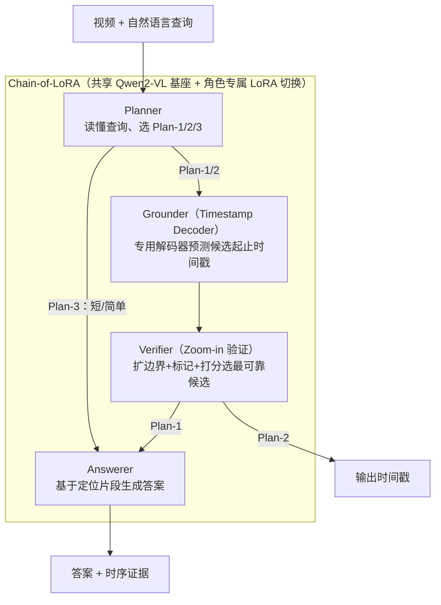

# VideoMind: A Chain-of-LoRA Agent for Temporal-Grounded Video Reasoning

**会议**: ICLR 2026  
**arXiv**: [2503.13444](https://arxiv.org/abs/2503.13444)  
**代码**: [https://github.com/yeliudev/VideoMind](https://videomind.github.io/)  
**领域**: LLM Agent  
**关键词**: 视频推理, 时序定位, LoRA, 多模态Agent, 视频问答

## 一句话总结

提出 VideoMind，一个基于角色分工的视频语言Agent框架，通过 Planner-Grounder-Verifier-Answerer 四角色协作实现时序grounded视频推理，核心创新是 Chain-of-LoRA 机制——在统一基座模型上通过切换LoRA适配器实现角色无缝切换，2B模型即超越GPT-4o和Gemini-1.5-Pro。

## 研究背景与动机

视频理解面临独特的时间维度挑战：有效的视频推理不仅需要识别视觉外观，还需理解它们如何随时间演变。现有方法存在两大瓶颈：

**视觉CoT缺乏时序定位能力**：静态图像上的Chain-of-Thought方法虽然能生成详细推理步骤，但无法显式定位或回顾视频中的特定片段，导致长视频推理效果差

**现有视频Agent方案的效率问题**：基于多个独立组件（如不同任务的专用模型）的Agent系统内存开销大、灵活性差，多任务联合训练又导致能力干扰

人类处理长视频的策略提供了启发：**分解问题 → 定位相关片段 → 回看确认细节 → 综合答案**。VideoMind旨在模拟这一认知过程，同时保持高效率。

## 方法详解

### 整体框架

VideoMind 要解决的是长视频的"时序 grounded 推理"——既要答对问题，又要指出答案依据的片段落在视频的第几秒。它在单个 Qwen2-VL 基座上定义四个专职角色，串成一条函数调用链：Planner 读懂查询后决定调用哪几个角色，Grounder 预测相关片段的起止时间戳，Verifier 回看候选片段挑出最可靠的一个，Answerer 再基于定位到的片段（或全视频）生成自然语言答案。关键在于这四个角色不是四个独立模型，而是共享同一基座、各挂一组 LoRA，靠切换 LoRA 在一个模型内完成角色切换。

### 关键设计

**1. Planner：按查询难度自适应选择推理计划**

四步全跑并非总是划算——短视频或常识类问题根本不需要先定位再验证，硬上 grounding 既费算力又可能引入噪声把答案带偏。Planner 因此先读懂查询，再从三种预定义计划里挑一条：需要同时给出答案和时序证据时走 Plan-1（Grounding → Verifying → Answering），只要时间戳时走 Plan-2（Grounding → Verifying），短视频或简单问题则走 Plan-3 直接回答。角色之间用 JSON 风格的函数调用 `{"type": "<role>", "value": "<argument>"}` 串成一条链，由 Planner 输出调度顺序。消融显示这种自适应调度只对约 40% 的样本真正执行 grounding，其余直接回答，准确率反而从 69.2 升到 70.0——把算力花在真正需要定位的样本上。

**2. Grounder 的 Timestamp Decoder：用检测器式解码替代语言建模来定位时间**

视频时序定位的痛点在于，如果让 LLM 像写文字那样直接吐出"从 12.3 秒到 18.7 秒"，数字本身缺乏几何约束、精度很差。VideoMind 的 Grounder 改为引入一个 `<REG>` token，生成它时把它与全部视觉 token 的隐状态一起送进专用解码器：先做 1D 平均池化把每帧压成一个向量 $\mathbf{h}_v' \in \mathbb{R}^{T \times D_L}$，再线性投影降维得 $\mathbf{e}_v = E_v(\mathbf{h}_v') \in \mathbb{R}^{T \times D}$，经三层 Transformer 编码器把帧特征与查询特征融合。核心是其后的**时序特征金字塔**——四级 Conv1D 逐步下采样，分别保留 1、1/2、1/4、1/8 的序列长度后拼接，使得短事件和长事件能在不同尺度上被并行预测。解码器顶端挂三个输出：帧级前景/背景分类头、帧级起止偏移的边界回归头、以及拉开帧-查询匹配度的对比项。这套"检测器式"结构把定位从模糊的文本生成变成有监督的几何回归，正是 2B 模型 mIoU 能反超 GPT-4o 的原因。

**3. Verifier 的 Zoom-in 策略：模拟人类"回看确认"**

Grounder 单次预测难免给出几个似是而非的候选，谁更准需要二次甄别。Verifier 对每个候选片段向两侧各扩展 50% 边界，把上下文一起纳入视野，并在序列中插入 `<SEG-START>` 与 `<SEG-END>` 两个特殊 token 显式标出片段边界，让模型清楚"该看哪一段"。随后做一次二值判断（Yes/No），用 teacher forcing 取出两个答案 token 的 logit $L_y, L_n$，以 $\text{Sigmoid}(L_y - L_n)$ 作为该候选的置信度排序。这个"放大边界 + 标记 + 打分"的回看动作让 grounding 的 mIoU 额外提升约 3.2。

**4. Chain-of-LoRA：把多角色压进一个模型**

直接用四个独立模型当四个角色（All-Distributed）效果好但内存爆炸，多任务联合训一个模型（All-in-One）又会让角色能力互相干扰。VideoMind 让所有角色共享同一 LMM 主干，每个角色只配一组角色专属的 LoRA 适配器（Grounder 额外挂上前述时间戳解码器）。推理时所有 LoRA 参数都常驻内存，切换角色仅是切换对应的 LoRA 权重，没有重新加载整模型的开销。结果是它在性能上与 All-Distributed 完全持平，内存却从 16.6G 压到 4.2G，把"多智能体协作"做成了单模型内的零成本切换。

### 损失函数 / 训练策略

Grounder 的训练把三项损失加权求和。分类用 Focal Loss 缓解前景/背景的极度不均衡，$\mathcal{L}_{cls} = -\lambda_{cls}\alpha(1-\hat{c}_i)^\gamma \log(\hat{c}_i)$，取 $\alpha=0.9, \gamma=2.0, \lambda_{cls}=5.0$；边界回归用 L1 Loss，$\mathcal{L}_{reg} = \lambda_{reg}(|b_i^s - \hat{b}_i^s| + |b_i^e - \hat{b}_i^e|)$，$\lambda_{reg}=1.0$；再加一项温度 $\tau=0.07$、权重 $\lambda_{con}=0.05$ 的对比损失 $\mathcal{L}_{con}$ 强化判别性表示。四个角色各自在专属数据上独立训 LoRA：Planner 用 39K 样本（NExT-QA 34K + QVHighlights 5K），Grounder 混合 7 个数据源共 210K，Verifier 用 232K（DiDeMo 165K + TACoS 43K + QVHighlights 24K），Answerer 则直接沿用原始模型不做微调。

## 实验关键数据

### 主实验（Grounded VideoQA）

CG-Bench（平均视频时长27分钟）上的对比：

| 方法 | 参数量 | long-acc. | mIoU | rec.@IoU | acc.@IoU |
|------|--------|-----------|------|----------|----------|
| GPT-4o | – | 45.2 | 5.62 | 8.30 | 4.38 |
| Gemini-1.5-Pro | – | 37.2 | 3.95 | 5.81 | 2.53 |
| Qwen2-VL | 72B | 41.3 | 3.58 | 5.32 | 3.31 |
| **VideoMind (Ours)** | **2B** | 31.0 | **5.94** | **8.50** | **4.02** |
| **VideoMind (Ours)** | **7B** | **38.4** | **7.10** | **9.93** | **4.67** |

视频时序定位 Charades-STA：

| 方法 | 参数量 | R@0.3 | R@0.5 | R@0.7 | mIoU |
|------|--------|-------|-------|-------|------|
| UniTime | 7B | – | 59.1 | 31.9 | 52.2 |
| **VideoMind** | **7B** | **73.5** | **59.1** | **31.2** | **50.2** |

通用视频QA（Video-MME / MLVU / LVBench）：

| 方法 | 参数量 | Video-MME All | MLVU M-Avg | LVBench |
|------|--------|------|------|---------|
| GPT-4o | – | 71.9 | 54.5 | 30.8 |
| Gemini-1.5-Pro | – | 75.0 | – | 33.1 |
| **VideoMind** | **2B** | 55.4 | 58.7 | **35.4** |
| **VideoMind** | **7B** | 58.2 | **64.4** | **40.8** |

### 消融实验（Chain-of-LoRA对比）

不同角色集成策略的性能与效率对比（2B模型）：

| 方法 | 内存 | NExT-GQA mIoU | NExT-GQA Acc | Charades R@0.5 | Video-MME All |
|------|------|-----------|----------|------------|-----------|
| Qwen2-VL-2B | 4.1G | – | 69.6 | – | 53.0 |
| + CoT（纯文本推理） | 4.1G | – | 69.7 | – | 52.8 |
| + All-in-One（联合训练） | 4.2G | 28.0 | 70.5 | 47.8 | 53.6 |
| + All-Distributed（4×独立模型） | **16.6G** | 28.6 | 71.4 | 51.1 | 55.4 |
| + **Chain-of-LoRA** | **4.2G** | **28.6** | **71.4** | **51.1** | **55.4** |

Chain-of-LoRA 以 4.2G 内存达到了与 16.6G 的 All-Distributed 完全相同的性能。

### 关键发现

1. **纯文本CoT对视频推理无效**：+CoT几乎无提升（69.7 vs 69.6），说明视频需要视觉中心的推理策略
2. **角色能力间存在干扰**：All-in-One联合训练性能明显低于分布式（47.8 vs 51.1 R@0.5），验证了LoRA分离的必要性
3. **Verifier提升grounding 3.2 mIoU**：候选片段验证带来一致性改善
4. **Planner自适应调度的价值**：仅对40%样本执行grounding（其余直接回答），准确率从69.2提升到70.0

## 亮点与洞察

1. **Chain-of-LoRA的极简优雅**：无需维护多个完整模型，仅通过切换轻量LoRA即可在不同角色间无缝切换，将"多agent"压缩到单一模型中
2. **2B模型超越GPT-4o的时序grounding**：在CG-Bench的mIoU和rec.@IoU上，2B小模型击败了GPT-4o，说明专用的时序定位能力比通用能力更关键
3. **Timestamp Decoder的精度优势**：相比直接用语言模型生成时间戳文本，专用解码器+特征金字塔的设计在定位精度上有本质提升
4. **Zoom-in验证策略**：模拟人类"回看确认"的行为，通过扩展边界+特殊标记增强模型的边界感知能力

## 局限与展望

1. **各角色需要独立优化和准备训练数据**：虽然LoRA轻量，但整体训练流程仍然复杂
2. **缺少音频模态**：当前仅处理视觉和文本，未利用视频中的音频信息
3. **预定义的推理计划**：Planner从三种固定计划中选择，缺乏更灵活的动态规划能力
4. **未来方向**：多角色联合优化的可能性、音频模态融合

## 相关工作与启发

- **与VideoChat-TPO的关系**：TPO也关注视频时序推理，但VideoMind通过LoRA机制更高效地集成多种能力
- **与OpenAI o1系列推理的对比**：o1依赖纯文本推理链，VideoMind通过视觉中心的角色链（定位→验证→回答）实现测试时计算扩展
- **时序特征金字塔**：借鉴了ActionFormer等时序检测方法的多尺度设计，将其嵌入LMM框架

## 评分

- 新颖性: ⭐⭐⭐⭐ (Chain-of-LoRA机制新颖优雅，角色分工的agentic设计有价值)
- 实验充分度: ⭐⭐⭐⭐⭐ (15个benchmark全面评估，消融充分，可视化清晰)
- 写作质量: ⭐⭐⭐⭐ (结构清晰，图表丰富，技术描述详实)
- 价值: ⭐⭐⭐⭐⭐ (代码开源，跨任务通用性强，小模型优势突出，对视频Agent方向有重要推动)

<!-- RELATED:START -->

## 相关论文

- [\[CVPR 2026\] Asynchronous Temporal Modeling with Two-Agent Framework for Streaming Dense Video Captioning](../../CVPR2026/llm_agent/asynchronous_temporal_modeling_with_two-agent_framework_for_streaming_dense_vide.md)
- [\[CVPR 2026\] WorldMM: Dynamic Multimodal Memory Agent for Long Video Reasoning](../../CVPR2026/llm_agent/worldmm_dynamic_multimodal_memory_agent_for_long_video_reasoning.md)
- [\[ICLR 2026\] SimuHome: A Temporal- and Environment-Aware Benchmark for Smart Home LLM Agents](simuhome_a_temporal-_and_environment-aware_benchmark_for_smart_home_llm_agents.md)
- [\[ACL 2026\] SafeMCP: Proactive Power Regulation for LLM Agent Defense via Environment-Grounded Look-Ahead Reasoning](../../ACL2026/llm_agent/safemcp_proactive_power_regulation_for_llm_agent_defense_via_environment-grounde.md)
- [\[ACL 2026\] ZARA: Training-Free Motion Time-Series Reasoning via Evidence-Grounded LLM Agents](../../ACL2026/llm_agent/zara_training-free_motion_time-series_reasoning_via_evidence-grounded_llm_agents.md)

<!-- RELATED:END -->
