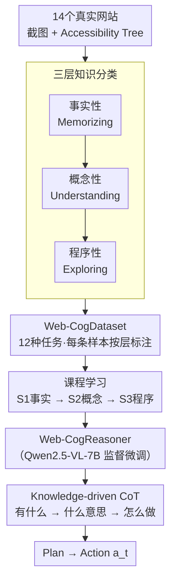

# Web-CogReasoner: Towards Knowledge-Induced Cognitive Reasoning for Web Agents

**会议**: ICLR 2026  
**arXiv**: [2508.01858](https://arxiv.org/abs/2508.01858)  
**代码**: [https://github.com/Gnonymous/Web-CogReasoner](https://github.com/Gnonymous/Web-CogReasoner)  
**领域**: LLM Agent  
**关键词**: Web Agent, 认知推理, Bloom分类学, Chain-of-Thought, 知识驱动

## 一句话总结

受Bloom教育分类学启发，提出 Web-CogKnowledge Framework，将Web Agent能力分解为 Factual→Conceptual→Procedural 三层知识的渐进式学习，配合 Knowledge-driven CoT 推理框架训练得到 Web-CogReasoner，在Web-CogBench上以84.4%超越Claude Sonnet 4 (76.8%)和Gemini 2.5 Pro (80.4%)。

## 研究背景与动机

Web Agent正从早期的规则系统演变为基于LLM/LVM的智能系统。当前Web Agent面临的核心挑战是：**通用预训练知识在专门任务上存在性能瓶颈**。

具体而言：

**纯文本Agent**：仅处理HTML/Accessibility Tree，遗漏视觉线索

**纯视觉Agent**：直接从截图推理，但缺乏结构化数据

**混合Agent**：整合双模态，但仍缺乏系统化的知识基础

先前的知识增强方法往往缺乏系统性或理论支撑。论文的关键洞察来自教育学：人类学习先是**积累知识**（阶段1），然后基于知识基础**学习应用、创新和创造**（阶段2）。对应到Web Agent：
- **阶段1（知识内容学习）**：建立多层基础——事实性知识（基本概念）和概念性知识（关系理解），对应"学什么"
- **阶段2（认知过程）**：发展程序性知识——逻辑推理框架，对应"怎么做"

## 方法详解

### 整体框架

论文要解决的是"通用预训练知识在专门的 Web 任务上打不过"这一瓶颈，思路是把"教 Agent 什么知识"和"教 Agent 怎么用知识"系统化。整体分两条线汇成一个模型：先借 Bloom 教育分类学把网页知识分成事实性、概念性、程序性三层，据此从 14 个真实网站爬取并按层标注出 Web-CogDataset，再用"先记忆、再理解、后探索"的课程学习把基座微调成 Web-CogReasoner；推理时模型不直接拍动作，而是走一遍 Knowledge-driven CoT，按事实→概念→程序三层依次提问后再规划动作。整个 Agent-网页交互被建模为引入知识集合 $K$ 的 POMDP $P=(S,A,O,K,T,R)$，每一步以截图和 Accessibility Tree 为观测 $O$，先生成推理思路 $h_t$ 再选出动作 $a_t$。

### 关键设计

**1. 三层知识分类：把"通用知识打不过专门任务"的瓶颈拆成可逐层教学的对象**

原本笼统的"网页知识"无从下手训练，论文借鉴 Bloom 教育分类学，把 Web Agent 需要的知识从底到顶分成事实性、概念性、程序性三层，分别对应记忆、理解、探索三种认知能力，于是它变成三类目标明确、可分别采样的样本。三层的定义与典型任务如下：

| 知识层级 | 定义 | 对应认知能力 | 示例任务 |
|---------|------|------------|---------|
| 事实性知识 | 网页元素的具体信息 | Memorizing（记忆） | 识别元素属性、预测单步交互结果 |
| 概念性知识 | 语义关系和抽象模式 | Understanding（理解） | 推断界面组件功能、理解页面结构 |
| 程序性知识 | 完成任务的操作方法 | Exploring（探索） | 执行目标导向序列、处理中断 |

这个分层不是命名游戏：后面的消融显示低层是高层的前提，跳过低层直接训练高层会失败（仅 S3 在线成功率 13.14%，补上 S1 后翻倍到 23.47%），所以三层既是分类，也定义了训练的先后顺序。

**2. Web-CogDataset：让三层知识落到真实网页上而非凭空标注**

光有分类还不够，得有按层组织的真实语料才能教。论文从 14 个代表性网站选择性爬取元数据，按三层知识设计出 12 种精细任务，覆盖从感知元素、理解组件功能到执行目标序列的完整链路。关键在于每条样本都被明确归到某一知识层，从而能在课程学习里按层取用，让训练信号与知识分类一一对应，而不是把所有数据混在一起喂。

**3. Knowledge-driven CoT（KCoT）：把三层知识塞进推理链，让模型决策时按层调用知识而非直接拍动作**

即便学过三层知识，模型推理时若把知识当背景噪声，掌握度也兑现不成动作准确率。KCoT 把推理组织成 $\text{Task Prompt} \rightarrow \text{KCoT} \rightarrow \text{Plan} \rightarrow \text{Action}$ 的链条，其中 KCoT 这一步显式拆成三问：事实层先问"页面上有什么"以识别元素和状态，概念层再问"这意味着什么"以推断组件角色和交互关系，程序层最后问"如何完成任务"以规划目标导向的步骤。这样每步动作前模型都按事实→概念→程序的顺序复盘一遍已学知识。它的必要性有硬数据：同样学满三层知识，不配 KCoT 在线成功率仅 25.35%，配上 KCoT 直接升到 42.9%——知识和调用知识的推理框架缺一不可。

### 损失函数 / 训练策略

训练以 Qwen2.5-VL-7B 为基座做监督微调，采用模仿学习并套用知识引导的推理模板，关键在于按三层知识做课程学习而非一次性混合喂入：阶段 S1 只喂事实性样本（元素属性识别、单步交互预测），阶段 S2 加入概念性样本（元素功能理解、页面结构理解），阶段 S3 再叠上程序性样本（多步任务执行、意图推理、中断处理）。这种"先记忆、再理解、后探索"的渐进顺序与三层知识的依赖关系对齐，使高层探索能力建立在已稳固的低层基础之上。

## 实验关键数据

### 主实验（Web-CogBench）

各模型在8项任务的综合表现：

| 模型 | Memorizing | Understanding | Exploring | Overall |
|------|-----------|---------------|-----------|---------|
| Claude Sonnet 4 | – | – | – | 76.8 |
| Gemini 2.5 Pro | – | – | – | 80.4 |
| Qwen2.5-VL-7B | 53.2 | 60.0 | – | 69.8 |
| UI-TARs-7B-SFT | 63.5 | 48.0 | – | 46.4 |
| **Web-CogReasoner** | **91.4** | **69.2** | – | **84.4** |

WebVoyager在线任务成功率（15个网站平均）：

| Agent | Overall |
|-------|---------|
| Claude Sonnet 4 | 47.7% |
| Gemini 2.5 Pro | 54.9% |
| OpenWebVoyager-Max | 26.2% |
| **Web-CogReasoner** | **30.2%** |

VisualWebBench综合评分：

| 模型 | 感知均分 | 推理均分 | Overall |
|------|---------|---------|---------|
| Claude Sonnet 4 | 80.7 | 91.2 | 85.9 |
| Gemini 2.5 Pro | 80.3 | 93.0 | 86.6 |
| UI-TARs-7B-SFT | 82.4 | 89.7 | 86.0 |
| **Web-CogReasoner** | 79.0 | **93.6** | **86.3** |

### 消融实验（课程学习渐进增益）

渐进式知识训练在Web-CogBench上的效果：

| 配置 | Memorizing | Understanding | Exploring | Overall |
|------|-----------|---------------|-----------|---------|
| 基座模型 | 67.6 | 61.0 | 77.9 | 69.8 |
| +S1 (事实知识) | **85.5 (+17.9)** | 64.2 | 60.1 | 72.1 |
| +S1+S2 (概念知识) | 88.1 | **75.5 (+11.3)** | 65.8 | 78.3 |
| +S1+S2+S3 (程序知识) | 90.8 | 74.1 | **85.0 (+19.2)** | **84.4** |

层级依赖验证（WebVoyager）：

| 配置 | Overall |
|------|---------|
| S3 only | 13.14% |
| S1+S3 | 23.47% |
| S1+S2+S3 (w/o KCoT) | 25.35% |
| S1+S2+S3 (w/ KCoT) | **42.9%** |

### 关键发现

1. **低层知识是高层知识的前提**：S1+S3的成功率(23.47%)几乎是S3 only(13.14%)的两倍，证明程序性探索离不开事实性基础
2. **KCoT是知识激活器**：完整知识(S1+S2+S3)但无KCoT仅25.35%，加KCoT后飙升至42.9%——知识与推理框架缺一不可
3. **UI-TARs的启示**：UI-TARs在VisualWebBench上表现优秀(86.0%)，但Web-CogBench仅46.4%——强感知能力并不等于认知推理能力
4. **执行效率**：Web-CogReasoner的平均任务步数(4.73)低于所有对比方法，结构化知识带来更高效的决策

## 亮点与洞察

1. **教育学理论指导AI训练**：首次将Bloom分类学系统性地应用于Web Agent训练，从"教什么"和"怎么教"两个维度设计训练流程
2. **知识层级的严格验证**：消融实验清晰证明了Factual→Conceptual→Procedural的依赖链——跳过低层直接训练高层能力会失败
3. **KCoT的"知识激活"功能**：与简单增加训练数据不同，KCoT提供了一种显式的知识组织方式，使模型能够在决策时按层调用已有知识
4. **开源标杆的超越**：7B开源模型在多个维度超越或逼近Claude/Gemini等闭源商用模型

## 局限与展望

1. **依赖模仿学习**：当前训练完全基于SFT/IL，缺乏强化学习的探索能力，可能限制Agent发现新策略
2. **在线任务仍落后商用模型较大**：WebVoyager上(30.2% vs Gemini 54.9%)，实际网页交互能力仍有提升空间
3. **Cross-web泛化较弱**：Online Mind2Web的跨网站泛化(10.1%)显著弱于Claude(21.7%)，未见过的网站仍是挑战
4. **14个网站的知识覆盖面**：构建训练集的网站数量有限，扩展到更多领域和网站的泛化性有待验证
5. **未来方向**：集成强化学习以增强探索、泛化和自主发现程序性知识的能力

## 相关工作与启发

- **与UI-TARs的互补**：UI-TARs强于视觉感知但弱于认知推理，Web-CogReasoner通过知识框架弥补了从感知到推理的鸿沟
- **与AutoWebGLM的关系**：AutoWebGLM也使用课程学习，但仅关注结构识别→组件理解→任务执行的技能维度，未建立知识层级理论
- **与CoT推理的关系**：KCoT不是通用的思维链，而是按知识层级组织的结构化推理——事实→概念→程序，每层推理有明确的资源依赖

## 评分

- 新颖性: ⭐⭐⭐⭐ (Bloom分类学的应用于Web Agent训练有新意，KCoT框架有理论基础)
- 实验充分度: ⭐⭐⭐⭐⭐ (4个benchmark、详尽消融、层级依赖验证、效率分析、跨域泛化测试)
- 写作质量: ⭐⭐⭐⭐ (理论框架清晰，教育学动机自洽，实验组织合理)
- 价值: ⭐⭐⭐⭐ (提供了Web Agent系统化训练的方法论，数据集和benchmark有社区价值)

<!-- RELATED:START -->

## 相关论文

- [\[ICLR 2026\] WebArbiter: A Principle-Guided Reasoning Process Reward Model for Web Agents](webarbiter_a_principle-guided_reasoning_process_reward_model_for_web_agents.md)
- [\[ICLR 2026\] ST-WebAgentBench: A Benchmark for Evaluating Safety and Trustworthiness in Web Agents](st-webagentbench_a_benchmark_for_evaluating_safety_and_trustworthiness_in_web_ag.md)
- [\[CVPR 2026\] Learning to Adapt: Self-Improving Web Agent via Cognitive-Aware Exploration](../../CVPR2026/llm_agent/learning_to_adapt_self-improving_web_agent_via_cognitive-aware_exploration.md)
- [\[NeurIPS 2025\] Web-Shepherd: Advancing PRMs for Reinforcing Web Agents](../../NeurIPS2025/llm_agent/web-shepherd_advancing_prms_for_reinforcing_web_agents.md)
- [\[ICML 2026\] Weasel: 通过重要性-多样性数据选择实现 Web Agent 的域外泛化](../../ICML2026/llm_agent/weasel_out-of-domain_generalization_for_web_agents_via_importance-diversity_data.md)

<!-- RELATED:END -->
