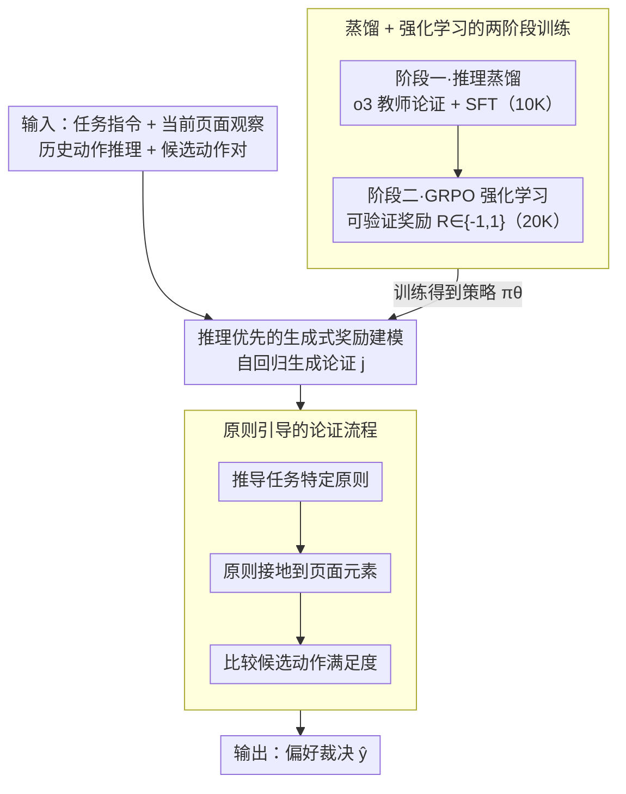

# WebArbiter: A Principle-Guided Reasoning Process Reward Model for Web Agents

**会议**: ICLR2026  
**arXiv**: [2601.21872](https://arxiv.org/abs/2601.21872)  
**代码**: [WebArbiter Project Page](https://webarbiter.github.io/)  
**领域**: LLM Agent  
**关键词**: Web Agent, 过程奖励模型, 推理优先, 原则引导, 强化学习, 推理蒸馏

## 一句话总结
WebArbiter 提出一种推理优先、原则引导的过程奖励模型 (WebPRM)，将奖励建模形式化为文本生成任务，通过推理蒸馏+强化学习的两阶段训练，在 WebPRMBench 上以 7B 模型超越 GPT-5 达 9.1 个百分点。

## 背景与动机
- Web Agent 涉及长视域、多步决策和不可逆动作，需要过程级 (step-level) 监督
- 结果奖励模型 (ORM) 仅提供稀疏且延迟的反馈，可能误判错误轨迹为成功
- 已有 WebPRM 存在明显缺陷：
    - **标量 WebPRM**：将进度压缩为粗粒度分数，缺乏可解释性和弱接地
    - **检查列表 WebPRM**：依赖脆弱的模板匹配，在布局或语义变化下失效
    - **LLM-as-Judge**：成本高、可扩展性差、易产生幻觉
- 核心问题：如何构建一个既可解释又稳健的过程奖励模型，能够抵抗表面相关性并提供可审计的推理链？

## 方法详解

### 整体框架
WebArbiter 把过程奖励建模重写成"先讲理由、再下结论"的文本生成任务：把 Web 导航建模为 POMDP $\mathcal{E} = (\mathcal{S}, \mathcal{A}, \mathcal{O})$，给定任务指令、当前页面观察、历史动作推理和一对候选动作，模型先自回归生成一段原则引导的结构化论证，最后输出偏好裁决。整条管线有两条轴：推理时，输入经**生成式奖励建模**写出论证，论证内部按**原则引导的流程**逐步推导，末尾给出裁决；训练时，先用强教师 (o3) **蒸馏**出会写论证的初始策略，再用可验证奖励做 GRPO **强化学习**把裁决对齐到正确性信号。底座是 Qwen2.5-3B/7B-Instruct，用 LoRA 微调。

### 关键设计

**1. 推理优先的生成式奖励建模：把裁决变成可审计的论证**

传统标量 WebPRM 把进度压成一个粗分数、检查列表 WebPRM 依赖脆弱的模板匹配，二者都无法解释"为什么这个动作更好"。WebArbiter 改为生成式：把指令 $\mathcal{I}$、当前观察 $o_p$、历史动作与推理 $(a_{<p}, c_{<p})$、以及两个候选动作对 $(a_p^1, c_p^1)$ 和 $(a_p^2, c_p^2)$ 拼成紧凑输入 $x = (\mathcal{I}, o_p, a_{<p}, c_{<p}, (a_p^1, c_p^1), (a_p^2, c_p^2))$，再自回归地写出长为 $L$ 的论证 $j$：

$$\pi_\theta(j | x) = \prod_{l=1}^{L} \pi_\theta(j_l | x, j_{<l})$$

论证末尾给出裁决 $\hat{y}$。整体训练目标就是让裁决匹配真值标签 $\max_{\pi_\theta} \mathbb{E}_{(x,y) \sim \mathcal{D}_{\text{Train}}, \hat{y} \sim \pi_\theta(j|x)} [\mathbb{1}(\hat{y} = y)]$。由于判断理由被显式写出来，奖励信号从"一个数"变成"一段可读、可查的链路"。训练数据复用 WebPRM Collection (Chae et al., 2025)，每个实例含指令、观察序列与专家标注轨迹，正向动作取自专家演示 $A^+$、负向动作取自被拒轨迹 $A^-$，配成成对偏好样本。

**2. 原则引导的论证流程：用动态推导的原则抵抗表面相关性**

检查列表方法把"什么算对"写死成模板，一旦页面布局或语义变化就失效。WebArbiter 不预设模板，而是让模型在论证里先从当前指令和页面状态推导出任务特定的原则，再把原则逐条接地到页面元素上，比较候选动作满足原则的程度，最后才输出偏好。这条"推导原则 → 接地到页面 → 比较候选 → 给出裁决"的固定论证结构，使判断有据可依、不被表面文本相似度带偏；消融显示去掉显式原则会让 BoN 准确率从 74.60 掉到 55.16，说明原则正是稳健泛化的核心。

**3. 蒸馏 + 强化学习的两阶段训练：先学会讲理、再放大正确率**

直接在 Instruct 模型上冷启动 RL 会在 Mind2Web 上升、其他环境反而塌掉，因为模型还不会稳定地写论证。第一阶段推理蒸馏用 o3 生成原则引导的论证，以标准 SFT 交叉熵拟合教师的逐 token 输出：

$$\mathcal{L}_{\text{SFT}}(\theta) = -\frac{1}{K} \sum_{i=1}^{K} \sum_{l=1}^{L_i} \log \pi_\theta(\hat{j}_l^{(i)} | x^{(i)}, \hat{j}_{<l}^{(i)})$$

用 10K 样本把"会写论证"的能力先打牢。第二阶段把蒸馏后的模型当参考策略 $\pi_{\text{ref}}$，用剩余 20K 样本做 GRPO，奖励只看裁决是否命中真值 $R(x, \hat{y}) \in \{-1, 1\}$，目标在最大化奖励的同时用 KL 约束不要偏离参考策略太远：

$$\mathcal{L}_{\text{RL}}(\theta) = \max_{\pi_\theta} \mathbb{E}_{(x,y) \sim \mathcal{D}_{\text{RL}}, \hat{y} \sim \pi_\theta(j|x)} [R(x, \hat{y})] - \beta \mathbb{D}_{\text{KL}}(\pi_\theta \| \pi_{\text{ref}})$$

SFT 提供稳定起点、RL 充当放大器，二者组合的效果远超任一单独使用。

## WebPRMBench 基准

### 数据分布
- 跨 4 个 Web 环境：Mind2Web、WebArena、AssistantBench、WorkArena
- 共 1,150 个步骤级偏好实例（每个包含 1 个正确+4 个被拒绝动作）

### 评估指标
**成对准确率 (Pairwise Acc)**：
$$\text{Acc}_{\text{Pairwise}} = \frac{1}{|\mathcal{D}|} \sum_{(a^+, a^-)} \mathbb{1}[\pi_\theta(a^+) \succ \pi_\theta(a^-)]$$

**Best-of-N 准确率 (BoN Acc)**：更严格，要求正确动作同时优于所有 4 个干扰项：
$$\text{Acc}_{\text{BoN}} = \frac{1}{|\mathcal{D}|} \sum_{i=1}^{|\mathcal{D}|} \prod_{q=1}^{4} \mathbb{1}[\pi_\theta(a_i^+) \succ \pi_\theta(a_i^{-_q})]$$

## 实验关键数据

### WebPRMBench 主要结果

| 模型 | Mind2Web BoN | WebArena BoN | AssistantBench BoN | WorkArena BoN | Avg BoN |
|------|-------------|-------------|-------------------|-------------|---------|
| GPT-4o | 52.62 | 66.67 | 66.67 | 55.19 | 60.29 |
| GPT-5 | 62.39 | 71.64 | 63.33 | 64.62 | 65.50 |
| Claude-3.7-Sonnet | 57.90 | 64.10 | 61.30 | 60.60 | 60.98 |
| DeepSeek-R1 | 57.37 | 60.21 | 56.18 | 63.89 | 59.41 |
| WebShepherd-8B | 73.69 | 43.88 | 30.00 | 25.53 | 43.28 |
| **WebArbiter-7B** | **89.53** | **68.66** | **70.00** | **70.19** | **74.60** |

WebArbiter-7B 以 Avg BoN Acc 超越 GPT-5 达 **9.1 个百分点**，超越前 SOTA WebShepherd-8B 达 **31.32 个百分点**。

### 训练策略消融实验

| 方法 | Mind2Web BoN | WebArena BoN | AssistantBench BoN | WorkArena BoN | Avg BoN |
|------|-------------|-------------|-------------------|-------------|---------|
| Instruct (原始) | 39.18 | 42.79 | 53.33 | 35.85 | 42.78 |
| + Cold Start RL | 86.00 | 35.80 | 33.60 | 37.90 | 48.33 |
| + Cold Start RL + Principles | 88.00 | 46.30 | 48.90 | 51.80 | 58.75 |
| + SFT (无原则) + RL | 94.34 | 41.50 | 40.20 | 44.60 | 55.16 |
| **WebArbiter (SFT+原则+RL)** | **89.53** | **68.66** | **70.00** | **70.19** | **74.60** |

### WebArena-Lite 实际搜索效果
在奖励引导轨迹搜索中，WebArbiter 超越 WebShepherd 最高达 **7.2 个百分点**。

## 核心消融发现

### 1. 冷启动 RL 不稳定
- 直接在 Instruct 模型上做 RL，Mind2Web 上升到 86.00，但其他环境反而下降
- 说明没有推理蒸馏基础的 RL 在跨环境泛化上不稳定

### 2. 原则引导至关重要
- 去除显式原则仅保留推理论证：BoN Acc 从 74.60 降至 55.16（-19.44）
- 原则引导使判断更有根据，抵抗表面相关性

### 3. SFT 是 RL 的必要前提
- 推理蒸馏为 RL 提供稳定的起点，RL 主要起放大器作用
- SFT + RL 的组合效果远超任一单独使用

## 亮点
1. **推理优先范式**：将奖励建模从分数预测转变为可审计的推理生成，极大提升可解释性
2. **原则动态引导**：从任务指令和状态推导原则，而非依赖固定模板，适应性强
3. **跨环境稳健泛化**：仅在 Mind2Web 训练，在 4 个不同环境均达最佳
4. **小模型超大模型**：7B 模型超越 GPT-5 和 DeepSeek-R1
5. **两阶段训练策略**：推理蒸馏 + RL 的组合互补性强

## 局限与展望
- 训练数据仅 30K 且来自 Mind2Web 单一环境，扩展多环境训练数据可能进一步提升
- 当前仅支持成对比较，多候选设置需要进一步验证
- 基于文本的观察表示（accessibility tree），未利用视觉信息
- 推理生成增加了推理延迟，实时部署场景需权衡
- WebPRMBench 的负样本由模型生成，可能存在分布偏差

## 与相关工作的对比
- 相比 WebShepherd（检查列表 WebPRM）：WebArbiter 在新环境上完全碾压（WorkArena BoN 70.19 vs 25.53）
- 相比标量 WebPRM（Miao et al., 2025）：提供可审计的推理链而非数值分数
- 相比 LLM-as-Judge：7B 专用模型远超通用 GPT-5
- 相比 Reasoning RM 文献（Chen et al., 2025）：首次将推理 RM 应用于 Web Agent 领域

## 启发与关联
- 原则引导的推理蒸馏范式可推广到其他过程奖励建模场景
- 两阶段 SFT → RL 流程对训练可验证奖励模型有参考价值
- WebPRMBench 提供了标准化的 WebPRM 评估框架
- 推理优先的奖励模型可与搜索/规划算法结合，实现推理时扩展

## 评分
- 新颖性: ⭐⭐⭐⭐⭐ (推理优先+原则引导的WebPRM设计全新，两阶段训练策略创新)
- 实验充分度: ⭐⭐⭐⭐⭐ (4环境benchmark、多类型baseline、详细消融、实际搜索验证)
- 写作质量: ⭐⭐⭐⭐ (结构清晰，但符号较多，需要仔细阅读)
- 价值: ⭐⭐⭐⭐⭐ (7B超越GPT-5，开源WebPRMBench，对Web Agent领域贡献巨大)

<!-- RELATED:START -->

## 相关论文

- [\[ACL 2026\] Exploring Reasoning Reward Model for Agents](../../ACL2026/llm_agent/exploring_reasoning_reward_model_for_agents.md)
- [\[ICML 2026\] Process Reward Agents for Steering Knowledge-Intensive Reasoning](../../ICML2026/llm_agent/process_reward_agents_for_steering_knowledge-intensive_reasoning.md)
- [\[ICLR 2026\] Web-CogReasoner: Towards Knowledge-Induced Cognitive Reasoning for Web Agents](web-cogreasoner_towards_knowledge-induced_cognitive_reasoning_for_web_agents.md)
- [\[ICLR 2026\] WebOperator: Action-Aware Tree Search for Autonomous Agents in Web Environment](weboperator_action-aware_tree_search_for_autonomous_agents_in_web_environment.md)
- [\[ICLR 2026\] ST-WebAgentBench: A Benchmark for Evaluating Safety and Trustworthiness in Web Agents](st-webagentbench_a_benchmark_for_evaluating_safety_and_trustworthiness_in_web_ag.md)

<!-- RELATED:END -->
