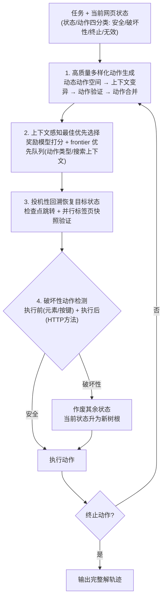

# WebOperator: Action-Aware Tree Search for Autonomous Agents in Web Environment

**会议**: ICLR2026  
**arXiv**: [2512.12692](https://arxiv.org/abs/2512.12692)  
**代码**: [kagnlp.github.io/WebOperator](https://kagnlp.github.io/WebOperator/)  
**领域**: LLM/NLP  
**关键词**: Web Agent, 树搜索, 回溯机制, 破坏性动作处理, 最佳优先搜索, 自主代理

## 一句话总结

提出 WebOperator，一个动作感知的树搜索框架，通过投机性回溯、破坏性动作检测、动作验证与合并等机制，使 Web 自主代理能在部分可观测、不可逆的真实网页环境中安全高效地探索，在 WebArena 上以 gpt-4o 达到 54.6% SOTA 成功率。

## 背景与动机

1. **贪心决策的脆弱性**：现有 LLM-based Web Agent 逐步贪心选择动作，不考虑长期后果或替代路径，在部分可观测的网页环境中，单步错误往往导致不可达目标状态。
2. **缺乏显式回溯机制**：没有回溯能力的代理无法纠正错误或系统性地探索替代路径，一旦进入错误状态就只能依赖脆弱的导航来撤销。
3. **朴素回溯不可靠**：现有树搜索方法的回溯假设所有动作可逆，但真实网页具有非确定性（异步更新、DOM 变异），朴素重放可能失败或导致不一致状态。
4. **不可逆动作被忽视**：提交表单、删除项目、登出等操作会永久改变环境，现有方法完全未处理这类破坏性动作，执行后会使之前所有已访问状态失效。
5. **动作生成质量低且冗余**：LLM 可能生成无效或上下文无关的动作（如在起始页执行 go_back），固定数量的候选动作中很多语义等价，浪费搜索预算。
6. **计算开销过高**：MCTS 等方法依赖大量随机 rollout 和环境重置，在 Web 规模下成本过高，不具实用性。

## 方法详解

### 整体框架

WebOperator 把 Web 自主代理建模成一次"动作感知的最佳优先树搜索"：先对网页的状态与动作按可逆性做形式化分类，再围绕这套分类构建动作生成、最佳优先选择、投机性回溯和破坏性动作检测四个相互配合的模块，让代理在不可逆、非确定性的真实网页里既敢探索又不会把环境搞坏。形式化层面，状态被拆成临时状态（DOM 元素、滚动偏移、打开的标签页）与持久状态（服务端数据、cookie、本地存储）；动作被分成四类——只改临时状态、完全可逆的**安全动作**（滚动、操作下拉框，URL 跳转作为特殊安全动作），改持久状态、不可完全撤销的**破坏性动作**（表单提交、删除），终止搜索但不改环境的**终止动作**，以及语法或语义出错的**无效动作**。一轮搜索循环里：当前网页状态作为树节点 → 生成并精选候选动作 → 用最佳优先策略选出最该试的那个 → 投机性回溯把环境恢复到该动作所在状态 → 执行动作并判断它是否破坏性（破坏性则重置树根）→ 直到某个终止动作产出完整解轨迹。后续所有模块都建立在这套四分类之上。

### 关键设计

**1. 高质量多样化的动作生成：压低分支因子又不漏掉有用动作**

树搜索最怕分支爆炸，而 LLM 直接生成的候选动作里大量是无效的（在起始页 `go_back`）或语义重复的。WebOperator 用四步收紧动作空间：**动态动作空间**根据当前观察自适应裁剪可用动作类型（仅在存在上一页时才暴露 `go_back`），避免无关探索；**动作验证**在执行前用静态分析（DOM/可访问性树里的元素可见性、启用状态）加轻量动态检查（导航类动作的 URL 可达性）过滤掉跑不通的动作，并把失败反馈回传给 LLM 重新生成；**上下文变异**则反过来鼓励多样性——对同一状态变换 LLM 输入的组成（任务历史长度、检索到的相关轨迹），逼模型给出语义不同的候选；最后**动作合并**把语义等价的候选并成一个、直接降低分支因子。验证既剔除了无效动作又因为减少了无谓尝试，把平均动作数从 9.30 压到 8.67，单这一步就贡献了 +4.5% 成功率。

**2. 上下文感知的最佳优先选择：把搜索预算花在最该探索的分支上**

代替 MCTS 的随机 rollout，WebOperator 维护一个优先队列（frontier），每步先用过程奖励模型给候选动作打分，再结合两类因素动态重算优先级：一是动作类型（安全/破坏性/终止/重复），二是搜索上下文（目标进展、历史已执行的破坏性动作、累计步数）。策略上让安全可逆动作优先探索、破坏性动作延后到战略上确有必要时才执行、终止动作只在高置信度下才提升优先级；当 frontier 规模超出预算时按结构化规则裁剪低价值分支，维持有界的队列。正因为选择质量高，WebOperator 仅用 10 步预算（42.7%）就超过了用更大预算的现有树搜索方法，说明把功夫下在动作质量和选择策略上，比单纯堆计算预算更划算。

**3. 投机性回溯：在真实非确定性网页里实现可靠的状态恢复**

选定一个动作后，要先把环境恢复到该动作所在的状态才能执行它。朴素回溯假设动作可逆、直接从根状态重放整条历史动作，但真实网页有异步更新和 DOM 变异，重放经常失败或落到不一致状态——消融实验里朴素树搜索甚至把成功率从 54.84% 拉低到 51.61%，说明不可靠的回溯弊大于利。WebOperator 从效率和可靠性两头解决。效率上引入**检查点跳转**：当某网页刷新后观察不变、且 URL 与父节点不同时标记为检查点（刷新稳定、是独立导航点），回溯时直接用 URL 导航跳到目标状态最近的检查点，只补放必要的 UI 交互（滚动、填表），省去整条路径重放。可靠性上采用**投机执行加快照验证**：回溯先在并行浏览器标签页里试跑，每步重放前把当前观察与存储快照逐一比对，任何一处因随机性、动态内容或 UI 漂移对不上就立即中止，主环境毫发无损；只有全部快照匹配才把结果提交回主环境。这套机制是先前树搜索 Web Agent 普遍缺失的，也是带来最终 +8.39% 绝对提升的关键。

**4. 双阶段破坏性动作检测与隔离：在不可逆操作把搜索树作废前先拦住它**

提交表单、删除项目、登出这类动作会永久改变持久状态，一旦执行，搜索树里之前访问过的状态全部失效（无法再回溯到那些状态），这是以往树搜索方法集体忽视的致命问题。WebOperator 用执行前、执行后两道启发式来识别：**执行前**基于动作类型和交互元素做轻量判断——非点击动作（滚动、切标签）通常安全，点击里只有按钮元素可能破坏，Enter 键（常触发表单提交）视为潜在破坏性，而带 "back"、"search"、"refresh" 等导航/临时标签的按钮归为安全；**执行后**则监控该动作触发的 HTTP 请求，GET 通常无害，POST/PUT/DELETE/PATCH 是强破坏性信号——一前一后形成"先主动规避、再事后纠正"的双保险。一旦确认某动作是破坏性的，框架就让搜索树中除当前状态外的所有状态失效、把当前状态升级为新的树根、并从新根用最佳优先搜索继续——相当于承认"覆水难收"，主动重置而不是徒劳地假装能撤销。

## 实验关键数据

### 表1：WebArena 成功率对比（SR %）

| Agent | 模型 | Overall | Reddit | GitLab | Shopping | CMS | Map |
|---|---|---|---|---|---|---|---|
| AgentSymbiotic | claude-3.5-sonnet | 52.1 | 66.0 | 51.0 | 48.0 | 49.0 | 60.0 |
| ScribeAgent | gpt-4o | 53.0 | 73.7 | 59.7 | 45.8 | 37.9 | 56.3 |
| **WebOperator** | **gpt-4o** | **54.6** | **76.4** | 52.8 | 49.2 | **55.0** | 55.2 |
| WebPilot | gpt-4o | 37.2 | 65.1 | 39.4 | 36.9 | 24.7 | 33.9 |
| Branch-n-Browse | gpt-4o | 35.8 | 50.9 | 36.7 | 34.6 | 26.4 | 46.8 |

WebOperator 以 54.6% 总成功率超越所有已有方法，在 Reddit（76.4%）和 CMS（55.0%）领域表现尤为突出。

### 表2：消融实验（WebArena-lite，gpt-4o）

| 配置 | Avg Actions | SR (%) |
|---|---|---|
| Base ReAct Agent | 9.30 | 47.74 |
| + Dynamic Action Space | 9.17 | 49.03 |
| + Action Validation | 8.67 | 53.55 |
| + Multi-Action + Merging + Context Variation | 25.30 | 54.84 |
| + Tree Search (朴素) | 24.79 | 51.61 |
| + Destruction-Aware + Selection Heuristic | 29.67 | 58.71 |
| **+ Speculative Backtracking（完整系统）** | **31.34** | **60.00** |

关键发现：(1) 动作验证单独贡献 +4.5% SR 且显著减少平均动作数（从 9.3→8.67）；(2) 朴素树搜索反而降低性能（54.84→51.61），说明没有可靠回溯的树搜索弊大于利；(3) 投机性回溯带来最终 +8.39% 的绝对提升。

### 搜索预算分析

仅用 10 步预算，WebOperator（42.7%）已超越所有使用更大预算的现有树搜索方法（Branch-n-Browse 35.8%，WebPilot 37.2%），体现极高的搜索效率。

## 亮点

1. **系统性的动作分类体系**：首次将 Web 动作按可逆性分为安全/破坏性/终止/无效四类，并设计相应的分阶段处理策略，使树搜索方法真正适用于真实 Web 环境。
2. **投机性回溯**：在并行标签页中尝试回溯并逐步验证快照一致性，避免主环境被非确定性行为破坏——这是所有先前树搜索 Web Agent 都缺失的关键能力。
3. **消融实验揭示的洞察**：朴素树搜索反而降低性能这一发现意义重大，说明回溯可靠性比搜索宽度更重要，为后续研究指明了方向。
4. **高搜索效率**：10 步预算即超越所有现有方法，说明动作生成质量和选择策略的改进比增加计算预算更有效。
5. **全面的功能覆盖**：在 Table 1 与先前方法的特性对比中，WebOperator 是唯一在动态动作空间、动作验证、上下文变异、动作合并、非确定性环境处理、破坏性动作处理六个维度全部打勾的方法。

## 局限与展望

1. **高度动态环境**：当页面内容变化非常频繁时，投机性回溯可能总是失败，退化为顺序搜索。
2. **破坏性动作检测精度有限**：执行前启发式仅约 37% 的标记被确认为真正破坏性，召回率-精度权衡有优化空间，更精确的方法可能需要模型推理或学习型世界模型。
3. **奖励模型依赖**：候选动作评估依赖过程奖励模型，其泛化能力和准确性直接影响整体性能。
4. **frontier 预算约束**：固定大小的动作队列在非常大或复杂的网站上可能限制探索充分性。
5. **终止风险**：提前执行终止动作会导致搜索过早结束，虽有延后策略但无形式化保证。
6. **单用户场景**：未考虑多用户或协作环境中的状态冲突问题。

## 与相关工作的对比

- **vs. LM-TS / LATS**：这些先驱工作建立了树搜索 Web Agent 的框架，但假设所有动作可逆、使用朴素的重放式回溯，在真实 Web 的非确定性环境下表现脆弱。WebOperator 通过投机性回溯和破坏性动作检测解决了这些核心缺陷。
- **vs. WebPilot**：基于 MCTS 的方法需要大量随机 rollout 和环境重置，在 Web 规模下计算开销过高。WebOperator 的最佳优先搜索 + 检查点跳转在更低预算下实现更高性能。
- **vs. WebGuard / InferAct**：这些安全感知方法通过外部分类器或模拟器检测风险动作，但安全保障在规划循环之外。WebOperator 将安全机制（破坏性动作检测 + 投机回溯）直接集成在搜索框架内部。
- **vs. AgentOccam / ScribeAgent**：非树搜索方法在简单任务上高效，但缺乏系统性纠错能力。WebOperator 的 40% 成功任务需要至少一次回溯，证明了结构化探索的不可替代性。

## 评分

- 新颖性: ⭐⭐⭐⭐ （动作分类体系和投机性回溯是重要创新，但整体仍是树搜索框架的改进而非范式变革）
- 实验充分度: ⭐⭐⭐⭐⭐ （WebArena + WebVoyager 双基准、细粒度消融、预算分析、回溯分析、破坏性动作统计，实验非常全面）
- 写作质量: ⭐⭐⭐⭐ （问题分解清晰、动机充分，但方法细节分散在正文和附录之间，需频繁跳转）
- 价值: ⭐⭐⭐⭐ （SOTA 性能 + 完整开源，投机性回溯等技术对 Web Agent 社区有实际推动作用）

<!-- RELATED:START -->

## 相关论文

- [\[ICLR 2026\] SimuHome: A Temporal- and Environment-Aware Benchmark for Smart Home LLM Agents](simuhome_a_temporal-_and_environment-aware_benchmark_for_smart_home_llm_agents.md)
- [\[AAAI 2026\] Prune4Web: DOM Tree Pruning Programming for Web Agent](../../AAAI2026/llm_agent/prune4web_dom_tree_pruning_programming_for_web_agent.md)
- [\[ACL 2026\] LiTS: A Modular Framework for LLM Tree Search](../../ACL2026/llm_agent/lits_a_modular_framework_for_llm_tree_search.md)
- [\[ICLR 2026\] Web-CogReasoner: Towards Knowledge-Induced Cognitive Reasoning for Web Agents](web-cogreasoner_towards_knowledge-induced_cognitive_reasoning_for_web_agents.md)
- [\[ICLR 2026\] ToolTree: Efficient LLM Agent Tool Planning via Dual-Feedback Monte Carlo Tree Search and Bidirectional Pruning](tooltree_efficient_llm_agent_tool_planning_via_dual-feedback_monte_carlo_tree_se.md)

<!-- RELATED:END -->
