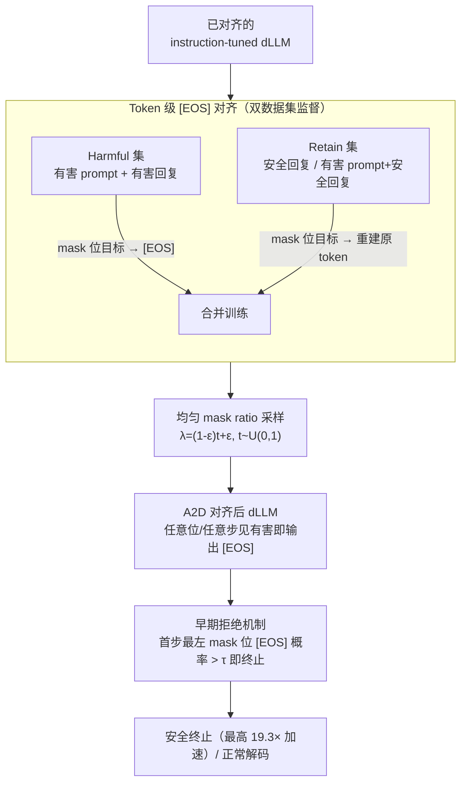

# A2D: Any-Order, Any-Step Safety Alignment for Diffusion Language Models

**会议**: ICLR 2026  
**arXiv**: [2509.23286](https://arxiv.org/abs/2509.23286)  
**代码**: 有  
**领域**: LLM对齐  
**关键词**: diffusion language model, safety alignment, token-level defense, jailbreak, masked diffusion

## 一句话总结
提出 A2D，一种针对扩散语言模型（dLLM）的 token 级安全对齐方法，通过训练模型在遇到有害内容的 mask 位置输出 [EOS] token 来实现任意解码顺序、任意解码步的安全防御，将 DIJA 模板攻击成功率从 80%+ 降到近零（1.3%/0.0%），并支持早期拒绝实现 19.3x 加速。

## 研究背景与动机
**领域现状**：扩散语言模型（如 LLaDA、Dream）通过迭代去mask而非从左到右生成文本，支持任意顺序解码。已有安全对齐方法从 AR 模型继承，依赖响应级拒绝和固定解码顺序假设。

**现有痛点**：dLLM 的任意顺序解码大幅扩大了攻击面——有害内容可以在任意位置出现。DIJA 攻击通过在 [MASK] token 之间穿插对抗文本绕过早期拒绝，成功率超 80%。per-token KL 分析显示 dLLM 的安全对齐是"浅层"的——仅在前几步有效，后续步骤安全信号快速衰减。

**核心矛盾**：AR 模型的响应级拒绝假设固定的从左到右解码，但 dLLM 的解码可以是任意顺序、任意步骤的——传统对齐在 dLLM 上根本不适用。

**本文目标** 如何让 dLLM 在任意解码顺序和任意解码步骤都能可靠拒绝有害内容？

**切入角度**：将安全对齐从响应级降到 token 级——让模型在任何 mask 位置遇到有害内容时都输出 [EOS] 作为通用抑制信号。

**核心 idea**：token 级 [EOS] 对齐 + 随机 mask 训练，让 dLLM 在解码的任何位置任何步骤都能拒绝有害续写。

## 方法详解

### 整体框架
A2D 要解决的问题是：让一个已经 instruction-tuned 的 dLLM，无论按什么顺序解码、解码到第几步，只要某个 mask 位置本该填入有害内容，就改填 [EOS] 这个终止信号。它不改架构、不加外部分类器，只在标准 masked diffusion 训练目标上动两处。第一处是把训练数据拆成 Harmful 集和 Retain 集：对 Harmful 集（有害 prompt + 有害回复），所有 mask 位置的监督目标从原始 token 换成 [EOS]；对 Retain 集（安全回复、以及「有害 prompt + 安全回复」这类样本），保持正常的重建目标——让模型学会"只在有害内容上输出 [EOS]、其余照常生成"。第二处是训练时均匀采样 mask 比例，让模型同时见到「几乎全 mask」的早期解码和「几乎无 mask」的晚期解码，把安全信号铺满整条解码轨迹。训练完成后，有害输入会让 mask 位置的 [EOS] 概率飙高——A2D 进一步把这个概率读作内部安全信号，在解码第一步就检测、超阈值即提前终止。

### 关键设计

**1. Token 级 [EOS] 对齐：把响应级拒绝降到每个 mask 位置**

dLLM 的任意顺序解码让有害内容可以冒在任何位置，传统的「整段响应级拒绝」根本管不住。A2D 改成在 token 级别对齐：训练数据拆成 Harmful 集和 Retain 集，对 Harmful 集采样随机 mask 后把所有被 mask 位置的监督目标统一设为 [EOS]，逼模型学会「不管当前看到的是哪部分上下文，只要识别出有害续写，就在这里输出终止信号」；对 Retain 集则照常重建原 token。选 [EOS] 是因为它本就是模型熟悉的 token（用于填充和结束），不必引入新词。这里的关键巧思是 Retain 集**特意纳入「有害 prompt + 安全回复」样本**——它教模型「面对有害提问也可以正常给出安全回答」，因此模型只在真正有害的续写上触发 [EOS]，而不会把所有看起来敏感的良性请求都一律拒掉（XSTest 上 0% 误拒率即来自此）。token 级的监督形式天然兼容 dLLM 任意顺序解码——任何位置、任何上下文片段都能触发拒绝。

**2. 均匀 mask ratio 采样：堵住「浅层对齐」只在前几步生效的漏洞**

per-token KL 分析显示现有 dLLM 的安全对齐是浅层的——只在解码的前几步有效，后续步骤安全信号迅速衰减。A2D 在训练时对每个样本采样时间步 $t \sim U(0,1)$，并令 mask 比例 $\lambda = (1-\epsilon)t + \epsilon$，使其覆盖从「几乎完全 mask」（对应早期解码阶段）到「几乎无 mask」（对应晚期解码阶段）的所有比例。这样安全监督就不再集中在前几步，而是均匀分布到每一个解码阶段，真正做到 any-step 防御；实验里 DIJA 这类「先填好部分有害续写」的攻击成功率被压到近零，正是因为模型在解码后段也仍会拒绝。

**3. 早期拒绝机制：把 [EOS] 概率当成内部安全信号提前刹车**

经过前两步训练，模型对有害输入会在 mask 位置赋予很高的 [EOS] 概率——这个概率本身就是一个可读出的内部安全信号。A2D 在第一步解码时只检测**最左** mask 位置的 [EOS] 概率，一旦超过阈值 $\tau$ 便立即终止、不生成任何 token。之所以只看最左位而非后续位置，是为了避免把「okay」这类短良性回复误判成拒绝。由于在解码起点就刹车、跳过了后续所有去 mask 步骤，安全终止显著加速：$\tau=0.9$ 时在 AdvBench 上提速约 6×、仅 1.6% 过度拒绝，$\tau=0.8$ 时进一步提速到 19.3×（代价是误拒率略升），阈值给出了「速度 vs 良性兼容」的可调权衡。

### 损失函数 / 训练策略
仍是标准 masked diffusion 的全 mask 位置交叉熵损失，唯一改动是把 Harmful 集样本的监督目标替换成 [EOS]、Retain 集照常重建原 token。训练数据为 BeaverTails 的 30K 样本（划分为 Harmful 集与 Retain 集），整套方法施加在已对齐的 instruction-tuned dLLM 之上，训练 10 个 epoch、batch size 16、学习率 $5\times10^{-5}$（AdamW，weight decay 0.1）。

## 实验关键数据

### 主实验（攻击成功率 ↓%）

| 模型 | 方法 | Zeroshot | PAIR | ReNeLLM | Prefilling | DIJA | Avg |
|------|------|----------|------|---------|------------|------|-----|
| LLaDA | Original | 14.6 | 77.5 | 56.5 | 69.6 | 82.9 | 60.2 |
| | VRPO | 2.5 | 32.3 | 19.2 | 9.0 | 45.0 | 21.6 |
| | **A2D** | **2.1** | **~低** | **~低** | **~低** | **1.3** | **~最低** |
| Dream | A2D | - | - | - | - | **0.0** | - |

### 能力保持

| 指标 | Original | A2D |
|------|----------|-----|
| General (MMLU等) | 66.6 | **66.2** |
| Math (GSM8K等) | 41.4 | **40.6** |
| Coding (HumanEval等) | 32.6 | **35.0** |

### 关键发现
- A2D 将 DIJA 攻击成功率从 82.9% 降到 1.3%（LLaDA）和 0.0%（Dream）——彻底消除了模板攻击
- 能力保持甚至略有提升（coding 从 32.6→35.0），说明 token 级对齐不损害一般能力
- XSTest 上 0% 误拒率——完全不过度拒绝良性 prompt
- 早期拒绝机制实现 19.3x 更快的安全终止
- 在三种解码策略（左到右/置信度/随机）下都有效——真正的 any-order 防御

## 亮点与洞察
- **揭示了 dLLM 的核心安全漏洞**：KL 散度分析首次系统证明 dLLM 的安全对齐是浅层的，且比 AR 模型更严重
- **token 级 [EOS] 对齐的简洁性**：不引入新架构或外部分类器，仅修改训练目标——最小化的改动实现最大化的防御
- **内置安全监控能力**：[EOS] 概率自然作为实时安全信号，支持解码过程中的持续监控

## 局限与展望
- 仅在 BeaverTails 上训练，有害类型的覆盖可能不够全面
- 应用于已对齐模型之上（而非从头对齐），与原始对齐的交互效果未完全理解
- 自适应攻击（知道 A2D 的机制后的攻击）的鲁棒性未深入分析
- 早期拒绝的阈值需要每个模型单独调整

## 相关工作与启发
- **vs AR 模型的安全对齐**: AR 的 RLHF/DPO 假设固定解码顺序，不适用于 dLLM；A2D 原生支持任意顺序
- **vs DIJA 攻击**: DIJA 利用 dLLM 的 mask 机制构造模板攻击，A2D 恰好利用同样的 mask 机制做防御——以其人之道还治其人之身
- **vs Circuit Breaker / AlphaSteer**: 这些方法针对 AR 模型的激活空间，A2D 直接在 dLLM 的训练目标上做文章

## 评分
- 新颖性: ⭐⭐⭐⭐⭐ 首次系统研究 dLLM 安全对齐，token 级 [EOS] 方案非常新颖
- 实验充分度: ⭐⭐⭐⭐⭐ 3 个 dLLM、5 种攻击、多维能力评测、KL 分析
- 写作质量: ⭐⭐⭐⭐⭐ 漏洞分析→方法设计→实验验证的逻辑链非常清晰
- 价值: ⭐⭐⭐⭐⭐ 为 dLLM 安全部署铺平了道路

<!-- RELATED:START -->

## 相关论文

- [\[ICLR 2026\] Agnostics: Learning to Synthesize Code in Any Programming Language with a Universal RL Environment](agnostics_learning_to_code_in_any_programming_language_via_reinforcement_with_a_.md)
- [\[ICLR 2026\] GuardAlign: Test-time Safety Alignment in Multimodal Large Language Models](guardalign_test-time_safety_alignment_in_multimodal_large_language_models.md)
- [\[CVPR 2026\] DRM: Diffusion-based Reward Model With Step-wise Guidance](../../CVPR2026/llm_alignment/drm_diffusion-based_reward_model_with_step-wise_guidance.md)
- [\[ICLR 2026\] Mitigating the Safety Alignment Tax with Null-Space Constrained Policy Optimization](mitigating_the_safety_alignment_tax_with_null-space_constrained_policy_optimizat.md)
- [\[ICLR 2026\] JULI: Jailbreak Large Language Models by Self-Introspection](juli_jailbreak_large_language_models_by_self-introspection.md)

<!-- RELATED:END -->
