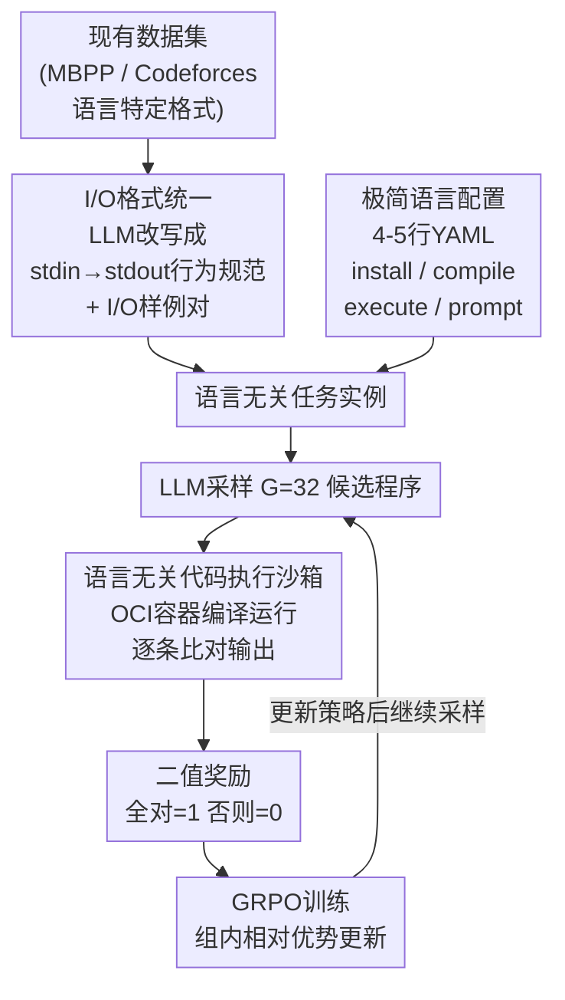

# Agnostics: Learning to Synthesize Code in Any Programming Language with a Universal RL Environment

**会议**: ICLR 2026  
**arXiv**: [2508.04865](https://arxiv.org/abs/2508.04865)  
**代码**: [https://github.com/sunblaze-ucb/agnostics](https://github.com/sunblaze-ucb/agnostics) (agnostics.abgru.me)  
**领域**: 其他  
**关键词**: 低资源编程语言, RLVR, 语言无关验证器, GRPO, 代码执行沙箱  

## 一句话总结
提出Agnostics，一种语言无关的后训练pipeline：将编程任务统一为I/O行为规范格式，用通用验证器+GRPO强化学习训练LLM在任何编程语言上编码，使Qwen 4B在Lua/Julia/R/OCaml/Fortran五种低资源语言上达到匹敌16B-70B模型的SOTA水平。

## 研究背景与动机

**领域现状**：LLM擅长Python/JavaScript等高资源语言编程，但在Lua(0.53%)、Julia(0.10%)、R(0.35%)、Fortran(0.07%)等低资源语言上表现极差——不仅预训练数据少，后训练（SFT+RL）的数据集、测试工具和RL基础设施也严重缺乏。

**现有痛点**：(a) 每种新语言似乎都需要新的数据集、测试框架和RL环境——工程代价极高；(b) 合成数据方法（如MultiPL-T）需要为每种语言编写~500行的提示/测试翻译器，且拒绝采样在困难问题上效率极低（≈30%接受率）；(c) 预训练阶段上采样低资源语言或在其数据上微调改善有限。

**核心矛盾**：RL需要可靠的奖励信号（代码正确性验证），但为每种语言构建验证环境是该过程中最重的工程负担。

**本文目标**：设计一个"配置一种新语言只需4-5行YAML"的通用RL后训练pipeline。

**切入角度**：关键洞察——对大量编程任务而言，**正确性可以纯粹通过程序的外部可观察行为（I/O）来判定**，因此验证器可以与目标语言完全解耦。

**核心 idea**：将所有编程任务统一为"读stdin→计算→写stdout"的I/O格式，用一个语言无关的验证器给任何语言的代码打奖励，实现通用RLVR。

## 方法详解

### 整体框架
Agnostics要解决的核心难题是：为一种新的低资源语言搭一套能跑RL的环境，最重的活就是"验证代码对不对"，而传统做法把验证器和语言绑死，每换一种语言都得重写一遍测试框架。它的破局点是把验证从语言里彻底剥离出来——只要程序读stdin、算一算、写stdout，那"输出对不对"和它用什么语言写的毫无关系，一个验证器就能给所有语言打分。

整条pipeline分两段：先是**数据准备**，用LLM把MBPP、Codeforces等现有数据集里语言特定的格式（Python函数+assert）改写成纯I/O行为描述，再配一份几行的语言配置把它落到目标语言上；然后是**训练**，模型对每个任务采样一组候选程序，丢进语言无关的代码执行沙箱跑出二值正确性当奖励，再用GRPO按组内相对优势更新——更新后的策略继续采样，如此循环。

### 关键设计

**1. I/O格式统一：把语言特定的任务改写成可被任意语言复用的行为规范**

每种语言的测试方式都不一样，验证器没法通用，根子就在任务描述本身是语言特定的。Agnostics让LLM把原始任务（如MBPP里的Python函数加一串assert）重写成"读标准输入→计算→写标准输出"的问题描述，外加若干I/O样例对 $(in_k, out_k)$。改写时特别要求LLM把I/O约定钉死——小数保留几位、字段用什么分隔、是否排序——消除一切歧义，否则同一份输入会有多个"合法"输出导致误判。改完之后这份规范对任何语言都成立：不管是Lua还是Fortran，只要程序能跑出 $out_k$ 就算对，验证器不需要知道语言是什么。

**2. 极简语言配置：用4-5行YAML替代数百行的语言翻译器**

I/O规范统一之后，接新语言剩下的只是"怎么编译怎么跑"这点机械信息。配置文件就五个字段：`install`（装编译器）、`filename`（源文件名）、`compile`（编译命令）、`execute`（运行命令）、`prompt`（提示前缀）。比如R语言只需写明装tidyverse、文件名snippet.R、用Rscript执行、再加一句关于readLines读输入用法的提示就够了。相比MultiPL-T那种每语言~500行的提示/测试翻译器，工程量直接塌缩到几行。对OCaml、Fortran这类极低资源语言，连prompt prefix都能半自动生成：先让模型生成一批错误代码，再用GPT-o3分析它们的共性错误，反过来写出针对性的提示前缀。

**3. 语言无关代码执行沙箱：安全且高效地编译运行任意语言来算奖励**

有了规范和配置，还需要一个能真把代码跑起来、且不会被恶意或病态代码搞崩的执行环境。沙箱基于OCI容器，为每种语言预构建含编译器的镜像；容器内常驻一个执行harness，接收(程序, I/O样例, 超时)三元组，写文件→编译→运行→逐条比对输出，全部命中奖励=1，否则=0。安全是头等约束：CPU、内存、文件系统、输出大小（5MB上限）全部设限，专门防无限循环、宏展开爆炸、巨量输出这类病态行为。效率上做了两处关键优化——复用warm容器而非每次spawn新容器，快了约两个数量级；编译走RAM disk进一步提速。

**4. GRPO训练：用组内相对优势把二值正确性变成可用的RL信号**

奖励信号有了，最后是怎么用它更新模型。每个prompt采样 $G=32$ 个候选，逐个丢进沙箱验证得到二值奖励 $R_i \in \{0,1\}$，再算组内相对优势

$$\hat{A}_i = \frac{R_i - \text{mean}(R)}{\text{std}(R)}$$

然后走标准的clipped PPO更新，省掉KL散度项。这里有个重要的踩坑：作者试过给"能跑但输出错"的程序发部分奖励，结果模型很快学会钻空子——要么生成空程序，要么直接硬编码公开测试用例骗分。所以最终坚持二值奖励，只有全部测试通过才给分，反而最稳。

### 训练策略
- AdamW，lr=5e-6，cosine decay，0.1 epoch warmup
- 每batch 4个prompt × 32组大小
- 训练温度0.7，评估温度0.2
- 单epoch训练
- 用Ray实现分布式：GPU节点做训练，CPU节点做代码执行

## 实验关键数据

### 主实验——Ag-LiveCodeBench-X (新的多语言难基准)

| 模型 | Lua | Julia | R | OCaml | Fortran |
|------|-----|-------|---|-------|---------|
| Llama 3.3 70B | 25 | 22 | 13 | 7 | 3 |
| Qwen 3 32B | 22 | 26 | 17 | 2 | 1 |
| Qwen 3 4B (base) | 11 | 10 | 10 | 1 | 0 |
| **Qwen3-4B-CF-X (Ours)** | **23** | **22** | **15** | **7** | **15** |
| **Qwen3-8B-CF-X (Ours)** | **25** | **25** | **19** | **7** | **17** |

4B模型训练后达到匹敌70B模型的水平！OCaml从1%→7%（与Sonnet 4持平），Fortran从0%→15%（超过所有对比模型）。

### MultiPL-E结果
在更简单的MultiPL-E基准上同样显著提升，达到≤16B参数模型的SOTA。

### 关键发现
- 从几乎为零的基准准确率（如Fortran 0%、OCaml 1%）训练成功，说明RLVR只需极低的初始能力即可启动学习
- Binary reward（全对=1/否则=0）比部分奖励更有效——后者被模型exploit
- Ag-Codeforces-X（竞赛编程数据）比Ag-MBPP-X（简单任务）训练效果好得多——偏难的训练数据更有价值
- 每条轨迹训练成本低，整个pipeline高度自动化

## 亮点与洞察
- **将语言特定问题转化为语言无关问题**的思路极其巧妙——I/O是程序行为的通用接口，任何语言都能产生，一个验证器能检验所有语言
- **4行YAML配置新语言**使得扩展到新语言几乎零门槛——这对低资源语言社区有极大的实用价值
- **小模型+领域RL >> 大模型**的结论再次被验证：4B RLVR模型 ≈ 70B基线。这说明代码生成任务中，验证信号的价值远超模型规模
- 执行沙箱的工程设计非常周到（warm容器、RAM disk、输出大小限制、编译/执行双超时），是真正的production-ready系统

## 局限与展望
- 限于"stdin/stdout I/O"格式的任务，不适用于需要API调用、GUI交互、文件操作的编程任务
- 语言配置中的prompt prefix仍需人工或半自动编写，对极罕见语言可能不trivial
- 仅验证输出正确性，不评估代码风格、效率、惯用法——训练出的代码可能不idiomatic
- 训练只做了1个epoch，更长训练或curriculum learning可能进一步提升
- 未在大模型（>16B）上验证——对已经较强的大模型，RLVR的边际收益是否递减？

## 相关工作与启发
- **vs MultiPL-T**: MultiPL-T需要为每种语言写~500行翻译器，拒绝采样在难问题上需要数量级更多计算；Agnostics仅需4行YAML+RLVR
- **vs DeepSeek R1**: R1在代码RL上对Python有效但未公开低资源语言细节；Agnostics专攻低资源语言场景
- **vs 合成SFT数据**: Cassano et al.证明无验证的合成数据对低资源语言几乎无效；RLVR通过验证信号解决了这个问题

## 评分
- 新颖性: ⭐⭐⭐⭐⭐ I/O行为验证实现语言无关RL的核心idea既简单又深刻，实用创新
- 实验充分度: ⭐⭐⭐⭐⭐ 5种低资源语言×多个模型×两个基准+自建新基准Ag-LCB-X，非常全面
- 写作质量: ⭐⭐⭐⭐⭐ 清晰有组织，系统设计决策都有合理解释
- 价值: ⭐⭐⭐⭐⭐ 对低资源编程语言的LLM后训练提供了完整的基础设施级解决方案

<!-- RELATED:START -->

## 相关论文

- [\[ICLR 2026\] A2D: Any-Order, Any-Step Safety Alignment for Diffusion Language Models](a2d_any-order_any-step_safety_alignment_for_diffusion_language_models.md)
- [\[ICLR 2026\] Toward Universal and Transferable Jailbreak Attacks on Vision-Language Models (UltraBreak)](toward_universal_and_transferable_jailbreak_attacks_on_vision-language_models.md)
- [\[ACL 2026\] AgentV-RL: Scaling Reward Modeling with Agentic Verifier](../../ACL2026/llm_alignment/agentv-rl_scaling_reward_modeling_with_agentic_verifier.md)
- [\[ICLR 2026\] No Prompt Left Behind: Exploiting Zero-Variance Prompts in LLM Reinforcement Learning via Entropy-Guided Advantage Shaping](no_prompt_left_behind_exploiting_zero-variance_prompts_in_llm_reinforcement_lear.md)
- [\[ICLR 2026\] Learning More with Less: A Dynamic Dual-Level Down-Sampling Framework for Efficient Policy Optimization](learning_more_with_less_a_dynamic_dual-level_down-sampling_framework_for_efficie.md)

<!-- RELATED:END -->
