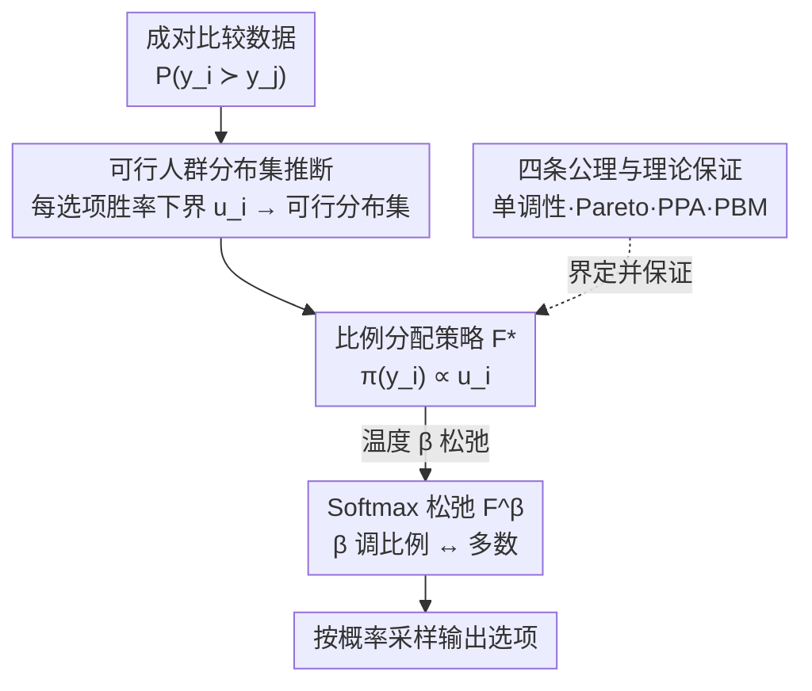

# Beyond RLHF and NLHF: Population-Proportional Alignment under an Axiomatic Framework

**会议**: ICLR 2026  
**arXiv**: [2506.05619](https://arxiv.org/abs/2506.05619)  
**代码**: 补充材料中包含实验代码  
**领域**: AI Alignment / Social Choice Theory  
**关键词**: RLHF, NLHF, 偏好学习, 社会选择理论, 人群比例对齐, 公理化框架  

## 一句话总结
提出基于社会选择理论公理的偏好学习框架，从成对比较数据中推断评估者人群分布的可行集，构造满足人群比例对齐(PPA)和人群有界可操纵性(PBM)公理的策略。

## 背景与动机

**领域现状**：主流偏好学习有两条路线。RLHF 用 Bradley-Terry 模型把多人的偏好压缩成单一标量奖励再优化策略，等价于社会选择里的最大 Borda 规则、确定性地选出胜者；NLHF 则把偏好学习建模为两人零和博弈、求 Nash 均衡策略，对应最大彩票（maximal lotteries）。两者都能聚合偏好，却都不保证策略**按人群比例**反映各评估者群体。

**核心痛点**：当两组评估者对两个选项的偏好接近 50:50（如 $50{+}\epsilon$ 比 $50{-}\epsilon$）时，RLHF 和 NLHF 都会输出确定性策略、把概率全押在微弱多数方，少数群体被彻底抹平——这种细微的比例差异在策略优化里被丢失了。

**已有方案的局限**：能做"按比例对齐"的多元对齐方法（mixture-based、steerable models）通常需要显式的评估者群组标签，而现实中群组身份往往隐式、不可观测；公理化方案里像随机独裁制（Random Dictatorship）虽满足比例对齐，却无法仅凭成对比较数据实现。

**本文目标**：不依赖任何额外群组信息，仅从成对比较数据出发，构造一个既按人群比例对齐、又难被策略性操纵的偏好学习算法。

## 方法详解

### 整体框架

整个方法把"对齐"重新表述成一个社会选择问题：不再把偏好压成单一标量奖励，而是分两步走——先从成对比较数据反推出"评估者人群可能长什么样"的可行集合，再在这个集合上构造一个按各群体份额比例随机选择、且难被操纵的策略。第一步对每个选项估出一个人群份额上界，把这些上界拼成真实人群分布的多面体外近似；第二步据此分配选择概率，得到比例策略 $F^*$，并用温度参数把它松弛成可在"比例公平"与"服从多数"之间滑动的 $F^\beta$。最后用四条公理界定这样的策略应满足的性质，并证明 RLHF/NLHF 会违反其中的比例与抗操纵公理，而本文策略在这两条上有理论保证。

### 关键设计

**1. 可行人群分布集推断：没有群组标签时反推人群结构**

多元对齐方法通常要求显式的评估者群组标签，但实际只能拿到成对比较数据。本文绕开这一点：对每个选项 $y_i$，定义 $u_i = \min_{y \neq y_i} P(y_i \succ y)$，即 $y_i$ 在所有对决中胜率的最小值，作为支持 $y_i$ 的人群份额的一个上界——因为任何把 $y_i$ 排在首位的群体，至少要让 $y_i$ 赢下所有对手，所以该群体的份额不会超过 $y_i$ 的最低胜率。把这些上界拼起来，就得到真实人群分布 $w$ 的多面体外近似

$$\bar{\mathcal{W}}(P) = \{w \in \Delta(\mathcal{Y}) \mid w_i \leq u_i\}.$$

它的约束数只随选项数 $M$ 线性增长，因此可处理；代价是选项多时这个外近似会偏宽松。这样无需任何额外标注，仅凭比较概率就刻画出"人群可能长什么样"的集合。

**2. 比例分配策略 F*：让选择概率正比于人群份额**

有了上界后，最自然的对齐策略是按份额比例随机选择：$\pi(y_i) = u_i / \sum_j u_j$。这与 RLHF/NLHF 的确定性输出形成对比——当两群人对两个选项的偏好接近 $50{+}\epsilon$ 比 $50{-}\epsilon$ 时，确定性策略会把概率全押给微弱多数方、彻底丢掉少数方，而比例策略会以接近一半的概率照顾到弱势群体。换句话说，它在最坏情况下的比例失配上取保守解，保证少数偏好不被多数的微弱优势抹平。

**3. Softmax 松弛 F^β：在比例对齐与服从多数间可调权衡**

纯比例策略虽然公平，却可能在该果断选多数方时显得"太软"。为此引入温度参数 $\beta$ 做松弛：

$$\pi(y_i) = \frac{u_i \exp(\beta u_i)}{\sum_j u_j \exp(\beta u_j)}.$$

$\beta = 0$ 时退化回原始比例策略 $F^*$；$\beta \to \infty$ 时概率质量集中到上界最大的选项，收敛为 minimax Condorcet 方法（即偏向能在两两对决中胜过所有对手的 Condorcet 赢家）。因此 $\beta$ 越大越偏向多数、胜率越高，但比例对齐随之变弱——这条权衡被后续实验直接验证。

**4. 四条公理与理论保证：界定"好策略"并证明优于 RLHF/NLHF**

为说明上述策略的合理性，本文用四条公理作为评判标准。两条基础公理是**单调性**（提升某选项排名不会降低它被选中的概率）和 **Pareto 效率**（若所有人都偏好 $y$ 胜 $y'$，策略应倾向 $y$）。真正核心的是两条新提出的量化公理：$\alpha$-PPA（人群比例对齐）要求每个群体首选项的被选概率至少弱比例于其人群份额，即 $\pi(y_k)/w_k^\sigma \geq \alpha(\sigma)$；$\gamma$-PBM（人群有界可操纵性）要求任何群体靠策略性误报偏好所能攫取的策略增益被仿射上界 $\gamma_1 w_k^\sigma + \gamma_2$ 约束住，从而非多数群体无法靠操纵翻身成多数。本文进一步证明：RLHF 与 NLHF 会违反任意强度的 PPA 和 PBM，而本文策略在这两条公理上有理论保证——这正是它区别于既有方法的根本所在。

## 实验

### 主实验：MovieLens 电影推荐

| 方法 | 胜率 | PPA 水平 | PBM 增益 |
|------|------|----------|----------|
| RLHF | 0.7784 | 0 | 0.0611 |
| NLHF | 0.7712 | 0 | 0.0124 |
| $F^\beta$($\beta=1$) | ~0.60 | 0.4869 | 8.9e-4 |

- β 增大时胜率升高但 PPA 下降，验证理论预测的权衡关系
- 提出方法在 β≤10 时操纵抗性显著优于基线

### 消融实验：LLM 对齐（Qwen2.5-3B-Instruct）

| 数据集 | β=0 PPA | DPO PPA |
|--------|---------|---------|
| Synthetic-Color | 0.0883 | 0.0000 |
| Alpaca-Expertise | 0.1428 | 0.1321 |
| Alpaca-Style | 0.5012 | 0.3786 |

- 合成数据上权衡明显；Alpaca 数据因 GPT-4.1 注释噪声效果较弱
- 计算代价与 RLHF 相当，高于 DPO

## 亮点与洞察
- 理论严谨：证明 RLHF/NLHF 违反任意强度的 PPA 和 PBM 公理
- 仅需成对比较数据即可推断人群分布可行集，不需要群组标签
- Softmax 松弛提供比例对齐与 Condorcet 一致性的可调权衡
- 操纵抗性有理论保证：非多数群体无法通过策略性误报获得多数地位

## 局限与展望
- PPA 仅关注各群组首选项的选择概率，忽略低排名偏好
- LLM 场景下评估 PPA 水平仍是开放问题（logit 估计 vs 群组分类均有噪声）
- 两阶段函数近似方法计算开销不低于 RLHF，需开发直接策略优化版本
- 外近似 $\bar{\mathcal{W}}$ 在选项数多时可能过于宽松

## 相关工作
- **RLHF / DPO**：等价于最大 Borda 规则，确定性选择胜者
- **NLHF**：等价于最大彩票(Maximal Lotteries)，满足 Pareto 但不满足 PPA
- **Random Dictatorship**：完美 PPA 但不可从成对比较实现
- **多元对齐**（Sorensen 2024, Chen 2024）：需要显式群组标签
- **抗操纵机制**（Buening 2025, Park 2024）：追求严格策略防篡改，本文约束群体层面增益

## 评分
- 新颖性: ⭐⭐⭐⭐⭐
- 实验充分度: ⭐⭐⭐⭐
- 写作质量: ⭐⭐⭐⭐⭐
- 价值: ⭐⭐⭐⭐

<!-- RELATED:START -->

## 相关论文

- [\[ICLR 2026\] Beyond Pairwise: Empowering LLM Alignment With Ranked Choice Modeling](beyond_pairwise_empowering_llm_alignment_with_ranked_choice_modeling.md)
- [\[ICLR 2026\] General Exploratory Bonus for Optimistic Exploration in RLHF](general_exploratory_bonus_for_optimistic_exploration_in_rlhf.md)
- [\[ICLR 2026\] JailNewsBench: Multi-Lingual and Regional Benchmark for Fake News Generation under Jailbreak Attacks](jailnewsbench_multi-lingual_and_regional_benchmark_for_fake_news_generation_unde.md)
- [\[ICLR 2026\] Unifying Stable Optimization and Reference Regularization in RLHF (DAR)](unifying_stable_optimization_and_reference_regularization_in_rlhf.md)
- [\[CVPR 2026\] EcoAlign: An Economically Rational Framework for Efficient LVLM Alignment](../../CVPR2026/llm_alignment/ecoalign_an_economically_rational_framework_for_efficient_lvlm_alignment.md)

<!-- RELATED:END -->
