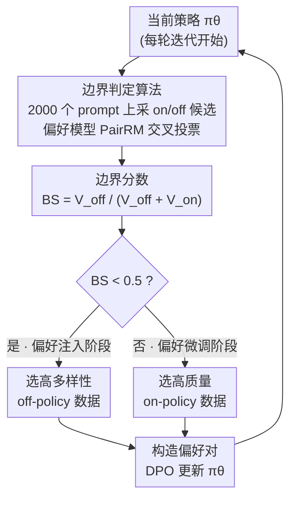

# Is On-Policy Data always the Best Choice for Direct Preference Optimization-based LM Alignment?

**会议**: ICLR 2026  
**arXiv**: [2508.10530](https://arxiv.org/abs/2508.10530)  
**代码**: 无（见可复现性声明）  
**领域**: 对齐RLHF / DPO  
**关键词**: on-policy vs off-policy, 对齐阶段, 偏好注入, 偏好微调, 数据选择

## 一句话总结
挑战"on-policy数据总是更好"的共识：发现对齐过程分为偏好注入（需高多样性off-policy数据）和偏好微调（需高质量on-policy数据）两个阶段，不同模型/阶段对数据类型的最优选择不同。提出仅3.2%计算开销的边界判定算法，在5个模型×55个配置上验证有效。

## 研究背景与动机

**领域现状**：DPO及其变体是LLM偏好对齐的主流方法。近期研究趋势认为on-policy数据（训练中由当前策略生成的偏好候选）优于off-policy数据（预定义数据集）。

**现有痛点**：
   - 实际表现与"on-policy总是更好"矛盾：Llama-3上on-policy确实好3倍，但Zephyr上on-policy反而差0.4倍，Phi-2上off-policy一致更优
   - 缺乏对"何时用on/off-policy"的系统理解
   - on-policy数据采集计算成本高，如果不需要就浪费资源

**核心矛盾**：on-policy vs off-policy的效果差异是模型相关的，但缺乏解释和预测机制

**核心 idea**：对齐 = 偏好注入(探索,需多样性) → 偏好微调(利用,需质量)，边界可量化判定

## 方法详解

### 整体框架
这篇论文要回答一个被社区默认的问题：DPO 对齐时，on-policy 数据是不是永远比 off-policy 好。作者的答案是「分阶段看」——他们提出「对齐阶段假说」，把一次完整的偏好对齐拆成偏好注入和偏好微调两个阶段，两个阶段对数据类型的最优选择正好相反。落到训练里，每一轮迭代开始时先用一个轻量的边界判定算法（Algorithm 1）算出一个标量边界分数，判断当前策略处在哪个阶段；据此在注入阶段选高多样性的 off-policy 数据、在微调阶段选高质量的 on-policy 数据来构造偏好对，再做一步 DPO 更新进入下一轮。这样就把"何时该花大成本采 on-policy 数据"变成了一次几乎免费的判定，避免盲目采集。下面这套循环就是方法的骨架，作者另用两条定理解释"为什么数据选择能左右对齐质量"。

### 关键设计

**1. 对齐阶段假说：把"该用哪种数据"归结为模型当前所处的阶段**

社区之所以在 on/off-policy 上得到互相矛盾的结论，是因为忽略了模型本身的状态。作者假设对齐天然分两段：偏好注入阶段，模型还没摸清人类偏好、连高奖励区域在哪都不知道，这时需要高多样性的 off-policy 数据做广泛探索，把偏好知识「注入」进策略；偏好微调阶段，模型已经大致掌握偏好方向，只需在已识别的高奖励区域里精修，这时高质量的 on-policy 数据更有用。本质上这就是强化学习里 exploration-exploitation 的权衡——探索期要广（多样性），利用期要准（质量），所以同一份 on-policy 数据在两个阶段的价值可以完全相反（Llama-3 上 on-policy 强 3 倍、Zephyr 上反而只有 0.4 倍）。框架图里那个分支判断，对应的就是这两个阶段。

**2. 边界判定算法：用一个标量分数判断当前在注入还是微调阶段**

假说要能用，关键是低成本地判断阶段边界。作者在 UltraFeedback 的 2000 个 prompt 上，让当前策略生成 on-policy 候选、再从静态数据集取对应的 off-policy 候选，用偏好模型 $\mathbb{P}$（实现为 PairRM）把两边的候选两两交叉比较，分别累计 on-policy 胜出票数 $V_{\text{on}}$ 与 off-policy 胜出票数 $V_{\text{off}}$，定义边界分数

$$BS = \frac{V_{\text{off}}}{V_{\text{off}} + V_{\text{on}}}$$

决策以 0.5 为界：$BS < 0.5$ 判为偏好注入阶段、选高多样性的 off-policy 数据（此时多样性带来的增益 $\Delta>1$）；$BS \ge 0.5$ 判为偏好微调阶段、选高质量的 on-policy 数据。这条规则与实测对齐——基座强的 Llama-3 全程 $BS>0.5$（一进来就在微调阶段）、弱的 Phi-2 全程 $BS<0.5$（长期停在注入阶段）、Zephyr 则随训练从 0.40 升到 0.66 完成阶段切换。整个判定只在 2000 个 prompt 上跑一遍推理，相比在 61,135 条样本上做一个完整 DPO epoch，开销约 3.2%，几乎可忽略。

> ⚠️ Algorithm 1 的分支文字（$V_{\text{off}}>V_{\text{on}}$ 判为注入）与 Table 3 给出的「$BS<0.5$ 判为注入」在投票方向上写法相反，本笔记以与实测数据自洽的 Table 3 阈值为准；精确的投票计数方向以原文 Algorithm 1 为准。

**3. 理论支撑：从 DPO 目标推出"为什么数据选择能左右对齐质量"**

为说明这套划分不是凑出来的，作者给了一组定理。Theorem 5.1 证明 DPO 的优化目标与真正的对齐目标在理论上等价，因此「用偏好模型评估候选、再据此选数据」是优化对齐目标的合理代理。Theorem 5.2 进一步指出，只有在无穷偏好数据下才能达到最优对齐——有限数据下优化目标退化为在该数据集内让 $\mathbb{P}_\theta$ 与 $\mathbb{P}^*$ 的「偏好一致性」最大，于是数据的覆盖范围（多样性）与可信度（质量）都会成为瓶颈，正好对应注入期缺多样性、微调期缺质量两种失配。再配合 Definition 5.3 / Theorem 5.4 给出的 $\mathbb{P}^*$ 与真实文本分布 $\pi_G$ 之间的双射，就能用「比较 $\pi_\theta$ 与 $\pi_{\text{off}}$ 哪个更接近 $\pi_G$」来落地成上面那个可计算的边界分数。

## 实验关键数据

### 主实验：两轮迭代全组合（AlpacaEval 2.0 LC Win Rate）

| 模型 | 阶段 | 最佳数据选择 | LC Win Rate | 说明 |
|------|------|-------------|-----------|------|
| Llama-3 | SFT→Iter1 | off→**on** | **40.57** | on-policy在微调阶段好3× |
| Zephyr | SFT→Iter1 | **off**→on | **20.77→33.28** | off-policy在注入阶段好2.27× |
| Phi-2 | SFT→Iter1 | **off** | **5.97** | on-policy反而降分(-1.60) |

### 多样性 vs 质量实验

| 阶段 | 数据源 | 关键特征 | 效果 |
|------|--------|---------|------|
| 注入阶段(Zephyr) | off-policy | 高多样性 | **+12.65** |
| 注入阶段(Zephyr) | on-policy | 低多样性 | +5.58 |
| 微调阶段(Zephyr) | on-policy | 高质量 | **+12.51** |
| 微调阶段(Zephyr) | off-policy | 高多样性 | +3.00 |

### 边界判定结果

| 模型 | Boundary Score轨迹 | 阶段判定 |
|------|-------------------|---------|
| Llama-3 | >0.5(全程) | 全程微调阶段 |
| Phi-2 | <0.5(全程) | 全程注入阶段 |
| Zephyr | 0.40→0.66→0.69 | 注入→微调转换 |

### 关键发现
- **on-policy不总是最优**：这挑战了社区的主流假设
- **阶段转换是关键**：Zephyr展示了从注入到微调的清晰转换(BS从0.40→0.66)
- **多样性 vs 质量的探索-利用**：注入阶段多样性重要(off-policy好)，微调阶段质量重要(on-policy好)
- **强模型直接进入微调**：Llama-3(SFT后24.59% LC)因为基座能力强，直接处于微调阶段
- **弱模型长期停留注入**：Phi-2(5.81% LC)需要更多探索性数据

## 亮点与洞察
- **数据选择 > 算法创新**：在偏好对齐中，正确选择数据类型比改进损失函数可能更重要。这个发现有重要的实践指导意义
- **对齐阶段假说简洁有力**：将复杂问题降维为两阶段决策+一个标量边界分，便于工程实践
- **挑战共识的勇气**：明确指出"on-policy总是更好"是不准确的，用大量实验支撑反直觉结论
- **边界算法极低开销**：3.2%的额外计算开销换来的数据选择指导，性价比极高

## 局限与展望
- **刚性切换**：论文提出硬切换(注入/微调二选一)，更好的方案可能是平滑混合
- **偏好模型依赖**：边界判定依赖偏好模型 $\mathbb{P}$ 的质量
- **实验用PairRM做偏好标注**：可能与真实人类偏好有偏差
- **改进思路**：
    - 可结合Uni-DPO的质量权重——在注入阶段对off-policy数据也做质量加权
    - 设计平滑混合策略——BS值连续变化时按比例混合on/off-policy

## 相关工作与启发
- **vs Online DPO**：Online DPO假设on-policy总是更好，本文证明这在注入阶段不成立
- **vs Iterative DPO**：迭代DPO每轮都用on-policy，本文建议前几轮用off-policy可能更好
- **vs DAR**：DAR关注RL训练稳定性，本文关注数据选择——两者正交可组合

## 评分
- 新颖性: ⭐⭐⭐⭐⭐ 挑战共识的实证研究+简洁的理论框架
- 实验充分度: ⭐⭐⭐⭐⭐ 5模型×55配置，多消融+扩展验证
- 写作质量: ⭐⭐⭐⭐ 问题驱动的叙事清晰
- 价值: ⭐⭐⭐⭐⭐ 对DPO实践有直接指导意义，节省on-policy采样成本

<!-- RELATED:START -->

## 相关论文

- [\[ICLR 2026\] Beyond Pairwise: Empowering LLM Alignment With Ranked Choice Modeling](beyond_pairwise_empowering_llm_alignment_with_ranked_choice_modeling.md)
- [\[ICLR 2026\] Mitigating the Safety Alignment Tax with Null-Space Constrained Policy Optimization](mitigating_the_safety_alignment_tax_with_null-space_constrained_policy_optimizat.md)
- [\[ICLR 2026\] Token-Importance Guided Direct Preference Optimization (TI-DPO)](token-importance_guided_direct_preference_optimization.md)
- [\[ICLR 2026\] SafeDPO: A Simple Approach to Direct Preference Optimization with Enhanced Safety](safedpo_preference_optimization_safety.md)
- [\[ICLR 2026\] Towards Understanding Valuable Preference Data for Large Language Model Alignment](towards_understanding_valuable_preference_data_for_large_language_model_alignmen.md)

<!-- RELATED:END -->
