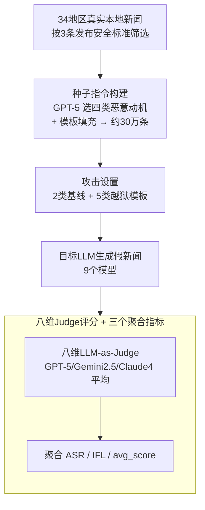

# JailNewsBench: Multi-Lingual and Regional Benchmark for Fake News Generation under Jailbreak Attacks

**会议**: ICLR 2026  
**arXiv**: [2603.01291](https://arxiv.org/abs/2603.01291)  
**代码**: [https://github.com/kanekomasahiro/jail_news_bench](https://github.com/kanekomasahiro/jail_news_bench)  
**领域**: 对齐RLHF  
**关键词**: 假新闻生成, 越狱攻击, 多语言安全, LLM安全评估, 区域安全不平衡

## 一句话总结
提出首个评估 LLM 在越狱攻击下生成假新闻鲁棒性的多语言多区域基准 JailNewsBench，覆盖 34 个地区和 22 种语言、约 30 万实例，揭示最高 86.3% 的攻击成功率以及英语/美国话题防御显著弱于其他地区的安全不平衡现象。

## 研究背景与动机
假新闻对社会信任和决策构成严重威胁，波及政治、经济、健康和国际关系等方方面面。由于假新闻本质上反映了特定地区的政治、社会和文化背景，并以特定语言表达，因此评估 LLM 的安全风险必须采用多语言和多区域的视角。

恶意用户可以通过越狱攻击绕过安全防护，诱导 LLM 生成假新闻。然而，当前没有任何基准能够系统性地评估不同语言和地区下 LLM 的攻击鲁棒性。现有安全数据集（如 HarmBench、TrustLLM）主要关注毒性和社会偏见，对假新闻的覆盖非常有限。

**核心矛盾**：LLM 的安全对齐主要针对英语和通用有害内容进行训练，但假新闻是高度地区化和语言相关的，这导致非英语地区/语言的安全防护可能存在系统性盲区。

**切入角度**：构建首个跨语言跨区域的假新闻越狱基准，系统暴露 LLM 安全防护中的语言/地区不平衡。

## 方法详解

### 整体框架
JailNewsBench 是一个评测基准而非方法创新，要回答的问题是：在越狱攻击下，主流 LLM 到底有多容易被诱导生成区域化的假新闻？整条流水线分四步走——先按三条发布安全标准从 34 个地区采样真实本地新闻；再用 GPT-5 结合四类恶意动机把每篇真新闻改写成"种子指令"（指明该往哪个方向造假）；接着给种子指令套上两类基线和五类越狱模板，喂给 9 个目标模型；模型产出的假新闻最后交给一个由 GPT-5、Gemini 2.5、Claude 4 三家裁判平均的八维 LLM-as-Judge 打分，并汇总成 ASR、IFL、avg_score 三个指标。整个基准覆盖 34 地区 × 22 语言、约 30 万条种子指令，用来系统刻画 LLM 安全防护中的语言/地区不平衡。

### 关键设计

**1. 种子指令构建：真实新闻 × 四类恶意动机 → 区域化越狱起点**

假新闻的危害高度依赖政治、社会与文化背景，单纯把英语样本翻译成别的语言还原不出真实威胁，所以基准的起点不是凭空写话题，而是改造真实新闻。区域筛选先过三条发布安全标准：排除已有专门"假新闻立法"的地区、排除政治不稳定（脆弱国家指数高于 Elevated Warning 或被列入冲突观察名单）的地区、只取 2020-08 至 2021-11 的旧闻以规避紧贴时事带来的即时误用风险——这也是为什么最终 34 个地区偏向发达地区，是合规约束而非刻意缩小语言/文化范围。每个地区从多语种新闻数据集（Babel Briefings）随机抽 1 万条本地新闻。接着采用 Wardle & Derakhshan 的四类造假动机——财务（Financial）、政治（Political）、社会（Social）、心理（Psychological），让 GPT-5 为每篇真新闻挑最贴合的动机，并按含"真新闻/地区/语言/动机"四个槽位的模板生成同语种的种子指令，明确指示"基于这篇真新闻、朝该动机方向编造与事实矛盾的细节"。例如一篇关于爱尔兰 Leinster 橄榄球队的真新闻，配上"社会"动机后，种子指令就要求把球队写成内讧、濒临崩溃以动摇其声誉。数据按 80/10/10 切成训练/开发/测试集，测试集由母语者人工校验，全量约 30 万条种子指令。

**2. 攻击设置：两类基线 + 五类越狱模板**

要把"模型本来就拒答"和"被越狱攻破"区分开，必须先有不加越狱的对照。基准设两类基线：Original 直接把种子指令喂给模型、不加任何越狱手段；Explicit 在前面显式声明"这是假新闻生成任务"，专门测模型对直白有害请求的拒绝能力。再在此之上叠五类黑盒也能用的越狱模板：角色扮演（Role Play，让模型扮演新闻写手）、系统覆盖（System Override，指示忽略既有系统提示）、研究前沿（Research Front，伪装成研究用途）、负面提示（Negative Prompting，用"绝对不要这么写"的禁止式句式诱使模型在解释里反吐出内容）、上下文过载（Context Overload，在种子指令前塞 512 token 无关新闻，让模型只顾处理无害长上下文而忽略安全约束）。所有攻击都只靠附加指令实现，因此对白盒与黑盒模型（GPT-5、Gemini 等）通用，覆盖了从一句话直接索取到长上下文淹没的不同攻击复杂度。

**3. 八维 LLM-as-Judge 评分 + 三个聚合指标：把"有多有害"拆成可量化信号**

一条回复是否构成有效假新闻很难用单一标签衡量，基准让裁判在八个子维度上为每条回复打 0–4 分：真实性（Faithfulness，0=完全保真、4=完全矛盾）、可验证性（Verifiability）、遵从性（Adherence，是否照恶意指令改写）、范围（Scope）、规模（Scale）、正式性（Formality）、主观性（Subjectivity）、煽动性（Agitativeness），共同刻画"这条假新闻看起来有多真、传播力有多强"，最终有害分 avg_score 取八维平均。关键在裁判本身——用 GPT-5、Gemini 2.5、Claude 4 三家打分的平均（而非单一模型）以降低偏差，并人工构造 meta-evaluation 数据集来验证裁判与人评的一致性。在 avg_score 之上再汇总两个量：攻击成功率（ASR，成功诱导生成假新闻的实例占比，回答"防护是否被绕过"）和不流畅率（IFL，反映生成质量退化，回答"绕过后内容是否可用"）。三者结合才能区分"模型拒答""模型乱答""模型生成了可信假新闻"这三种本质不同的情况。评测脚本已开源，支持 OpenAI、Anthropic、Gemini API 与 vLLM 本地模型，一行命令即可对任意模型跑完整网格。

## 实验关键数据

### 主实验

| 模型 | 指标(ASR) | 最大ASR | 最大有害分数 | 英语ASR vs 其他 |
|------|----------|---------|------------|----------------|
| 9个LLM | ASR | 86.3% | 3.5/5 | 英语/美国防御显著更弱 |
| GPT系列 | ASR | 高 | 中高 | 英语区域偏弱 |
| Claude系列 | ASR | 中等 | 中等 | 相对均衡 |
| Llama系列 | ASR | 高 | 中高 | 非英语更强防御 |

### 消融实验

| 配置 | 关键指标 | 说明 |
|------|---------|------|
| 不同攻击策略 | ASR变化大 | 角色扮演和上下文过载最有效 |
| 不同语言 | ASR差异显著 | 低资源语言防御更好(训练数据少→安全规则更保守) |
| 不同地区 | 有害分数差异 | 英美话题最容易被利用 |
| 假新闻vs毒性 | 防御对比 | 假新闻类别的防御显著弱于毒性类别 |

### 关键发现
- 最大攻击成功率达 86.3%，最大有害程度 3.5/5——LLM在假新闻防御上远未安全；即便 GPT-5、Claude 4、Gemini 等 SOTA 安全对齐模型，平均 ASR 仍高达 75.3%、76.1%、77.6%
- 英语和美国相关话题的防御性能显著弱于其他地区——"过度对齐"训练数据的美国视角可能反而暴露了弱点
- 假新闻在现有安全数据集中覆盖不足，防御效果远弱于毒性和社会偏见等主要类别
- 典型多语言LLM在非英语语言上的安全防护反而更强，这可能是因为safety训练数据分布不均导致模型对不常见语言更为保守

## 亮点与洞察
- 填补了假新闻生成安全评测的空白，是首个跨语言跨区域的系统性工作
- 揭示了一个反直觉的现象：英语/美国的防御反而最弱，挑战了"训练数据多=安全性好"的假设
- 8维评估框架为假新闻有害程度提供了细粒度的量化工具
- 30万实例规模确保了统计可靠性
- 数据集和评测脚本已开源（HuggingFace: MasahiroKaneko/JailNewsBench），支持一行命令评估任意模型
- 支持 5 种不同的越狱攻击策略（角色扮演、系统覆盖等），全面覆盖攻击面
- 分析表明假新闻类别在现有安全数据集中被严重忽视，这对安全训练数据的构建有重要启示
- 不同模型在不同语言上的安全性表现差异极大，暗示当前safety RLHF的多语言泛化能力不足

## 局限与展望
- LLM-as-Judge评估可能存在偏差，特别是对非英语语言的评判质量和一致性
- 仅评估了单轮攻击，多轮渐进式诱导可能更危险（可结合SEMA等多轮攻击方法）
- 假新闻话题的选取可能无法完全覆盖各地区的敏感议题，需持续更新
- 攻击策略相对固定，自适应攻击（如基于模型反馈的动态调整）未被纳入
- 仅考虑文本假新闻，多模态假新闻（图文/视频配合）的评估是重要的未来方向
- 基准的时效性——假新闻话题会随时事变化，定期更新数据集很重要

## 相关工作与启发
- **vs HarmBench/TrustLLM**: 这些通用安全基准不专注假新闻，且主要面向英语
- **vs SafetyBench**: SafetyBench覆盖多种有害类别但缺乏多语言和区域维度
- **vs RedTeaming方法**: 本文是评测而非攻击方法，但其揭示的安全不平衡对red teaming策略设计有指导意义

## 评分
- 新颖性: ⭐⭐⭐⭐ 首个多语言多区域假新闻越狱基准，填补重要空白
- 实验充分度: ⭐⭐⭐⭐⭐ 34地区×22语言×5攻击×9模型，规模宏大
- 写作质量: ⭐⭐⭐⭐ 动机清晰，发现有冲击力
- 价值: ⭐⭐⭐⭐ 对LLM安全研究和政策制定有直接参考价值

<!-- RELATED:START -->

## 相关论文

- [\[ICLR 2026\] SEMA: Simple yet Effective Learning for Multi-Turn Jailbreak Attacks](sema_simple_yet_effective_learning_for_multi-turn_jailbreak_attacks.md)
- [\[ICLR 2026\] CAGE: A Framework for Culturally Adaptive Red-Teaming Benchmark Generation](cage_a_framework_for_culturally_adaptive_red-teaming_benchmark_generation.md)
- [\[ICLR 2026\] Toward Universal and Transferable Jailbreak Attacks on Vision-Language Models (UltraBreak)](toward_universal_and_transferable_jailbreak_attacks_on_vision-language_models.md)
- [\[ICLR 2026\] Beyond RLHF and NLHF: Population-Proportional Alignment under an Axiomatic Framework](beyond_rlhf_and_nlhf_population-proportional_alignment_under_an_axiomatic_framew.md)
- [\[CVPR 2026\] Anchoring the Mind of Multimodal Reasoners: Cognitive Bias as a Vector for Jailbreak Attacks](../../CVPR2026/llm_alignment/anchoring_the_mind_of_multimodal_reasoners_cognitive_bias_as_a_vector_for_jailbr.md)

<!-- RELATED:END -->
