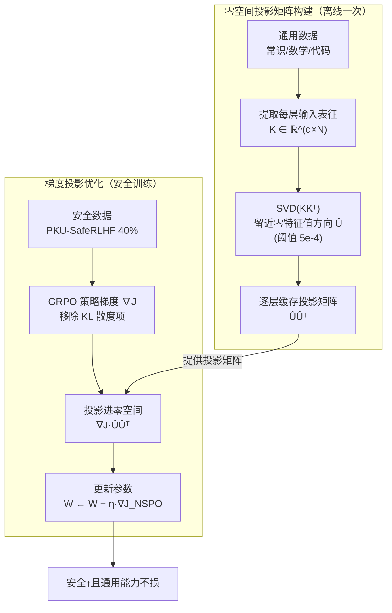

# Mitigating the Safety Alignment Tax with Null-Space Constrained Policy Optimization

**会议**: ICLR 2026  
**arXiv**: [2512.11391](https://arxiv.org/abs/2512.11391)  
**代码**: [https://github.com/ivanniu/NSPO](https://github.com/ivanniu/NSPO)  
**领域**: 对齐RLHF  
**关键词**: Safety Alignment, Null Space, 策略优化, Alignment Tax, gradient projection

## 一句话总结
提出 NSPO，将安全对齐的策略梯度投影到通用任务表征的零空间中，从几何层面保证安全优化不损害通用能力，仅用 40% 安全数据即在 7 个安全 benchmark 上达到 SOTA，同时在数学/代码/指令遵循上几乎无性能损失。

## 研究背景与动机

**领域现状**：LLM 安全对齐（拒绝有害请求、遵守伦理规范）通常通过 RL（PPO/GRPO/DPO）在安全数据上训练实现。

**现有痛点**：安全对齐会导致 **alignment tax**——模型变得过于保守，在数学推理、代码生成等通用任务上性能下降。现有方法（SafeRLHF、W-DOOR、BFPO）将安全和通用能力建模为双目标优化，通过平衡权重或混入大量通用数据来缓解，但**没有在训练过程中显式解决两个目标的梯度冲突**。

**核心矛盾**：安全梯度和通用能力梯度方向存在冲突——沿安全梯度更新参数时，会破坏模型已学到的通用任务表征。

**本文目标** 如何在进行安全对齐时，从根本上避免对通用能力的损害？

**切入角度**：如果参数更新 $\Delta$ 处于通用任务输入表征 $K$ 的零空间（$\Delta K = 0$），则更新后模型对通用输入的输出保持不变。

**核心 idea**：将安全策略梯度投影到通用任务表征矩阵的零空间中，几何上保证安全更新与通用能力正交。

## 方法详解

### 整体框架
NSPO 要解决的是「安全对齐时怎么不伤通用能力」。它抓住一个干净的几何事实：通用能力体现为基模型把每层的输入表征 $K$ 映射到输出 $V=W_{\text{base}}K$ 这套关系；只要参数更新 $\Delta$ 落在 $K$ 的零空间里（$\Delta K = 0$），更新后 $(W+\Delta)K = WK = V$，模型对所有通用输入的输出原封不动。于是 alignment tax 被转化成一个约束问题——把安全更新限制在通用表征的零空间内。

整套流程因此搭在 GRPO 之上、分离线与在线两段。**离线一次**：在少量通用数据上收集每层线性变换的输入表征 $K$，对协方差矩阵 $KK^T$ 做 SVD，挑出近零特征值对应的方向拼成零空间投影矩阵 $\hat{U}\hat{U}^T$，逐层缓存。**在线训练**：在安全数据上照常算 GRPO 策略梯度（但去掉 KL 项），每步更新前先把梯度右乘缓存好的投影矩阵、压进零空间，再拿投影后的梯度更新参数。这样安全优化只能沿「不改变通用输出」的方向发生。

### 关键设计

**1. 零空间投影矩阵构建：把「不能动的方向」一次性算出来**

要保证更新不破坏通用能力，先得知道哪些参数方向承载着通用任务的表征。NSPO 把通用数据（常识、数学、代码）喂进基模型 $\pi_{\text{base}}$，捕获每一层线性变换的输入表征 $K \in \mathbb{R}^{d \times N}$（$d$ 是表征维度、$N$ 是 token 数），目标是找到 $K$ 的左零空间——落在这个子空间里的更新与所有通用输入正交。难点是实际中 $N \gg d$，直接对 $K$ 求零空间在计算和存储上都吃不消。NSPO 改对 $d \times d$ 的非中心协方差矩阵 $KK^T$ 做分解（二者零空间等价，但后者维度小得多）：$\{U, \Lambda, U^T\} = \text{SVD}(KK^T)$，丢掉对应非零特征值的特征向量、只留近零特征值（阈值 $5\text{e-}4$）的那批拼成 $\hat{U}$，投影矩阵即 $\hat{U}\hat{U}^T$。这一步离线算一次、逐层缓存复用，SVD 的 $O(d^3)$ 是一次性开销。

**2. 安全梯度投影到零空间：硬约束代替软平衡**

有了投影矩阵，安全优化就被几何地锁死在零空间里。每步先按 GRPO 算出安全梯度 $\nabla_W \mathcal{J}$，再右乘投影矩阵：

$$\nabla_W \mathcal{J}_{\text{NSPO}} = (\nabla_W \mathcal{J}) \cdot \hat{U}\hat{U}^T$$

投影后的梯度满足 $\nabla_W \mathcal{J}_{\text{NSPO}} \cdot K = 0$，于是用它更新参数时模型对通用输入的输出完全不变：$(W - \eta \nabla_W \mathcal{J}_{\text{NSPO}})K = WK = V$。相比 KL 正则、混合通用数据这类「软约束」只能事后在两个目标间折中，这里是从几何上硬约束安全更新不侵入通用能力子空间，所以才能在仅 40% 安全数据、不掺通用数据的情况下既学到安全又不掉通用能力。论文还证了两条让这套硬约束站得住的性质：一是**稳定性**——投影是非扩张映射，$\|\nabla_W \mathcal{J}_{\text{NSPO}}\|_2 \leq \|\nabla_W \mathcal{J}\|_2$，更新幅度不会被放大、无需额外裁剪；二是**仍是有效下降方向**——投影没把安全目标搅成上升方向，存在学习率 $\eta > 0$ 使 $\mathcal{J}(W - \eta \nabla_W \mathcal{J}_{\text{NSPO}}) \leq \mathcal{J}(W)$，排除了「投影太严导致根本学不到安全」的担忧。

**3. 移除 KL 散度正则：投影本身就是更合适的正则**

NSPO 干脆去掉了 GRPO 目标里的 $D_{\text{KL}}[\pi_\theta \| \pi_{\text{ref}}]$ 项。多数 RL 算法靠它防止策略对齐时过度优化，但在安全对齐场景里它会帮倒忙：KL 把策略往参考模型 $\pi_{\text{ref}}$ 拉，而这个参考模型本身可能并不安全，于是这股拉力反倒成了安全目标 $\mathcal{J}$ 的上升方向、和安全目标打架。零空间投影正好替代了 KL 的角色——既防止过度优化偏离原模型，又不会把策略往不安全方向牵，去掉 KL 后安全目标还能继续干净地下降。

### 损失函数 / 训练策略
训练目标就是 GRPO 的策略梯度项加零空间投影、并删去 KL 项，超参沿用 GRPO 默认值（$\epsilon = 0.2$）。仅用 PKU-SafeRLHF 的 40% 数据（~11K 样本）训练，不掺任何通用任务数据；投影矩阵离线一次 SVD 后缓存。工程上用 offloading 机制每次只在 GPU 上保留当前层的投影矩阵、其余卸到 CPU，额外显存仅 $O(d^2)$，训练中投影的 $O(d^3)$ 也远小于前反向传播的 $O(n^2 d + n d^2)$（$n$ 为序列长度，$n \gg d$）。

## 实验关键数据

### 主实验

**安全性能（Llama3-8B-Instruct, ASR% ↓ 越低越好）**:

| 方法 | AdvBench | HarmBench | SORRY-Bench | ALERT |
|------|---------|-----------|-------------|-------|
| Base | 1.36 | 7.50 | 34.15 | 3.81 |
| SafeRLHF | 14.39 | 41.34 | 44.77 | 13.66 |
| W-DOOR | 0.75 | 2.81 | 30.46 | 1.86 |
| BFPO | 0.64 | 4.16 | 29.73 | 7.22 |
| **NSPO** | **0.06** | **0.18** | **16.81** | **1.00** |

**通用能力保持（Qwen2.5-7B-Instruct）**:

| 方法 | MATH | HumanEval | IFEval | MMLU |
|------|------|-----------|--------|------|
| Base | 高基线 | 高基线 | 高基线 | 高基线 |
| NSPO | ~无损失 | ~无损失 | ~无损失 | ~无损失 |
| 其他方法 | 明显下降 | 明显下降 | 部分下降 | 部分下降 |

### 消融实验

| 配置 | 安全性 | 通用能力 | 说明 |
|------|--------|---------|------|
| NSPO (完整) | 最优 | 保持 | 零空间投影+去KL |
| 无投影 (标准GRPO) | 改善 | 下降 | 安全梯度损害通用能力 |
| Random 投影 | 差 | 差 | 随机方向无法同时满足两个目标 |
| 保留 KL 散度 | 略差 | 更好 | KL 将策略拉向不安全参考模型 |

### 关键发现
- NSPO 仅用 40% 安全数据（~11K 样本）即超越使用全量数据的 baseline
- 在 Llama3-8B 和 Qwen2.5-7B 上一致有效，说明方法不依赖特定模型架构
- 零空间投影的额外计算开销极小：SVD 一次性计算 $O(d^3)$，训练中投影 $O(d^3)$ 远小于前向/反向传播 $O(n^2d + nd^2)$
- 投影矩阵来源的通用数据只需 1000 样本，数据效率极高

## 亮点与洞察
- **几何视角解决 alignment tax**：不再用软约束（KL 正则、混合数据）缓解，而是用硬约束（零空间投影）从根本上消除安全梯度对通用能力的干扰。这个思路可迁移到任何"学新能力不忘旧能力"的场景（如持续学习、多任务微调）。
- **理论证明 descent 方向**：投影后梯度仍然是有效下降方向的证明很关键——这排除了"投影太严格导致无法学习"的担忧。
- **去 KL 反而更好**：KL 正则本是防止策略偏离参考模型的标准做法，但在安全对齐中参考模型本身可能不安全，KL 正则反而有害。NSPO 用投影替代 KL 是更合理的选择。

## 局限与展望
- 零空间维度取决于通用任务表征的秩——如果通用表征覆盖了大部分参数空间，零空间可能很小，限制安全学习的表达能力
- 仅在安全对齐场景验证，是否能推广到 helpfulness alignment、多任务学习等需进一步探索
- 特征值阈值 5e-4 是手动设定的，缺乏自适应选择机制
- 通用能力保持依赖有限的采样数据（1000 样本）是否足以代表全部通用能力分布？

## 相关工作与启发
- **vs SafeRLHF**: SafeRLHF 用约束 MDP 框架但仍是软约束，NSPO 是硬约束，安全性和通用能力保持都显著更好
- **vs W-DOOR/BFPO**: 这些方法通过偏好排序和双目标优化平衡安全与通用，但需要更多数据且仍有 alignment tax
- **vs 持续学习方法（如 LoRA、EWC）**: NSPO 的零空间思路与 EWC（弹性权重巩固）思想相似——保护重要参数方向。但 NSPO 更直接：不是惩罚偏离，而是几何投影

## 评分
- 新颖性: ⭐⭐⭐⭐⭐ 零空间投影应用于 LLM 安全对齐是全新视角，理论完备
- 实验充分度: ⭐⭐⭐⭐⭐ 7 安全+7 通用 benchmark，两个模型，多消融
- 写作质量: ⭐⭐⭐⭐ 理论推导清晰，实验全面
- 价值: ⭐⭐⭐⭐⭐ 解决了安全对齐领域的核心痛点，方法简洁高效可落地

<!-- RELATED:START -->

## 相关论文

- [\[ICLR 2026\] AlphaSteer: Learning Refusal Steering with Principled Null-Space Constraint](alphasteer_learning_refusal_steering_with_principled_null-space_constraint.md)
- [\[ACL 2025\] Safety Alignment via Constrained Knowledge Unlearning](../../ACL2025/llm_alignment/safety_alignment_via_constrained_knowledge_unlearning.md)
- [\[ICLR 2026\] Is On-Policy Data always the Best Choice for Direct Preference Optimization-based LM Alignment?](is_on-policy_data_always_the_best_choice_for_direct_preference_optimization-base.md)
- [\[ICLR 2026\] A2D: Any-Order, Any-Step Safety Alignment for Diffusion Language Models](a2d_any-order_any-step_safety_alignment_for_diffusion_language_models.md)
- [\[CVPR 2026\] SafeGRPO: Self-Rewarded Multimodal Safety Alignment via Rule-Governed Policy Optimization](../../CVPR2026/llm_alignment/safegrpo_self-rewarded_multimodal_safety_alignment_via_rule-governed_policy_opti.md)

<!-- RELATED:END -->
