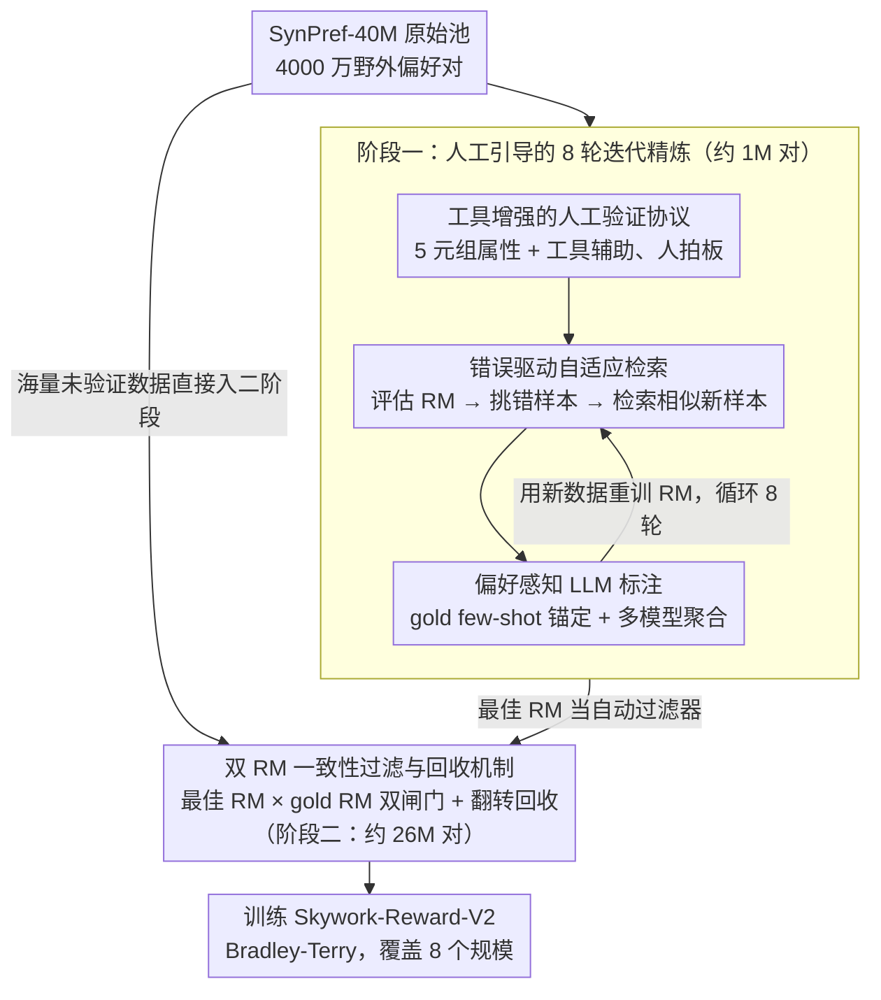

# Skywork-Reward-V2: Scaling Preference Data Curation via Human-AI Synergy

**会议**: ICLR 2026  
**arXiv**: [2507.01352](https://arxiv.org/abs/2507.01352)  
**代码**: SynPref-40M 数据集公开  
**领域**: 对齐 RLHF / 奖励建模  
**关键词**: 奖励模型, 偏好数据策展, Human-AI 协同, 数据质量, 可扩展策展

## 一句话总结

提出 Human-AI 协同的两阶段偏好数据策展流水线：阶段一通过人工验证、错误驱动自适应检索和偏好引导 LLM 标注迭代 8 轮积累约 1M 偏好对；阶段二借助双 RM 一致性过滤将数据规模扩展到 26M 对。最终训练的 Skywork-Reward-V2 8B 模型在 RewardBench 达 97.8%，7 个主流基准平均 88.6%，全面超越所有开源 70B 奖励模型。

## 研究背景与动机

奖励模型（RM）是 RLHF 流水线的核心组件，负责将人类偏好信号转化为可优化的标量奖励。然而，截至 2024 年 9 月，开源 RM 的发展实际上已经停滞：RewardBench 排行榜前 20 中有 16 个模型直接或间接使用相同基座模型或高度相似的训练数据。更关键的问题在于，RewardBench 分数从约 80 提升到 90+ 并不能一致地转化为其他基准或下游任务的增益——论文作者对 31 个顶级开源 RM 进行了跨 7 个基准的相关性分析，发现 RewardBench 与其他基准之间的 Pearson 相关性很弱，部分维度甚至呈负相关。

**根本瓶颈不在模型架构或损失函数，而在偏好数据本身**。现有偏好数据集存在三个系统性缺陷：(1) 覆盖范围窄——集中在少数任务类型；(2) 合成标注质量不足——纯 LLM 标注引入的偏差无法自我纠正；(3) 缺乏严格的质量控制——人工标注虽然质量高但不可扩展。论文还专门对 Gemma-2-27B 系列的多种损失函数变体（包括改进的排序损失、对比损失等）进行了对比实验，发现原始版本在综合性能上仍然最优，表明单纯改进训练算法无法弥补数据质量的缺陷。

核心 idea：用人工验证来引导 LLM 标注（而非替代），再通过错误驱动检索 + 一致性过滤实现质量和规模的同时扩展。

## 方法详解

### 整体框架

论文的目标是策展出一个兼顾质量和规模的偏好数据集 SynPref-40M（4000 万偏好对，其中 2600 万通过策展保留）。整体被切成两个互补的阶段：阶段一用少量人工标注驱动 8 轮迭代精炼，每一轮都靠"工具增强人工验证 → 错误驱动检索 → 偏好感知 LLM 标注"这条小循环反复定位当前 RM 的盲区并针对性补充高质量数据，积累约 1M 偏好对；阶段二把阶段一锤炼出的最佳 RM 和一个独立的 gold RM 当作自动过滤器，对海量野外数据做双重一致性筛选并回收翻转可疑样本，无需额外人工就把规模扩展到约 26M 对。最终用这批数据以标准 Bradley-Terry 目标训练出 Skywork-Reward-V2 全系列模型。

### 关键设计

**1. 工具增强的人工验证协议：让人工标注既可靠又信息密集**

纯人工标注虽然质量高，但裸看对话历史和两个回复很容易判断飘移、效率低下。论文给每个偏好对附上一个 5 元组属性——任务类别、偏好客观性、争议性、期望属性、实例级标注指南——把"凭感觉选"变成"按明确标准选"。同时允许标注者借助搜索引擎、前沿 LLM 助手以及数学/代码等领域专用 LLM 作为辅助：事实核查任务必须用搜索引擎核实，代码正确性任务必须执行代码并验证输出，但最终判断禁止完全交给 LLM、必须由人拍板。这套"工具增强但人做主"的协议把标注质量从裸人工的 +0.4 拉到 +3.2，说明给人配上合适的工具和结构化属性，远比单纯增加人力更能榨出标注价值。

**2. 错误驱动自适应检索：把有限的标注预算精准投到 RM 最薄弱的区域**

随机标注更多数据是低效的，真正的增益来自补齐 RM 的盲区。每轮迭代先在 gold 验证集上评估当前 RM，挑出它预测错误的样本，再以这些样本的 $(x, a)$（对话 + 属性）嵌入为查询，从未验证池里检索语义相似的新样本送去标注。检索数量随 RM 置信度 $p$ 动态变化：$k = k_{\max}$ 当 $p \le 0.5$（预测错误），$k = \lceil k_{\max} \cdot (1 - p) \rceil$ 当 $p > 0.5$（预测正确），其中 $k_{\max} = 8$。直觉很清楚——RM 越没把握的区域分到越多新样本，本质上是一种面向偏好标注的不确定性采样，使每一份人工标注都落在最能改善模型的地方。

**3. 偏好感知 LLM 标注：用人工 gold 数据给 LLM 判断装上锚点**

直接让 LLM 判断偏好会引入难以自我纠正的偏差，这正是大量纯 LLM 合成数据集失效的原因。论文的做法是先从 gold 集中检索语义相似的人工已标注样本，作为 few-shot 示例插入 prompt，使 LLM 的每次判断都以人工验证过的偏好为参照。标注时用多个强 LLM 分别打分，先在单模型内做自一致性聚合、再跨模型合并以削弱单一模型偏差，同时把两个回复在 prompt 中的顺序随机化以消除位置偏差。这样既保留了 LLM 标注的规模优势，又把它的偏差牢牢约束在人工标准附近。

**4. 双 RM 一致性过滤与回收机制：在自动扩展规模时守住质量并榨干每一条数据**

阶段二面对的是无人工兜底的野外数据，需要一套纯自动的质量闸门。当前最佳 RM 置信度 >0.5 的样本直接保留；不一致的样本走一遍 LLM 重新标注（复用阶段一的检索 + few-shot 方案，只是不再涉及人工）。在此之上再训练一个仅用人工验证数据的 gold RM 做二次检验，只有同时通过 gold RM 和最佳 RM / LLM 一致性检查的样本才被收进数据集。巧妙之处在于被两个 RM 都拒绝的样本并不丢弃——既然两个独立 RM 都判它不合理，原始标注很可能本身就是反的，于是把它的 chosen/rejected 翻转后作为"修正数据"回收使用，零额外标注成本，且实验证明这一招在所有阶段和迭代中都带来一致增益。

### 损失函数 / 训练策略

训练沿用标准的 Bradley-Terry 点对式目标，$p = \sigma(r_\theta(x, y_w) - r_\theta(x, y_l))$，没有在损失层面做花哨改动——论文的结论恰恰是数据质量才是瓶颈。模型覆盖 8 个规模（Qwen3 0.6B/1.7B/4B/8B、Llama-3.2 1B/3B、Llama-3.1 8B，并各配常规版与 40M 版）。训练用 16K tokens 最大上下文、10240 的大 batch size、常数学习率、单 epoch，其中大 batch 设置相比常规配置节省约 35% 的总训练计算量。

## 实验关键数据

### 主实验：7 基准综合评估

| 模型 | 参数量 | RB | RB-v2 | PPE-Pref | PPE-Corr | RMB | RM-Bench | JudgeBench | Avg |
|------|--------|------|-------|----------|----------|------|----------|------------|-----|
| OffsetBias-8B | 8B | 89.0 | 64.8 | 59.2 | 64.1 | 57.8 | 71.3 | 63.5 | 67.1 |
| ArmoRM-8B | 8B | 90.4 | 66.5 | 60.6 | 60.6 | 64.6 | 69.2 | 59.7 | 67.4 |
| Skywork-V1-27B | 27B | 94.3 | 75.3 | 63.6 | 61.9 | 69.4 | 67.6 | 66.5 | 71.2 |
| Nemotron-70B | 70B | 93.9 | 76.7 | 64.2 | 63.2 | 64.9 | 72.2 | 65.8 | 71.6 |
| INF-ORM-70B | 70B | 95.1 | 76.5 | 64.2 | 64.4 | 70.5 | 75.4 | 70.2 | 73.8 |
| **Skywork-V2-Qwen3-1.7B** | **1.7B** | 90.3 | 68.3 | 67.6 | 70.5 | 78.1 | 78.7 | 72.9 | **75.2** |
| **Skywork-V2-Llama-8B** | **8B** | 96.4 | 84.1 | 77.3 | 83.4 | 86.4 | 92.8 | 80.0 | **85.8** |
| **Skywork-V2-Llama-8B-40M** | **8B** | **97.8** | **86.5** | **79.8** | **87.2** | **89.3** | **96.0** | **83.4** | **88.6** |

几个关键对比：(1) 1.7B 的 Skywork-V2 在除 RewardBench/RB-v2 外的所有基准上均超越此前最强的 70B 模型 INF-ORM；(2) 8B 版本在全部 7 个基准上排名第一；(3) 40M 版通过回收翻转数据再获 +2.8 平均分提升。

### 消融实验：数据策展方法对比

| 策展方式 | 相对于 Seed RM 的增益 |
|---------|---------------------|
| 直接加未策展数据（无策展） | ≈0（12M 数据甚至无法超越 seed 模型） |
| 纯 LLM 策展（自一致性聚合） | +0.1 点（可能在优化随机性范围内） |
| 人工策展（裸标注） | +0.4 点 |
| 人工策展 + 偏好属性 | +1.1 点 |
| 人工策展 + LLM 策展 | +2.3 点 |
| 完整协议（工具增强人工 + 自适应检索 + LLM） | **+3.2 点** |
| 仅 290K 策展数据（全集 1.8%） | 已超越此前 SOTA 70B 模型 |

### 其他关键实验结果

- **RM-Bench 风格偏差抵抗力**：大多数基线模型在 Easy/Normal/Hard 三种风格条件下性能差距巨大（如 INF-ORM-70B 的 Normal 80.0 vs Hard 54.0，差距 26 点）。Skywork-V2-8B-40M 在 Hard 条件下仍达 93.5（差距仅 4.1 点），表明 SynPref-40M 训练出的偏好表征更去偏化
- **Best-of-N 缩放**：在 RMB 的 BoN 评估中，所有 8 个 Skywork-V2 变体均超越 GPT-4o（最高差距 +20 点），且在 PPE Correctness 的 5 个任务上展现正向缩放曲线
- **RewardBench v2 精确指令遵循**：所有已有 RM 在此维度得分 <50，Skywork-V2-8B-40M 达 67.8，超越 Claude-3.7-Sonnet（54.4）和 Gemini-2.5-Flash（55.3）
- **JudgeBench 数学推理**：Skywork-V2-Llama-3B 在数学子任务上达 87.5，等同于 o3-mini (high)；8B-40M 达 89.3 超越之

## 亮点与洞察

- **数据质量压倒性地重要于数量**：12M 未策展数据训练的 RM 甚至不如种子模型，而仅 290K（1.8%）策展数据已超越此前 70B SOTA。这直接挑战了"偏好数据越多越好"的朴素假设
- **纯 LLM 策展几乎无效**：仅带来 +0.1 点增益。这解释了为什么大量使用 LLM 合成标注的开源偏好数据集无法推动 RM 进步——LLM 标注的偏差在没有人工校准锚点的情况下会自我强化
- **错误驱动检索是关键的 bridge**：它将少量人工标注的价值最大化——不是随机标注更多数据，而是精确定位 RM 的盲区并针对性补充
- **回收机制的巧妙之处**：被两个 RM 都拒绝的偏好对意味着原始标注可能是错的。翻转 chosen/rejected 后作为"correction data"重新使用，零成本获取额外训练数据，且实验验证在所有阶段和迭代中都带来一致的性能提升
- **工具增强人工标注 >> 裸人工标注**：允许标注者使用搜索引擎和 LLM 工具后（但最终判断仍由人做出），标注质量从 +0.4 跃升到 +3.2。这为未来的数据标注协议设计提供了重要参考

## 局限与展望

- 主观偏好（如写作风格）不展现数据缩放行为，策展主要对客观偏好有效
- 阶段一仍然依赖人工标注资源，总共需要 8 轮迭代的人力投入
- 仅使用成对 Bradley-Terry 目标，未探索点对式评分或列表式排序方法
- 未尝试 70B+ 规模基座模型（出于训练成本和部署考虑），数据质量优势在更大模型上的边际收益未知

## 相关工作与启发

- **vs ArmoRM / Nemotron / INF-ORM（70B 量级）**：这些模型在单个基准上可能很强，但综合 7 个基准后均不如 Skywork-V2 8B，证明数据质量可以弥补 9 倍的模型规模差距
- **vs 生成式奖励模型（DeepSeek-GRM、RM-R1）**：这类方法通过推理链或元评判来增强判断能力，但 Skywork-V2 仅用 Bradley-Terry 目标就全面超越，说明数据层面的改进与模型层面的改进是正交的
- **vs 主动学习**：错误驱动检索本质上是一种面向偏好标注的主动学习策略，但不同之处在于它不是直接让人标注检索出的样本，而是用人工 gold 数据引导 LLM 来标注，实现了质量与效率的平衡

## 评分

- 新颖性: ⭐⭐⭐⭐ 两阶段 Human-AI 协同流水线设计系统且精巧，错误驱动检索 + 偏好感知标注 + 回收机制环环相扣
- 实验充分度: ⭐⭐⭐⭐⭐ 7 个基准 × 8 个模型规模 × 详尽的数据/方法双维度消融，证据链非常完整
- 写作质量: ⭐⭐⭐⭐ 流程描述清晰，先用 Section 2 充分建立动机再展开方法，逻辑性强
- 价值: ⭐⭐⭐⭐⭐ 为奖励模型训练提供了从数据策展到模型训练的完整方案，SynPref-40M 和全系列模型开源，可直接复现和应用

<!-- RELATED:START -->

## 相关论文

- [\[ICLR 2026\] Towards Understanding Valuable Preference Data for Large Language Model Alignment](towards_understanding_valuable_preference_data_for_large_language_model_alignmen.md)
- [\[ACL 2026\] AgentV-RL: Scaling Reward Modeling with Agentic Verifier](../../ACL2026/llm_alignment/agentv-rl_scaling_reward_modeling_with_agentic_verifier.md)
- [\[ACL 2025\] Finding the Sweet Spot: Preference Data Construction for Scaling Preference Optimization](../../ACL2025/llm_alignment/finding_the_sweet_spot_preference_data_construction_for_scaling_preference_optim.md)
- [\[AAAI 2026\] Intrinsic Barriers and Practical Pathways for Human-AI Alignment: An Agreement-Based Complexity Analysis](../../AAAI2026/llm_alignment/intrinsic_barriers_and_practical_pathways_for_human-ai_alignment_an_agreement-ba.md)
- [\[ICLR 2026\] Capability-Based Scaling Trends for LLM-Based Red-Teaming](capability-based_scaling_trends_for_llm-based_red-teaming.md)

<!-- RELATED:END -->
