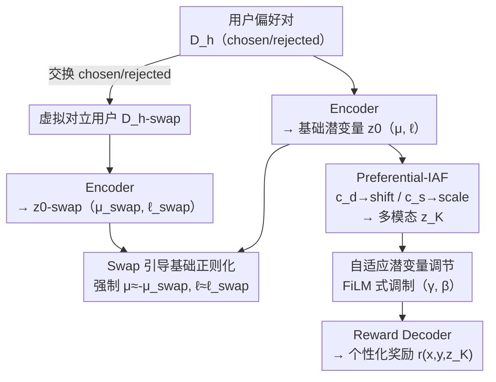

# Swap-guided Preference Learning for Personalized RLHF (SPL)

**会议**: ICLR 2026  
**arXiv**: [2603.12595](https://arxiv.org/abs/2603.12595)  
**代码**: [https://github.com/cobang0111/SPL](https://github.com/cobang0111/SPL)  
**领域**: LLM Alignment / 个性化对齐  
**关键词**: 个性化奖励模型, 后验崩坏, 潜变量偏好学习, swap引导正则化, 偏好多样性

## 一句话总结
解决变分偏好学习(VPL)中的后验崩坏问题：提出SPL，通过swap引导基础正则化(强制潜变量编码用户偏好而非被忽略)+Preferential-IAF分解swap可逆/不可逆信号+自适应潜变量调节。在Llama-3.1-8B上达63.71%准确率+97.10%活跃单元，而VPL崩坏到57.14%+0%。

## 研究背景与动机

**领域现状**：统一奖励模型假设所有用户偏好一致，但实际中用户偏好存在显著多样性。VPL用潜变量建模用户特定偏好。

**现有痛点**：VPL的潜变量在稀疏数据+强解码器组合下会后验崩坏——潜变量被完全忽略，退化为单一奖励模型

**核心 idea**：swap引导正则化强制潜变量有用 + IAF分解用户特定信号

## 方法详解

### 整体框架

SPL 在 VPL（Variational Preference Learning）框架上做修复，目标是治好后验崩坏——让用户特定的潜变量真正承载偏好信息，而不是被强解码器绕过。整条管线分两路汇合：主路把用户的偏好数据集 $\mathbb{D}_h$ 送进 encoder，编码出基础潜变量 $z_0$（含均值 $\mu$、对数方差 $\ell$）；镜像路把同一用户每个偏好对的 chosen/rejected 全部互换，得到一个"偏好完全相反的虚拟对立用户" $h_{swap}$，同样编码出 $z_0^{swap}$。两路的输出被一条 swap 引导损失约束成镜像关系，逼迫潜变量编码偏好方向。基础潜变量随后经 Preferential-IAF 流变换为表达力更强的多模态 $z_K$，最后通过 FiLM 式的自适应调节注入 reward decoder，输出个性化奖励 $r_\phi(x,y,z_K)$。整套方法的支点就是那个互换观察：交换 chosen/rejected 这一天然对称性，正好可以拿来约束潜空间结构。

### 关键设计

**1. Swap 引导基础正则化：让潜变量必须编码偏好方向**

后验崩坏的根源是 decoder 能从 (prompt, response) 对里直接读出足够信息，于是干脆忽略 $z$。SPL 的对策是为每个用户 $h$ 交换全部偏好对的 chosen/rejected，构造虚拟对立用户 $h_{swap}$，再强制 encoder 的输出在两者之间呈镜像关系。这个约束并非凭空设定，而是来自一个 swap 实验观察：在不崩坏的训练里，均值天然出现符号翻转 $\mu \approx -\mu_{swap}$（偏好方向反了，潜变量方向也应反向），而对数方差保持不变 $\ell \approx \ell_{swap}$（交换并不改变这个用户偏好的确定程度）；崩坏时两者都退化为 $\mu \approx \mu_{swap}$、潜变量不再携带任何用户信号。SPL 把这条"健康特征"直接写成引导损失 $\mathcal{L}_{guide} = \mathbb{E}_h[\frac{1}{2}(1+\cos(\mu, \mu_{swap})) + \eta \frac{1}{2}(1-\cos(\ell, \ell_{swap}))]$，用余弦相似度分别拉 $\mu$ 与 $\mu_{swap}$ 反向、拉 $\ell$ 与 $\ell_{swap}$ 同向，$\eta$ 平衡两项。一旦潜变量必须区分一个用户和它的反向版本，它就再也无法被 decoder 安全地忽略掉。

**2. Preferential-IAF：把方向信号和不确定性信号解耦**

光让潜变量"有用"还不够表达力，标准 IAF 把单个 context 向量同时喂给 shift 和 scale 两个函数，方向与不确定性纠缠在一起。P-IAF 把上面那条 swap 对称性继续用到 flow 里：将 context 拆成两半——swap 可逆分量 $c_d = \frac{1}{2}(c - c_{swap})$ 编码会随交换翻转的偏好方向，swap 不变分量 $c_s = \frac{1}{2}(c + c_{swap})$ 编码与交换无关的不确定性。随后 $c_d$ 只进 shift 函数、$c_s$ 只进 scale 函数，两路信号各管各的，交叉耦合被切断；经过 $K$ 步自回归流变换后得到能刻画多种偏好模式、超出单一高斯能力的多模态 $z_K$。消融实验显示，去掉这一分解后潜变量的特化程度明显下降。

**3. 自适应潜变量调节：按潜变量清晰度动态注入奖励**

有了承载偏好的 $z_K$，还要让 decoder 用好它。借鉴 FiLM 特征调制（Perez et al., 2018），SPL 设计了一个逐用户的调制 decoder：把 $z_K$ 映射为缩放 $\gamma$ 与平移 $\beta$，对输入的 prompt-response 嵌入 $e$ 做 FiLM 式调制，从而动态调整潜变量对奖励预测的影响——当潜变量低不确定性、清晰编码了偏好时，decoder 更多地借它来个性化奖励。消融显示这一项主要带来训练加速与更稳定的优化，并显著提升对噪声偏好标签的鲁棒性：去掉它虽不会引发崩坏，但准确率会明显下降。

### 损失函数 / 训练策略
总目标在 VPL 的变分下界上叠加 swap 引导项：$\mathcal{L}(\phi, \psi) = -\text{ELBO} + \lambda \mathcal{L}_{guide}$，其中 $\text{ELBO}$ 等于偏好似然期望减去 $\beta \cdot D_{KL}[q_\psi(z_K|\mathbb{D}_h) \,\|\, p(z_K)]$。借助 IAF 的 Jacobian 行列式可以高效计算这个 $D_{KL}$，而 $\mathcal{L}_{guide}$ 则施加在基础分布 $z_0$ 上、负责保证 swap 镜像约束；$\lambda$ 控制引导强度。也正是因为有引导项兜底，SPL 对 KL 权重 $\beta$ 的取值远比 VPL 鲁棒。

## 实验关键数据

### 后验崩坏诊断

| 模型 | 方法 | 准确率 | 活跃单元率↑ | 崩坏状态 |
|------|------|--------|------------|---------|
| Llama-3.2-3B | VPL | 62.37% | 88.22% | 轻度崩坏 |
| Llama-3.2-3B | **SPL** | **63.28%** | **93.07%** | 健康 |
| Llama-3.1-8B | VPL | 57.14% | **0.00%** | **完全崩坏!** |
| Llama-3.1-8B | **SPL** | **63.71%** | **97.10%** | 健康 |

### 跨数据集表现

| 数据集 | VPL KL稳定性 | SPL KL稳定性 | SPL 准确率提升 |
|--------|------------|------------|-------------|
| Pets（简单） | 不崩坏 | 不崩坏 | +0.5% |
| UF-P-2（中等） | 部分崩坏 | 不崩坏 | +2.1% |
| UF-P-4（复杂） | 完全崩坏 | 不崩坏 | +6.6% |

### 关键发现
- **VPL 在 8B 模型上完全崩坏**：活跃单元从 88%→0%，更强的 decoder 完全绕过潜变量
- **SPL 消除崩坏**：即使在 8B 模型/复杂数据上仍保持 97.10% 活跃单元
- **崩坏与模型容量相关**：更大的 decoder→更容易绕过 $z$→更需要 swap 引导
- **SPL 对 $\beta$ 鲁棒**：VPL 对 KL 权重 $\beta$ 极其敏感，SPL 在宽范围内稳定
- **P-IAF 的分解有效**：消融显示去掉 $c_d/c_s$ 分解后特化程度下降

## 亮点与洞察
- **首次报告偏好学习中的后验崩坏**：虽然 VAE 领域已知此问题，但在偏好建模中未被识别
- Swap 引导是解决后验崩坏的优雅方案——利用偏好对的天然对称性（交换 chosen/rejected）约束潜空间结构
- P-IAF 的 swap-reversal/invariant 分解在梯度场上有明确的物理意义——方向信号与不确定性信号解耦
- 自适应调节避免了"强制使用 $z$"导致的过拟合——当 $z$ 信号弱时自动回退

## 局限与展望
- 测试场景有限，未验证实际 RLHF 训练中的个性化效果（仅评估了偏好预测准确率）
- 用户偏好类型用预定义分类（helpfulness/honesty 等），未处理连续偏好谱
- P-IAF 的步数 $K$ 和 $\lambda$ 的选择依赖调参，缺乏自适应机制
- 未与其他个性化 RLHF 方法（如多奖励模型聚合）做直接比较

## 相关工作与启发
- **vs VPL (Poddar et al., 2024)**：SPL 解决了 VPL 的核心缺陷（后验崩坏），使个性化奖励模型在较大模型上也可用
- **vs VAE 后验崩坏文献**：偏好学习中的崩坏有独特成因——decoder 从 (prompt, response) 对中已获取足够信息，不需要 $z$
- **vs 多奖励聚合**：SPL 用连续潜空间表示用户偏好，比离散多奖励更灵活
- **启发**：个性化对齐的核心挑战不是"如何建模多样偏好"，而是"如何确保偏好信息进入潜变量"

## 评分
- 新颖性: ⭐⭐⭐⭐ swap 引导正则化和 P-IAF 分解的思路新颖
- 实验充分度: ⭐⭐⭐ 多模型验证但应用场景有限
- 写作质量: ⭐⭐⭐⭐ 问题分析（崩坏→swap 观察→方法设计）的叙事线清晰
- 价值: ⭐⭐⭐⭐ 为个性化对齐提供了实用且有理论支撑的解决方案

<!-- RELATED:START -->

## 相关论文

- [\[ACL 2025\] SynthesizeMe! Inducing Persona-Guided Prompts for Personalized Reward Models in LLMs](../../ACL2025/llm_alignment/synthesizeme_persona_prompts.md)
- [\[ACL 2026\] P-Check: Advancing Personalized Reward Model via Learning to Generate Dynamic Checklist](../../ACL2026/llm_alignment/p-check_advancing_personalized_reward_model_via_learning_to_generate_dynamic_che.md)
- [\[ICLR 2026\] No Prompt Left Behind: Exploiting Zero-Variance Prompts in LLM Reinforcement Learning via Entropy-Guided Advantage Shaping](no_prompt_left_behind_exploiting_zero-variance_prompts_in_llm_reinforcement_lear.md)
- [\[ICLR 2026\] Token-Importance Guided Direct Preference Optimization (TI-DPO)](token-importance_guided_direct_preference_optimization.md)
- [\[ACL 2026\] PERSA: Reinforcement Learning for Professor-Style Personalized Feedback with LLMs](../../ACL2026/llm_alignment/persa_reinforcement_learning_for_professor-style_personalized_feedback_with_llms.md)

<!-- RELATED:END -->
