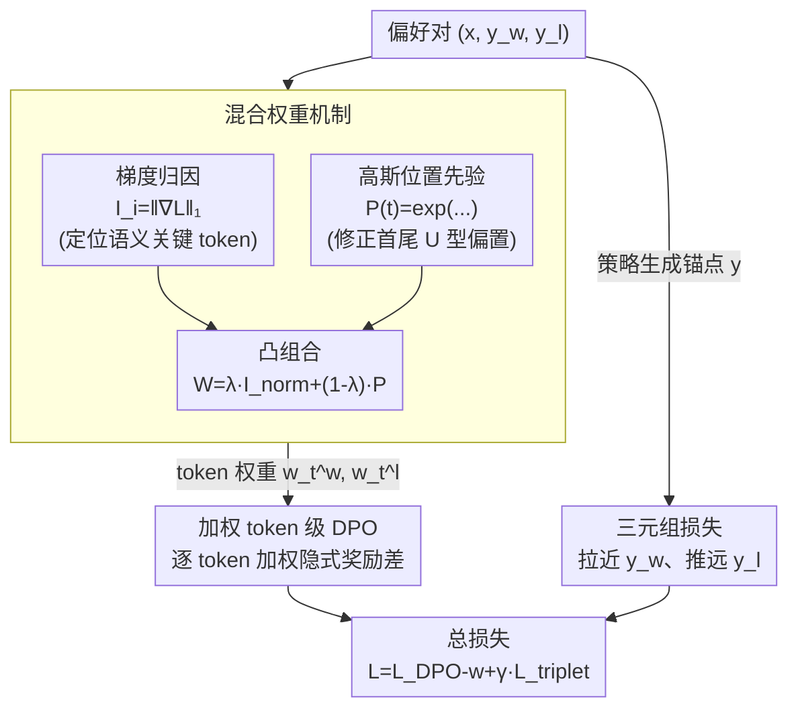

# Token-Importance Guided Direct Preference Optimization (TI-DPO)

**会议**: ICLR 2026 Oral  
**arXiv**: [2505.19653](https://arxiv.org/abs/2505.19653)  
**代码**: [https://github.com/gracefulning/TIDPO](https://github.com/gracefulning/TIDPO)  
**领域**: 对齐RLHF / DPO  
**关键词**: token级DPO, 梯度归因, 混合权重, 三元组损失, 细粒度对齐

## 一句话总结
提出TI-DPO，通过梯度归因+高斯先验的混合权重机制精确量化每个token对偏好的贡献，结合三元组损失在连续语义空间引导优化，在6个基准上平均62.3分达到SOTA，同时具备可解释的token级控制能力。

## 研究背景与动机

**领域现状**：DPO在序列级优化偏好，忽略不同token的差异化重要性。已有token级方法(TDPO/TIS-DPO)用概率代理评估重要性，但有偏差。

**现有痛点**：
   - DPO的粗粒度优化对数据噪声敏感、分布偏移严重
   - 现有token级方法的概率代理产生不一致输出
   - 二元"好/坏"对比框架无法在连续语义空间精细调整生成行为

**核心矛盾**：需要同时精确识别关键token + 在连续空间引导偏好调整

**核心 idea**：梯度归因定位关键token + 高斯先验修正位置偏差 + 三元组损失做连续空间引导

## 方法详解

### 整体框架

TI-DPO 把原本作用在整条序列上的 DPO 信号下放到 token 级别。给定一条偏好数据 $(x, y_w, y_l)$，它分三步走：先用一套**混合权重机制**为 $y_w$、$y_l$ 里的每个 token 估计重要性（梯度归因定位语义关键位、高斯先验修正首尾偏置）；再把这套权重灌进 token 级的隐式奖励差里做**加权对比**，让关键 token 主导优化信号；与此并行，让策略模型自己生成一个锚点回答，挂一项**三元组损失**在连续语义空间里把锚点拉近优答案、推远劣答案。两路损失合成总目标 $\mathcal{L}_{\text{TI-DPO}} = \mathcal{L}_{\text{DPO-w}} + \gamma \mathcal{L}_{\text{triplet}}$，其中 $\gamma$ 平衡加权 DPO 项与三元组项。

### 关键设计

**1. 混合权重机制：让关键 token 被放大、噪声 token 被压住**

序列里 token 的重要性天差地别，但 DPO 一视同仁，这正是它对噪声敏感的根源。TI-DPO 用两路信号融合出 token 权重。第一路是梯度归因 $I_i = \|\nabla_{e_i}\mathcal{L}_{\text{target}}\|_1$，对每个 token 的 embedding $e_i$ 求目标损失梯度的 $\ell_1$ 范数，梯度越大说明该 token 对最终预测的影响越关键，因而能直接刻画语义层面的重要性。问题是梯度归因带有模型固有的 U 型注意力偏差——首尾 token 总被过度关注。第二路因此引入一个高斯位置先验 $\mathcal{P}(t) = \exp(-\frac{1}{2}(\frac{t-\mu}{\sigma})^2)$（取 $\mu=(T-1)/2$、$\sigma=T/4$）来抬高中段 token 的权重、抵消这种偏差。两者经凸组合 $W = \lambda \cdot \mathcal{I}_{\text{norm}} + (1-\lambda) \cdot \mathcal{P}$ 得到最终权重，并对 $y_w$ 和 $y_l$ 各算一套。梯度归因管"哪些 token 语义上重要"，高斯先验管"修正位置上的系统性偏差"，二者互补才让权重既准又稳。

**2. 加权 token 级 DPO：把序列级奖励差拆成逐 token 的加权和**

拿到权重后，TI-DPO 重写隐式奖励差：$\Delta r_{\text{token}} = \sum_t w_t^w \log\frac{\pi_\theta(y_w^t|\cdot)}{\pi_{\text{ref}}(y_w^t|\cdot)} - \sum_t w_t^l \log\frac{\pi_\theta(y_l^t|\cdot)}{\pi_{\text{ref}}(y_l^t|\cdot)}$。相比原始 DPO 把整段对数似然比一股脑相加，这里每个 token 的策略/参考对数比都乘上自己的权重 $w_t$，于是关键 token 的贡献被放大、噪声 token 被抑制。优化信号因此集中到真正决定偏好的位置上，对标签噪声和分布偏移都更鲁棒。

**3. 三元组损失：从二元对比走向连续空间引导**

二元"好/坏"对比只能告诉模型哪个更好，却没法在连续语义空间里精细调整生成行为。TI-DPO 让策略模型自己生成一个锚点回答 $y$，在隐式奖励空间里同时拉近 $y$ 与优答案 $y_w$、推远 $y$ 与劣答案 $y_l$，损失为 $\mathcal{L}_{\text{triplet}} = \max(0, d(y, y_w) - d(y, y_l) + \alpha)$，$\alpha$ 是间隔超参。这把目标从"在两个固定样本间选边"升级为"主动向好样本对齐、同时远离坏样本"，在连续语义空间提供了比二元对比更细粒度的方向引导，也是消融里去掉后退化最明显的一项。

## 实验关键数据

### 主实验（3模型平均）

| 方法 | MMLU | GSM8K | HumanEval | TruthfulQA | IFEval | Avg |
|------|------|-------|-----------|-----------|--------|-----|
| DPO | 65.3 | 69.3 | 61.0 | 56.7 | 70.0 | 57.7 |
| SimPO | 63.5 | 64.7 | 58.2 | 54.2 | 64.7 | 54.5 |
| GRPO | 70.7 | **75.7** | 64.3 | 59.9 | 74.0 | 62.1 |
| **TI-DPO** | 70.0 | 73.0 | **67.0** | **62.0** | **75.7** | **62.3** |

### 消融实验（Llama-3.2-3B）

| 配置 | General | Math | Code | Reliability |
|------|---------|------|------|-------------|
| Full TI-DPO | **65.4** | **80.7** | **33.0** | **86.8** |
| 无三元组损失 | 64.0 | 79.0 | 31.0 | 83.0 |
| 均匀权重 | 64.0 | 78.2 | 29.0 | 80.0 |
| 无高斯先验 | 64.5 | 79.7 | 31.5 | 82.5 |

### 关键发现
- **TI-DPO与GRPO持平**：平均62.3 vs 62.1，但TI-DPO在HumanEval(67 vs 64.3)和IFEval(75.7 vs 74)上领先
- **权重分布适应任务**：数学任务的权重集中在[0.2,0.5]（关键符号少），安全任务的权重偏向[0.6,0.8]（需全面关注）
- **噪声鲁棒性**：标签噪声增加时，TI-DPO性能退化最少
- **可解释性**：可可视化哪些token被赋予高权重，如医疗场景中"medical attention"权重高而"painkillers"被降权

## 亮点与洞察
- **梯度归因+位置先验的互补设计**：梯度归因捕获语义重要性但有位置偏差，高斯先验修正偏差——两者互补
- **三元组损失打破二元框架**：从"好/坏"对比扩展到"与好样本对齐+远离坏样本"的连续空间引导
- **可解释的token级控制**：不仅提升性能，还能可视化关键token——对安全审计有直接价值

## 局限与展望
- **计算开销**：梯度归因需要额外前向+反向传播
- **高斯先验假设**：假设重要token在序列中均匀分布，某些任务可能不成立
- **改进思路**：可结合Uni-DPO的质量权重做数据级+token级的双层动态调权

## 相关工作与启发
- **vs TDPO/TIS-DPO**：使用概率代理有偏差，TI-DPO用梯度归因+高斯先验更准确
- **vs Uni-DPO**：Uni-DPO在数据级调权，TI-DPO在token级调权——两者正交可组合
- **vs GRPO**：GRPO用RL探索，TI-DPO用监督信号的token级细化——性能相当但机制不同

## 评分
- 新颖性: ⭐⭐⭐⭐ 混合权重机制+三元组损失的组合设计精巧
- 实验充分度: ⭐⭐⭐⭐⭐ 6基准×3模型×详尽消融+噪声实验
- 写作质量: ⭐⭐⭐⭐ 理论动机清晰
- 价值: ⭐⭐⭐⭐ token级DPO的实用改进，可解释性是差异化优势

<!-- RELATED:START -->

## 相关论文

- [\[ICLR 2026\] SafeDPO: A Simple Approach to Direct Preference Optimization with Enhanced Safety](safedpo_preference_optimization_safety.md)
- [\[ICML 2025\] DPO Meets PPO: Reinforced Token Optimization for RLHF](../../ICML2025/llm_alignment/dpo_meets_ppo_reinforced_token_optimization_for_rlhf.md)
- [\[ICML 2025\] TGDPO: Harnessing Token-Level Reward Guidance for Enhancing Direct Preference Optimization](../../ICML2025/llm_alignment/tgdpo_harnessing_token-level_reward_guidance_for_enhancing_direct_preference_opt.md)
- [\[ICLR 2026\] Is On-Policy Data always the Best Choice for Direct Preference Optimization-based LM Alignment?](is_on-policy_data_always_the_best_choice_for_direct_preference_optimization-base.md)
- [\[ICLR 2026\] Swap-guided Preference Learning for Personalized RLHF (SPL)](swap-guided_preference_learning_for_personalized_reinforcement_learning_from_hum.md)

<!-- RELATED:END -->
