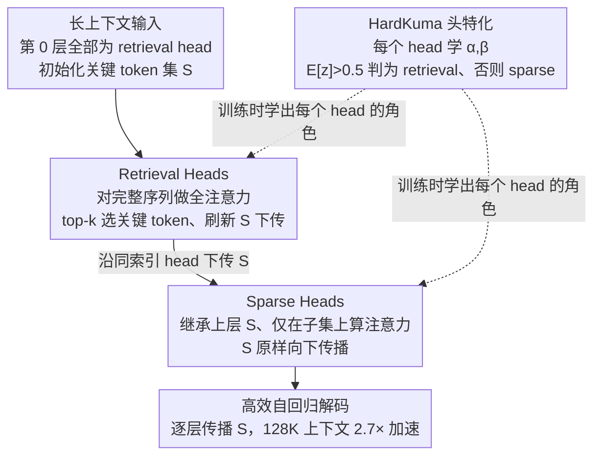

# LycheeDecode: Accelerating Long-Context LLM Inference via Hybrid-Head Sparse Decoding

**会议**: ICLR 2026  
**arXiv**: [2602.04541](https://arxiv.org/abs/2602.04541)  
**代码**: [https://github.com/（论文提及有代码）](https://github.com/（论文提及有代码）)  
**领域**: LLM效率  
**关键词**: 长上下文推理, 稀疏注意力, 注意力头特化, KV缓存优化, HardKuma分布

## 一句话总结
提出 LycheeDecode，通过将注意力头细粒度分为少量 retrieval heads（负责全注意力选关键 token）和大量 sparse heads（复用选出的 token 做稀疏计算），并用 HardKuma 分布端到端学习头类型，在 128K 上下文下实现 2.7× 加速且性能不降。

## 研究背景与动机
长上下文 LLM（如支持 1M token 的 Gemini-2.5、Qwen2.5-1M）已经成为主流趋势，但自回归解码的 KV 缓存随序列长度线性增长，导致内存和延迟瓶颈严重。现有稀疏注意力方法分两类：**驱逐式**（SnapKV、H2O 等永久丢弃 token）和**选择式**（TidalDecode、SeerAttention 等动态选子集计算）。

关键观察：近期工作（TidalDecode、OmniKV）发现相邻层的关键 token 高度相似，因此采用**层级共享策略**——同一层所有 head 共享同一组关键 token。但这个假设过于粗糙：作者通过 heatmap 分析发现，同一层不同 head 的 top-k overlap 率差异巨大（如相邻层第 14 个 head 重叠率 0%，第 24 个 head 重叠率 100%）。这意味着统一的层级共享会抹杀 head 间的功能多样性。

核心矛盾：**层级共享粒度太粗，忽视了注意力头功能分化**。切入角度：将共享粒度从层级细化到头级，让不同 head 扮演不同角色。核心 idea：少量 retrieval heads 负责全注意力发现关键 token，大量 sparse heads 复用这些 token 高效计算。

## 方法详解

### 整体框架

LycheeDecode 想解决的是：长上下文解码时每生成一个 token 都要对整段 KV 缓存做全注意力，缓存随序列线性膨胀，内存和延迟双双爆炸。它的思路是把每层的注意力头细分成两类——少量 **retrieval heads** 在完整序列上跑全注意力、负责挑出当前最关键的 token 子集并往下层传递；大量 **sparse heads** 直接继承这个子集、只在其上做稀疏计算。这样昂贵的全量扫描只由一小撮头承担，绝大多数头都走廉价的稀疏路径。头扮演哪种角色不靠人工指定，而是给每个头挂一个 **HardKuma** 门控变量，端到端学出来，让稀疏结构和模型权重一起训练。第 0 层所有头默认都是 retrieval head，用来初始化关键 token 集，之后这个集合沿同索引的头逐层向下流动。

### 关键设计

**1. Retrieval Heads：定期重新发现关键 token**

层级共享之所以失效，是因为它假设一组 token 能服务全层所有 head；本文反过来只让一小撮 head 承担"找 token"的重活。这些 retrieval head 在第 $l$ 层对完整 KV 做标准 dense attention $A_h^{(l)} = \text{softmax}\!\left(\frac{q_h^{(l)}(K_h^{(l)})^T}{\sqrt{d_k}}\right)$，再从注意力分数里取出 top-k 个关键 token 的索引集合 $\mathcal{S}_h^{(l+1)} = \text{argsTopK}(A_h^{(l)}, k)$，并把它交给下一层同索引位置的 head 使用。第一层所有 head 默认都是 retrieval head，用来给整条管线初始化 token 集合。因为只有少量 head 付出全注意力代价，又能随解码进度不断刷新关键 token，框架既保住了上下文适应性，又把昂贵的全量扫描压到最低。

**2. Sparse Heads：复用子集换取计算与显存的双重节省**

占绝大多数的 sparse head 不再自己搜索 token，而是继承上层传来的集合 $\mathcal{S}_h^{(l)}$，只在这个子集上算注意力：

$$O_h^{(l)} = \text{softmax}\!\left(\frac{q_h^{(l)} (K_h^{(l)}[\mathcal{S}_h^{(l)}])^T}{\sqrt{d_k}}\right) V_h^{(l)}[\mathcal{S}_h^{(l)}]$$

且不更新集合、原样往下传（$\mathcal{S}_h^{(l+1)} = \mathcal{S}_h^{(l)}$）。由于参与运算的 key/value 只剩 $k$ 个而非整段历史，单 head 的计算量和需要从 KV 缓存里加载的数据量同步骤降，这正是端到端 2.7× 加速的主要来源。

**3. HardKuma 头特化机制：让离散的角色分配变得可微**

一个 head 是 retrieval 还是 sparse 本质是个二值选择，DuoAttention 那样用连续变量学完再取整会带来训练-推理不一致。作者改用 Hard Kumaraswamy 分布：先从均匀分布采样 $u$、经 Kuma 逆 CDF 变换得 $s=(1-u^{1/\beta})^{1/\alpha}$，再线性拉伸到 $(p,q)$ 区间（$p<0,\,q>1$）得 $s'=s\cdot(q-p)+p$，最后硬截断回 $[0,1]$ 得 $z=\min(1,\max(0,s'))$。落在 $(p,0]$ 和 $[1,q)$ 的概率质量被压到恰好 0 和 1，采样值天然堆在两端、却又全程可微。每个 head 只学两个参数 $\alpha_h^{(l)}, \beta_h^{(l)}$，推理时把随机采样换成确定性判定：按期望 $\mathbb{E}[z_h^{(l)}] > 0.5$ 判为 retrieval head、否则 sparse head，从而把硬性分类问题塞进了梯度下降框架。

### 损失函数 / 训练策略
训练阶段每个 head 同时算出 sparse 和 full 两份注意力图，再用 HardKuma 采样值 $z_h^{(l)}$ 做线性混合 $\tilde{A}_h^{(l)} = z_h^{(l)} \cdot A_{R,h}^{(l)} + (1 - z_h^{(l)}) \cdot A_{S,h}^{(l)}$，使得"该选哪种 head"的梯度能直接回流。目标函数由蒸馏项和稀疏约束两部分组成：蒸馏项让混合注意力的 student 在 logits 上逼近全注意力 teacher（L2 距离），稀疏约束则把 retrieval head 的总数压到目标值，整体写成 $\min_{\alpha,\beta} \max_{\lambda \geq 0} \mathcal{L}_{\text{distill}} + \lambda \cdot (\mathbb{E}[\|\mathbf{z}\|_0] - N_{\text{target}})$。其中 $\mathbb{E}[\|\mathbf{z}\|_0]$ 有闭式解，拉格朗日乘子 $\lambda$ 由梯度上升自动调节，省去了手工搜稀疏度超参的麻烦；整个训练只需在单张 A100 上跑 3000 步、几小时即可完成。

## 实验关键数据

### 主实验（LongBench 长上下文理解）

| 方法 (Budget) | MFQA | NrtQA | Qasper | 2Wiki | HotQA | QMSum | TrQA | PRe | Avg |
|---|---|---|---|---|---|---|---|---|---|
| Full Attention (Llama3-8B) | 30.76 | 5.52 | 14.56 | 13.32 | 11.50 | 19.43 | 86.56 | 77.00 | 32.33 |
| TidalDecode (4096) | 30.94 | 6.19 | 13.85 | 14.40 | 13.71 | 19.48 | 86.30 | 78.00 | 32.86 |
| **LycheeDecode (4096)** | **30.11** | **5.85** | **14.39** | **12.86** | **12.66** | **19.30** | **86.78** | **82.58** | **33.07** |
| Full Attention (Qwen3-8B) | 25.84 | 3.43 | 10.96 | 11.97 | 11.74 | 20.90 | 90.21 | 89.08 | 33.02 |
| TidalDecode (4096) | 23.57 | 2.99 | 10.79 | 11.47 | 11.31 | 20.01 | 88.94 | 85.00 | 31.76 |
| **LycheeDecode (4096)** | **24.90** | **3.32** | **10.88** | **12.74** | **11.68** | **20.71** | **90.34** | **93.25** | **33.48** |

在数学推理任务上（DeepSeek-R1-Distill-Qwen-7B），LycheeDecode + Cache Correction 在 AIME24 上达 46.7%（Full Attention 为 40.0%），平均得分 44.9 超越 Full Attention 的 43.0。

### 消融实验（头识别方法对比）

| 方法 | Passkey Retrieval | HotpotQA |
|---|---|---|
| Direct Optimize (DuoAttention) | 32.06 | 31.02 |
| Hard Concrete | 32.13 | 30.25 |
| **HardKuma (Ours)** | **33.07** | **31.11** |

不同稀疏策略（Top-k / Top-p / Threshold / Ratio）对比中，Ratio 方法在等稀疏度下整体最优。

### 关键发现
- LycheeDecode 在 Llama3 和 Qwen3 上均超越层级共享的 TidalDecode，验证头级策略优于层级策略
- 128K 上下文下端到端解码加速 2.7×，kernel 级加速最高 7×（8/8 稀疏 head 配置）
- HardKuma 比 DuoAttention 的直接优化和 Hard Concrete 分布都更稳定
- 推理性能甚至超过 Full Attention，作者假设头特化帮助过滤了无关上下文噪声
- 端到端加速在多 batch size 场景下依然保持，实用性强

## 亮点与洞察
- **头级粒度**是本文最大创新点，通过 heatmap 可视化和 LongBench 对比充分证明不同 head 功能多样性不应被统一共享策略抹杀
- Retrieval-Sparse 协作机制构建了高效的信息传播管线：retrieval head 定期刷新关键 token 保证上下文适应性，sparse head 复用结果保证计算效率
- HardKuma 分布巧妙解决了离散变量的端到端学习问题，比 continuous relaxation + rounding 更自然
- 训练开销极低（单 A100 几小时），非常实用
- 用 TileLang 实现的 hybrid-head block-sparse kernel 做到了真正的端到端加速

## 局限与展望
- Retrieval head 数量固定为 32，未探索自动确定最优数量的方法
- 在 HotpotQA 短答案场景下识别效果略差，稀疏监督信号场景有待优化
- 仅评估了 7B-8B 规模模型，更大规模（70B+）的效果未知
- 未与 Native Sparse Attention（Qwen3 原生稀疏）做直接对比
- block-sparse kernel 的实现依赖 TileLang，可移植性未讨论

## 相关工作与启发
- 与 DuoAttention 对比：DuoAttention 也区分 retrieval/streaming heads，但各 head 独立决策，没有 retrieval → sparse 的协作传播机制
- 与 TidalDecode 对比：TidalDecode 在层级共享，LycheeDecode 在头级共享，粒度更细
- 可与 KV cache 量化/压缩方法组合，进一步降低内存
- 头特化 + 稀疏的思路可能推广到 MoE 架构中的 expert 分配
- 对多模态长序列场景（如视频理解、多文档对话）同样适用

## 评分
- 新颖性: ⭐⭐⭐⭐ 头级共享+HardKuma组合有新意，但retrieval/sparse head分类思路并非全新
- 实验充分度: ⭐⭐⭐⭐⭐ 长上下文理解+数学推理+效率测试+消融全面覆盖，模型覆盖Llama3和Qwen3
- 写作质量: ⭐⭐⭐⭐ 逻辑清晰，图表丰富，动机阐述充分
- 价值: ⭐⭐⭐⭐ 对长上下文LLM推理加速有实际意义，方法实用且训练开销低

<!-- RELATED:START -->

## 相关论文

- [\[ACL 2025\] Squeezed Attention: Accelerating Long Context Length LLM Inference](../../ACL2025/llm_efficiency/squeezed_attention_accelerating_long_context_length_llm_inference.md)
- [\[ICML 2026\] OBCache: Optimal Brain KV Cache Pruning for Efficient Long-Context LLM Inference](../../ICML2026/llm_efficiency/obcache_optimal_brain_kv_cache_pruning_for_efficient_long-context_llm_inference.md)
- [\[ICLR 2026\] Understanding and Improving Length Generalization in Hierarchical Sparse Attention Models](understanding_and_improving_length_generalization_in_hierarchical_sparse_attenti.md)
- [\[ICLR 2026\] When Does Divide and Conquer Work for Long Context LLM? A Noise Decomposition Framework](when_does_divide_and_conquer_work_for_long_context_llm_a_noise_decomposition_fra.md)
- [\[ICML 2026\] Stochastic Sparse Attention for Memory-Bound Inference](../../ICML2026/llm_efficiency/stochastic_sparse_attention_for_memory-bound_inference.md)

<!-- RELATED:END -->
