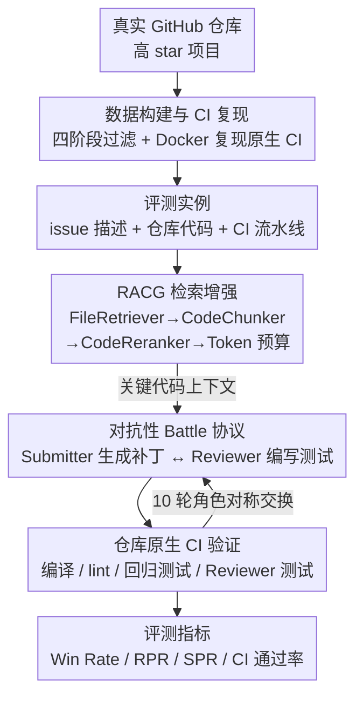

# SwingArena: Adversarial Programming Arena for Long-context GitHub Issue Solving

**会议**: ICLR 2026 Oral  
**arXiv**: [2505.23932](https://arxiv.org/abs/2505.23932)  
**代码**: [GitHub](https://github.com/) / [HuggingFace Dataset](https://huggingface.co/)  
**领域**: LLM效率  
**关键词**: 对抗性评测, CI流水线, Submitter-Reviewer, 检索增强代码生成(RACG), 多语言代码基准  

## 一句话总结
提出SwingArena对抗性评测框架，让两个LLM在真实GitHub issue上交替扮演补丁提交者和测试审查者，通过仓库原生CI流水线（编译/lint/回归测试）端到端验证，在C++/Python/Rust/Go四语言400个实例上揭示了模型在"激进补丁生成"与"防御性质量保证"间的行为分化。

## 研究背景与动机

**领域现状**：LLM代码能力评测经历了从HumanEval/MBPP的函数级片段到SWE-Bench的仓库级issue修复的演进。SWE-Bench将评测锚定在真实GitHub issue上，是重要进步，但其核心评判标准仍然是"补丁能否通过预设的单元测试"。

**现有痛点**：当前基准存在三个关键盲区。首先，静态基准使用固定的、可预测的测试用例，无法模拟真实开发中reviewer主动构造corner case来挑战补丁质量的动态过程。其次，几乎所有基准都是单agent范式——模型生成补丁，测试集打分，缺少submitter-reviewer之间的迭代博弈。第三，SWE-Bench等基准仅关注Python，忽略了C++/Rust/Go等同样主流的语言，且不执行完整的CI流水线（编译、linting、风格检查、安全扫描、回归测试等多层门控），与工业实践严重脱节。

**核心矛盾**：真实软件开发本质上是对抗性的——贡献者提交PR，reviewer不仅审查代码逻辑，还会主动编写针对性测试来暴露补丁的薄弱环节。这种动态博弈是现有静态评测无法捕捉的维度。同时，真实仓库的代码量往往达到数万行，相关信息分散在多个文件中，如何在有限token窗口下高效检索关键代码上下文也是核心挑战。

**本文目标** (1) 设计一个对抗性双agent评测协议，让模型同时展现补丁生成和测试构造两种能力；(2) 构建跨四种语言的真实CI评测基准，评判标准从"通过单元测试"升级为"通过完整CI流水线"；(3) 提供一个多语言检索增强代码生成(RACG)基线，统一处理长上下文挑战。

**切入角度**：作者观察到真实PR审查中，reviewer的角色本质上是一个"对抗性测试生成器"——他们的目标不是确认代码正确，而是找出代码的缺陷。这个对抗性动态恰好可以用双agent框架建模：一个agent生成补丁(submitter)，另一个agent生成针对性测试(reviewer)，交替角色、迭代博弈。

**核心 idea**：将LLM代码评测从"静态生成+固定测试"升级为"双agent对抗+完整CI验证"，用submitter-reviewer角色交换捕捉真实软件开发的动态协作特性。

## 方法详解

### 整体框架
SwingArena 要解决的问题是：现有代码评测都用"固定测试集打分"，无法捕捉真实开发里 reviewer 主动构造 corner case 来挑刺补丁的对抗动态。整套系统沿着一条数据流转起来——先在离线阶段做**数据构建与 CI 复现**，从真实 GitHub 仓库挖出 issue 并在 Docker 里把仓库原生 CI 完整复现，得到一批"带 buggy 程序 + 可跑 CI"的评测实例；评测时每个实例先经过 **RACG 检索支持层**，在有限 token 窗口里把分散在数万行代码中的关键上下文检索出来喂给模型；拿到上下文后进入**对抗评测层**，两个 LLM 交替扮演补丁提交者(Submitter)和测试审查者(Reviewer)，补丁与新测试一起送进仓库原生 CI 验证，多轮博弈后产出胜率、CI 通过率等指标。因此输入是一个带 buggy 程序的 issue 描述加对应仓库代码，输出是两个 agent 在多轮 battle 中的 Win Rate / RPR / SPR 等评测分数。

### 关键设计

**1. 数据构建与 CI 复现：用四阶段过滤换一个真能跑 CI 的高质量数据集**

评测可信度直接取决于数据质量，而真实仓库的 CI 环境又极难复现，这一步是整个 benchmark 能不能立住的地基。作者走了一条四阶段过滤链：先通过 GitHub API 从高 star 仓库挖出约 2300 对 PR-Issue，再用 CI 测试过滤只保留所有 CI 检查都能通过的实例，接着用 LLM-as-Judge（Grok-3-beta）评估问题描述的清晰度和难度并要求给出评估理由，最后交人工专家校验、纠正 LLM 的评估偏差。这种"LLM 粗筛 + 人工精校"的两阶段策略兼顾了效率和准确性。每个仓库的 CI 环境都在隔离的 Docker 容器里完整复现，支持 GitHub Actions 和 Travis CI，连 Rust 的 cargo 这类语言特定构建系统也原样保留；Docker 隔离保证任务间零污染，再配上 temperature=0 加固定随机种子，整套评测结果才可复现。

**2. RACG 检索增强代码生成：在有限 token 窗口下统一处理四语言的长上下文**

真实仓库动辄数万行、相关信息散落在多个文件，模型的上下文窗口根本塞不下，这是长上下文 issue solving 的核心瓶颈。RACG 用一条三级流水线来收敛上下文：FileRetriever 先用 BM25 稀疏检索做文件级粗排，从 issue 描述出发取 top-k 候选源文件；CodeChunker 再对候选文件做语法感知分块，按函数/类/代码块切分，针对 C++/Python/Rust/Go 各自的解析规则切，解析失败时回退到正则分块；CodeReranker 最后用 CodeBERT 把问题和代码块都编码成稠密向量，按 cosine 相似度精排，并叠加三种偏置——语言感知打分（优先定义而非引用）、邻近性偏置（已选 chunk 附近的 chunk 加分）、跨文件去重。排好之后还有一个 Token Budget 管理器动态分配预算：空间充裕时选粗粒度 chunk，预算紧张时切到细粒度 chunk。这套设计补上了既有代码 RAG（如 SWE-Agent 的 AST 解析）只支持 Python、缺乏跨语言和预算管理的短板——语法感知分块保证代码块语义完整、不会在函数中间被截断，动态预算管理则让不同上下文窗口大小的模型站在同一起跑线上，评测才公平。

**3. 对抗性 Battle 协议：把"静态测试打分"换成 submitter-reviewer 的动态博弈**

针对的是静态基准最大的盲区——测试用例固定可预测，模型只要过几条预设单测就算赢，跟真实 PR 审查里 reviewer 不断找茬的过程完全脱节。SwingArena 让两个 LLM 分别扮演 Submitter 和 Reviewer：Submitter 根据 issue 描述和 RACG 检索到的代码上下文生成修复补丁，Reviewer 则盯着补丁的变更内容编写针对性测试，专门探测 edge case 和逻辑缺陷。评分规则把双方的激励对得很死——Submitter 的补丁若通过全部 CI 检查（含 Reviewer 新写的测试）得 +1，否则 -1；Reviewer 的测试如果能在 golden patch 上通过、却让 Submitter 的补丁失败则得 +1，若连 golden patch 都跑不过反而 -1。每场 battle 共 10 轮，两个 agent 各做 5 轮 Submitter、5 轮 Reviewer，角色完全对称。这种角色交换正是它比静态评测多出来的维度：同一个模型既要证明自己会"修"、也要证明自己会"验"。而 Reviewer 那套质量门控（测试必须先过 golden patch、禁止改动生产代码、限制行数、禁止非确定性逻辑）则堵住了"写 trivial 测试刷分"这种 exploitative 行为。

## 实验关键数据

### 主实验：闭源模型对抗性Battle

| 对战配置 | Submitter | Reviewer | RPR | SPR | Win Rate |
|----------|-----------|----------|-----|-----|----------|
| GPT-4o vs GPT-4o | GPT-4o | GPT-4o | 0.71 | 0.68 | 0.97 |
| Claude vs Claude | Claude | Claude | 0.62 | 0.62 | 1.00 |
| Gemini vs Gemini | Gemini | Gemini | 0.72 | 0.63 | 0.91 |
| DeepSeek vs DeepSeek | DeepSeek | DeepSeek | 0.70 | 0.66 | 0.96 |
| GPT-4o vs Claude | GPT-4o | Claude | 0.65 | 0.55 | 0.90 |
| Claude vs GPT-4o | Claude | GPT-4o | 0.66 | 0.55 | 0.89 |
| Gemini vs DeepSeek | Gemini | DeepSeek | 0.64 | 0.64 | 1.00 |
| DeepSeek vs Gemini | DeepSeek | Gemini | 0.68 | 0.64 | 0.96 |

RPR=Reviewer测试通过golden patch的比例，SPR=Submitter补丁通过CI的比例。Win Rate是submitter最终通过所有检查的比例。

### 多语言Best@3与RACG消融

| 模型/配置 | 平均 | C++ | Go | Rust | Python |
|-----------|------|-----|-----|------|--------|
| DeepSeek-V3 | **0.59** | 0.64 | 0.61 | **0.58** | 0.52 |
| Gemini-2.0 | 0.57 | 0.64 | 0.58 | 0.51 | **0.57** |
| GPT-4o | 0.57 | 0.63 | 0.53 | 0.56 | 0.54 |
| Claude-3.5 | 0.55 | 0.63 | 0.55 | 0.52 | 0.50 |

| RACG消融配置 | Best@3 | Win Rate |
|-------------|--------|----------|
| C++ w/ RACG | 0.42 | 0.84 |
| C++ w/o RACG | 0.38 | 0.77 |
| Python w/ RACG | 0.46 | 0.84 |
| Python w/o RACG | 0.44 | 0.71 |
| Rust w/ RACG | 0.58 | 0.75 |
| Rust w/o RACG | 0.49 | 0.72 |
| Go w/ RACG | 0.45 | 0.80 |
| Go w/o RACG | 0.37 | 0.71 |
| BM25-only | 0.38 | 0.62 |
| Top-20 Related + Rerank | 0.43 | 0.73 |

### 关键发现
- **GPT-4o是最激进的补丁生成器**：无论对手是谁，作为submitter的Win Rate都≥0.90，说明其补丁"攻击性"极强。但其SPR(0.55~0.68)并非最高，表明高Win Rate部分来自对手reviewer的测试不够刁钻
- **DeepSeek-V3和Gemini在CI稳定性上领先**：DeepSeek的RPR/SPR始终保持在较高水平(0.60~0.70/0.55~0.66)，Gemini自对弈时RPR高达0.72。这两个模型更偏"防御型"——生成的补丁不一定最激进，但CI通过率最稳
- **所有模型在C++上表现最好，Python和Rust相对较弱**：这可能因为C++的CI流水线更标准化，而Python的测试非确定性和Rust的严格编译器增加了挑战
- **Reviewer身份微妙影响battle结果**：GPT-4o vs Claude(0.90) vs Claude vs GPT-4o(0.89)的轻微非对称性表明，reviewer的"严格程度"风格差异会影响submitter的最终表现
- **RACG在Go上增益最大**（Best@3从0.37到0.45，Win Rate从0.71到0.80），在Rust上增益也显著（Best@3从0.49到0.58），说明检索增强对代码上下文分散的语言更为关键
- **检索粒度分析**显示，从BM25到Class-level chunking可将Top-10文件命中率从20.7%提升到48.7%，但class-level chunk过大容易超出上下文窗口，block-level reranking是实践中的最优平衡点

## 亮点与洞察
- **对抗性评测揭示了静态基准看不到的维度**：同一个模型在submitter和reviewer角色下的表现可能截然不同（如GPT-4o擅长攻击但验证一般），这种行为分化只有在双agent交互设置下才能暴露。这一设计思路可以迁移到任何需要同时评估"生成"和"判别"能力的场景
- **完整CI流水线作为评判标准**是本文的核心升级：从"通过单元测试"到"通过编译+lint+风格检查+回归测试+reviewer测试"，这更接近工业界对代码质量的真实要求。24%的失败来自非功能性需求违规（风格/安全），证明仅看功能正确性远不够
- **RACG的token预算管理策略**巧妙地根据剩余窗口动态切换粗细粒度，在不同上下文窗口的模型间保证了公平性，这种adaptive packing思路对任何RAG场景都有参考价值
- **失败模式分析**发现31%的失败来自跨文件一致性问题（模型修了主文件但忘了更新头文件/API定义），这指出了当前LLM在"架构级推理"上的根本短板

## 局限与展望
- **检索瓶颈**：RACG固定Top-5文件检索限制可能成为复杂issue的瓶颈——论文的失败分析显示26%的错误归因于检索不到正确的目标文件。更动态的检索策略（如根据issue复杂度自适应调整k值）是明确的改进方向
- **评测成本高昂**：每对battle需多轮CI执行（Docker构建+完整测试套件），大规模评测对算力和时间都是挑战。未来可以探索轻量级CI代理或增量式验证来降低成本
- **语言和规模覆盖不足**：仅支持4种语言，未覆盖Java/TypeScript等主流语言；400个评测实例（每语言100个）的规模对细粒度统计分析可能不够，部分配对交叉实验结果的置信区间未报告
- **开源模型评测太浅**：主实验集中在4个闭源模型，开源模型仅用Qwen2.5-Coder-7B/14B和Seed-Coder-8B做了补充评测，缺少对CodeLlama、StarCoder2等主流开源代码模型的系统评估
- **reviewer质量门控可能过严**：禁止非确定性、限制行数等约束虽然防止了exploit，但也可能过滤掉一些有价值的并发/性能测试

## 相关工作与启发
- **vs SWE-Bench**: SWE-Bench是Python-only的静态issue修复基准，用预设单元测试评判。SwingArena在三个维度上扩展——多语言、完整CI、对抗性双agent。但SWE-Bench的数据规模（2294个实例仅Python一种语言）远大于SwingArena每种语言100个
- **vs Multi-SWE-Bench / SWE-PolyBench**: 这些扩展支持了多语言但仍依赖手动Docker配置且采用静态评测，缺少对抗性交互维度
- **vs Agent-as-a-Judge**: 用agent评估agent的思路类似，但Agent-as-a-Judge关注的是评分一致性，SwingArena关注的是通过对抗性交互暴露不同维度的能力差异
- **vs Agentless**: Agentless用BM25+AST做代码定位，SwingArena的RACG在此基础上加了CodeBERT重排序和token预算管理，是更完整的检索基线

## 评分
- 新颖性: ⭐⭐⭐⭐⭐ 对抗性CI评测框架在代码LLM基准中具有开创性，submitter-reviewer角色交换是新颖且直觉的设计
- 实验充分度: ⭐⭐⭐⭐ 覆盖4个闭源模型×4种语言×多种配对，消融实验和失败分析都做了；但开源模型评测不够系统，部分实验缺少误差估计
- 写作质量: ⭐⭐⭐⭐ 框架描述清晰，battle协议和评分机制定义明确，附录的失败模式分析有价值；部分section有冗余
- 价值: ⭐⭐⭐⭐ 为代码LLM评测提供了从静态到动态、从单语言到多语言、从单元测试到完整CI的全方位升级范式

<!-- RELATED:START -->

## 相关论文

- [\[ICML 2025\] Curse of High Dimensionality Issue in Transformer for Long-context Modeling](../../ICML2025/llm_efficiency/curse_of_high_dimensionality_issue_in_transformer_for_long-context_modeling.md)
- [\[NeurIPS 2025\] Harnessing the Computation Redundancy in ViTs to Boost Adversarial Transferability](../../NeurIPS2025/llm_efficiency/harnessing_the_computation_redundancy_in_vits_to_boost_adversarial_transferabili.md)
- [\[ICLR 2026\] LycheeDecode: Accelerating Long-Context LLM Inference via Hybrid-Head Sparse Decoding](lycheedecode_accelerating_long-context_llm_inference_via_hybrid-head_sparse_deco.md)
- [\[ICLR 2026\] When Does Divide and Conquer Work for Long Context LLM? A Noise Decomposition Framework](when_does_divide_and_conquer_work_for_long_context_llm_a_noise_decomposition_fra.md)
- [\[ACL 2025\] Ref-Long: Benchmarking the Long-Context Referencing Capability of Long-Context Language Models](../../ACL2025/llm_efficiency/ref-long_benchmarking_the_long-context_referencing_capability_of_long-context_la.md)

<!-- RELATED:END -->
